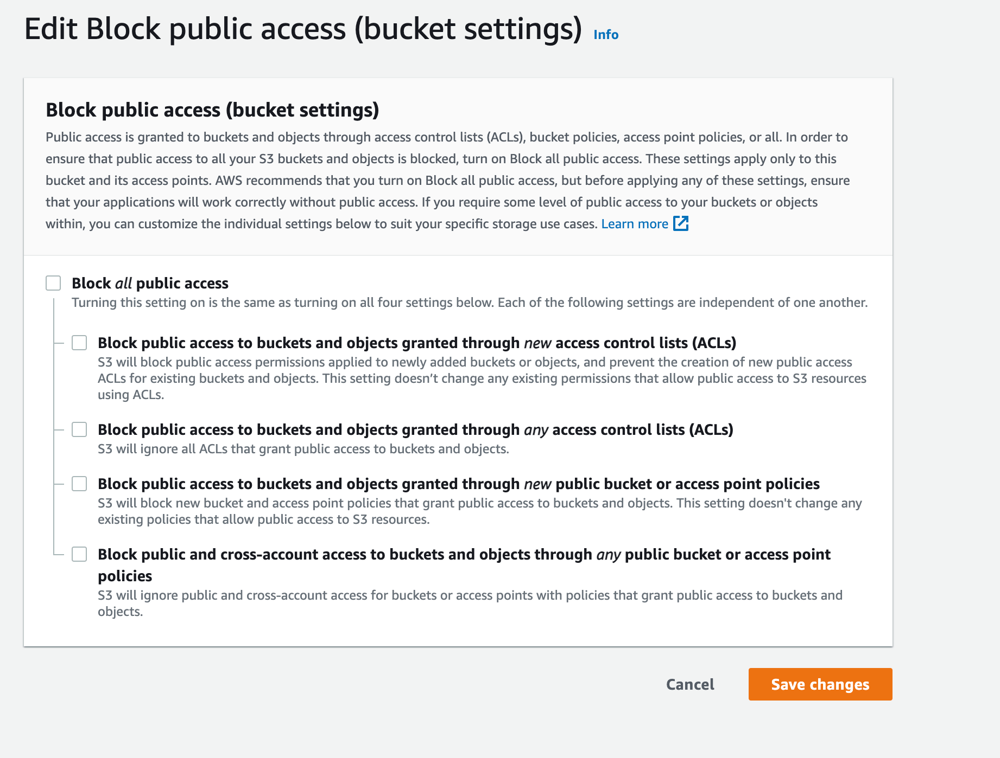
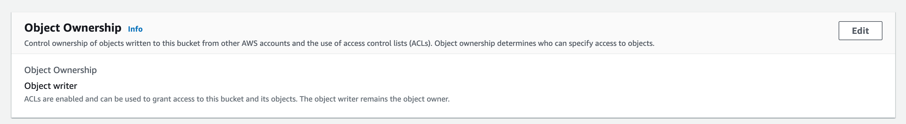

# Deploying Apostrophe in the Cloud with Heroku

There are many cloud hosting services, but they all present the same challenges. For example, separate servers often don't share a single filesystem. The database usually needs its own scalable cloud hosting. And performing tasks like minifying assets is often best done in your development environment, minimizing what has to be done in production.


## Deploying Apostrophe to Heroku

[Heroku](http://heroku.com) is a great starting point for cloud hosting because it is simple to set up, but all of the cloud's challenges come into play. What we learn by deploying to Heroku can be applied equally to Amazon EC2, Microsoft Azure, and other cloud hosting services.

To reduce costs for this how-to, we'll be using free services from Amazon Web Services and MongoDB Atlas, a MongoDB cloud hosting service from the creators of MongoDB. But remember that you can choose paid plans with much higher capacity and performance. Everything in this tutorial is designed to scale smoothly to those paid offerings. Heroku's offerings are in flux. They are eliminating the free tier, but they are offering low-price 'Eco' and 'Basic' plans with the same provisioning as the free tier used to write this tutorial.

## Before you begin

### Create the project (or use your own)
First, build an Apostrophe site! See the [setting up page](../guide/setting-up.md) to get started with the installation of the CLI. We will create a project called `heroku-tut`. Alternatively, you can use an existing Apostrophe site by simply skipping this step.

```bash
$ apos create heroku-tut
```
### Commit to Git
After creation, the project needs to be committed to a Git repository. If you don't already have Git installed on your system, you can learn about installation at the [official site](https://git-scm.com/book/en/v2/Getting-Started-Installing-Git).

The following example demonstrates initializing a Git repostitory for the `heroku-tut` project. You can skip this step if you have an existing project that is already being tracked.

```bash
$ cd heroku-tut
$ git init
Initialized empty Git repository in .../.git/
$ git add .
$ git commit -m "My first commit"
```

## First steps with Heroku

Create an account at [heroku.com](http://heroku.com).

Then create a Heroku app, choosing any app name and runtime location (US, Europe, etc.) you wish. While it is good to try and name your app the same as your project, this may not be possible if your app has a generic name like 'heroku-tut'. Remember the name of the app because we'll need it in future steps.

Following the instructions on the Heroku site, install the [Heroku CLI](https://devcenter.heroku.com/articles/heroku-command-line) if you haven't already.

*** From within your project directory log-in to heroku

```bash
$ heroku login
```

To enable deployment, add Heroku as a "git remote" to which your code can be pushed, substituting your Heroku app name created above:

```bash
$ heroku git:remote -a <yourAppName>
```

You can check to make sure this worked by using the command:

```bash
$ git remote -v
```
You should see output like, but with your app name at the end:

```bash
heroku  https://githeroku.com/apos-heroku-tut.git (fetch)
heroku  https://githeroku.com/apos-heroku-tut.git (push)
```
At this point, we can also tell Heroku that the site we will be spinning up is a production site. To accomplish this we will set the `NODE_ENV` environment variable to `production` using `heroku config:set`. The command should look like this:

```bash
$ heroku config:set NODE_ENV=production
```

## Add a MongoDB Atlas cluster
With our project set-up to deploy to Heroku, we need a database.

Heroku runs our node app, but it doesn't run MongoDB for us. So let's go to [MongoDB Atlas](https://www.mongodb.com/cloud/atlas) and sign up.

Once you log-in to your account, create a project. I named my project 'apostrophe', but you can use any name you wish. Next, within that project, click on 'Build a Database'. Select the free 'Shared' tier and pick 'AWS' as your cloud provider and the same region you chose for Heroku.
For "Cluster Tier" choose "M0 Sandbox".

We recommend you give your cluster the same name as your project, in the case of this example, 'heroku-tut'.

You will need to set up an administrative MongoDB user for your cluster. These will be part of your MongoDB database connection credentials. **Be sure to set a secure, separate username and password,** do not use your Atlas login credentials. One thing to note: the characters `: / ? ! # [ ] @` in your username or password will need to be [URL-encoded](https://www.eso.org/~ndelmott/url_encode.html) in the database connection string.

### IP address allowing

MongoDB Atlas requires us to allowlist the IP addresses that should be allowed to talk to the database. **Yes, it is secured by an encrypted password,** but this still helps to reduce potential DOS attacks.

This is a problem with Heroku because it may connect from many IP addresses.

If you are buying a larger Atlas plan you may be able to use the "VPC Peering" option, the details of which are beyond the scope of this recipe. Otherwise, use this IP address range:

`0.0.0.0/0`

This will allow you to connect, but you might desire a fixed IP for your site. One solution is to use the [fixie-socks](https://elements.heroku.com/addons/fixie-socks) add-on from Heroku.

### Telling Heroku about your database

You will need to set an environment variable in Heroku so that your dynos can communicate with the database. Within your new database deployment, click on the 'connect' button next to the name. Next, click on 'Connect your application'. By default, the driver drop-down menu should be set to 'Node.js' and version '4.1 or later'. If they aren't, change them and then copy the connection string. Paste the string into a text editor and add your password. Again, make sure to URL encode any special characters. Now use this string to set an environment variable in Heroku. It should look something like this:

```
$ heroku config:set 'APOS_MONGODB_URI=mongodb+srv://<yourUserName>:<password>@heroku-tut.lrzxt0l.mongodb.net/?retryWrites=true&w=majority'
```

We use single quotes to avoid problems with most special characters in the URI. If you used the `'` character in the URI, you'll need to escape that with `\'`.

From here, you can test your site locally.

```bash
APOS_MONGODB_URI='YOUR-uri-goes-here' npm start
```

You should be able to view your website at the designated local port.

Press Control-C after you successfully test the site. Startup may take an extra moment because of the remote connection to MongoDB.

> At a small scale, "the cloud" is always slower than a single-server configuration. When things have to talk to each other, running them farther apart doesn't speed things up. However, after you reach a certain scale, a single server is impractical. And of course a single server is a single point of failure.

> If you do not run `npm start` with the environment variable set correctly, it'll seem to work because it will connect to your own mongodb. You can shut down your local mongodb server temporarily if you want to be really, really sure.

Now your database exists in the cloud, but it doesn't contain any users, so you won't be able to log in. So, let's use the command line to connect again to fix that:

```bash
$ APOS_MONGODB_URI='YOUR-uri-goes-here' node app @apostrophecms/user:add admin admin
```

*This is the same user-creation command you saw in our getting-started tutorial.* We're just talking to a different database.

> You can also copy a local database from an existing site to Atlas using the [`mongodump`](https://www.mongodb.com/docs/database-tools/mongodump/) and [`mongorestore`](https://www.mongodb.com/docs/database-tools/mongorestore/) commands. For additional examples of their use, see the `scripts/sync-down` and `scripts/sync-up` files in a CLI created project.

## Storing files with Amazon S3

**If you try to deploy now it might seem to work... but don't be fooled!** If you upload images and then redeploy later, or even just wait a day or so... forget it. They are gone forever. That's because, with Heroku, local files are "written on water." What's more, on any given page load you might not even hit the same dyno where the files were uploaded. And similar issues will break your static assets, like CSS and JS.

So we need to use Amazon S3 for persistent storage of both uploads and static assets.

First, [log into the Amazon Web Services console](https://aws.amazon.com/console/). Create an account if you haven't already. *You may have to provide a credit card but as of this writing, you can complete this how-to using their free service tier.*

From the Amazon Web Services control panel, click on S3. Then click "Create Bucket."

Choose a bucket name (the same as your app is nice but not mandatory) and a region. Then click "Create."

You can set your permissions right away.

1) Click on the "Permissions" tab. Click on the "Edit" button to edit your permissions.


2) Uncheck the "Block all public access" box and save the changes. You will have to confirm that you want to do this.


3) Scroll down the page to the "Object Ownership" section and click the "Edit" button.


4) Select "ACLs enabled" and "Object writer" then acknowledge the warning and save the changes.


You can test it *without* Heroku, on your local machine, by setting the environment variables just for one run of your site (the trailing `\` characters are there to allow us to break one command line over multiple lines for readability in the `bash` shell):

```bash
$ APOS_S3_BUCKET=YOUR-bucket-name \
  APOS_S3_SECRET=YOUR-s3-secret \
  APOS_S3_KEY=YOUR-s3-key \
  APOS_S3_REGION=YOUR-chosen-region \
  node app
```

Upload an image to your site, then right-click it and inspect the image URL. It should be on an Amazon S3 server at this point, **not localhost**.

> "What if I want to use an S3-compatible service that isn't run by Amazon?" You can set the `APOS_S3_ENDPOINT` variable to a complete hostname. If you do, you should *not* set `APOS_S3_REGION`. See the tutorial in the Cookbook section for more information.

### Adding the S3 variables to Heroku

Just use `heroku config:set` again:

```bash
$ heroku config:set APOS_S3_BUCKET=YOUR-bucket-name
$ heroku config:set APOS_S3_SECRET=YOUR-s3-secret
$ heroku config:set APOS_S3_KEY=YOUR-s3-key
$ heroku config:set APOS_S3_REGION=YOUR-chosen-region
```

## Efficient asset delivery

In this setup, images are delivered efficiently via S3, and everyone can see all of the assets. However, we can set one more environment variable so that static assets like CSS and JS are served from S3.

```bash
$ heroku config:set APOS_UPLOADFS_ASSETS=1
```

Now, those assets will be copied to the S3 file storage and served from there.

> To ensure the contents of the bundle's `data/` subdirectory are still available, and to provide backwards compatibility for any URLs you have hard-coded in your templates that are not aware that the relevant contents of `public/` have been copied to S3, the assets are also extracted to the application's folder on Heroku. Apostrophe, however, will consistently reference the contents via S3 URLs instead.

## Deploying to Heroku

As a final step, we need to add a release id. There are a number of ways to accomplish this, but we will use a file named 'release-id' at the root of our project. This file doesn't have an extension and takes a short, unique string, like the date. Any time you make code changes and need to redeploy, the string in this file needs to be changed. We can do this by updating our build script within the `package.json` file.

First, create a new file called `heroku-release-tasks` within the `scripts` file at the root of your project. From the terminal at the root of your project issue the following command:

```bash
$ touch ./scripts/heroku-release-tasks && chmod 755 ./scripts/heroku-release-tasks
```

This command will create the file and then give it the permissions to be executed on the server. Open that file in your code editor and add the following:

```bash
export APOS_RELEASE_ID=`cat /dev/urandom |env LC_CTYPE=C tr -dc 'a-zA-Z0-9' | fold -w 32 | head -n 1`

echo $APOS_RELEASE_ID > ./release-id

node app @apostrophecms/asset:build || exit 1
```

Next, the `"build"` script within the `package.json` file needs to be altered to run the new script. If you are building your project from scratch, you can simply replace the command that the `"build"` script runs with:

```json
"build": "bash ./scripts/heroku-release-tasks"
```

Commit all your new files to your git repo and then type:

```bash
$ git push heroku main
```
::: note
My repo branch is named `main`, while yours might be named `master`.
:::

Heroku will then start installing your dependencies via `npm install`, and you'll see the progress right in the terminal. Sometimes it can be easier to see the progress and trouble-shoot any problems by going to the Heroku dashboard. Select your app and then the 'Activity' tab. If you site has been successfully built you will see a 'Deployed' message at the top of the feed. If it is still building there will be a link to the build log that you can click.

When the site fully deploys you can visit:

https://YOUR-app-name-here.herokuapp.com/

And log in.

Victory!

## Updating your site

Any time we make changes to our project code we have to redeploy it to Heroku. Our modification to the `package.json` makes this easy. After making changes to our code, we simply have to commit those changes and push them to Heroku. Our script will give a new release id and rebuild the assets.

## If it doesn't work

**If your deployment fails,** type `heroku logs` to see what went wrong.

**If your images don't "stick" between restarts,** you probably skipped the Amazon S3 steps.

### Fonts, other assets, and CORS errors in the browser console

To ensure there are no CORS (Cross-Origin Resource) errors, visit your amazon S3 bucket settings to adjust the CORS configuration:

`Amazon S3 → [bucket] → Permissions Tab → CORS configuration button`

Verify the value of `AllowedOrigin`. It should match the heroku url and/or the production URL of your project:

```
<AllowedOrigin>https://example.com</AllowedOrigin>
```

```
<AllowedOrigin>https://example.herokuapp.com</AllowedOrigin>
```