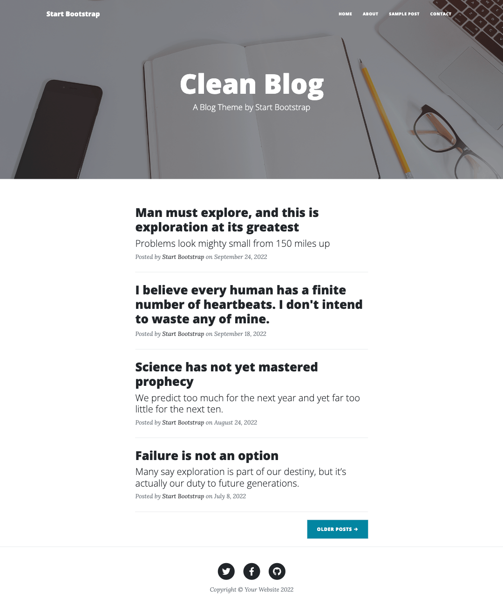
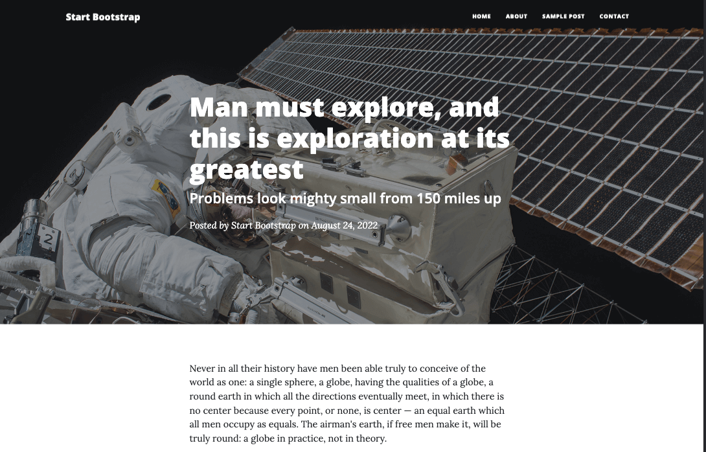
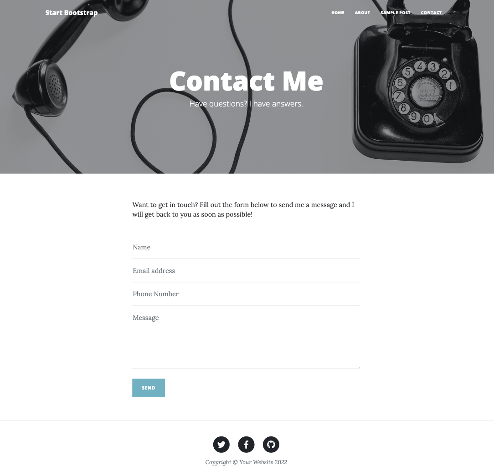

# Converting a premade HTML template for use in an Apostrophe Project

Creating a web site from scratch can be a daunting process. Not only do you have to create the HTML markup, but also the styling to make it all look good. One way to get started quickly is to use one of the numerous premade templates available on the internet. In this tutorial, we will walk through the steps to convert the ["Start Bootstrap Clean Blog"](https://startbootstrap.com/theme/clean-blog) template into an Apostrophe template. While we are starting with a specific template, these steps can be generalized to any template you might download.

### Prefer to read? Scroll past the video.

::: tip
This tutorial is available in video and textual forms. Watch the video, or continue reading if you prefer. Of course, you can do both!
:::

### Video - Converting an HTML template for use in Apostrophe

<iframe width="560" height="315" src="https://www.youtube.com/embed/KqzKrbCv5G4" title="YouTube video player" frameborder="0" allow="accelerometer; autoplay; clipboard-write; encrypted-media; gyroscope; picture-in-picture; web-share" allowfullscreen></iframe>

## Overview

Let's outline the steps that we need to perform.

1. Create a new starter kit project
2. Add the styling and scripts from the template to our project
3. Identify sections found on each page that can be converted into [fragments](/guide/fragments.md)
   - Navigation
   - Header
   - Footer
4. Modify the project core layout in `views/layout.html`
5. Create the apostrophe default page type
6. Add the blog pages using `apostrophecms/page`
   - create the index.html page
   - create the show.html page

## Template Introduction

This recipe is based on the Clean Blog template which is a free [download](https://startbootstrap.com/theme/clean-blog) from Start Bootstrap. This template contains 4 simple pages.

The "Home" page contains a listing of all the blog articles on the site.


This has an accompanying page to show the individual articles.



This structure matches up nicely with the structure of the apostrophe `piece-page-type` with an `index.html` template to list all of the pieces and a `show.html` template to show each individual piece.

The final two pages are an "About" page and a "Contact Me" page, which have identical structures, just content differences.



All of these pages have very similar headers containing fixed navigation, a large header image, and some text over the image.

They also all display an identical footer containing social links and some copyright text.

The styling of the template is a combination of the popular Bootstrap frontend styling framework and custom CSS.

Let's get started converting this template to an Apostrophe project!

## Creating a new project

If you don't already have the apostrophe CLI installed, follow the instructions [here](https://docs.apostrophecms.org/guide/setting-up.html#the-apostrophe-cli-tool). Next, create a new project from the command line. Make sure you are in the directory where you want to create your new project folder and run the following command:

<AposCodeBlock>

``` sh
apos create template-app
```

</AposCodeBlock>

The CLI app will create the new project and an admin user. At the end of the installation, it will ask for an administrator password - make sure to remember this password for login.

## Adding Bootstrap and project styling

### Adding the styling

This particular template comes with both `dist` and `src` folders. Within the dist folder is a `css` folder that contains all of the compiled styling for the site. We could use this as the source for the styling of our project, but this wouldn't be as easy to modify with additional or custom styling variables.

Alternatively, the `src` folder contains an `scss` folder with all of the styling sheets and imports. Since this template utilizes Bootstrap, which has a npm package, we are going to install and then include the main styling from the `node-modules` folder. Open a terminal at the root of your project and install Bootstrap using:

``` sh
npm install bootstrap
```

::: info
This template uses Bootstrap 5, which is the latest version as of this writing. If you need another version for your template, make sure to specify it during the install.
:::

The next thing we will do is copy the contents of the `scss` folder that contains all of the theme-specific styling into our project. While these files could be added to any Apostrophe module, we recommend creating an "asset" module just for your project. If you are using the CLI-created starter kit project, this module will already exist. If not, create a `modules/asset` folder and add the `asset` module to your `app.js` file. Next, within the `modules/asset` folder create a `ui/src` folder and copy the entirety of the `dist/scss` folder.

For the HTML template, the `styles.scss` file is the entry point for loading all of the individual scss sheets. For our Apostrophe project, we are going to move this sheet up one level from the `/scss` folder into the `ui/src` folder and rename it `index.scss`. If an Apostrophe module has a `ui/src/index.js` file it is automatically recognized and loaded. Other Sass files won't be loaded unless imported by such a file. Next, we need to edit this file to point to all of the theme-specific [partials](https://sass-lang.com/guide#topic-4). Looking at the file path for each `@import` statement, each partial or folder of partials is expected to be found in the same folder as the entry sheet. After copying it into our project, this is no longer true. Instead, all of the partials are located within the `scss` folder of the same directory. Modify all of the `@import` statements (except for the Bootstrap import) to point to the correct location by prefixing the path with the folder name:

<AposCodeBlock>

``` scss
// Import variables
@import './scss/variables';

// import bootstrap
// This path is pointing to the Bootstrap package in the node_module folder
@import 'bootstrap/scss/bootstrap';

// Global CSS
@import './scss/global';

// Components
@import './scss/components/buttons';
@import './scss/components/forms';
@import './scss/components/navbar';

// Sections
@import './scss/sections/footer';
@import './scss/sections/masthead';
@import './scss/sections/post';
```

<template v-slot:caption>
modules/asset/ui/src/index.scss
</template>
</AposCodeBlock>

The main Bootstrap components are loaded in from the `node_modules` where they were installed. An alternative to directly loading from the `node-modules`, which will load in every Bootstrap component, would be to import only those components needed for the project using `@import 'bootstrap/scss/_buttons';`, for example.

### Adding the Bootstrap and project JavaScript

Bootstrap has its own bundle of JavaScript. In addition, this template has a small, custom script that modifies the navigation based on scroll direction. We have multiple choices for adding the Bootstrap code to the page. We could elect to bring it in from a CDN. However, we have already installed the Bootstrap NPM package and are going to make a server call to load custom JavaScript, so instead, we can bundle all of our scripts into a single call.

Create another file named `index.js` within the `modules/asset/ui/src` folder. Within this file, we can import the main Javascript bundle and add the custom script from the template `src/js/scripts.js` file.

<AposCodeBlock>

``` javascript
// import the bootstrap.js and popper.js files from the node_modules
import bootstrap from 'bootstrap';

export default () => {
  //code from the template
  window.addEventListener('DOMContentLoaded', () => {
    let scrollPos = 0;
    const mainNav = document.getElementById('mainNav');
    const headerHeight = mainNav.clientHeight;
    window.addEventListener('scroll', function () {
      const currentTop = document.body.getBoundingClientRect().top * -1;
      if (currentTop < scrollPos) {
        // Scrolling Up
        if (currentTop > 0 && mainNav.classList.contains('is-fixed')) {
          mainNav.classList.add('is-visible');
        } else {
          mainNav.classList.remove('is-visible', 'is-fixed');
        }
      } else {
        // Scrolling Down
        mainNav.classList.remove(['is-visible']);
        if (
          currentTop > headerHeight &&
          !mainNav.classList.contains('is-fixed')
        ) {
          mainNav.classList.add('is-fixed');
        }
      }
      scrollPos = currentTop;
    });
  });
};
```

<template v-slot:caption>
  modules/asset/ui/src/index.js
</template>

</AposCodeBlock>

## Identifying common areas

Each of the four pages included in this template has some common areas that can be converted into [fragments](../guide/fragments.md). While all of the pages have both navigation and main header areas that occupy the same general area, we are going to split these into two fragments. That is because the navigation can get all of its settings from global, whereas the rest of the header area is going to get settings on a per-page basis. We will add each of the three fragments in the `views` folder at the project level.

### Adding the navigation

Inside the `views` folder create another folder named `fragments` and a file named `navigation.html`. To turn this page into a fragment, add opening and closing fragment block tags - `` and ``.

Open one of the template pages and copy the navigation section. Paste this between the two fragment tags. To add the website brand to the navigation, we will replace the `href` with the homepage URL from `data.home._url`, which is available to all [templates](/guide/pages.md). We will add a simple text logo from user input in the apostrophe global settings.

Next, within the unordered list, delete the last three `<li>` items. To populate the list with each of the pages selected in the global settings we will use a `for` loop.

<AposCodeBlock>

``` nunjucks

<!-- Navigation-->
<nav class="navbar navbar-expand-lg navbar-light" id="mainNav">
  <div class="container px-4 px-lg-5">
    <a class="navbar-brand" href="{{ data.home._url }}">{{ data.global.brand }}</a>
    <button class="navbar-toggler" type="button" data-bs-toggle="collapse" data-bs-target="#navbarResponsive" aria-controls="navbarResponsive" aria-expanded="false" aria-label="Toggle navigation">Menu<i class="fas fa-bars"></i>
    </button>
    <div class="collapse navbar-collapse" id="navbarResponsive">
      <ul class="navbar-nav ms-auto py-4 py-lg-0">
        
        <li class="nav-item">
          <a class="nav-link px-lg-3 py-3 py-lg-4" href="{{ page._page[0]._url }}">{{ page.label }}</a>
        </li>
        
      </ul>
    </div>
  </div>
</nav>

```

<template v-slot:caption>
  views/fragments/navigation.html
</template>
</AposCodeBlock>

In this code block, we are surrounding one of the list items with our `for` loop. For each selected page we are adding a list item containing a link and label. This data will come from an `array` field schema field containing a `string` input for the label and a `relationship` field for the page link. Note that since this URL is populated from a `relationship` field, data will be delivered to the page in an array. So, we need to specify that we are getting the `_url` from the first array item.

All of the styling for our menu and each of the items will come from the Bootstrap class names we copied over with the HTML markup.

Next, we need to add the schema fields to populate our navigation menu. If your project doesn't already contain one, create a `modules/@apostrophecms/global/index.js` file. Our [tutorial](building-navigation.md) in the recipes section has some more complicated methods for adding navigation. In this case, we are going to add a simple array schema field with a relationship to our pages.

<AposCodeBlock>

``` javascript
module.exports = {
  fields: {
    add: {
      brand: {
        type: 'string',
        label: 'Brand name',
        required: true
      },
      pages: {
        type: 'array',
        titleField: 'Pages',
        fields: {
          add: {
            label: {
              type: 'string',
              label: 'Page label'
            },
            _page: {
              label: 'Page to link',
              type: 'relationship',
              withType: '@apostrophecms/page',
              max: 1,
              required: true,
              builders: {
                project: {
                  title: 1,
                  _url: 1
                }
              }
            }
          }
        }
      }
    },
    group: {
      navigation: {
        label: 'Navigation links',
        fields: [ 'brand', 'pages' ]
      }
    }
  }
};
```

<template v-slot:caption>
  modules/@apostrophecms/global/index.js
</template>
</AposCodeBlock>

### Adding the footer

Much like we constructed the navigation, we are going to use a fragment populated with data from the apostrophe global settings for the footer. Create a `views/fragments/footer.html` file with a fragment block and paste the navigation area from any of the template pages between the blocks. In this case, we are going to replace each of the social links and the copyright text. You can choose to make the link for each social media account be required, or wrap each of the list items in an `if` block to make them optional.

<AposCodeBlock>

``` nunjucks

<!-- Footer-->
<footer class="border-top">
  <div class="container px-4 px-lg-5">
    <div class="row gx-4 gx-lg-5 justify-content-center">
      <div class="col-md-10 col-lg-8 col-xl-7">
        <ul class="list-inline text-center">
          
            <li class="list-inline-item">
              <a href="{{ data.global.twitterUrl }}">
                <span class="fa-stack fa-lg">
                  <i class="fas fa-circle fa-stack-2x"></i>
                  <i class="fab fa-twitter fa-stack-1x fa-inverse"></i>
                </span>
              </a>
            </li>
          
          
            <li class="list-inline-item">
              <a href="{{ data.global.facebookUrl }}">
                <span class="fa-stack fa-lg">
                  <i class="fas fa-circle fa-stack-2x"></i>
                  <i class="fab fa-facebook-f fa-stack-1x fa-inverse"></i>
                </span>
              </a>
            </li>
          
          
            <li class="list-inline-item">
              <a href="{{ data.global.githubUrl }}">
                <span class="fa-stack fa-lg">
                  <i class="fas fa-circle fa-stack-2x"></i>
                  <i class="fab fa-github fa-stack-1x fa-inverse"></i>
                </span>
              </a>
            </li>
          
        </ul>
        <div class="small text-center text-muted fst-italic">Copyright &copy; {{ data.global.copyright }}</div>
      </div>
    </div>
  </div>
</footer>

```

<template v-slot:caption>
  views/fragments/footer.html
</template>
</AposCodeBlock>

Modify the global settings file to include the new footer schema fields.

<AposCodeBlock>

``` javascript
module.exports = {
  fields: {
    add: {
      // ...
      twitterUrl: {
        type: 'url',
        label: 'Twitter URL'
      },
      facebookUrl: {
        type: 'url',
        label: 'Facebook URL'
      },
      githubUrl: {
        type: 'url',
        label: 'Github URL'
      },
      copyright: {
        type: 'string',
        label: 'Copyright text',
        required: true
      }
    },
    group: {
      // ...
      footer: {
        label: 'Footer URLs and text',
        fields: [ 'twitterUrl', 'facebookUrl', 'githubUrl', 'copyright' ]
      }
    }
  }
};

```

<template v-slot:caption>
  modules/@apostrophecms/global/index.js
</template>
</AposCodeBlock>

::: info
An alternative way to add the social links would be to use an `array` schema field to collect the URL and logo class information. Then within the template loop over each item in the array to add them to the page. This would make the template code and logic a little cleaner.
:::

### Adding the header

The headers of each page have an image and headline in common. They also each have a subheading, but the styling of that subheading depends on the type of page that is being displayed. Additionally, the header for the page displaying the individual blog articles also has metadata about the author and publication date. While we could have separate header template fragments, we can also use a conditional block to add the needed markup.

Create a `views/fragments/header.html` file and add the fragment block tags. Unlike the navigation and footer fragments that got their data from apostrophe's global settings, the header will get its data from the page. This means that we will have to pass data into our fragment within the block tags - ``.

Paste the page header section from the `index.html` template page in between the tags. This markup is present on the home, about, and contact pages. Once we create the blog article page we will come back and add the conditional block. Modify the heading and subheading to get field schema data from the page settings.

Adding an image as a background for the header will take some more complex modifications of the fragment. First, when we create the page settings, we will add a `headerImage` area that requires a maximum of one image through the `@apostrophe/image` widget. Within the template fragment we will retrieve that image using the `apos.image.first` and `apos.attachment.url` helpers.

<AposCodeBlock>

``` nunjucks



<!-- Page Header-->

  
  <header class="masthead" style="background-image: url('{{ backgroundUrl }}')">

  <header class="masthead" style="background-color: blue;">

    <div class="container position-relative px-4 px-lg-5">
      <div class="row gx-4 gx-lg-5 justify-content-center">
        <div class="col-md-10 col-lg-8 col-xl-7">
          <div class="site-heading">
            <h1>{{ data.heading }}</h1>
            <span class="subheading">{{ data.subheading }}</span>
          </div>
        </div>
      </div>
    </div>
  </header>

```

<template v-slot:caption>
  views/fragments/header.html
</template>
</AposCodeBlock>

We will revisit the field schema for the header when we create our default page.

## Modifying the `layout.html` file

Now that we have our three common fragments setup, we need to start adding them to our pages. Again, the navigation and footer fragments are populated with data from the global settings. Therefore, we can add those fragments to our base layout file - `views/layout.html`. In addition, looking at the head section of the template files, we can see that the `fontawesome` and Google `Lora` and `Open Sans` fonts are being added. We can alter this same file to load those files into the head section

::: info
If your pages are being loaded and viewed in an EU country, serving fonts from Google might violate GDPR. There are multiple articles on the internet detailing how to download the files and host them locally in order to comply with GDPR.
:::

The first modification we are going to make is to import our two fragments.

<AposCodeBlock>

``` nunjucks


```

</AposCodeBlock>

This will bring our fragments into the template and name them `navigation` and `footer`.

To load our font files we are going to take advantage of the `extraHead` section of the `outerLayout` template that our `layout.html` is extending. You can read the [documentation](/guide/layout-template.html) to learn about other sections of this template that can be extended. Add the `` tags after the `` section. Within those tags copy the fonts section of the head from any of the template pages. You can also see that there are links for the site favicon and some other meta tags in this section of the template. You can elect to add those if you desire.

Finally, delete all of the markup in the `beforeMain` and `afterMain` sections. into the `beforeMain` block render the navigation - ``. In the `afterMain` block render the footer fragment = ``. The final modification we can make to the template is to add the semantic `<main></main>` tags. Looking at the original template pages, we can see that the main section has a class of `mb-4`. This markup can be added around the `` tags.

<AposCodeBlock>

``` nunjucks



{# Automatically extends the right outer layout and also handles AJAX siutations #}




  {{ title }}
  
    {{ apos.log('Looks like you forgot to override the title block in a template that does not have access to an Apostrophe page or piece.') }}
  



  <!-- Font Awesome icons (free version)-->
  <script src="https://use.fontawesome.com/releases/v6.1.0/js/all.js" crossorigin="anonymous"></script>
  <!-- Google fonts-->
  <link href="https://fonts.googleapis.com/css?family=Lora:400,700,400italic,700italic" rel="stylesheet" type="text/css" />
  <link href="https://fonts.googleapis.com/css?family=Open+Sans:300italic,400italic,600italic,700italic,800italic,400,300,600,700,800" rel="stylesheet" type="text/css" />



  


<main class="mb-4">

  {#
    Usually, your page templates in the @apostrophecms/pages module will override
    this block. It is safe to assume this is where your page-specific content
    should go.
  #}

</main>


  


```

<template v-slot:caption>
  views/layout.html
</template>
</AposCodeBlock>

Note the use of `navigationArea()` and `footerArea()` in the `render` calls. If you look at the fragment files, you will see that the fragment blocks use these names. This is to allow for a single fragment file to have multiple fragments. We are using these names just to be a little clearer in our calls for this tutorial, but this could be cleaned up and both be called `area()` resulting in `` and ``.

## Creating a default page

Now all of our pages will have our navigation and footer areas, but we need to add our header and all of the body content. We could make a separate file for each page of our site, but it makes sense to have a default page that will be used for the non-blog pages. We can use the existing `modules/default-page`.

We need to make two major modifications to the existing `default-page`. First, we need to import and display our header fragment. In this case, we want to add the header into the `beforeMain` block. In order to accomplish this we need to add the 
::: v-pre
`{{ super() }}`
:::
call to include all of the `beforeMain` content from our layout template.

Second, we need to add the template styling and the main content area to the `main` block.

<AposCodeBlock>

``` nunjucks





  {{ super() }}
  



  <div class="container px-4 px-lg-5">
    <div class="row gx-4 gx-lg-5 justify-content-center">
      <div class="col-md-10 col-lg-8 col-xl-7">
        
      </div>
    </div>
  </div>

```

<template v-slot:caption>
  modules/default-page/views/page.html
</template>
</AposCodeBlock>

Next, we need to modify the schema fields of the `default-page/index.js` file to add the data to the header and the main body of the page. For a number of the schema fields below, I'm choosing to make them required. You could instead leave them optional, but then wrap the areas where they are added to the templates in conditional statements in case the editor leaves the fields empty.

<AposCodeBlock>

``` javascript
module.exports = {
  extend: '@apostrophecms/page-type',
  options: {
    label: 'Default Page'
  },
  fields: {
    add: {
      heading: {
        type: 'string',
        label: 'Heading',
        required: true
      },
      subheading: {
        type: 'string',
        label: 'Subheading',
        required: true
      },
      headerImage: {
        type: 'area',
        required: true,
        options: {
          widgets: {
            '@apostrophecms/image': {}
          },
          max: 1
        }
      },
      main: {
        type: 'area',
        options: {
          widgets: {
            '@apostrophecms/rich-text': {
              toolbar: [
                'styles',
                '|',
                'bold',
                'italic',
                'strike',
                'link',
                '|',
                'bulletList',
                'orderedList'
              ],
              styles: [
                {
                  tag: 'p',
                  label: 'Paragraph (P)'
                },
                {
                  tag: 'h3',
                  label: 'Heading 3 (H3)'
                },
                {
                  tag: 'h4',
                  label: 'Heading 4 (H4)'
                }
              ]
            },
            '@apostrophecms/image': {},
            '@apostrophecms/video': {}
          }
        }
      }
    },
    group: {
      basics: {
        label: 'Basics',
        fields: [
          'title',
          'heading',
          'subheading',
          'headerImage',
          'main'
        ]
      }
    }
  }
};

```

<template v-slot:caption>
  modules/default-page/index.js
</template>
</AposCodeBlock>

Since we are modifying the project's existing `default-page/index.js` file, we don't need to modify either the `app.js` or `modules/@apostrophecms/page/index.js` files.

To accommodate the content on the 'Contact Us' page, we could also add the widgets from the [form extension](https://apostrophecms.com/extensions/form-builder-3-x) in the `main` area. 

### Modifying the logged-in page display
If we were to take a look at our page right now while logged-in as an editor, we would see a couple of problems. First, the navigation section is styled to be added at the top of the page using a `postion: absolute` CSS rule. The problem with this is that this ends up putting our navigation *over* the ApostropheCMS admin-bar. Not only can we not see the navigation, but this also blocks access to the admin-bar menus. So, we need to add some code onto the page that will move our navigation below the admin-bar in the page flow.

There are several areas in our project where we could add code to solve this problem. In this case, we will add a small script to our asset module again. While we could add it to `modules/asset/ui/src/index.js` along with the template code, this would result in the delivery of extra unnecessary JavaScript to all users. Instead, we will add the code into `modules/asset/ui/apos/apps`. This folder is commonly used in projects to add new custom Vue UI components and is only served to logged-in users.

<AposCodeBlock>

``` javascript
export default () => {
  // check that the admin-bar module exists
  const loggedIn = !!window.apos.modules['@apostrophecms/admin-bar'];
  if (loggedIn) {
    // wrap in `apos.util.onReady()` that fires when the page is loaded and at every refresh
    apos.util.onReady(() => {
      //get the admin-bar height
      const adminBarHeight =
        window.apos.modules['@apostrophecms/admin-bar'].height;
        // get the navigation ID - if you are using a different template, adjust accordingly
      const pageNav = document.getElementById('mainNav');
      // set the absolute position of the navigation to after the admin-bar
      pageNav.style.top = adminBarHeight + 'px';
    });
  }
};

```

<template v-slot:caption>
  modules/asset/ui/apos/apps/AdminBarHeight.js
</template>
</AposCodeBlock>


## Add the blog pages

The last two pages from the template are blog index and article pages. We could use the [blog module](https://apostrophecms.com/extensions/blog), but it has features we don't necessarily need for this template. So, to simplify this tutorial we will just create our blog `piece-type` and `piece-page-type`. We can do this using the CLI tool.

``` sh
apos add piece blog --page
```

Once we have these added to our project we need to modify the `app.js` file to include both.

<AposCodeBlock>

``` javascript
require('apostrophe')({
  modules: {
    // ...
    blog: {},
    'blog-page': {}
  }
});

```

<template v-slot:caption>
  app.js
</template>
</AposCodeBlock>

Additionally, the `blog-page` needs to be added to the `modules/@apostrophecms/page/index.js` file so that it is available in our page manager.

Next, we will modify the `modules/blog/index.js` file to include the necessary field schema. We need to add the header image and text, plus the actual blog content. This is essentially identical to the index for the `default-page`. We can copy the contents of that file and then add two additional schema fields - `author` and `publicationDate`.

<AposCodeBlock>

``` javascript
module.exports = {
  extend: '@apostrophecms/piece-type',
  fields: {
    add: {
      headerImage: {
        type: 'area',
        label: 'Header image',
        required: true,
        options: {
          widgets: {
            '@apostrophecms/image': {}
          },
          max: 1
        }
      },
      heading: {
        type: 'string',
        label: 'Heading',
        required: true
      },
      subheading: {
        type: 'string',
        label: 'Subheading',
        required: true
      },
      author: {
        type: 'string',
        label: 'Author',
        required: true
      },
      publicationDate: {
        type: 'date',
        label: 'Publication date',
        required: true
      },
      main: {
        type: 'area',
        options: {
          widgets: {
            '@apostrophecms/rich-text': {
              toolbar: [
                'styles',
                '|',
                'bold',
                'italic',
                'strike',
                'link',
                '|',
                'bulletList',
                'orderedList'
              ],
              styles: [
                {
                  tag: 'p',
                  label: 'Paragraph (P)'
                },
                {
                  tag: 'h3',
                  label: 'Heading 3 (H3)'
                },
                {
                  tag: 'h4',
                  label: 'Heading 4 (H4)'
                }
              ]
            },
            '@apostrophecms/image': {},
            '@apostrophecms/video': {}
          }
        }
      }
    },
    group: {
      basics: {
        label: 'Basics',
        fields: [ 'title', 'headerImage', 'heading', 'subheading', 'author', 'publicationDate', 'main' ]
      }
    }
  }
};

```

<template v-slot:caption>
  modules/blog/index.js
</template>
</AposCodeBlock>

The `index.js` file for the `blog-page` will also be quite similar. Again, it will have a header image, heading, and subheading.

<AposCodeBlock>

``` javascript
module.exports = {
  extend: '@apostrophecms/piece-page-type',
  options: {
    perPage: 5
  },
  fields: {
    add: {
      headerImage: {
        type: 'area',
        label: 'Header image',
        required: true,
        options: {
          widgets: {
            '@apostrophecms/image': {}
          },
          max: 1
        }
      },
      heading: {
        type: 'string',
        label: 'Heading',
        required: true
      },
      subheading: {
        type: 'string',
        label: 'Subheading',
        required: true
      }
    },
    group: {
      basics: {
        label: 'Basics',
        fields: [
          'title',
          'headerImage',
          'heading',
          'subheading'
        ]
      }
    }
  }
};

```

<template v-slot:caption>
  modules/blog-page/index.js
</template>
</AposCodeBlock>

In the code above we are adding a `perPage` option of `5`. This will limit the number of blog articles shown on the "Home" page. This can be adjusted to best serve your needs.

### The blog index.html page

The "Home" page of the template is essentially an `index.html` page that lists all of the blog articles. Just like with the default page, we are going to add our header to a `beforeMain` block. Within the `main` block, we will copy the `<!-- Main Content -->` section from the `index.html` HTML template. To convert it to dynamically show all of the blog articles from our site we will delete all of the code in each of the `<!-- Post preview -->` sections except the first. Then, we will wrap the first  `<!-- Post preview -->` section in a `for` loop. Finally, we will modify the `<!-- Pager -->` section to show both newer and older posts.

<AposCodeBlock>

``` nunjucks





  {{ super() }}
  



  <!-- Main Content-->
  <div class="container px-4 px-lg-5">
    <div class="row gx-4 gx-lg-5 justify-content-center">
      <div class="col-md-10 col-lg-8 col-xl-7">
        
          <!-- Post Preview -->
          <div class="post-preview">
            <a href="{{ piece._url }}">
              <h2 class="post-title">{{ piece.heading }}</h2>
              <h3 class="post-subtitle">{{ piece.subheading }}</h3>
            </a>
            <p class="post-meta"> Posted by {{ piece.author }} on {{ piece.publicationDate | date('MMMM D, YYYY') }}</p>
          </div>
          <!-- Divider-->
          <hr class="my-4" />
        
        <!-- Pager-->
        <div class="d-flex mb-4">
          
          <a href="{{ data.slug }}?page={{data.currentPage - 1}}" class="btn btn-primary text-uppercase me-auto">newer posts</a>
          
          
          <a href="{{ data.slug }}?page={{data.currentPage + 1}}" class="btn btn-primary text-uppercase ms-auto">older posts</a>
          
        </div>
      </div>
    </div>
  </div>


```

<template v-slot:caption>
  modules/blog-page/index.html
</template>
</AposCodeBlock>

Focusing on the `for` loop in the code. We are stepping through all of the articles returned in `data.pieces` and outputing the relevant data. Again, since we specified a `perPage` value of `5` in the options, this will return the five newest blog articles. This can be further configured within the `blog-page` module options, for example with the [`sort` option](https://docs.apostrophecms.org/reference/modules/piece-type.html#sort).

The "Pager" section is expanded to conditionally show newer and older blog articles, unlike the original template, which only shows older articles. Within the section, we are taking advantage of some additional data that is being delivered to the `index.html` page. Within the `data` payload are `data.currentPage` and `data.totalPages`. The `data.totalPages` is how many individual data sets are present for the particular piece type if divided into groups based on the `perPage` option (the default is `10`).

By default, we are showing the newest blog articles first. Therefore, if the `data.currentPage` is equal to `1` then we shouldn't display the button to load newer articles. If we are on any other page we want the button displayed, with a URL that adds a query to go to the previous page -
::: v-pre
`{{data.currentPage - 1}}`.
:::

We are only displaying the button to go to older posts if we aren't at the last set of pieces - `data.totalPages > data.currentPage`. If this is true we display a button that points to the URL with a query that goes to the next set of pieces - 
::: v-pre
`{{data.currentPage + 1}}`.
:::

### The blog show.html page

The `show.html` page will display each of the individual blog articles and will be based on the original HTML template `post.html` page. Like the other pages, we start by rendering the header fragment in the `beforeMain` block. If we look at the `post.html` page we can see that the header looks slightly different from the other pages. It contains metadata not found on the other pages. After setting up the main part of the page we will alter the `header.html` fragment to address this.

Open the `post.html` template file and copy the `<!-- Post Content -->` section into the `main` block of the `show.html` page. All of the content in `p` tags can be deleted because we will replace it with the content added to the `main` area of our blog pieces.

<AposCodeBlock>

``` nunjucks





    {{ super() }}
    



    <!-- Post Content-->
    <article class="mb-4">
        <div class="container px-4 px-lg-5">
            <div class="row gx-4 gx-lg-5 justify-content-center">
                <div class="col-md-10 col-lg-8 col-xl-7">
                    
                </div>
            </div>
        </div>
    </article>

```

<template v-slot:caption>
  modules/blog-page/views/show.html
</template>
</AposCodeBlock>

As outlined above, the header of the blog piece pages is different from the other pages. There are two ways that we could approach this. We could create a dedicated blog header fragment and add it into our `views/fragments/header.html` file with a new name. The other approach is to add some conditional markup to our existing header fragment. In this case, we will do the latter.

<AposCodeBlock>

``` nunjucks






  

  

  


<!-- Page Header-->

  
  <header class="masthead" style="background-image: url('{{ backgroundUrl }}')">

  <header class="masthead" style="background-color: blue;">

    <div class="container position-relative px-4 px-lg-5">
        <div class="row gx-4 gx-lg-5 justify-content-center">
            <div class="col-md-10 col-lg-8 col-xl-7">
                <div class="{{ pageClass }}">
                    <h1>{{ data.heading }}</h1>
                    
                    <span class="subheading">{{ data.subheading }}</span>
                    
                    <h2 class="subheading">{{ data.subheading }}</h2>
                    <span class="meta">
                        Posted by {{ data.author }} on {{ data.publicationDate | date('MMMM D, YYYY') }}
                    </span>
                    
                </div>
            </div>
        </div>
    </div>
  </header>

```

<template v-slot:caption>
  views/fragments/header.html
</template>
</AposCodeBlock>

So, what did we change? First, at the top, we created a new variable, `type`, and set it to the value of `data.type`. This is going to give us the type of page or piece that is being loaded. Looking at the code differences in the header section of each of the three pages, we can see that the container for the header text has a different class depending on the template page type. In our header fragment, we conditionally set the `pageClass` variable based on the page type, either 'default-page', 'blog-page', or 'blog'. Next, within the code, we use this variable and wrap the HTML below the `h1` tag with a conditional statement to only add the metadata if we are on a blog page.

Now we need to add our pages to the site and give them some content. The "About Me" and "Contact Me" both use the `default-page` template. The existing "Home" page should be swapped out for a `blog-page` template. All that is left to do is create your blog articles!

## Summary

Any pre-made HTML template can be converted for use in Apostrophe through some simple steps.

- Add the front end assets to your Apostrophe project
- Create an Apostrophe page type for each of the template pages that substitutes data from the schema fields into each area of the page that you want to edit.
- Add special piece types and piece page types

In this tutorial, we took extra steps to create reusable navigation, header, and footer fragments. While this makes the overall project more compact it is completely optional. Hopefully, this will help you get your Apostrophe project up and running a little more quickly!
