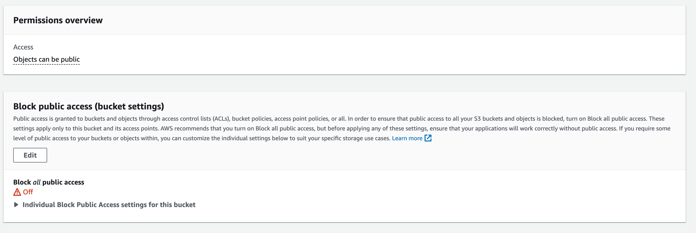
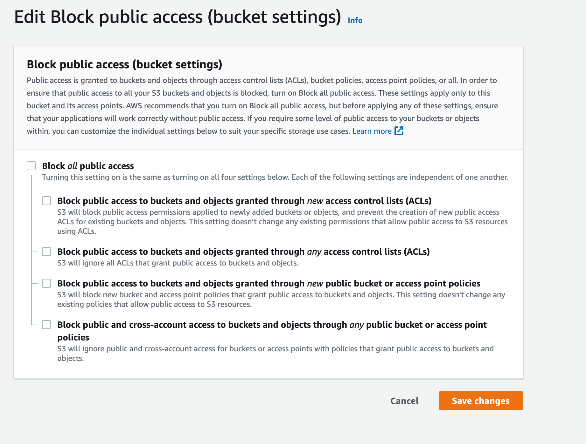
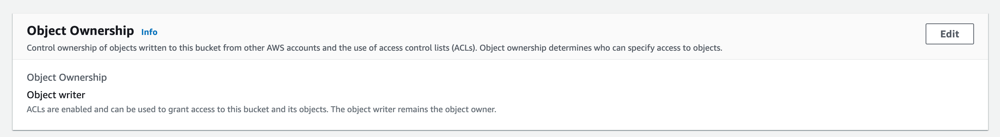
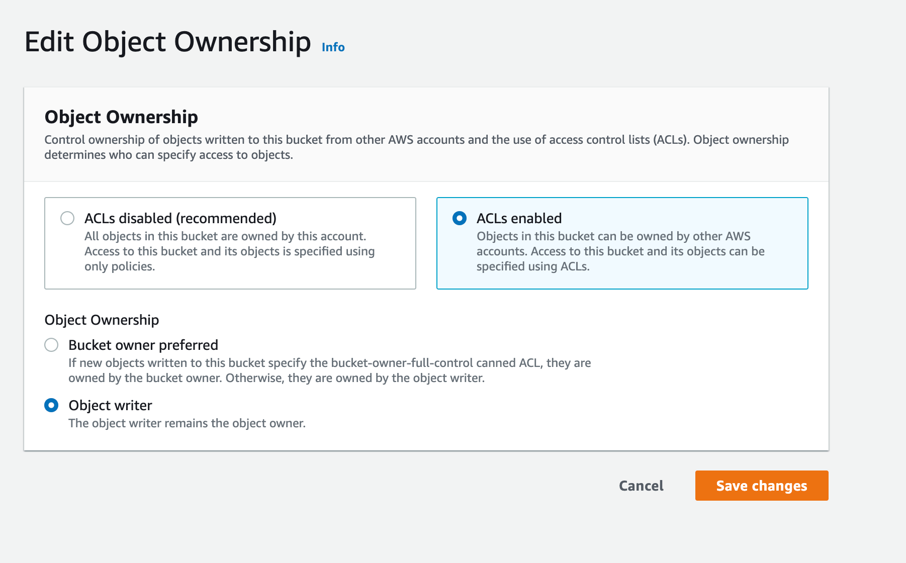

# Hosting an ApostropheCMS project with Docker

[Docker](https://www.docker.com/) is a containerization platform that lets developers build an image for their projects and then run it anywhere. This guide is for production, not development. If you want to use Docker as a development environment, you can explore using a persistent Docker volume for your project, but bear in mind that commands like npm install can be very slow in such a configuration.

The initial steps of this guide will assume that you will be hosting your database, project, and uploaded assets on the same server. The second part will outline steps for configuring to use the AWS S3 service for hosting assets. Finally, the third portion will provide guidance for using the MongoDB Atlas multi-cloud database.

::: tip
This guide uses MongoDB throughout, but that is a choice, not a requirement. ApostropheCMS supports MongoDB, PostgreSQL, and SQLite through the [`db-connect`](/guide/using-sqlite-and-postgres.md) layer, and the choice changes the shape of your Docker setup right from the start:

- **MongoDB or PostgreSQL** — run the database as a second container (as this guide does) or point at a hosted service, setting `APOS_DB_URI` to a `mongodb://` or `postgres://` URI.
- **SQLite** — no database container and no database server at all. The database is a file, so it needs its own persistent volume, and `APOS_DB_URI` is a `sqlite://` path on that volume. Never put it on the uploads volume, which Apostrophe serves publicly.

See [Choosing a Database](/guide/choosing-a-database.md) for help deciding. The steps below apply either way; where a step is MongoDB-specific, we note the alternative.
:::

::: warning
Notice that we rely on a Docker base image specifically for Node.js here. That's the best path forward. If you use a `RUN apt-get` step in Debian or Ubuntu, you will get an outdated, unsupported version of Node.js. Also, note that Node.js base images already depend on Debian by default, so you can easily incorporate other Debian packages if you need them.
:::

## Creating the image

### Install Docker

Docker can be installed on Mac, Windows, and Linux machines with either a CLI interface or using the Docker Desktop application, which acts as a graphical interface to the Docker engine. For this tutorial, we will use the CLI version. You can read more about Docker and install it on your machine by following the instructions in the Docker [docs](https://docs.docker.com/get-started/). Feel free to walk through the tutorials that you find there, but it isn't necessary before following this tutorial. We will cover any necessary terminology as we walk step-by-step through getting Apostrophe running. However, please verify that your Docker install works before continuing.

### Apostrophe project setup

For this tutorial, we will be using the [a3-demo](https://github.com/apostrophecms/a3-demo) template. However, you can also use an existing project or create a new one by following our getting started [tutorial](/guide/setting-up.md). If using the a3-demo, follow the link and click on the "Use this template" button to fork the template into your own repo. Next, clone the repo to your local machine and open it in your favorite code editor.

### Creating the dockerfile

The [`Dockerfile`](https://docs.docker.com/engine/reference/builder/) passes a series of command line instructions to build an image. Below is an example of a file to build a container for a basic Apostrophe project:

<AposCodeBlock>

```bash
FROM node:24

WORKDIR /srv/www/apostrophe

RUN chown -R node: /srv/www/apostrophe
USER node

COPY --chown=node package*.json /srv/www/apostrophe/

ENV NODE_ENV=production
RUN npm ci

COPY --chown=node . /srv/www/apostrophe/

RUN ./scripts/build-assets.sh

CMD ["node", "app.js"]
```

<template v-slot:caption>
  Dockerfile
</template>

</AposCodeBlock>

Let's walk briefly through each of the lines. The first line specifies that this image will extend the official Node.js 24 image. If you need a different version of Node.js, you should alter this line to build from an official Node.js [image](https://hub.docker.com/_/node/) or a 3<sup>rd</sup> party image.

The `WORKDIR` command is used to define the working directory of the Docker container where all of the subsequent commands will be run. It implicitly runs both `mkdir` and `cd` commands.

By default, when we issue commands within the `Dockerfile` they are run within the container as a root user. Although Docker should ensure that the 'root' user inside the container can't see or interact with anything outside the container, it never hurts to use a non-root user inside the container too, just in case a flaw in the container system is found. Now that we have a directory, we reassign it to a low-level user `node` using the Docker `RUN` command and the linux `chown` command. Everything following `RUN` will be passed to the command line inside the container. Next, we switch to the new user using the `USER` command.

We are now going to install all of our dependencies inside of the working directory. First, we copy the `package.json` and `package-lock.json` into our project. Next, we pass our `NODE_ENV=production` environment variable into the build and then add those dependencies using `RUN npm ci`.

::: info
This means that you **must** commit the project `package-lock.json` and you must not list anything required to build the project assets as a "dev" dependency. Your project doesn't need any of those in production, right?
:::

Following the dependency install, all of the necessary project files are copied into the container. Note that we will also create a `.dockerignore` file to exclude some files and folders from being copied.

Next, we run a script to trigger the apostrophe asset build (we will cover this script next). To set a unique `APOS_RELEASE_ID` environment variable each time we change files and redeploy, we are using the script to create a `release-id` file with a unique string. Otherwise, we would have to change this string each time manually.

Everything until this point helped build the container image. Those commands only run once when the container image is built or rebuilt. The final `CMD` line is what runs every time the container is started.

### Creating the install script

The alpine linux distribution is slim and doesn't include bash, but we can access the "busybox" shell, which is compatible with the basics, at `/bin/sh`. Into the `scripts` folder at the root of your project create the following file:

<AposCodeBlock>

```bash
#!/bin/sh

export APOS_RELEASE_ID=`cat /dev/urandom |env LC_CTYPE=C tr -dc 'a-zA-Z0-9' | fold -w 32 | head -n 1`

echo $APOS_RELEASE_ID > ./release-id

node app @apostrophecms/asset:build
```

<template v-slot:caption>
  scripts/build-assets.sh
</template>

</AposCodeBlock>

We won't go through this file in detail. As covered in the previous section, it creates a random unique string and copies it out to the `release-id` file at the root of the project. It then triggers the `@apostrophecms/asset` module to build the assets. That module will read the `release-id` file and use the string in the build.

Building the assets inside this script, which is part of a **build step** in the Dockerfile, ensures the assets become part of the image, so they don't have to be re-generated every time the image is used. The same is true for the `release-id` file, which Apostrophe uses to identify the asset bundle it should be using. It'll be the same bundle at build time and at run time. If the image is rebuilt, we'll get a new image, new CSS URLs, and no stale stylesheets.

### Creating a `.dockerignore` file

The `.dockerignore` file prevents specific files from being copied into your final image. This is important to block sensitive or unnecessary files from being incorporated into your image. Simply go through your directory and copy any file or folder name not needed to build your project into your `.dockerignore` file. Note that folder names are followed by a `/`. I'm using Visual Studio Code in this tutorial, so the topmost folder listed won't be in your project if you use a different editor.

<AposCodeBlock>

```bash
.vscode/
apos-build/
badges/
data/
node_modules/
public/uploads/
.dockerignore
.env
.eslintignore
.gitignore
deploy-test-count
docker-compose.yaml
dockerfile
force-deploy
local.example.js
```

<template v-slot:caption>
  .dockerignore
</template>

</AposCodeBlock>

### Creating a `docker-compose.yaml` file

In this guide, we are starting by creating multiple containers and a persistent volume. This is so that we can provide both a MongoDB instance and a place to store uploaded assets. We are going to do this using [Docker Compose](https://docs.docker.com/compose/) and a `docker-compose.yml` file. In the following sections of the tutorial, we will look at removing the extra container and volume by taking advantage of cloud storage and database services. Create this file at the root of your project.

::: tip
This is the file where your [database choice](/guide/choosing-a-database.md) takes concrete form. The file below and its walkthrough use MongoDB. If you chose another database, read them first, then follow [Adapting the file for PostgreSQL](#adapting-the-file-for-postgresql) or [Adapting the file for SQLite](#adapting-the-file-for-sqlite).
:::

<AposCodeBlock>

```bash
services:
  db:
    image: mongo:8.0
    volumes:
      - dbdata:/data/db
  web:
    build:
      context: .
    container_name: "apostrophe-container"
    ports:
      - "3000:3000"
    environment:
      - NODE_ENV
      - APOS_DB_URI
      - APOS_CLUSTER_PROCESSES
    depends_on:
      - db
    volumes:
      - uploads:/srv/www/apostrophe/public/uploads

volumes:
  dbdata:
  uploads:
```

<template v-slot:caption>
  docker-compose.yaml
</template>

</AposCodeBlock>

The spacing in this file is very important. Whitespace, not tab, indentation indicates that a particular line is nested within the object passed on the line above it. Walking through this file, it starts with `services:`. From the indentation, we can see that we are creating two services - a `db:` container and a `web:` container. Much like our `Dockerfile`, within the `db:` we start by specifying an image to run. In this case, it is the `mongo:8.0` official image for running MongoDB v8.0, the newest version Apostrophe is tested against. MongoDB 7.0 is the minimum supported version, but starting on 8.0 gives you the longest runway before an upgrade is needed. Other images can be found in the docker library GitHub repo [README](https://github.com/docker-library/docs/blob/master/mongo/README.md#supported-tags-and-respective-dockerfile-links). You should use the version that mirrors your development environment.

Notice that the `db:` service publishes no ports. It doesn't need to: the `web:` container reaches the database over the private network Compose creates, at the hostname `db` and MongoDB's own port `27017`, which is why the connection string below is `mongodb://db:27017/apostrophe`. Adding a `ports:` entry here would publish the database on the server's network interface instead, which you do not want in production — and on Linux, Docker's published ports install their own firewall rules, so a port exposed this way can remain reachable even when `ufw` appears to forbid it. If you do need to reach the database from the host while testing, publish it temporarily with a mapping like `"27018:27017"` and remove it before deploying.

Finally, we add a volume for the MongoDB storage engine to write files into. This is a *named* volume, `dbdata`, declared in the top-level `volumes:` section at the bottom of the file and mounted at `/data/db` inside the container. Naming it matters: Docker manages the volume independently of the container, so rebuilding or replacing the database container leaves the data intact, and you can find and back up the volume by name. Without a persistent volume at this stage, the database would appear to work, but all content would be lost on every restart.

Looking at the `web:` container, we aren't passing an image but instead passing `build`. Within this, we are adding `context: .` which specifies we should build the image for this container from the `Dockerfile` in the same directory.

To make accessing the container running our apostrophe easier, we are giving it a name using the `container_name` key. You can use any name you would like, but remember it for later.

The next two lines, starting with `ports:`, list the ports that the container should listen through, in this case, the typical port 3000.

The `environment:` key lists environment variables that will get passed into the container. We could set the value of these here but are using a `.env` file instead.

The `depends_on:` key indicates that our Apostrophe instance requires the presence of the `db` container that we created first.

Finally, much like with the database, we are persisting a named volume, `uploads`, for any uploads to be written into. Without this, any uploads would be lost the next time we deployed.

#### Adapting the file for PostgreSQL

Skip this section if you are using MongoDB or SQLite.

PostgreSQL keeps the same two-container shape, so only the `db:` service changes. Swap the image for `postgres`, give the container the credentials and database name it should create on first start, and mount the `dbdata` volume at `/var/lib/postgresql/data`, which is where PostgreSQL writes its files:

<AposCodeBlock>

```yaml
services:
  db:
    image: postgres:17
    environment:
      - POSTGRES_USER
      - POSTGRES_PASSWORD
      - POSTGRES_DB
    volumes:
      - dbdata:/var/lib/postgresql/data
  web:
    # unchanged from the MongoDB version above
```

<template v-slot:caption>
  docker-compose.yaml
</template>

</AposCodeBlock>

The `web:` service, the `depends_on:` entry, and the top-level `volumes:` section stay exactly as they are. As with MongoDB, the `db:` service publishes no ports: the `web:` container reaches PostgreSQL at the hostname `db` on its default port, `5432`. Set the `POSTGRES_*` values in your `.env` file alongside the other variables, as shown in the [next section](#creating-the-env-file).

#### Adapting the file for SQLite

Skip this section if you are using MongoDB or PostgreSQL.

SQLite is not a server, so there is no `db:` service. Remove the `db:` service, the `depends_on:` entry, and the `dbdata` volume. The database is a file that Apostrophe writes from inside the `web:` container, so that container needs a persistent volume for it, just as a `db:` container would. Without one, the database file is lost on every restart.

Give the database its own named volume. **Don't reuse the `uploads` volume.** Everything in `public/uploads` is served publicly at `/uploads`, so a database file stored there could be downloaded by anyone. Mount the new volume outside `public/` instead:

<AposCodeBlock>

```yaml
services:
  web:
    build:
      context: .
    container_name: "apostrophe-container"
    ports:
      - "3000:3000"
    environment:
      - NODE_ENV
      - APOS_DB_URI
      - APOS_CLUSTER_PROCESSES
    volumes:
      - uploads:/srv/www/apostrophe/public/uploads
      - sqlitedata:/srv/www/apostrophe/data

volumes:
  uploads:
  sqlitedata:
```

<template v-slot:caption>
  docker-compose.yaml
</template>

</AposCodeBlock>

Docker creates a missing mount point owned by `root`, which the `node` user can't write to. Add `RUN mkdir -p /srv/www/apostrophe/data` to the `Dockerfile` after the `USER node` line so the directory already exists with the right owner. The local `data/` folder is already listed in `.dockerignore`, so no development database gets copied into the image.

### Creating the `.env` file

The last file we need to create before bringing our project up is a `.env` file at the root of our project containing the environmental variables. In this example file, we are assuming that you are hosting on a single server. Therefore we are setting the `APOS_CLUSTER_PROCESSES` environment variable to `2` to ensure that there is availability in case of a restart due to a crash. This number could be increased depending on your server.

<AposCodeBlock>

```bash
NODE_ENV=production
APOS_DB_URI=mongodb://db:27017/apostrophe
APOS_CLUSTER_PROCESSES=2
```

<template v-slot:caption>
  .env
</template>

</AposCodeBlock>

The only other line that might need alteration is the `APOS_DB_URI`, if you have configured your database to listen on a port other than MongoDB's default.

::: tip PostgreSQL and SQLite
`APOS_DB_URI` accepts any of the three URI formats, so switching backends only means changing its value. Replace the `APOS_DB_URI` line in the `.env` file above with the one for your database:

```bash
# PostgreSQL, running in the db container
POSTGRES_USER=apostrophe
POSTGRES_PASSWORD=change-this-password
POSTGRES_DB=apostrophe
APOS_DB_URI=postgres://apostrophe:change-this-password@db:5432/apostrophe

# SQLite, as a file on the dedicated sqlitedata volume
APOS_DB_URI=sqlite:///srv/www/apostrophe/data/apostrophe.db
```

For PostgreSQL, the user, password, and database name in `APOS_DB_URI` must match the `POSTGRES_*` values, which the `postgres` image uses to create the database the first time it starts.

See [Using SQLite and PostgreSQL](/guide/using-sqlite-and-postgres.md) for the full URI syntax.
:::

### Spinning our project up

Bringing our project up in Docker is a two-step process. First, from the CLI run `docker compose build`. This will create our project image. You should see commands from your `Dockerfile`, messages from the npm install, and then the familiar messages from Apostrophe as it builds the assets.

When this finishes, you can run the command `docker compose up`. This will bring your project up and if you are using the defaults, allow you to access the site at `http://localhost:3000`. At this point, you won't be able to log in because it is a fresh database. To do this, you need to open a session with your container running Apostrophe. With both containers still running, give the following command from your terminal.

```bash
docker exec -it <container_name> /bin/sh
```

The `<container_name>` should be substituted with the name you gave your container in the `docker-compose.yaml` file.

When the connection to your container is established, you issue the normal command for adding an Apostrophe admin to the database.

```bash
node app @apostrophecms/user:add admin admin
```

Now you should be able to log in as admin.

If you want to bring the site down use:

```bash
docker compose down
```

### Updating your project

Whenever your code or dependencies change, for example, when there is an update to Apostrophe, your container will have to be rebuilt. This can be done using the same steps as the initial build.

First, make sure your `package-lock.json` file is up to date by running `npm update` on your project repo. Then run:

```bash
docker compose build
```

After your container is re-built run:

```bash
docker compose restart
```

### Summary

While in this example, our project is still being hosted locally, any of these commands can be issued on a server that supports Docker once your project is deployed.

Right now, our Dockerized container is limited to a single server. For simple, low-traffic sites this could be fine. However, if we want to scale our site over several servers and add a load balancer like Nginix, we need to add support for cloud storage and a cloud database. Fortunately, Apostrophe makes this relatively easy.

## Using AWS S3 services

If you aren't hosting your project on a single server, you will need to have a different uploaded asset storage method. Typically this is a service like Amazon Web Services S3 or another similar service. Apostrophe is set up to easily use S3 services by adding environment variables. You can read more in the [documentation](/reference/modules/uploadfs.md#s3-storage-options). We can take advantage of this in Docker by expanding our `docker-compose.yml` and `.env` files.

### Changing the `docker-compose.yaml` file

In order to pass the environment variables into our project container we just need to add them inside the `environment:` key. If we are using S3 services at Amazon, we need to add four variables: `APOS_S3_REGION`, `APOS_S3_BUCKET`, `APOS_S3_KEY`, and `APOS_S3_SECRET`. For other S3-type storage solutions, such as [filebase](https://filebase.com/), you will also want to set the `APOS_S3_ENDPOINT` variable. For AWS, your `environment:` section should now look like this:

<AposCodeBlock>

```bash
…
    environment:
      - NODE_ENV
      - APOS_DB_URI
      - APOS_CLUSTER_PROCESSES
      - APOS_S3_REGION
      - APOS_S3_BUCKET
      - APOS_S3_KEY
      - APOS_S3_SECRET
…
```

<template v-slot:caption>
  docker-compose.yaml
</template>

</AposCodeBlock>

### Changing the `.env` file

Next, the `.env` file should be modified to contain values for each of the new environment variables. Each will get populated with values specific to your S3 buckets. Again, add the `APOS_S3_ENDPOINT` with value if using a service not hosted by AWS. The `APOS_DB_URI` line carries forward from earlier; if you chose PostgreSQL or SQLite, keep your own `postgres://` or `sqlite://` value — the S3 variables are independent of the database backend.

<AposCodeBlock>

```sh
NODE_ENV=production
APOS_DB_URI=mongodb://db:27017/apostrophe
APOS_S3_REGION=<your region>
APOS_S3_BUCKET=<your bucket name>
APOS_S3_KEY=<account key>
APOS_S3_SECRET=<account secret>
```

<template v-slot:caption>
  .env
</template>

</AposCodeBlock>

### Finishing up

While our Docker container is now configured for storing items on AWS S3, it won't fully work if we were to spin it up now. First, we have to configure our S3 bucket to allow the public to access it. This is easily done through the AWS control panel.

1. First, select the bucket from the S3 management console and then click on the "Permissions" tab. Click on the "Edit" button to edit your permissions.
   

2. Uncheck the "Block all public access" box and save the changes. You will have to confirm that you want to do this.
   

3. Scroll down the page to the "Object Ownership" section and click the "Edit" button.
   

4. Select "ACLs enabled" and "Object writer" then acknowledge the warning and save the changes.
   

Just like with the Docker container previously, you can now bring the site up with:

```sh
docker compose up
```

Any assets uploaded through the site will now be stored in your S3 bucket rather than on the server directly.

## Using MongoDB Atlas

[MongoDB Atlas](https://www.mongodb.com/atlas/database) is a robust, multi-cloud database service. There are a number of advantages, but one is that using a cloud database means that our project can run on multiple servers but still all access the same database. If we run our project in a docker container without an accompanying database container, we don't have to use Docker Compose. However, since we have already built these assets, we can continue with these files. Two files must be altered - `docker-compose.yaml` and `.env`.

::: tip PostgreSQL and SQLite
This section is about a hosted database, and the shape of it applies to PostgreSQL too: a managed provider such as [Amazon RDS](https://aws.amazon.com/rds/postgresql/), [Neon](https://neon.tech/), or [Supabase](https://supabase.com/database) gives you a `postgres://` connection string that goes into `APOS_DB_URI`, and the `db:` container goes away exactly as described below. SQLite is the one backend this doesn't apply to — it's a local file by design, so it can't be shared between servers. If you need multiple servers hitting one database, choose MongoDB or PostgreSQL.
:::

### Changing the `docker-compose.yaml` file

Since we no longer have to use the database container, we can simply delete that whole section from the `services:`. Likewise, we can also remove the `depends_on:` section, since we no longer have that container. Finally, remove `dbdata` from the top-level `volumes:` block — the volume it declared belonged to the database container, and nothing mounts it now. Leaving it in place is harmless, but Docker would go on creating an empty volume you never use. The `uploads` volume stays. That leaves:

<AposCodeBlock>

```bash
services:
  web:
    build:
      context: .
    container_name: "apostrophe-container"
    ports:
      - "3000:3000"
    environment:
      - NODE_ENV
      - APOS_DB_URI
      - APOS_CLUSTER_PROCESSES
    volumes:
      - uploads:/srv/www/apostrophe/public/uploads

volumes:
  uploads:
```

<template v-slot:caption>
  docker-compose.yaml
</template>

</AposCodeBlock>

A SQLite setup ends up with a similar single-service file, since it never needs a database container either. The difference is that it keeps the `sqlitedata` volume described [earlier](#adapting-the-file-for-sqlite) for its database file. That volume must stay separate from `uploads`, which is served publicly.

### Changing the `.env` file

First, start by getting an account and setting up a project and cluster according to the [instructions](https://www.mongodb.com/docs/atlas/?_ga=2.115258319.959071482.1662986164-305956368.1655805952&_gac=1.50376795.1662898658.Cj0KCQjwjvaYBhDlARIsAO8PkE2KG3UP3yszcTYrzDpB8BRxDZ7vM2vLMafvX59emZZKkDExo_ZPZRIaAneGEALw_wcB) at the Atlas site. Once you do this, you can get the connect string for your database. The `APOS_DB_URI` was already being set within the `.env` file. You simply need to substitute your connect string for the value. For a hosted PostgreSQL database, substitute the provider's `postgres://` connection string in the same way.

::: info
Any special characters in your user name or password within the connection string need to be converted to %-encoding.
:::

### Finishing up

Since this will create a new database, once you bring your site up you should add an admin user as was [detailed](#spinning-our-project-up) when we used the containerized version.

Then, to bring the site up use :

```sh
docker compose up
```

## Deploying

Great, so we have a working Apostrophe Docker image. How do we get it on the web? There are many options. Here are a few.

- [Automated builds from GitHub](https://docs.docker.com/docker-hub/github/)
- Install [Dokku](https://dokku.com/docs/getting-started/installation/) on the server then use [Dockerfile deployment](https://dokku.com/docs/getting-started/install/docker/)
- Use `docker save` and `docker load` to [deploy without a private registry](https://realguess.net/2015/02/04/docker-save-load-and-deploy/)
- Build the image directly on the server
- Many more (use a web search!)
