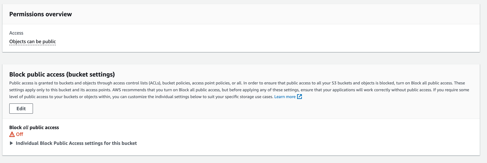
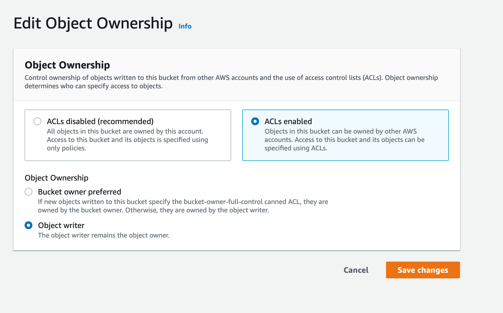

# Using S3 services with Apostrophe

Deploying Apostrophe to production requires that you specify hosting for the code base, the MongoDB instance, and storage for any uploaded content. Many hosting services can provide all three, but it is also possible and sometimes desirable to split these between different services. This tutorial looks at file storage solutions using the S3 API.

## What is the S3 API?
The S3 API is a REST API developed by Amazon as a means of communicating with their Simple Storage Service (S3). Versions of this API have since been adopted by many other providers. These alternative providers can sometimes provide lower cost points or desirable features, like IPFS. The `@apostrophecms/uploadfs` module provides an easy way to connect to most S3 API-powered services through environmental variables.

 Depending on the service used for hosting your code base, there are different ways to set these variables. For example, Heroku as we show in our [hosting tutorial](./deploying-to-heroku.md), allows you to configure your app either through their CLI or dashboard. For other hosting environments, you may need to set these variables through a `.env` or `.bashrc` file.

Let's start by looking at how to connect with Amazon Web Services (AWS) S3.

## Using AWS S3 services

For AWS S3 we need to add values for four environment variables: `APOS_S3_BUCKET`, `APOS_S3_REGION`, `APOS_S3_KEY`, and `APOS_S3_SECRET`.

1) Create an [Amazon AWS account](https://aws.amazon.com/pm/serv-s3/) and then log into the management console. From the "Services" menu select "Storage" and then "S3". Note that Amazon offers 12 months free with a fixed data cap.
2) This should take you to a dashboard screen where you can create a new bucket. Give your bucket a name. This is what we will use as a value for the `APOS_S3_BUCKET` environment variable.
3) Select an AWS region - this is the value we will use for the `APOS_S3_REGION` variable.
4) Leave everything else alone for now. We will come back to security in the next section.
5) From your account drop-down, select "Security credentials".
6) Open the "Access keys" section.
7) Click to "Create New Access Key"
8) This will create both our `APOS_S3_KEY` and `APOS_S3_SECRET` values. Make sure to save your secret value. You will be able to see your key from this page, but not your secret.

Setting these variables will allow for upload into your bucket, but until you change the permissions settings for the bucket your site won't be able to access the resources.

### Example Amazon S3 permissions

1) First, select the bucket from the S3 management console and then click on the "Permissions" tab. Click on the "Edit" button to edit your permissions.

2) Uncheck the "Block all public access" box and save the changes. You will have to confirm that you want to do this.

3) Scroll down the page to the "Object Ownership" section and click the "Edit" button.

4) Select "ACLs enabled" and "Object writer" then acknowledge the warning and save the changes.

If you are using a CDN or want to make uploaded objects private for another reason, you can set the `bucketObjectsACL` to `private`. See the [`uploadfs` documentation](/reference/modules/uploadfs.html#s3-storage-options) for more information and options.

## Using FileBase for storage

The FileBase storage service uses a truncated version of the S3 API. However, we can use this service in almost the same manner as the AWS S3 service. In this case, we must pass in one additional environment variable, `APOS_S3_ENDPOINT`, and **not** set the `APOS_S3_REGION` variable. See the [`uploadfs` documentation](/reference/modules/uploadfs.html#s3-storage-options) for more information and options.

1) Create a [FileBase account](https://filebase.com/). While the service does have a free tier, it doesn't allow public access. This means our site won't be able to load resources, so you need to select one of their paid plans.
2) From the console switch to the "Buckets" tab and click on "Create Bucket".
3) Give the bucket a name. This is the value we will pass to the `APOS_S3_BUCKET` variable.
4) Leave the storage network as "IPFS" and click "Create Bucket".
5) Set the bucket access to public using the toggle next to the bucket name.
6) Click the "Access Keys" tab.
7) This screen will display the key and secret values we will add to the `APOS_S3_KEY` and `APOS_S3_SECRET` variables.
8) On this screen we can also get the value for the `APOS_S3_ENDPOINT` environment variable from the URL listed under 'S3 API Endpoint'. Note: you should **not** set the `APOS_S3_REGION` key.

### FileBase Security
While FileBase can accept many of the same type of CORS (cross-origin resource sharing) and ACL (access control list) rules as AWS S3, simply setting the security toggle to "public" on the "Buckets" screen should be enough for most sites. FileBase does not allow for object-level ACLs. The permissions for your uploads is based on the bucket the object is uploaded into, so the `bucketObjectsACL` option will not apply.

## Using Vultr for storage

The Vultr storage service uses a truncated version of the S3 API. However, we can use this service in almost the same manner as the AWS S3 service. In this case, we must pass in one additional environment variable, `APOS_S3_ENDPOINT`, and **not** set the `APOS_S3_REGION` variable. See the [`uploadfs` documentation](/reference/modules/uploadfs.html#s3-storage-options) for more information and options.

1) Create a [Vultr account](https://www.vultr.com/). While the service doesn't have a free tier, you should be able to find a free credit offer if you are a new customer.
2) Log in to your account and navigate to "Products".
3) Select "Objects" to begin creating a new storage object.
4) Select your preferred location. 
5) Add a label for your object - this object can contain multiple storage buckets.
6) Wait for the object to install and then click on the green arrow.
7) Under the S3 Credentials you will see your Hostname, Secret Key, and Access Key. These will be used for the `APOS_S3_ENDPOINT`, `APOS_S3_SECRET`, and `APOS_S3_KEY` variables. Note: you should **not** set the `APOS_S3_REGION` key.
8) Click the "Buckets" tab.
9) Click the "Create Bucket" button.
10) Add a bucket name following the noted limitations. This name will be used to set the `APOS_S3_BUCKET` variable.

### Vultr Security
While files uploaded to Vultr are private by default, the `@apostrophecms/uploadfs` module sets `bucketObjectsACL` to `public-read` by default. Therefore, you don't have to perform any further security changes in order for your site to be able to access the stored files.

## Using Wasabi for storage

The Wasabi storage service has an expanded API that supports some features not found in the AWS S3 REST API, but is compatible with the core S3 API that Apostrophe uses. We can use this service in almost the same manner as the AWS S3 service. In this case, we must pass in one additional environment variable, `APOS_S3_ENDPOINT`, and **not** set the `APOS_S3_REGION` variable. See the [`uploadfs` documentation](/reference/modules/uploadfs.html#s3-storage-options) for more information and options.

1) Create a [Wasabi account](https://www.wasabi.com/).  While the service does have a free tier, it doesn't allow public access. This means our site won't be able to load resources, so you need to select one of their paid plans. You may be able to find a credit offer if you are a new customer.
2) Once logged in, click on "Create Bucket".
3) Add a bucket name. This is the value we need to set for the `APOS_S3_BUCKET` variable.
4) Select a preferred region. Note the URL to the right of each region. This is the value for the `APOS_S3_ENDPOINT` variable. Although each bucket will have a region listed, this should **not** be added to the `APOS_S3_REGION` variable. This variable should not be set.
5) Click the "Next" button to step through the settings until the "Create bucket" button comes up. Nothing needs to be changed.
6) Click on the "Access Keys" menu item on the left.
7) Click the "Create new access key" button.
8) Download the credentials. You won't be able to get the secret again.
9) Get the `APOS_S3_SECRET` and `APOS_S3_KEY` values from the file.

If you didn't note the endpoint URL you can get it based on the region code (e.g. 'us-east-1') from this [page](https://docs.wasabi.com/docs/service-urls-for-wasabis-storage-regions).

### Wasabi security
The files uploaded to the Wasabi bucket are publicly available right away without the need for any changes. However, if you click the menu to the right of the bucket name and select "Setting", it will bring up a page that allows you to alter permissions easily. See the [`uploadfs` documentation](/reference/modules/uploadfs.html#s3-storage-options) for more information and options.

## Using DigitalOcean Spaces for storage

The DigitalOcean Spaces API is a truncated version of the AWS S3 API that supports all the features we need for using it for storage with Apostrophe. We can use this service in almost the same manner as the AWS S3 service. In this case, we must pass in one additional environment variable, `APOS_S3_ENDPOINT`, and **not** set the `APOS_S3_REGION` variable. See the [`uploadfs` documentation](/reference/modules/uploadfs.html#s3-storage-options) for more information and options.

1) Create a [DigitalOcean account](https://www.digitalocean.com/). They don't have a free tier, but do offer a credit to new customers.
2) Once logged in, you'll be brought to a project page. Click on "Store static objects". In some cases, you might instead have to click "Start using Spaces".
3) Choose a preferred datacenter region.
4) Leave "Restrict File Listing" selected.
5) Create a name and select a project. If you haven't made one it will assign it to a default called "first-project". The name is the value for the `APOS_S3_BUCKET` variable.
6) Click on "Create a Space".
7) Click on the "Settings" tab.
8) Copy the "endpoint" URL. This is the value for the `APOS_S3_ENDPOINT` variable.
9) Click on the "API" tab in the left menu.
10) Scroll down to the "Spaces access keys" section and click "Generate New Key".
11) Add a name and hit return. It will take a few seconds to generate the key and secret. Copy them. You will be able to get the key again by returning to this page, but you won't be able to retrieve the secret.
12) Assign the key and secret values to the `APOS_S3_KEY` and `APOS_S3_SECRET` variables, respectively. The `APOS_S3_REGION` variable should **not** be set.

### DigitalOcean Security
The assets uploaded to the DigitalOcean Spaces are publicly readable by default. No security policy changes are required. If needed, you can configure the CORS (cross-origin resource sharing) through the settings of each space, and you shouldn't need to change anything.
