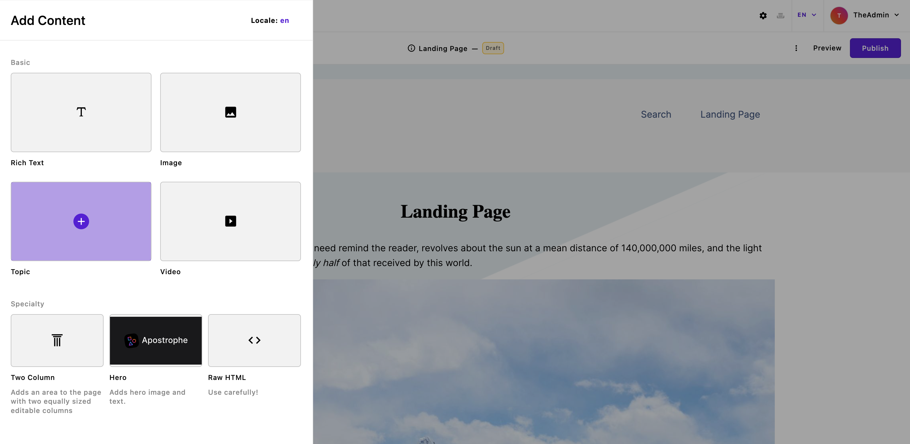

# Areas and widgets

**Areas** are core to Apostrophe's in-context editing experience. They are special fields where editors can add one or more content widgets. A **widget** is a section of structured content, such as a block of rich text, an image slideshow, or a grid of featured products. Together, these two features let editors add custom and advanced content to a website, move it around, and edit it &ndash; all within a model that maintains the content design. Areas can be configured for editors to add content through a basic menu or through an expanded preview menu.

## Basic area configuration

Like other fields, area fields are configured as part of the [field schema](/guide/content-schema.md) for a page or piece type. The following example shows a landing page type with one area field named `main`. Every area requires a `widgets` option to configure the allowed widget types. This example includes three core widget types.

<AposCodeBlock>

``` js
module.exports = {
  extend: '@apostrophecms/page-type',
  options: {
    label: 'Landing Page'
  },
  fields: {
    add: {
      main: {
        type: 'area',
        options: {
          widgets: {
            '@apostrophecms/rich-text': {},
            '@apostrophecms/image': {},
            '@apostrophecms/video': {}
          }
        }
      }
    },
    group: {
      mainArea: {
        label: 'Main page content',
        fields: ['main']
      }
    }
  }
};
```

<template v-slot:caption>
  modules/landing-page/index.js
</template>

</AposCodeBlock>


### Leave `-widget` out of area configuration

If you dig into the Apostrophe code, or read the guide to custom widget types, you may already know that widget module names end with `-widget`, such as `@apostrophecms/rich-text-widget`. This suffix is left off when configuring areas. The area knows these are widgets already and it does not seem necessary to require developers to write it over and over.

### Limiting the number of widgets in an area

To limit the number of widgets allowed in a specific area, include a `max` option.

```javascript
main: {
  type: 'area',
  options: {
    widgets: {
      '@apostrophecms/rich-text': {},
      '@apostrophecms/image': {},
      '@apostrophecms/video': {}
    },
    max: 3
  }
}
```

This can be especially useful when you want to allow only one widget of a particular type in an area. This can be a good way to add a special page introduction that should only include a single rich text area.

```javascript
introduction: {
  type: 'area',
  options: {
    widgets: {
      '@apostrophecms/rich-text': {}
    },
    max: 1
  }
}
```

## Expanded widget preview menu configuration
 To enhance the editor experience, an expanded widget menu can be added instead of the basic menu. This context menu expands from the left side and provides a visual indicator for each widget in the area and support for organizing widgets into groups. These visual indicators can be preview images or icons.

 Adding an `area` using the expanded menu requires a [field schema](/guide/content-schema.md) slightly different from a basic area. The following example shows a landing page type with one area field named `main`.

<AposCodeBlock>

```javascript
module.exports = {
  extend: '@apostrophecms/page-type',
  options: {
    label: 'Landing Page'
  },
  fields: {
    add: {
      main: {
        type: 'area',
        options: {
      👉🏻  expanded: true,
      👉🏻  groups: {
            basic: {
              label: 'Basic',
              widgets: {
                '@apostrophecms/rich-text': {},
                '@apostrophecms/image': {},
                'topic': {},
                '@apostrophecms/video': {}
              },
          👉🏻  columns: 2
            },
            layout: {
              label: 'Specialty',
              widgets: {
                'two-column': {},
                'hero': {},
                '@apostrophecms/html': {}
              },
              columns: 3
            }
          }
        }
      }
    },
    group: {
      mainArea: {
        label: 'Main page content',
        fields: ['main']
      }
    }
  }
};
```

<template v-slot:caption>
  modules/landing-page/index.js
</template>

</AposCodeBlock>



 For the expanded widget preview menu, there are three settings to configure. The first option is `expanded` and takes a boolean to activate the expanded preview. This is required to activate the menu.
 
 Second, widgets are added in a `groups` option that organizes the added widgets into specific regions of the menu. Each grouping of widgets is organized in a named object. In the example code, there are two such `groups` added within the area. The first is named `basic`, and the second is named `layout`. Each has a `label` key that provides the name displayed for the widget group. Each individual group has a `widgets` key that contains the names and options for all of the widgets to be included in that group. Like with the basic configuration, the widget names do not need the '-widget' suffix.
 
 Finally, each group has a `columns` key that takes an integer from 1-4. This determines how many widgets will be displayed per line. The default value is 3.

An `area` configured in this way can still take a `max` option to limit the number of widgets to be added.

### Widget preview options

#### `previewImage`: the simplest way to use an image

The `previewImage` option takes the extension, without prefixing, of the image to be used. For example, `'png'` or `'gif'`. The actual image should be added into the `/public` folder of the widget and named `preview.<extension>`, where `extension` matches the string passed to the option. If a file by this name exists in the `public/` subdirectory of the module's project-level configuration, that will automatically be used in preference to a version found in the core module, but still we recommend setting `previewImage` to match your file extension in case the extension of the original ever changes.

The displayed dimensions of the `previewImage` depend on the number of columns being used for the row in which it will be displayed. For two columns, the displayed dimensions are about 240 x 120, or 2:1. For three columns, the dimensions are about 160 x 90, or 16:9. For four columns, the dimensions are approximately 120 x 66, or approximately 16:9. Choosing an image with a ratio of 16:9, with the center of the image well placed should work with all column sizes.

::: info
The extension should always be lower case.
:::

#### `previewUrl`: when you need a custom image URL

The `previewUrl` option accepts a complete URL to the image being used. This option supports Apostrophe asset paths, making it easier to serve
images kept in a particular module. If you do not wish to use the default filename, or wish to serve the image from a different location, this option gives you the flexibility to achieve that.

**For example:** if you wish to serve the file `special-preview.jpg` from
your project-level `modules/@apostrophecms/image-widget/public` folder,
you can do that with the following configuration:

<AposCodeBlock>

```javascript
module.exports = {
  options: {
    // The "my-" prefix tells Apostrophe to use the project-level
    // folder, not the one in the core apostrophe module
    previewUrl: '/modules/@apostrophecms/my-image-widget/special-preview.jpg',
  }
}
```
<template v-slot:caption>
  modules/@apostrophecms/image-widget/index.js
</template>

</AposCodeBlock>

::: info
Note the `my-` prefix in `@apostrophecms/my-image-widget`. Without this
prefix, Apostrophe would look for the file in the core Apostrophe npm
module, and would not find it.
:::

#### `previewIcon`: when you prefer an icon to an image

The final option is `previewIcon`. This option takes any icon that has already been [registered](https://github.com/apostrophecms/apostrophe/blob/main/modules/@apostrophecms/asset/lib/globalIcons.js). Alternatively, additional Material Design Icons or icons from your own Vue files can be registered using the [`icons`](https://v3.docs.apostrophecms.org/reference/module-api/module-options.html#icon) property within the module. If it is present, the `icon` option will be used if no `previewIcon` option is set.

## Adding placeholder content to widgets

The rich text, image, and video widgets all display placeholder content by default. Additionally, these modules do not show an initial editing modal. This placeholder content will not be displayed in either the draft preview or the live page if published. This default behavior can be turned off by setting the `placeholder` option of the relevant module to `false`. This will eliminate the display of placeholder content and open the editing modal when the widget is selected.

Custom placeholder content can be added to the image and video widgets through the `placeholderImage` and `placeholderUrl` options.

For the image widget, the `placeholderImage` option takes **just the file extension,** like `jpg` (note no `.`). You must also copy a matching file in the `public` folder of the module, e.g. copy that image to `/modules/@apostrophecms/image-widget/public/placeholder.jpg` (the name must be `placeholder` and the extension must match `placeholderImage`).

`placeholderImage` is the easiest way, but for those who prefer to change the filename or specify a complete URL to the placeholder image, see also the [placeholderUrl option](core-widgets.md#specifying-a-custom-url-to-a-placeholder-image).

For the video widget, the `placeholderUrl` option takes the URL of a video on a site that the video widget already supports, like YouTube.

::: info
For legacy reasons, `placeholderUrl` is also supported for image widgets, however we do not recommend its use because it is challenging to determine the correct asset URL. Use `placeholderImage` and let Apostrophe figure it out for you.
:::

The custom placeholder content for the rich text widget is passed as a string to the `placeholderText` option in the `/modules/@apostrophecms/rich-text-widget/index.js` file. This can be either a simple string or a namespaced i18n string.

Both the image and video widgets have a `placeholderClass` option that takes a string and adds that class to the content wrapper.

## Adding areas to templates

Areas have a special template tag to add them in template markup. It requires passing two arguments: the area's context and the area name.

``` nunjucks

```

The **context** refers to the data object that the area field belongs to. This could be a page, a piece, or a widget. In the landing page example above, the `main` area belongs to a landing page. In that case, the context would be that page's data object in the template: `data.page`.

``` nunjucks

```

The template tag knows to use the area data on `data.page.main`, check for the widgets allowed in that area, and render the area using the correct widget templates.

### Passing context options

Most widget options must be included in the area field configuration. For example, you can configure the rich text widget to use particular formatting controls. The server uses these options to properly validate user input.

```javascript
main: {
  type: 'area',
  options: {
    widgets: {
      '@apostrophecms/rich-text': {
        toolbar: [
          'bold',
          'italic',
          'strike',
          'link'
        ]
      }
    }
  }
}
```

::: info
Learn more about rich text options in [the section on core widgets](/guide/core-widgets.md).
:::

In other situations, you may need to **pass the widget *template* options that only apply to a specific context**. One example of this is the [`sizes` attribute](https://developer.mozilla.org/en-US/docs/Web/HTML/Element/img#attr-sizes) for the core image widget's `img` tag. Since that attribute tells browsers which file versions to use in a responsive image, it may be different when the image is a small thumbnail as opposed to when it is a larger featured photo.

These can be added in an object after the area tag arguments using the `with` keyword.

<AposCodeBlock>

``` nunjucks

```

<template v-slot:caption>
  modules/landing-page/views/page.html
</template>

</AposCodeBlock>

The object following `with` should include keys matching widget type names, without the `-widget` suffix (e.g., the `@apostrophecms/image`). The context template will pass those options into the proper widget template as `data.contextOptions`. In the example above, the core image widget template, *and only that template*, would be able to use the data as:

``` nunjucks
{{ data.contextOptions.sizes }}
```

Any context options for widget types not allowed in the area are ignored.
