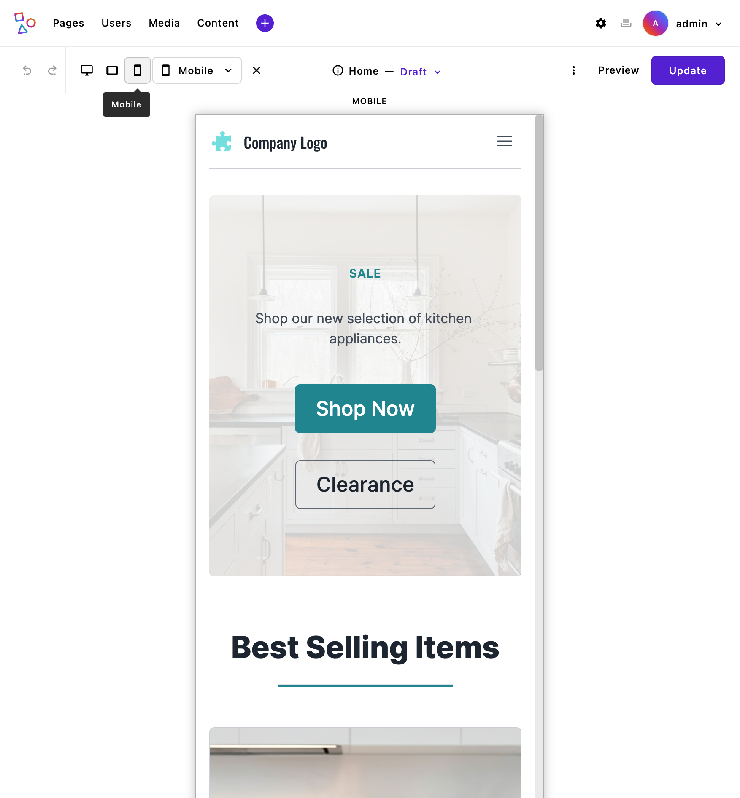
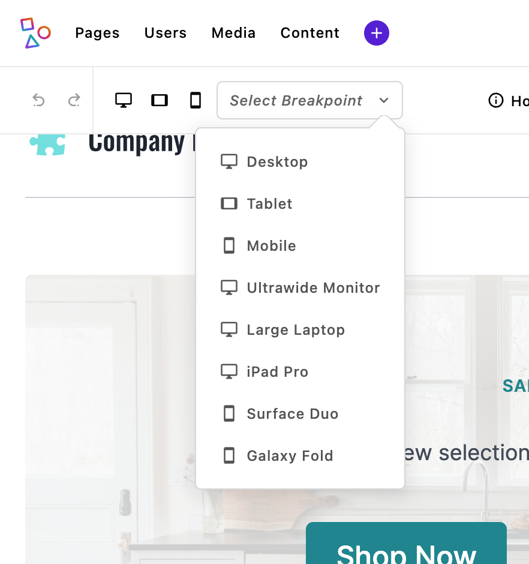

## Device breakpoint preview

Apostrophe provides a convenient way to emulate devices, like phones and tablets, making it easy to see how your content will look at different screen sizes.


When device preview mode is enabled, you’ll see icons in the admin bar for each of the breakpoints (sizes) that have been set through the `breakpointPreviewMode` of the `@apostrophecms/asset` module. By default, there are three shortcut device breakpoints added. Adding additional breakpoint preview sizes without `shortcut: true` will cause a dropdown menu with all the sizes to appear, in addition to the icons.



Clicking on an icon or making a selection from dropdown menu will cause your page content to display in a container that matches the specific device size, so you can quickly check how the layout and styles respond. The displayed content will be fully editable, so that you can see how any new content is impacted by the current media queries. You can go back to editing in the full browser screen by clicking on the currently selected preview icon or clicking on the `X` to the right of the dropdown.

Custom styles you’ve added with CSS media queries are converted by the `asset` module to container queries. Note that this only works with styles added or imported by stylesheets in the [`ui/src/index.scss` files of each module](/guide/front-end-assets.html#placing-client-side-code), it doesn't work with styles outside the build path, like styles added directly to the template.


Breakpoint preview is enabled by default, but if you want to change the configuration you can pass additional options to the `@apostrophecms/asset` module at project level.
<AposCodeBlock>

```javascript
module.exports = {
  options: {
    breakpointPreviewMode: {
      enable: true,
      screens: {
        desktop: {
          label: 'Desktop',
          width: '1440px',
          height: '900px',
          icon: 'monitor-icon',
          shortcut: true
        },
        tablet: {
          label: 'Tablet',
          width: '1024px',
          height: '768px',
          icon: 'tablet-icon',
          shortcut: true
        },
        mobile: {
          label: 'Mobile',
          width: '414px',
          height: '896px',
          icon: 'cellphone-icon',
          shortcut: true
        },
        ultrawide: {
          label: 'Ultrawide Monitor',
          width: '2560px',
          height: '1440px'
        },
        laptopLarge: {
          label: 'Large Laptop',
          width: '1680px',
          height: '1050px'
        },
        ipadPro: {
          label: 'iPad Pro',
          width: '1366px',
          height: '1024px'
        },
        surfaceDuo: {
          label: 'Surface Duo',
          width: '540px',
          height: '720px'
        },
        galaxyFold: {
          label: 'Galaxy Fold',
          width: '280px',
          height: '653px'
        }
      }
    }
  }
};
```
<template v-slot:caption>
modules/@apostrophecms/asset/index.js
</template>
</AposCodeBlock>

You can learn about all the properties that can be passed to the `breakpointPreviewMode` option on the [`@apostrophecms/asset` reference page](/reference/modules/asset.md#breakpointPreviewMode). The two most critical are `enable` and `screens`. If you pass `enable: false` it will remove the breakpoint preview icons and menu from the adminbar. The `screens` property takes an object where each property is a different breakpoint. Adding the `breakpointPreviewMode` at the project level will override any default values, so you need to pass `enable: true` if you wish to add additional breakpoints.

Each of the individual breakpoint properties in the `screen` object take a `label` that will be displayed to the user when they hover over the icon. The `icon` property supplies the icon that will be displayed if the breakpoint is also given a property of `shortcut: true`. This icon name should be either an icon you can [register in this module](/reference/module-api/module-options.md#icon) or an icon that is [already registered](/reference/module-api/module-overview.md#icons). Finally, each breakpoint needs the `width` and `height`, in pixels, of the container that corresponds to the device being emulated.

---

## Limitations and Differences
While the ApostropheCMS breakpoint preview effectively converts many media queries to container queries, there are some key limitations and differences to be aware of. These limitations stem from fundamental differences between **media queries** (which target the viewport) and **container queries** (which target individual containers).

#### 1. **Unsupported Parameters**
Certain media query conditions do not translate well to container queries:

- **Orientation queries**:
  - Parameters like `orientation: landscape` or `orientation: portrait` don't have equivalent behavior in container queries, as containers don't have the same orientation concept as viewports.
  - Example of query:
    ```css
    @media (orientation: landscape) { ... }
    ```
- **Aspect ratio**:
  - Queries based on aspect ratio, such as `min-aspect-ratio` and `max-aspect-ratio`, may not behave as expected in container contexts.
  - Example:
    ```css
    @media (min-aspect-ratio: 16/9) { ... }
    ```

#### 2. **Valid Syntax Patterns**
The plugin supports both standard media query syntax and modern range syntax:

- **Standard syntax** (fully supported):
  ```css
  @media (min-width: 600px) { ... }
  @media (max-width: 1200px) { ... }
  ```

- **Range syntax** (fully supported):
  ```css
  @media (width >= 600px) { ... }
  @media (width <= 1200px) { ... }
  @media (600px <= width <= 1200px) { ... }
  ```

#### 3. **Behavioral Differences**
Media queries operate on the **viewport size**, whereas container queries respond to the **size of a specific container**. This distinction can lead to subtle differences in layout and behavior:

- **Viewport context**:
  - Media queries are global; they consider the entire screen or browser window. If a layout condition depends on the viewport, such as full-page navigation menus, it might not behave identically when converted to container queries.

- **Nested containers**:
  - Container queries work within the bounds of their parent container. If a nested container has a different size, the styles applied to its content may differ from expectations.

- **Resizing effects**:
  - Breakpoint preview resizes containers but does not simulate the entire viewport behavior. This can impact layouts that rely on viewport-relative units like `vw` and `vh`.

#### 4. **Viewport-relative Units**
While the conversion from viewport-relative units (`vw`, `vh`, `vmin`, `vmax`) to container-relative units (`cqw`, `cqh`, `cqmin`, `cqmax`) generally provides a good approximation for the breakpoint preview feature, there are some practical considerations to be aware of:

- Nested Container References

The preview container becomes the new reference point for all calculations, which may not accurately represent the actual viewport proportions in the final design.

- Fixed-Size Elements Lose Their Consistency

Some designs might intentionally use viewport units for consistent sizing across different views. For example, a header that should always be exactly 10vh tall regardless of container. Converting these to container query units changes this intended behavior.

- Mixed Unit Relationships Change

When designs mix viewport units with other units, their relative proportions will change in the preview:

```css
/* Original CSS with mixed units */
.sidebar {
  width: 30vw; /* 30% of viewport width */
  margin-right: 20px; /* Fixed margin */
}

/* When converted in preview */
.sidebar {
  width: 30cqw; /* 30% of container width */
  margin-right: 20px; /* Still a fixed margin */
}
```

#### 5. **User Preference Queries**
Media queries that target user preferences don't translate to container contexts:

- **Prefers-color-scheme**: Media queries like `@media (prefers-color-scheme: dark)` are not applicable to containers, as they rely on global user settings.
- **Prefers-reduced-motion**: Similar to color schemes, these queries target user preferences and cannot be container-specific.

#### 6. **Body Element Styling**
Styles targeting the `body` element are supported in breakpoint preview mode. The system handles common body selector patterns like `body`, `html > body`, and `html body`, as well as body selectors with classes or attributes. However, very complex selector chains involving body may not be fully supported.
---

### Summary of Support
| **Media Query Feature**       | **Support in Container Queries**       |
|-------------------------------|---------------------------------------|
| Standard width/height queries | ✅ Fully supported |
| Range syntax queries | ✅ Fully supported |
| Viewport-relative units | ✅ Converted to container units |
| Print media queries| ✅ Preserved |
| Complex logical conditions (multiple combined conditions) | ⚠️ May behave differently |
| User preference queries | ❌ Not applicable to containers |
| `orientation` | ❌ Not applicable to containers |
| `aspect-ratio` | ❌ Not applicable to containers |

---

## Transform Option

The transform option provides a workaround for handling special cases by allowing you to provide a custom function to modify how media query parameters are converted into container query parameters. This function only affects the media query transformation and does not impact the conversion of viewport units (vh/vw) to container query units (cqh/cqw) within rules.

### Usage

```js
require('postcss-viewport-to-container-toggle')({
  transform: (mediaFeature) => string
})
```

### Parameters

- `mediaFeature` (string): The original media query parameters that would be transformed into container query parameters.

### Return Value

- Returns a string containing the transformed container query parameters.

### Default Behavior

When no transform function is provided, the plugin uses the original media feature string without modification:

```js
transform = null // Default value
// Equivalent to:
transform = (mediaFeature) => mediaFeature
```

### Examples

### Basic Transform

```js
// Custom transformation of media queries
{
  transform: (mediaFeature) => {
    return mediaFeature.replace(/(\d+)px/g, '$1em');
  }
}

// Input
@media (width > 600px) {
  .element { width: 100vw; }
}

// Output
@media (width > 600px) {
  :where(body:not([data-breakpoint-preview-mode])) .element { width: 100vw; }
}
@container (width > 600em) {
  .element { width: 100cqw; }
}
```

### Complex Transform

```js
// Modify specific types of queries while preserving others
{
  transform: (mediaFeature) => {
    // Convert pixel-based width queries to percentage-based
    if (mediaFeature.includes('width')) {
      return mediaFeature.replace(/(\d+)px/g, ($0, $1) => `${($1 / 1920) * 100}%`);
    }
    // Leave other queries unchanged
    return mediaFeature;
  }
}

// Input
@media (width > 600px) and (orientation: landscape) {
  .element { width: 100vw; height: 50vh; }
}

// Output
@media (width > 600px) and (orientation: landscape) {
  :where(body:not([data-breakpoint-preview-mode])) .element {
    width: 100vw;
    height: 50vh;
  }
}
@container (width > 31.25%) and (orientation: landscape) {
  .element {
    width: 100cqw;
    height: 50cqh;
  }
}
```

## Important Notes

1. The transform function is called when converting media queries to container queries.
2. The plugin modifies selectors and creates container queries in the following way:
   - For the original media query, selectors are modified to include the conditional attribute, like `:where(body:not([data-breakpoint-preview-mode])) .selector`
   - A new `@container` query is created with the transformed parameters
3. The attribute name (`data-breakpoint-preview-mode`) can be customized via the `modifierAttr` option in your plugin configuration
4. Print-specific media queries (e.g., `@media print`) are preserved as-is without transformation
5. The transform function only affects the container query parameters, not the actual CSS properties