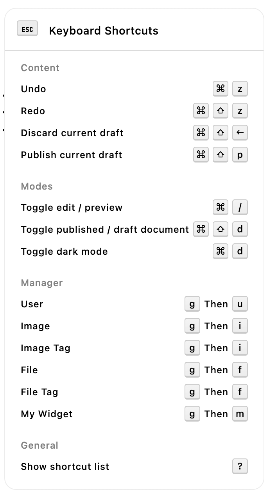

# Adding keyboard shortcuts

The `@apostrophecms/command-menu` module adds keyboard shortcuts and additional pop-up menus to the Admin UI. The list of shortcuts can be accessed from any page or piece-type manager using the '?' key. There are several pre-programmed common shortcuts, with additional page-level shortcuts added automatically for each custom piece-type created. Any module can streamline the editorial workflow through the addition of custom shortcuts. These shortcuts are added to the `commands(self)` customization function section of the module's `index.js` file. Like the other customization functions, it should return an object. 

<AposCodeBlock>

```javascript
module.exports = {
  // ...
  commands(self) {
    return {
    //...
    }
  }
}
```

<template v-slot:caption>
/modules/custom-widget/index.js
</template>
</AposCodeBlock>

## Registering shortcut commands
New shortcuts are registered by passing them as an object of objects to the `add` key. Each shortcut object requires a unique name as key. The best practice for ensuring the uniqueness of your shortcut name is to namespace it with the module name, for example, `custom-widget:shortcut-name`. If you are registering the same shortcut for several modules in a bundle, it may be programmatically easier to prefix with the registered name by using `` [`${self.__meta.name}:shortcut-name`] ``. Note the use of brackets and backticks to allow the use of template literals.

<AposCodeBlock>

```javascript
module.exports = {
  // ...
  commands(self) {
    return {
      add: {
        'custom-widget:new-shortcut': {
          type: 'item',
          label: 'New shortcut',
          action: {
            type: 'custom-widget-special-action',
            payload: {
              name: 'CustomWidgetActionShortcut'
              props: {moduleName: 'custom-widget'}
            }
          }
        }
      },
      // ...
    }
  }
}
```

<template v-slot:caption>
/modules/custom-widget/index.js
</template>
</AposCodeBlock>

Each shortcut object takes four required properties.

The `type` key always takes a value of `item`. 

The second, `label`, takes a string to display within the menu next to the shortcut keys.

The `action` key takes an object with one required and one optional property. The `type` key is required and takes a string. This string will be emitted when the user completes the shortcut. This string can be detected and used to trigger a function using `apos.bus.$on('type-string', function)`. This can be added to the `mounted()` hook of your Vue component or in custom module JavaScript added to the `/modules/custom-widget/ui/apos/apps/custom.js` file. If used in a Vue component it is best practice to also remove the listener by adding `apos.bus.$off('type-string', function)` to the `destroyed()` hook. If this string is specific to this module it must be unique, but the string can also be shared by multiple modules to trigger changes. For example, many built-in piece-types like the `@apostrophecms/image` and `@apostrophecms/file` use a common string of `command-menu-manager-close` to trigger the closing of the manager modal.

The optional `payload` key takes an object with properties that will be passed to the event listener. In the above example you would use:

<AposCodeBlock>

```javascript
// ...
async mounted() {
    apos.bus.$on('type-string', async state => {
      await self.function( state.name, state.props)
    });
  },
  destroyed() {
     apos.bus.$off('type-string', async state => {
      await self.function( state.name, state.props)
    });
  },
  // ...
```
<template v-slot:caption>
/modules/custom-widget/ui/apos/components/CustomWidgetDisplay.vue
</template>
</AposCodeBlock>

The final key required by the shortcut object is `shortcut`, which takes a string representing the key or key combination that triggers the action. There are three options - a single key, a key plus one or more modifiers, or a chord of two sequential key presses. You can pass multiple shortcuts by separating each with a space. **This is important when passing in shortcuts that use a modifier key that differs between Macintosh and Windows/Linux keymapping.** W3C has [published](https://www.w3.org/WAI/ARIA/apg/practices/keyboard-interface/) helpful guidance in selecting new shortcut keys.

For a single key, just pass that key as the string value to `shortcut`. The 'comma', 'space', and modifier keys (see below) shouldn't be used, but every other standard key can. See the [table](#keymappings) for additional keymappings for keys like the left arrow.

The modifiers that you can use are the 'command', 'option', 'alt', 'control', 'win', 'meta', and 'shift' keys. You can specify that one or more of these keys are held down at the same time as pressing a non-modifier key to activate the shortcut, for example, `Cmd+Shift+m`. See the [table](#keymappings) for the modifier keymappings.

Finally, you can assign a chord of two sequential keypresses to any shortcut by passing a string with each key separated by a comma. Remember that a space can be used as a key, so don't add a space after the comma.

❌ `shortcut: 'x, y'`

✅ `shortcut: 'x,y'`


::: note
Shortcuts already defined by the browser cannot be used within the shortcut manager.
:::

## Keymappings
Not that the key mappings below are shown with initial capitalization, but are case-insensitive.
| key(s) | Mapping |
|---|---|
| a-z, 0-9,`-=[]\;'./ | The same as the specific key (note that any upper case or symbol key that requires that the shift key be pressed will not work) |
| function keys 1-12 | fn1 - fn12 |
| MacOS `Command` or WinOS `Win` key | Meta |
| `Command` | Cmd, Command |
| `Option`/`Alt` | Alt, Option |
| `Control` | Ctrl, Control |
| `Escape` | Esc, Escape |
| `Space` | Space |
| `Tab` | Tab |
| `Shift` | Shift |
| `Caps lock` | Capslock |
| arrows | arrowleft, arrowup, arrowright, arrowdown |
| MacOS `Delete` or WinOS/Linux `Backspace` | Backspace |
| WinOS/Linux `Del` | Delete |
| `pgdn` | Pagedown |
| `pgup` | Pageup |

## Organizing shortcut commands

There are two types of shortcut menus. One is displayed on all page types, while the other is specific for each piece-type. Where each newly registered shortcut is displayed is determined by the `modal` property of the `commands(self)` function.

### Adding shortcuts to the page-level menu

The addition of shortcuts to the main page-level menu is accomplished by passing an object of objects to the `default` key. This key takes properties that specify either one of the four existing section ("content", "mode", "manager", or "general") or specifies the creation of a new section.

Each of the keys in the `default` object should start with `@apostrophecms/command-menu:` and be prefixed with the name of an existing or new section. For example, to add a new shortcut to the "general" section the key would be `@apostrophecms/command-menu:general`. For values, each key takes an object with a `commands` and an optional `label` property. The value of `commands` should be an array containing the names of all the shortcuts to be added to the section. The `label` key should be set to a string that will be added as a menu section header.

::: note
If you add a `label` property to a key that specifies an existing section, the passed-in `lable` string will override the existing label.
:::

<AposCodeBlock>

```javascript
module.exports = {
  // ...
    commands(self) {
    return {
      add: {
        'custom-widget:dark-toggle': {
          type: 'item',
          label: 'Toggle dark mode',
          action: {
            type: 'toggle-component-to-dark-mode'
          },
          shortcut: 'Meta+d'
        }
      },
      modal: {
        default: {
          '@apostrophecms/command-menu:mode': {
            commands: [ 'my-widget:dark-toggle' ]
          }
        }
      }
    };
  }
};
```

<template v-slot:caption>
/modules/custom-widget/index.js
</template>
</AposCodeBlock>



### Adding shortcuts to the piece-type menu

Shortcuts can be added to the piece-type menu by specifying the particular module with a key made up of the module name followed by `:manager`. For example, `my-piece:manager`. This key gets a property of `@apostrophecms/command-menu:manager` that has an object composed of `commands` and optional `label` properties. Like the page menu, the `commands` key receives an array composed of the names of each shortcut to be added.

<AposCodeBlock>

```javascript
module.exports = {
  / ...
  commands(self) {
    return {
      add: {
        'article:spellcheck': {
          type: 'item',
          label: 'Trigger spellcheck',
          action: {
            type: 'trigger-spellcheck-of-article',
            payload: {
              language: 'en'
            }
          },
          shortcut: 'Cmd+Shift+.'
        }
      },
      modal: {
        'article:manager': {
          '@apostrophecms/command-menu:manager': {
            commands: [ 'article:spellcheck' ]
          }
        }
      }
    };
  }
};

```

<template v-slot:caption>
/modules/article/index.js
</template>
</AposCodeBlock>


In this case, we could add our listener into some custom JavaScript that powers our hypothetical spell checker.

<AposCodeBlock>

```javascript
export default () => {
  apos.bus.$on('trigger-spellcheck-of-article', (payload) => {
    console.log('Spellcheck triggered with language ', payload.language);
    // remainder of the spellcheck code
  });
};
```

<template v-slot:caption>
/modules/article/ui/apos/apps/spellcheck.js
</template>
</AposCodeBlock>