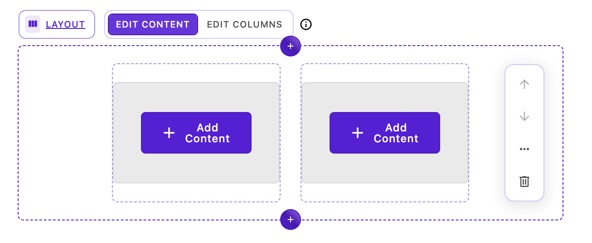
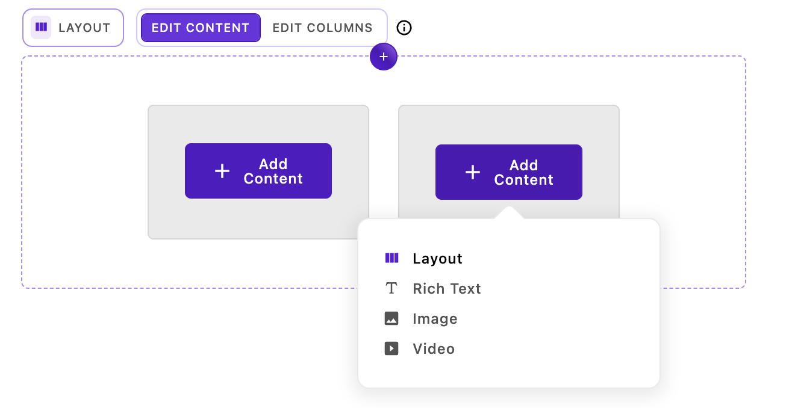
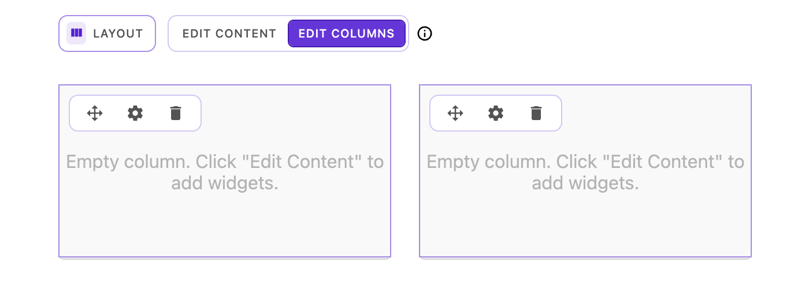
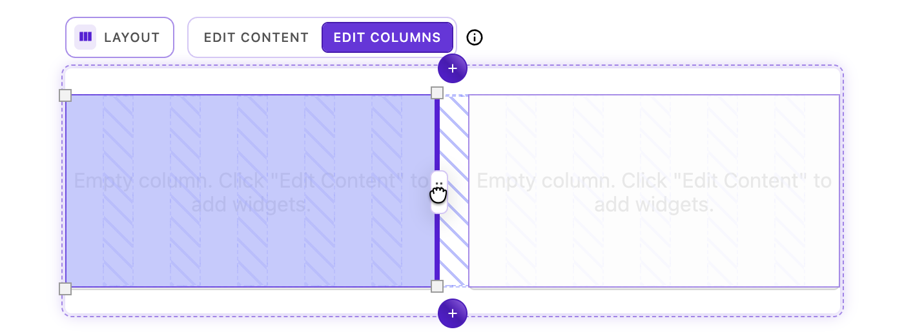
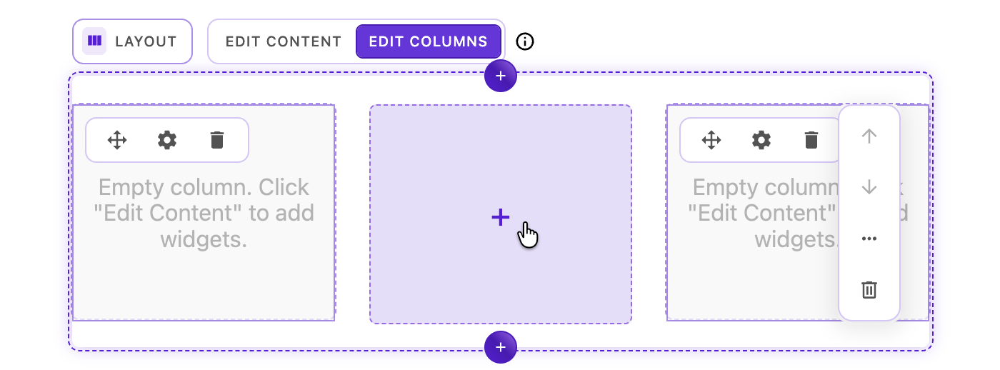
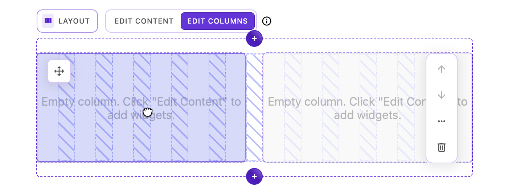
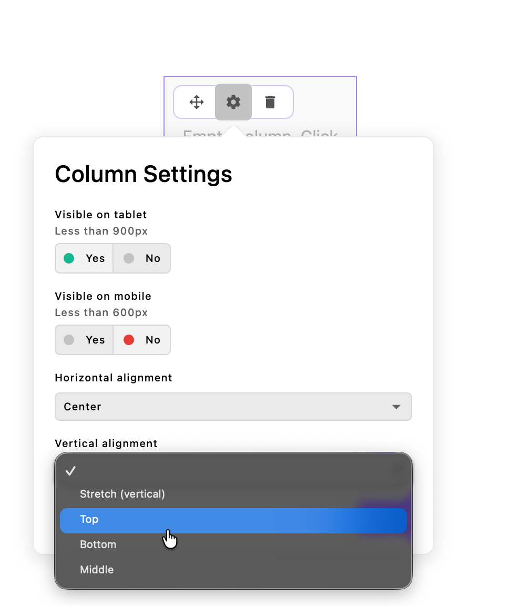
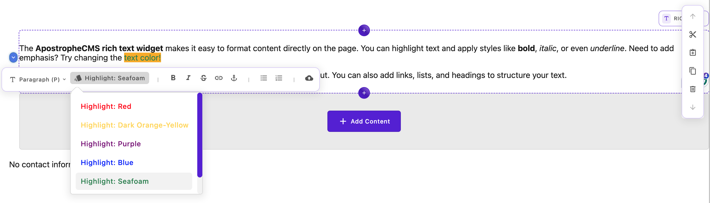

# Core widgets

Apostrophe comes with some content widgets you can use in areas right away. See below for their descriptions and options.

| Common name/label | Widget reference | What is it? |
| ------ | ------ | ------ |
| [Layout (beta)](#layout-widget-beta) | `@apostrophecms/layout-widget` | Create responsive grid-based layouts with configurable columns |
| [Rich text](#rich-text-widget) | `@apostrophecms/rich-text` | A space to enter text and allow formatting (e.g., bolding, links) |
| [Image](#image-widget) | `@apostrophecms/image` | A single image supporting alt text and responsive behavior |
| [Video](#video-widget) | `@apostrophecms/video` | Embed a video from most video hosts by entering its URL |
| [Raw HTML](#html-widget) | `@apostrophecms/html` | Allow entering HTML directly (see security notes below) |

## Layout widget (BETA)

> [!WARNING]
> **This widget is currently in BETA**. Bugs and rough edges may still be found. The API and configuration options are subject to change in future releases, but a migration path will be provided if this occcurs. Use with caution in production environments.



The layout widget provides a powerful CSS grid-based layout system for creating responsive column-based designs. Editors can add the layout widget to a page and then directly add, remove, and resize columns in-context without leaving the page. This provides precise control over column positioning, spanning, and responsive behavior across different screen sizes.

<AposCodeBlock>

``` js
fields: {
    add: {
      main: {
        type: 'area',
        options: {
          widgets: {
            '@apostrophecms/layout': {}
          }
        }
      }
// remainder of fields
```
  <template v-slot:caption>
    modules/@apostrophecms/home-page/index.js
  </template>
</AposCodeBlock>

### How it works

The layout widget creates a CSS grid container with a configurable number of grid columns (default 12). By default, two layout-column widgets (`@apostrophecms/layout-column-widget`) are added when the layout widget is first placed on a page. Editors can then add or remove columns in-context. Each column has its own area for widget addition and can:
- Span multiple grid columns
- Be positioned precisely on the grid
- Adjust its visibility at different breakpoints (desktop, tablet, mobile)
- Apply custom alignment (horizontal and vertical)

### Editor experience

The layout widget provides a specialized editing interface that separates layout management from content editing. This two-mode approach gives editors precise control over their grid structure while keeping content editing straightforward.

#### Editing modes

When a layout widget is selected on the page, the breadcrumb area at the top displays two mode-switching buttons:

- **Edit Content** (left button) - Add and edit widgets within existing columns
- **Edit Columns** (right button) - Modify the grid structure by adding, removing, resizing, and repositioning columns

Toggle between these modes depending on whether you need to work with content or adjust the layout structure.

#### Edit Content mode



In Edit Content mode, the interface behaves like a standard Apostrophe area with a few key differences:

- Each column displays its standard widget controls (add, edit, move, etc.)
- You can add any configured widget type to each column's content area
- The grid structure remains locked - you cannot resize or reposition columns
- This mode is ideal for editors who need to work with content without accidentally modifying the layout

**Common tasks in Edit Content mode:**
- Adding rich text, images, videos, or custom widgets to columns
- Editing existing widget content
- Reordering widgets within a column
- Removing widgets from columns

#### Edit Columns mode



Edit Columns mode unlocks the full power of the layout system, allowing you to manipulate the grid structure itself. Each column displays a set of controls and supports multiple interaction methods.

##### Column controls

Each column displays three icons in its upper-left corner:

1. **Move handle** (drag icon) - Click and drag to reposition the column on the grid
2. **Settings** (cog icon) - Opens the Column Settings dialog
3. **Delete** (trash icon) - Removes the column from the layout

##### Resizing columns



Columns can be resized horizontally using the drag handles that appear on the left and right edges of each column on hover:

1. **Hover over a column edge** - Resize handles appear at hover location
2. **Click and hold a handle** - The underlying grid structure becomes visible, showing column tracks and gaps
3. **Drag horizontally** - The column edge will snap to the nearest grid column line
4. **Release** - The column resizes to span the new width

**Resizing behavior:**
- Columns respect the configured `minSpan` setting (default: 2 columns)
- Columns cannot resize beyond the grid boundaries
- Columns can only be resized to the edge of adjacent columns
- The grid visualization disappears when you release the handle

**Visual feedback during resize:**
- Semi-transparent grid column indicators appear
- Gap indicators show the spacing between grid tracks
- The resizing column is highlighted
- Invalid resize positions are prevented automatically

##### Adding new columns



The layout widget intelligently detects when there's space available for a new column:

1. **Create space** - Resize existing columns or remove columns to create available space
2. **Watch for the plus icon** - When the available space equals or exceeds the `minSpan` setting, a plus icon (➕) appears in the available space
3. **Click the plus icon** - A new column is added at the `defaultSpan` width
4. **Position the column** - Use the move handle to reposition if needed

**Column addition requirements:**
- Available space must be at least `minSpan` columns wide (default: 2 columns)
- New columns are created at `defaultSpan` width (default: 6 columns)
- Maximum number of columns is limited by the grid's total `columns` setting

##### Repositioning columns



There are two methods for moving columns:

**Method 1: Body drag**

1. Click and hold anywhere on the column (except the move handle)
2. Drag the column over another column until it visually shifts
3. Release to exchange positions

**Method 2: Icon drag (drag via move handle)**

1. Click and hold the **move icon** in the upper-left corner
2. Drag the column to a new position
3. The grid visualization appears showing column tracks
4. Release to place the column

*Smart positioning behavior:*

When you drag over another column, the system intelligently decides whether to **nudge** or **swap**:

- **If there's enough grid space**: Adjacent columns are "nudged" over to make room for your column at the new position
- **If there isn't enough space**: Columns swap positions instead

> [!TIP]
> The swapping will occur when there is more than 40% overlap between the columns. This means that sometimes there will be more room to nudge the existing column, but the columns will swap anyway. If you want a column to nudge more than one or two grid columns, it is better to drag them separately.

This smart behavior means you don't have to worry about whether there's room - the layout automatically adapts:
- Dragging left or right with available space → neighbors shift to accommodate
- Dragging when grid is tight → clean position swap
- The grid visualization helps you see available space while dragging

##### Column Settings dialog



When in Edit Columns mode, click the settings icon (cog) on any column to open the Column Settings dialog, which provides options for:

**Responsive visibility controls**

- **Show on Tablet** - Toggle to show or hide this column at tablet viewport widths (configurable, default: 1024px and below)
- **Show on Mobile** - Toggle to show or hide this column at mobile viewport widths (configurable, default: 600px and below)

*Responsive behavior notes:*
- Columns are automatically visible at desktop widths
- Tablet and mobile visibility are independent settings
- Hidden columns still exist in the content but are not rendered
- Use these settings to create responsive layouts that adapt to smaller screens

**Content alignment controls**

- **Horizontal Alignment (justify)** - Controls how content aligns horizontally within the column. Options: `start`, `end`, `center`, `stretch`. Default: `stretch` (or the widget's `defaultCellHorizontalAlignment` setting)
- **Vertical Alignment (align)** - Controls how content aligns vertically within the column. Options: `start`, `end`, `center`, `stretch`. Default: `stretch` (or the widget's `defaultCellVerticalAlignment` setting)

*Alignment behavior notes:*
- These settings apply to the column's content area, not the column itself
- `stretch` (default) makes content fill the available space
- Alignment is applied via CSS Grid's `justify-self` and `align-self` properties
- Changes preview in real-time as you adjust settings

##### Deleting columns


To remove a column from the layout:

1. Click the trash icon in the upper-left corner of the column
2. Confirm the deletion if prompted
3. The column and all its content are removed
4. Adjacent columns are left untouched

> [!IMPORTANT]
> **Deleting a column also deletes all widgets within that column**. This action can be undone using **Ctrl/Cmd + Z**.

#### Keyboard shortcuts

While in Edit Columns mode, several keyboard shortcuts enhance your workflow:

- **Escape** - Close the Column Settings dialog
- **Ctrl/Cmd + Z** - Undo the last column operation (resize, move, add, delete)

### Basic configuration

The layout widget comes with sensible defaults but can be customized through various options:

<AposCodeBlock>

``` js
export default {
  modules: {
    '@apostrophecms/layout-widget': {
      options: {
        columns: 12,          // Total number of grid columns
        minSpan: 2,           // Minimum columns a cell can span
        defaultSpan: 6,       // Default span when adding new columns
        gap: '1.5rem',        // Gap between grid items
        mobile: {
          breakpoint: 600     // Mobile breakpoint in pixels
        },
        tablet: {
          breakpoint: 1024    // Tablet breakpoint in pixels
        },
        defaultCellHorizontalAlignment: null,  // Default horizontal alignment
        defaultCellVerticalAlignment: null     // Default vertical alignment
      }
    }
  }
};
```
<template v-slot:caption>
  app.js
</template>
</AposCodeBlock>

### Configuration options

| Option | Type | Default | Description |
| ------ | ---- | ------- | ----------- |
| `columns` | `Integer` | `12` | Total number of CSS grid columns in the grid template (minimum 2). This does not control how many layout-column widgets are added to the page. |
| `minSpan` | `Integer` | `2` | Minimum number of columns a cell can span |
| `defaultSpan` | `Integer` | `6` | Default number of columns for new cells |
| `gap` | `String` | `'1.5rem'` | CSS gap value between grid items |
| `mobile.breakpoint` | `Integer` | `600` | Mobile breakpoint in pixels |
| `tablet.breakpoint` | `Integer` | `1024` | Tablet breakpoint in pixels |
| `defaultCellHorizontalAlignment` | `String` | `null` | Default horizontal alignment (`'start'`, `'end'`, `'center'`, `'stretch'`) |
| `defaultCellVerticalAlignment` | `String` | `null` | Default vertical alignment (`'start'`, `'end'`, `'center'`, `'stretch'`) |
| `injectStyles` | `Boolean` | `true` | Automatically inject layout styles |
| `minifyStyles` | `Boolean` | `true` | Minify injected CSS |

> [!NOTE]
> The `columns` option defines the CSS grid template columns for layout calculations, not the number of layout-column widgets on the page. When a layout widget is first added, two layout-column widgets are created by default. Editors can add or remove columns in-context as needed. The `minSpan` option controls the minimum number of grid columns each layout-column widget can span.

### Configuring allowed widgets in columns

By default, layout columns contain the core rich text, image, and video widgets. You can customize this by extending the `@apostrophecms/layout-column-widget`:

<AposCodeBlock>

``` js
export default {
  fields: {
    add: {
      content: {
        type: 'area',
        options: {
          widgets: {
            '@apostrophecms/rich-text': {},
            '@apostrophecms/image': {},
            '@apostrophecms/video': {},
            'custom-content': {}
          }
        }
      }
    }
  }
};
```
<template v-slot:caption>
  modules/@apostrophecms/layout-column-widget/index.js
</template>
</AposCodeBlock>

### Best practices for nested layouts

> [!IMPORTANT]
> **We do not recommend infinite nesting of layout widgets**. While it's technically possible to add layout widgets inside column content areas, this can lead to complex, difficult-to-maintain content structures and potential performance issues.

#### Recommended approach: Extend for nested layouts with controlled depth

Instead of allowing infinite nesting, the recommended pattern is to create a nested layout widget that uses custom column widgets which only allow content widgets (not additional layout widgets). This gives editors one level of nesting while preventing complexity:

First, create a custom column widget that only accepts content widgets:

<AposCodeBlock>

``` js
export default {
  extend: '@apostrophecms/layout-column-widget',
  options: {
    label: 'Nested Layout Column'
  },
  fields: {
      add: {
        content: {
          type: 'area',
          options: {
            widgets: {
              '@apostrophecms/rich-text': {},
              '@apostrophecms/image': {},
              '@apostrophecms/video': {},
              'custom-content': {}
            }
          }
        }
      }
    };
  }
};
```
<template v-slot:caption>
  modules/nested-layout-column-widget/index.js
</template>
</AposCodeBlock>

Then create a nested layout widget that uses these custom columns:

<AposCodeBlock>

``` js
export default {
  extend: '@apostrophecms/layout-widget',
  options: {
    label: 'Nested Layout',
    icon: 'view-grid-icon',
    columns: 6,
    minSpan: 1,
    defaultSpan: 2
  },
  fields: {
    add: {
      columns: {
        type: 'area',
        options: {
          widgets: {
            'nested-layout-column': {}
          }
        }
      }
    }
  }
};
```
<template v-slot:caption>
  modules/nested-layout-widget/index.js
</template>
</AposCodeBlock>

Finally, add this new `nested-layout-widget` to any areas, with or without the base `@apostrophecms/layout-widget` and other content widgets.

This pattern allows editors to use the main layout widget (12 columns) and place a nested layout widget (6 columns) inside it, but the nested layout's columns can only contain content widgets, preventing infinite nesting.

### Creating custom column widgets

You can also create custom column widgets that extend the base column widget with different content options or restrictions:

<AposCodeBlock>

``` js
export default {
  extend: '@apostrophecms/layout-column-widget',
  options: {
    label: 'Specialized Content Column'
  },
  fields: {
    add: {
      content: {
        type: 'area',
        options: {
          widgets: {
            '@apostrophecms/rich-text': {
              toolbar: [ 'bold', 'italic', 'link' ]
            }
          }
        }
      }
    }
  }
};
```
<template v-slot:caption>
  modules/specialized-content-column-widget/index.js
</template>
</AposCodeBlock>

Then configure your layout widget to use the custom column widget:

<AposCodeBlock>

``` js
export default {
  extend: '@apostrophecms/layout-widget',
  options: {
    label: 'Custom Layout'
  },
  fields: {
    add: {
      columns: {
        type: 'area',
        options: {
          widgets: {
            'nested-column': {},
            'specialized-content-column': {}
          }
        }
      }
    }
  }
};
```
<template v-slot:caption>
  modules/custom-layout-widget/index.js
</template>
</AposCodeBlock>

## Rich text widget

The rich text widget provides a space for entering and editing formatted text. Editors can update its content directly in-context.

<iframe width="560" height="315" src="https://www.youtube.com/embed/LmVOzjKW13s?si=P3NxaJTFqwUBxK5I" title="YouTube video player" frameborder="0" allow="accelerometer; autoplay; clipboard-write; encrypted-media; gyroscope; picture-in-picture; web-share" referrerpolicy="strict-origin-when-cross-origin" allowfullscreen></iframe>

There are many text formatting features that you can configure for rich text widgets. These editor options are configured in three widget options: [`toolbar`](#configuring-the-toolbar), [`styles`](#configuring-text-styles), and [`color`](#configuring-the-color-picker). Add these to the widget configuration object when adding an area field.

<AposCodeBlock>

``` js
fields: {
    add: {
      main: {
        type: 'area',
        options: {
          widgets: {
            '@apostrophecms/rich-text': {
              // 👇 Toolbar configuration
              toolbar: ['styles', 'bold', 'italic', 'color'],
              // 👇 Styles configuration
              styles: [
                {
                  tag: 'p',
                  label: 'Paragraph (P)'
                },
                {
                  tag: 'h2',
                  label: 'Heading 2 (H2)'
                }
              ],
              color: {
                presetColors: [ '#000000', '#ffffff', '#ff0000', '#00ff00', '#0000ff']
              }
            }
          }
        }
      }
// remainder of fields
```
  <template v-slot:caption>
    modules/@apostrophecms/home-page/index.js
  </template>
</AposCodeBlock>

### Configuring the toolbar

To add formatting tools to the rich text toolbar, add their names to the `toolbar` array. The available formatting options include:

| Tool name | What is it? |
| --------- | ----------- |
| `'styles'` | A list of text styles, allowing different HTML tags and CSS classes (see ["Configuring text styles"](#configuring-text-styles) below) |
| `'color'` | Change text color (see ["Configuring the color picker"](#configuring-the-color-picker) below) |
| `'bold'` | Bold text |
| `'italic'` | Italicize text |
| `'strike'` | Strikethrough text |
| `'superscript'` | Superscript text |
| `'subscript'` | Subscript text |
| `'underline'` | Underline text |
| `'link'` | Add a link |
| `'anchor'` | Add an anchor id |
| `'horizontalRule'` | Add a visual horizontal rule |
| `'bulletList'` | Bulleted list |
| `'orderedList'` | Numbered list |
| `'blockquote'` | Block quote |
| `'codeBlock'` | Code block |
| `'alignLeft'` | Text Align Left |
| `'alignCenter'` | Text Align Center |
| `'alignRight'` | Text Align Right |
| `'alignJustify'` | Text Align Justify |
| `'importTable'` | Import a CSV file to be added as a table |
| `'image'` | Insert and edit images |
| `'undo'` | Undo the last change |
| `'redo'` | Redo the last undone change |
| `'\|'` | Add a visual separator to the toolbar (not a formatting action) |

<!-- TODO: Add a link to the how-to on adding your own tools when available. -->

### Configuring the insert menu

Note that the toolbar appears only when text is already selected. Some features, like
`table`, `importTable`, `image`, and `horizontalRule` should be available all the time because they insert entirely
new content unrelated to existing text.

To accommodate this, you can enable the "insert menu" as well:

``` js
// modules/@apostrophecms/home-page/index.js
// In area field configuration options
widgets: {
  '@apostrophecms/rich-text': {
    //  Toolbar configuration
    toolbar: ['styles', 'bold', 'italic', 'importTable', 'image'],
    // 👇 Insert menu configuration
    insert: ['table', 'importTable', 'image', 'horizontalRule']
}
```

When you do so, the user receives a hint to press the `/` key at the start of any
line to open the insert menu.

Note that in this example, the table and image insert menu options appear on the toolbar as well.
This is because there are useful features included for editing *existing* tables and
images, not just inserting new ones.

### Configuring text styles

When you add the `'styles'` formatting tool, you can configure an array of text styles. These must include an HTML tag and a label for the menu interface. They may also include a CSS class.

A single style including class might look like:

```javascript
{
  label: 'Centered heading',
  tag: 'h2',
  class: 'centered'
}
```

You can use the same tag in several styles with various CSS classes.

> [!IMPORTANT]
> If you want the content manager to be able to remove a class, you will also have to add the same tag without a class to the style array.

::: info
Including a class with a style will not automatically apply any styles. You still need to [write your own CSS](/guide/front-end-assets.md) for the class.
:::

Some tags will wrap the selected text, rather than converting the entire block to be enclosed in a specific tag. For example, selecting just a few words within a paragraph and applying a style using the span tag will surround the selected text with span tags configured with the configured class attribute(s).

In addition to the `span` tag, several other tags can wrap selected text without converting the entire block. These include `b`, `strong`, `code`, `mark`, `em`, `i`, `a`, `s`, `del`, `u`, `sup`, and `sub`. While the majority of these have dedicated toolbar buttons, you can also add them to the style menu if you want to apply a class when inserting them into the page.

Any of these wrapping-style tags added to the `styles` array will appear in a new `Apply styles` dropdown menu, separate from the dropdown for non-wrapping tags.

Adding to the toolbar styles:

``` js
{
  styles: [
    {
      tag: 'span',
      label: 'Highlight: Seafoam',
      class: 'highlight-seafoam'
    }
  ]
}
```
Adding to the stylesheet:

```css
.highlight-seafoam { color: #2e8b57; }
```



### Configuring the color picker
If you choose to add the `color` button to the toolbar you can optionally pass in a `color` configuration object.

The `color` configuration is an extension of the color schema field and as such follows the same options API. [See the configuration here](/reference/field-types/color.html#options).

### Configuring the table editor
By default tables in rich text are configured with resizable (draggable) column widths, minimum cell widths, and other helpers.

```javascript
tableOptions: {
  resizable: true,
  handleWidth: 10,
  cellMinWidth: 100,
  lastColumnResizable: false,
  class: 'apos-rich-text-table'
}
```

::: info
To override the defaults you must provide a new configuration object **at the `@apostrophecms/rich-text-widget`** module level. These options **do not** merge.
:::

#### Table editor options
| Property | Type | Default | What it does|
| --- | --- | --- | ------- |
| `resizable` | `Boolean` | `true` | Column widths are resizable (draggable) |
| `handleWidth` | `Integer` | `10` | The width of the resizable drag handle (in pixels) |
| `cellMinWidth` | `Integer` | `100` | The minimum width of a cell (in pixels) |
| `lastColumnResizable` | `Boolean` | `false` | Whether the last column of the table can be resized from the right side |
| `class` | `String` | `apos-rich-text-table` | Class applied to table element |

#### Custom table options example

<AposCodeBlock>

  ```js
  import apostrophe from 'apostrophe';

  apostrophe({
    modules: {
      '@apostrophecms/rich-text-widget': {
        options: {
          tableOptions: {
            resizable: false,
            class: 'my-table-class'
          }
        }
      }
    }
  });

  ```
  <template v-slot:caption>
    app.js
  </template>

</AposCodeBlock>

### Default rich text configuration

```javascript
{
  toolbar: [
    'styles',
    '|',
    'bold',
    'italic',
    'strike',
    'underline',
    'subscript',
    'superscript',
    'blockquote',
    '|',
    'alignLeft',
    'alignCenter',
    'alignRight',
    'image',
    'horizontalRule',
    'link',
    'anchor',
    'bulletList',
    'orderedList',
    'color'
  ],
  styles: [
    // you may also use a `class` property with these
    {
      tag: 'p',
      label: 'apostrophe:richTextParagraph'
    },
    {
      tag: 'h1',
      label: 'apostrophe:richTextH1'
    },
    {
      tag: 'h2',
      label: 'apostrophe:richTextH2'
    },
    {
      tag: 'h3',
      label: 'apostrophe:richTextH3'
    },
    {
      tag: 'h4',
      label: 'apostrophe:richTextH4'
    },
    {
      tag: 'h5',
      label: 'apostrophe:richTextH5'
    },
    {
      tag: 'h6',
      label: 'apostrophe:richTextH6'
    }
  ],
  insert: [
    'image',
    'table',
    'importTable'
  ]
}
```

If you prefer, you can configure only one of the two sections (`toolbar` or `styles`), and keep the default configuration for the other.

**You can also set your own default** rich text options. Avoid adding the same options repeatedly by configuring these options on the `@apostrophecms/rich-text-widget` module.

<AposCodeBlock>

  ```javascript
  export default {
    options: {
      defaultOptions: {
        toolbar: [
          // Your default formatting tools
        ],
        styles: [
          // Your own default styles
        ],
        color: {
          // Your own default color picker options
        },
      }
    }
  }
  ```
  <template v-slot:caption>
    modules/@apostrophecms/rich-text-widget/index.js
  </template>

</AposCodeBlock>

### Using Markdown in the Rich Text Widget
The rich text widget has limited support for using [Markdown syntax](https://www.markdownguide.org/cheat-sheet/). Heading styles can be selected by adding the same number of octothorpe ('#') as the heading level, followed by a space, and then the heading text. This will only work if you have that heading added into your `styles` dropdown. If you do not have a particular heading added to your `styles`, the next heading lower will be substituted. For example, if you have the `h2` tag added but not the `h1`, using `# My Title` will result in your title having `h2` tags. For the default rich text widget settings, headings `## H2`, `### H3`, and `#### H4` are defined.

Several other Markdown shortcuts are enabled by default, including double tilde (`~~ strikethrough~~`) for strikethrough and double asterisk (`**bold**`). See the table below for the entire list.


| Element | Syntax | Enabling |
| --- | --- | --- |
| `h1` | `# heading 1` | Must be defined in 'styles' |
| `h2` | `## heading 2` | Must be defined in 'styles' |
| `h3` | `## heading 3` | Must be defined in 'styles' |
| `h4` | `## heading 4` | Must be defined in 'styles' |
| `h5` | `## heading 5` | Must be defined in 'styles' |
| `h6` | `## heading 6` | Must be defined in 'styles' |
| `strong` | `**bold**` or `__bold__` | Default |
| `em` | `*italics*` or `_italics_`| Default |
| `blockquote` | `> blockquote` | Default |
| `ol` | `1. list item` | Default |
| `ul` | `* list item` | Default |
| `code` | \`code\` (single backticks)| Default |
| `s` | `~~strikethrough~~` | Default |
| `mark` | `==highlight==` | Default |
| `hr` | `---` | Default |

::: info
Spaces in the syntax between the symbol and any text in the table are required, e.g., `## heading`. Equally, a lack of space between symbols and any text is also required for proper formatting, e.g., `**bold**`.
:::
### Configuring the `image` toolbar and insert menu option

If you choose to enable the `image` toolbar option, which allows images to
appear inline in text, you will usually want to also add it to the `insert` option so
that the user can easily insert a brand-new image without selecting text first.

In addition, you will likely want to configure the `imageStyles` option
of the `@apostrophecms/rich-text-widget` module, in order to specify CSS classes
the user is allowed to select for the image:

<AposCodeBlock>

  ```javascript
  export default {
    options: {
      imageStyles: [
        {
          value: 'image-float-left',
          label: 'Float Left'
        },
        {
          value: 'image-float-right',
          label: 'Float Right'
        },
        {
          value: 'image-float-center',
          label: 'Center'
        }
      ]
    }
  }
  ```
  <template v-slot:caption>
    modules/@apostrophecms/rich-text-widget/index.js
  </template>

</AposCodeBlock>

Apostrophe will apply the specified classes to a `figure` element that will contain an `img` element and a `figcaption` element. You can also choose to add a link to your image. Like text links, by default images can be linked to URLs or internal pages. See the [next section](#allowing-links-to-specific-piece-types) for expanding that capability to linking with specific piece-type show pages.
Note that writing CSS styles for those classes to suit your needs is up to you. `image-float-left` does not ship with Apostrophe,
it is just an example.

Inline images can be handy, especially for floating, but image widgets and custom widgets are generally more
flexible.

### Allowing links to specific piece-types

By default, the rich text widget allows you to add links to URLs or internal pages. The `linkWithType` option allows you to add links to any `piece-type` show page. Simply pass an array with the name of each desired `piece-type`. If you want to maintain linking to internal pages, also add `@apostrophecms/any-page-type` to your array. Note that you don't need to change this setting if you just want to link to the main index page for a piece type.

<AposCodeBlock>

``` javascript
export default {
  options: {
    linkWithType: [ '@apostrophecms/any-page-type', 'article' ]
  }
};
```

<template v-slot:caption>
  modules/@apostrophecms/rich-text-widget/index.js
</template>
</AposCodeBlock>

### Adding placeholder content

By default, the rich text widget displays placeholder content. To block this behavior, set the `placeholder` option to a value of `false`. To change the content, pass either a simple string or a string containing a namespaced i18n key, to the `placeholderText` option.

<AposCodeBlock>

``` js
export default {
  options: {
    placeholderText: 'myNamespace:placeholder'
  }
};

```

<template v-slot:caption>
modules/@apostrophecms/rich-text-widget/index.js
</template>
</AposCodeBlock>

<AposCodeBlock>

``` json
{
  "placeholder": "Add text here..."
}

```

<template v-slot:caption>
modules/@apostrophecms/rich-text-widget/i18n/myNamespace/en.json
</template>
</AposCodeBlock>


## Image widget

The image widget displays a single image with full caption and linking support. Images are wrapped in semantic figure elements, allowing you to add optional captions beneath each image. The widget also supports adding links to external URLs, internal pages, or any piece-type show page (using the [`linkWithType` option](#allowing-image-links-to-specific-piece-types)). Apostrophe automatically generates responsive image variants to optimize loading across different screen sizes.

<!-- TODO: Link to info about uploading media regarding multiple image versions, instead of explaining here, when available. -->

<AposCodeBlock>

``` js
fields: {
    add: {
      main: {
        type: 'area',
        options: {
          widgets: {
            '@apostrophecms/image': {}
          }
        }
      }
// remainder of fields
```
  <template v-slot:caption>
    modules/@apostrophecms/home-page/index.js
  </template>
</AposCodeBlock>

### Styling
By default, image widgets output a `figure` element with an optional `figcaption` when a caption is added. An inline style of `margin: 0` is applied to the `figure` by default to reduce unwanted spacing. If you prefer to handle all styling in your own CSS, you can disable the default inline styles by setting `inlineStyles: false` and adding your own `className` in the widget configuration, either in a project level module or per-area:

<AposCodeBlock>

``` js
export default {
  options: {
    inlineStyles: false,
    className: 'image-class'
  }
}
```
  <template v-slot:caption>
    modules/@apostrophecms/image-widget/index.js
  </template>
</AposCodeBlock>

The `className` string will be appended with `__wrapper` on the `figure` element and `__caption` on the `figcaption` element.

### Specifying a minimum size

You can specify a minimum size for any image widget:

<AposCodeBlock>

``` js
// In area field configuration options
widgets: {
  '@apostrophecms/image': {
    minSize: [ 1000, 600 ]
  }
}
```
<template v-slot:caption>
  modules/@apostrophecms/home-page/index.js
</template>

</AposCodeBlock>

This widget won't allow the editor to select any image under 1000 pixels wide, or under 600 pixels tall. In addition, editors won't be able to crop the image smaller than that after selecting it for that particular widget.

### Specifying an aspect ratio

You can specify an aspect ratio for any image widget:

<AposCodeBlock>

``` js
// In area field configuration options
widgets: {
  '@apostrophecms/image': {
    aspectRatio: [ 3, 2 ]
  }
}
```
<template v-slot:caption>
  modules/@apostrophecms/home-page/index.js
</template>

</AposCodeBlock>

In some designs, especially slideshow experiences involving multiple images, allowing images with different aspect ratios just doesn't look good. For these cases, you can set an appropriate aspect ratio.

When you set an aspect ratio, editors can still select differently shaped images. However, if they save that selection without manually cropping it, the image is automatically cropped to match the ratio you set. If the editor does choose to manually crop it, the cropping interface ensures the aspect ratio you chose remains in effect.

### Taking advantage of the "focal point" feature

A fixed ratio for all devices doesn't work for all designs. If your responsive design features custom CSS with different ratios at different breakpoints, consider encouraging editors to use the focal point feature as an alternative to setting `minSize`. The image widget emits CSS that biases the browser toward ensuring that the editor's chosen focal point remains visible, regardless of device.

### Customizing responsive image sizes {#srcset}

<!-- TODO: link to attachment module srcset method when reference is available. -->
The image widget's default `srcset` attribute for responsive behavior assumes the image is roughly the same width as the viewport. This will help reduce download times even if the display size is smaller, but you can make responsive loading more accurate by providing [the `sizes` attribute](https://developer.mozilla.org/en-US/docs/Web/HTML/Element/img#attr-sizes) value.

This configuration is applied as a template option. In the template's `area` tag, include a `sizes` [context option](/guide/areas-and-widgets.md#passing-context-options) for the image widget. The option value should be the actual HTML attribute value.

``` nunjucks

```

See below for the image variant sizes that Apostrophe generates by default.

### Specifying the fallback size

Most browsers will use the responsive `srcset` attribute to find the right image file to display. Older browsers may need the static `src` attribute value. By default Apostrophe uses the `full` image variant, no larger than 1140px
by 1140px, for the `src` value.

You can change this in the area field widget options, using another image size name.

<AposCodeBlock>

``` js
// In area field configuration options
widgets: {
  '@apostrophecms/image': {
    size: 'one-half'
  }
}
```
<template v-slot:caption>
  modules/@apostrophecms/home-page/index.js
</template>

</AposCodeBlock>

The sizes available by default are:

| Name | Maximum width | Maximum height |
| ------ | ------ | ------ |
| `max` | 1600px | 1600px |
| `full` | 1140px | 1140px |
| `two-thirds` | 760px | 760px |
| `one-half` | 570px | 700px |
| `one-third` | 380px | 700px |
| `one-sixth` | 190px | 350px |

The final image size name is `original`, which delivers the original image file. This should be used carefully since it could be very large and slow to download.

You can also elect to change the default size for all image widgets by passing a named size to the `size` option in a project-level image widget configuration. This size will be overridden by a `size` set in the area widget configuration.

<AposCodeBlock>

``` js
export default {
  options: {
    size: 'one-half'
  }
}
```
<template v-slot:caption>
modules/@apostrophecms/image-widget/index.js
</template>
</AposCodeBlock>

### Adding a `loading` attribute
You can elect to add a `loading` attribute to your image markup by passing the `loadingType` option to either the project-level image widget configuration or within the area widget configuration. This [attribute](https://developer.mozilla.org/en-US/docs/Web/HTML/Element/img#attr-loading) can take values of `lazy` or `eager` to alter when the image is loaded onto the page. As with the `size` option, setting this option in the area widget configuration will override the value added to project-level options.

<AposCodeBlock>

``` javascript
export default {
  options: {
    loadingType: 'lazy'
  }
}
```
  <template v-slot:caption>
    modules/@apostrophecms/image-widget/index.js
  </template>
</AposCodeBlock>

### Adding a placeholder image

The image widget displays a placeholder image by default. To block this behavior, set the `placeholder` option to a value of `false`.

Alternatively, the placeholder image can be changed for your project. For the image widget, the `placeholderImage` option takes **just the file extension,** like `png` (note no `.`). You must also copy a matching file to the `public` subdirectory of your project-level configuration of the module, e.g. copy that image to `/modules/@apostrophecms/image-widget/public/placeholder.png` (the name must be `placeholder` and the extension must match `placeholderImage`).

<AposCodeBlock>

``` js
export default {
  options: {
    // for a file named 'placeholder.png' in the module's project-level public folder
    placeholderImage: 'png'
  }
};
```

<template v-slot:caption>
/modules/@apostrophecms/image-widget/index.js
</template>
</AposCodeBlock>

### Specifying a custom URL to a placeholder image

While `placeholderImage` is usually the straightforward choice, sometimes more customization is desired. The `placeholderUrl` option supports Apostrophe asset paths as well as full URLs, making it easier to serve images kept in a particular module. If you do not wish to use the default filename, or wish to serve the image from a different location, this option gives you the flexibility to achieve that.

**For example:** if you wish to serve the file `special-placeholder.jpg` from your project-level `modules/@apostrophecms/image-widget/public` folder,
you can do that with the following configuration:

<AposCodeBlock>

``` js
export default {
  options: {
    // The "my-" prefix tells Apostrophe to use the project-level
    // folder, not the one in the core apostrophe module
    placeholderUrl: '/modules/@apostrophecms/my-image-widget/special-placeholder.jpg'
  }
}
```
<template v-slot:caption>
  modules/@apostrophecms/image-widget/index.js
</template>
</AposCodeBlock>

::: info
Note the `my-` prefix in `@apostrophecms/my-image-widget`. Without this
prefix, Apostrophe would look for the file in the core Apostrophe npm
module, and would not find it.
:::

### Allowing image links to specific piece-types

By default, the image widget allows you to add links to URLs or internal pages. The `linkWithType` option allows you to add links to any `piece-type` show page. Simply pass an array with the name of each desired `piece-type`. If you want to maintain linking to internal pages, also add `@apostrophecms/any-page-type` to your array. Note that you don't need to change this setting if you just want to link to the main index page for a piece type.

<AposCodeBlock>

``` javascript
export default {
  options: {
    linkWithType: [ '@apostrophecms/any-page-type', 'article' ]
  }
};
```

<template v-slot:caption>
  modules/@apostrophecms/image-widget/index.js
</template>
</AposCodeBlock>

## Video widget

The core video widget accepts a video URL and fetches the embed code to display it. Most major video hosts are supported by default.

<!-- TODO: Link to the `allowList` option on the oembed module once module references are available. -->

<AposCodeBlock>

``` js
fields: {
    add: {
      main: {
        type: 'area',
        options: {
          widgets: {
            '@apostrophecms/video': {}
          }
        }
      }
// remainder of fields
```
  <template v-slot:caption>
    modules/@apostrophecms/home-page/index.js
  </template>
</AposCodeBlock>

### Adding a placeholder video

By default, the video widget displays a placeholder video. To block this behavior, set the `placeholder` option to a value of `false`. The default video can be changed by adding a hosted video URL string as the value of the `placeholderUrl` option. The video URL must be compatible with the video widget, e.g., a YouTube video page URL, Vimeo video page URL, etc.

<AposCodeBlock>

``` js
export default {
  options: {
    placeholderUrl: 'https://vimeo.com/375468729'
  }
};

```

<template v-slot:caption>
/modules/@apostrophecms/video-widget/index.js
</template>
</AposCodeBlock>

## HTML widget

**Or: How to get access to the editing interface when embedded HTML breaks it.**

The HTML widget allows content editors to embed raw HTML directly into a template. This can be helpful if they may need to add third-party features (e.g., sign-up forms). This can also be very dangerous since there are no limits to what they can add. Bad JavaScript in embedded HTML can break the user interface, making it impossible to remove the bad code.

<AposCodeBlock>

``` js
fields: {
    add: {
      main: {
        type: 'area',
        options: {
          widgets: {
            '@apostrophecms/html': {}
          }
        }
      }
// remainder of fields
```
  <template v-slot:caption>
    modules/@apostrophecms/home-page/index.js
  </template>
</AposCodeBlock>

>[!IMPORTANT]
> **Think carefully before providing this widget option to editors and make them aware of the risks.**

There is a safety mechanism in case things do go wrong. If embedded HTML breaks the Apostrophe interface, append the query parameter `safemode=1` to the end of the URL. The HTML widget will not render its contents and editors will be able to edit it to remove or fix the embed.

```
https://example.net/broken-page?safemode=1
```


To do that, access the page with `?safemode=1` at the end of the URL. Then you will be able to edit the widget and remove the offending content.

## Enabling real-time preview for widgets

The `preview` option allows widgets to update in real time as edits are made, giving editors immediate visual feedback. When enabled, the editing modal will intelligently position itself to avoid overlapping the widget.

### Global preview configuration

You can enable this feature globally for all widgets in your project:

<AposCodeBlock>

```javascript
export default {
  modules: {
    '@apostrophecms/widget-type': {
      options: {
        preview: true
      }
    }
  }
};
```
<template v-slot:caption>
  app.js
</template>
</AposCodeBlock>

### Widget-specific configuration

You can enable or disable this feature for individual widget types:

<AposCodeBlock>

```javascript
export default {
  modules: {
    '@apostrophecms/rich-text-widget': {
      options: {
        preview: true
      }
    }
  }
};
```
<template v-slot:caption>
  app.js
</template>
</AposCodeBlock>

When the preview option is enabled:
- Widgets update in real time as edits are made
- Previews will only update when all required fields and validation errors have been dealt with
- The editing modal will position itself to avoid overlapping the widget

## Setting a CSS class on core widgets

There are two options to set classes on core widgets. You can add a `className` option to **either the widget module or the widget options in an area field**. That value will be added to the outer-most HTML element in core widget templates. If both are set, the `className` property on the area configuration will be used.

Configuring on the module widget level:

<AposCodeBlock>

``` js
import apostrophe from 'apostrophe';

apostrophe ({
  root: import.meta,
  modules: {
    '@apostrophecms/video-widget': {
      options: {
        className: 'project-video-class'
      }
    }
  }
};
```
<template v-slot:caption>
  app.js
</template>

</AposCodeBlock>

Configuring on the area field widget options:

<AposCodeBlock>

``` js
export default {
  fields: {
    add: {
      main: {
        type: 'area',
        options: {
          widgets: {
            '@apostrophecms/video': {
              className: 'area-video-class'
            }
          }
        }
      }
    },
    // ...
  }
};
```
<template v-slot:caption>
modules/@apostrophecms/home-page/index.js
</template>

</AposCodeBlock>
