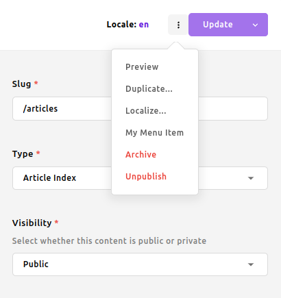

# Customizing the user interface

This guide focuses on how to customize Apostrophe's administrative user interface, or "admin UI." The built-in functionality covers most situations, but sometimes you'll want to add or change functionality.

::: warning
* Altering the UI should be done rarely and carefully. When possible, add new functionality like custom schema field types and custom manager view columns. Avoid overriding components entirely unless absolutely necessary.
* Overriding a UI component prevents the project from benefiting from future UI improvements and bug fixes related to that component.
* Make sure there is not a better way to achieve the desired goal. This includes [asking for help in Discord](https://chat.apostrophecms.org) and [requesting](https://portal.productboard.com/apostrophecms/1-product-roadmap/tabs/1-under-consideration) or [contributing](https://github.com/apostrophecms/apostrophe/blob/main/CONTRIBUTING.md#apostrophecms-contribution-guide) new features for the core.
* Apostrophe version 3.x used Vue 2.x to power the Admin UI components. With newer versions of Apostrophe, those same components are powered by Vue.js 3.x. We have taken care to include as much backward compatibility as possible, but custom components added in earlier versions of Apostrophe may need modification.
:::

## Apostrophe admin UI file structure

Apostrophe's admin UI is implemented with Vue.js. It is built from many `.vue` files across various Apostrophe modules. These are typically found in Apostrophe core, but they can be anywhere in the project. This means that we can introduce our own Vue components to the admin UI just by adding `.vue` files to the `ui/apos/components` subdirectory of any Apostrophe module. As explained below, it is also possible to override existing components by supplying a component with the same name.

## Rebuilding the UI when we make changes

For performance reasons, Apostrophe projects are not configured to automatically rebuild the admin UI every time your code changes. This makes sense because in most projects there is no custom admin UI code, and it takes time to build.

However, we can "opt-in" to rebuilding the UI on every code change, like this:

```bash
APOS_DEV=1 npm run dev
```

For convenience, you may wish to set this environment variable for the lifetime of your terminal session:

```bash
export APOS_DEV=1
```

Of course the admin UI is always rebuilt when deploying. No special changes or environment settings are needed for production use.

## Registering custom field types

Apostrophe's [schema field types](content-schema.md) cover many situations, but we might wish to add a new one.

Since it is a larger topic that touches on more than just UI, we've created a [separate article on how to add a custom field type](/guide/custom-schema-field-types.md). However, note that you will find it easier to follow the remainder of this article if you read that article first.

## Adding custom columns to the piece type manager

Another common extension is a custom column for the piece type manager. By default the manager modal displays the title, certain flags, and the last time the piece was updated. We can extend this to display our custom star ratings.

### Implementing the server-side part

Let's look at a simple piece type module called `review` that takes advantage of the [`starRating` field type we define in a separate article](/guide/custom-schema-field-types.md). We'll add a `rating` field to the schema for the piece type, and also add a column to display it in the manager modal:

<AposCodeBlock>

```js
module.exports = {
  extend: '@apostrophecms/piece-type',
  fields: {
    add: {
      rating: {
        type: 'starRating',
        label: 'Star Rating',
        required: true
      }
    }
  },
  columns: {
    // 👇 Columns are a "cascade" just like fields,
    // we have an "add" property with a subproperty
    // for each column
    add: {
      rating: {
        // 👇 Each column has a label property and a
        // component property. The component name must
        // exist as a Vue component
        label: 'Rating',
        component: 'ColumnStarRating'
      }
    }
  }
};
```
  <template v-slot:caption>
    modules/review/index.js
  </template>
</AposCodeBlock>

### Implementing the browser-side part

This code makes reference to a Vue component, `ColumnStarRating`, that doesn't exist yet. Next we'll introduce that component:

<AposCodeBlock>

```js
<template>
  <p
    class="apos-table__cell-field"
    :class="`apos-table__cell-field--${header.name}`"
  >
    <span v-if="hasValue">
      <span v-for="index in 5" :key="index" class="rating">{{ isActive(index) ? '☆' : '★' }}</span>
    </span>
    <span v-else>
      None
    </span>
  </p>
</template>

<script>
import AposCellMixin from 'Modules/@apostrophecms/ui/mixins/AposCellMixin';

export default {
  name: 'ColumnStarRating',
  mixins: [ AposCellMixin ],
  computed: {
    hasValue() {
      return this.get(this.header.name) != null;
    }
  },
  methods: {
    isActive(index) {
      return index <= (this.get(this.header.name) || 0);
    }
  }
};
</script>

```
  <template v-slot:caption>
    modules/star-range-field/ui/apos/components/ColumnStarRating.vue
  </template>
</AposCodeBlock>

While the Vue component could be placed in any module, it makes the most sense to group it in the `star-range-field` module because it might be used as a column in any piece type, not just a `review`.

This component uses `AposCellMixin` to do two important things:

* The component gains access to the configuration of the column by accessing the `header` prop, which is automatically declared by the mixin.
* The component can fetch properties from the piece by invoking `this.get` with any property name. Following Apostrophe's convention this method automatically fetches from the published version of the piece if it exists, otherwise from the draft.

## Overriding standard Vue.js components by name

Most of the time we don't need to override admin UI components that ship with Apostrophe. But if we have a need, we can do so by **placing a file with the same name as a standard component in the `ui/apos/components` subdirectory of a project-level module.** You can also do this in a custom npm module to achieve reuse across projects.

::: warning
When you override a component in this way, you take responsibility for keeping up to date with changes made upstream in that component in new releases of Apostrophe. Common sense applies here: while we are unlikely to break your code that overrides the logo with a new Apostrophe update, overriding the entire document manager UI might involve a serious commitment on your part.
:::

Apostrophe will use only the last version of a component that it finds during startup. The general startup order is:

1. Core Apostrophe modules
2. Installed and project-level modules, in the order they are configured in `app.js`

For instance, if the last module in our project's `app.js` modules list contains a `ui/apos/components/AposLogPadless.vue` file, that logo will be used in the admin bar, in place of the version that is normally loaded from Apostrophe core or in any module configured earlier.

::: info
For more information about the patterns used, props provided and APIs needed to override an existing core component, it's necessary to study the source code of the original.
:::

### Example: overriding the Apostrophe logo

One of the easiest component overrides is the Apostrophe logo, seen in the admin bar by customers while they edit the site.

To do this, copy `AposLogoPadless.vue` and `AposLogo.vue` from the `apostrophe` module to the `ui/apos/components` subdirectory of a new `admin-ui-overrides` Apostrophe module in your own project, like this:

```bash
mkdir -p modules/admin-ui-overrides/ui/apos/components
# Copy both versions of the logo
cp node_modules/apostrophe/modules/@apostrophecms/schema/ui/apos/components/AposLogo*.vue modules/admin-ui-overrides/ui/apos/components
```

Now, open `modules/admin-ui-overrides/ui/apos/components/AposLogo.vue`. The file looks like this:

<AposCodeBlock>

```js
<template>
  <svg viewBox="0 0 141.5 144.5">
    <!-- Lots of svg subelements here -->
  </svg>
</template>
```
  <template v-slot:caption>
    modules/admin-ui-overrides/ui/apos/components/AposLogo.vue
  </template>
</AposCodeBlock>

As you can see, it is **just an SVG file wrapped in a Vue `template` element,** nothing more.

So, you can replace its contents with those of your own logo in SVG format. SVG is a great choice, but if you
really wanted to, you could also use an `img` element or similar, pointing to a static asset. If you choose to
do that, make sure you follow our [static module assets](static-module-assets.md) guide.

Next, make similar changes to **your copy** of `AposLogoPadless.vue`.

Now **make sure you enable the `admin-ui-overrides` module in `app.js`, otherwise it will not be honored:**

<AposCodeBlock>

```js
const apostrophe = require({
  modules: {
    // ... Plenty of other modules should be here, this is just an example
    // that demonstrates enabling one more
    'admin-ui-overrides': {}
  }
});
```
  <template v-slot:caption>
    app.js
  </template>
</AposCodeBlock>

::: tip
The name `admin-ui-overrides` was chosen for convenience. You can override **any** admin UI Vue component
in **any** module of your project. The name of the component is what matters, so **do not change
the component name** if your intent is to override.
:::

::: warning
Not seeing your changes take effect in development? Make sure you read [rebuilding the UI when you make changes](#rebuilding-the-ui-when-we-make-changes), above.
:::

### Components with a "logic mixin" are safer and easier to override

Certain components have been refactored to make them safer and easier to override in this way. Specifically, these components import a Vue "mixin" from a `logic` subdirectory. Such components are safer to override because the `.vue` file you are copying will only contain markup and styles, not business logic.

Understand however that when you override such a component, you are still taking responsibility for staying up to date with upstream changes that do impact the template, such as new UI elements, props, click handlers in the template, etc.

Here is a partial list to give you an idea of what is easiest to override, keeping in mind that this list is ever-growing. To find and copy these files, open `node_modules/apostrophe` with your editor, keeping in mind you should **copy them to your project as seen in the example below,**. *Never* modify them inside `node_modules/apostrophe`.

```
AposSettingsManager.vue
AposPagesManager.vue
AposInputObject.vue
AposInputBoolean.vue
AposSchema.vue
AposInputArray.vue
AposInputWrapper.vue
AposInputRadio.vue
AposArrayEditor.vue
AposInputRelationship.vue
AposInputCheckboxes.vue
AposInputPassword.vue
AposSearchList.vue
AposInputRange.vue
AposInputDateAndTime.vue
AposInputColor.vue
AposInputAttachment.vue
AposInputArea.vue
AposSubform.vue
AposInputSlug.vue
AposInputSelect.vue
AposInputString.vue
AposDocContextMenu.vue
AposForgotPasswordForm.vue
AposLoginForm.vue
TheAposLogin.vue
AposResetPasswordForm.vue
```

### Example: overriding the look and feel of the login page

::: tip
This example assumes you have already followed the previous example. In particular, make sure you have an `admin-ui-overrides` module set up at this point.
:::

Apostrophe's login page is a good example of an experience that makes use of components with logic mixins, components that are therefore safer to override than most.

In the previous example, we already saw how to change the Apostrophe logo, which also changes it on the login page. So for this example we'll focus on a different, but equally simple task: removing the Apostrophe version number from the login form. This makes sense if you are not interested in making this information visible, or perhaps wish to display your own project's version number, etc.

First, let's copy `TheAposLogin.vue` from the `apostrophe` npm module to the project-level `admin-ui-overrides` module we created and enabled in the last example:

```bash
cp node_modules/apostrophe/modules/@apostrophecms/login/ui/apos/components/TheAposLogin.vue modules/admin-ui-overrides/ui/apos/components
```

Now, let's take a look at that file. Parts not relevant to what we're changing have been left out for brevity, so **don't copy and paste from here,** edit the file you copied:

<AposCodeBlock>

```js
<template>
  <transition name="fade-stage">
    <div
      v-show="loaded"
      class="apos-login apos-theme-dark"
      data-apos-test="loginForm"
      :class="themeClass"
    >
      <!-- Code omitted for brevity -->
      <transition name="fade-outer">
        <div v-show="loaded" class="apos-login__footer">
          <AposLogo class="apos-login__logo" />
          <label class="apos-login__project-version">
            Version {{ context.version }}
          </label>
        </div>
      </transition>
    </div>
  </transition>
</template>

<script>
import TheAposLoginLogic from 'Modules/@apostrophecms/login/logic/TheAposLogin';

export default {
  name: 'TheAposLogin',
  mixins: [ TheAposLoginLogic ]
};
</script>

<style lang="scss">
  // styles here
</style>

<style lang="scss" scoped>
  // more styles here
</style>
```
  <template v-slot:caption>
    modules/admin-ui-overrides/ui/apos/components/TheAposLogin.vue
  </template>
</AposCodeBlock>

Here you can see several things:

* The code we want to remove is just one small part of the `template` element. We should leave the rest as-is.
* There is no business logic, instead we have a "logic mix-in" that we are **not copying**, so we do not have to take responsibility for maintaining a "fork" of it.
* The styles are also present in `style` elements. We can leave them as-is or change them as we see fit.

To remove the version number, change the contents of that final `transition` element and leave the rest the same:

```js
<transition name="fade-outer">
  <div v-show="loaded" class="apos-login__footer">
    <AposLogo class="apos-login__logo" />
    <!-- Goodbye version number! (You can remove this part entirely)
      <label class="apos-login__project-version">
        Version {{ context.version }}
      </label>
    -->
  </div>
</transition>
```

::: warning
Not seeing your changes take effect in development? Make sure you read [rebuilding the UI when you make changes](#rebuilding-the-ui-when-we-make-changes), above.
:::

## Overriding standard Vue.js components through configuration

There can be only one `AposDocsManager` component definition in a project, but sometimes we need different behavior for a specific piece type. We could work around this by overriding a core component and adding conditional logic, but this results in code that is hard to maintain, and also means we are stuck maintaining a copy of a complex component and missing out on bug fixes and improvements. It would be better to **specify a different, custom component name to be used** to manage a particular piece type.

Here is an example of how to do that:

<AposCodeBlock>

```js
module.exports = {
  extend: '@apostrophecms/piece-type',
  options: {
    components: {
      managerModal: 'AnnouncementManager'
    }
  }
}
```
  <template v-slot:caption>
    modules/announcement/index.js
  </template>
</AposCodeBlock>


With this configuration, Apostrophe will look for a Vue.js component called `AnnouncementManager` when the user selects "Announcements" from the admin bar, bypassing `AposDocManager`.

As for the actual Vue.js code, we would place that in `modules/announcement/ui/apos/components/AnnouncementManager.vue`.

Of course there are other components that can be overridden in this way, and the list is growing over time. Here are the components that can currently be overridden through configuration:

| Module                       | Option                    | Default            |
| ---------------------------- | ------------------------- | ------------------ |
| `@apostrophecms/piece-type`  | `components.managerModal` | `AposDocsManager`  |
| `@apostrophecms/piece-type`  | `components.editorModal`  | `AposDocEditor`    |
| `@apostrophecms/page`        | `components.managerModal` | `AposPagesManager` |
| `@apostrophecms/page`        | `components.editorModal`  | `AposDocEditor`    |
| `@apostrophecms/widget-type` | `components.widgetEditor` | `AposWidgetEditor` |
| `@apostrophecms/widget-type` | `components.widget`       | `AposWidget`       |

For readability's sake, a `.` is used in the table above to separate sub-properties of `options` (see the example above for what the actual configuration looks like). If an option exists for `@apostrophecms/piece-type` it can be used for any module that extends it.

::: info
Since the type of an existing page can be changed, there is only one manager modal and only one editor modal for all pages, and those component names are configured on the `@apostrophecms/page` module. Piece and widget types can have their own type-specifc overrides.

If an option ends in `Modal`, the component is required to embed the `AposModal` component. For examples, look at the source code of the default components listed above.

The `AposWidgetEditor` component already provides a modal dialog box in which to edit the schema of any widget, so we won't need to configure a replacement unless we want to support editing directly on the page. `AposRichTextWidgetEditor` is an example of how to do this.

The `AposWidget` component has **nothing to do with a typical site visitor experience.** It is used only when displaying our widget while the page is in edit mode. While overriding this component is rare, the `@apostrophecms/rich-text-widget` module does so to provide a "click the text to edit" experience for rich text widgets. If you're just trying to enhance your widget with frontend JavaScript, you should write a [widget player](custom-widgets.md#client-side-javascript-for-widgets) instead.

Before you override an editor modal, consider [adding a custom schema field type](/guide/custom-schema-field-types.md) instead.
:::

## Adding custom context menu items

Apostrophe offers a context menu that can be used to carry out certain operations on a document, such as 'preview', 'duplicate', and so on. We can add custom context menu items from within any module, targeting any Vue component that implements `AposModal`. For an example of this, see the [code for the draft sharing modal](https://github.com/apostrophecms/apostrophe/blob/main/modules/%40apostrophecms/modal/ui/apos/components/AposModalShareDraft.vue). The menu registration should happen in the initialization phase. It is important to note that context menu operations will appear for all documents, even if added by a module associated with a specific type of document. However, take note of the various options below to limit when they appear.

Here is an example of how to add a custom context menu item labeled "My Menu Item".



<AposCodeBlock>

```js
module.exports = {
  extend: '@apostrophecms/piece-type',
  options: {
    label: 'Article',
    pluralLabel: 'Articles'
  },
  init(self) {
    self.apos.doc.addContextOperation({
      context: 'update',
      action: 'myUniqueAction',
      label: 'My Menu Item',
      modal: 'MyModalComponent',
      // Optional
      conditions: [ 'canEdit', 'canPublish' ],
      // Optional: match properties of the individual document
      if: {
        type: 'my-type'
      },
      // Optional: match properties of the module, not the individual document
      moduleIf: [
        autopublish: true
      ]
    });
  }
}
```
  <template v-slot:caption>
    modules/article/index.js
  </template>
</AposCodeBlock>

::: warning
Do not use core actions as your `action` property value - this would lead to unpredictable results and generally broken UI. You may consult what the core actions are in the [AposDocContextMenu component logic props](https://github.com/apostrophecms/apostrophe/blob/main/modules/%40apostrophecms/doc-type/ui/apos/logic/AposDocContextMenu.js).
:::

::: info
* The `context`, `action`, `label`, and `modal` properties are required.
* The current API supports only `context: 'update'` (the custom menu items are available for previously saved documents).
* The `action` property should be globally unique.
* Overriding the same `action` is possible (the last wins).
* You may mark the action as "dangerous" via an optional property `modifiers: [ 'danger' ]` (see the 'Archive' and 'Unpublish' menu items).
* An additional optional boolean property `manuallyPublished` is supported. When set to true, the custom menu item is available only for document types that do not have the `autopublish: true` or `localized: false` options set.
* The `conditions` property is optional. It takes an array of one or more strings specifying conditions that all must be satisfied to determine if the action can be run on the current doc. Valid values are: 'canPublish', 'canEdit', 'canDismissSubmission', 'canDiscardDraft', 'canLocalize', 'canArchive', 'canUnpublish', 'canCopy', 'canRestore'. To go beyond these, see the more flexible `if` and `moduleIf` features below.
* The optional `moduleName` property can be used to override the `moduleName` prop passed to the modal. By default, it will be the name of the piece type module corresponding to the individual piece, or `@apostrophecms/page` in the case of pages.
* The `if` property takes an object that works like a MongoDB query criteria object, in a limited way: each property must match the corresponding property of the document. The `$or`, `$and` and `$ne` operators are supported as in MongoDB, along with dot notation to match nested properties. Other MongoDB query features are not supported at this time.
* The `moduleIf` property works like `if`, but it matches properties of the module rather than the document. Note this extends only to properties passed down to the browser via the `getBrowserData` method of the module in question. You can expose new properties via this method by using the `extendMethods` feature, [as mentioned here](https://docs.apostrophecms.org/reference/modules/piece-type.html#getbrowserdata-req).
* For backward compatibility, this method can also be called with the `moduleName` passed as the first argument and the object as the second, but this is discouraged.
:::

## Toggling the visibility of the admin-bar

There are times when you want to allow people that don't have editing or content creation permissions to log into your project site. For example, the visibility of a page or a piece document can be set to `login required`, so only those with an account can view it. In that case, it may be desirable to not display the admin-bar. The `@apostrophecms/admin-bar` module `getShowAdminBar()` method can be extended to return `false` which will hide the admin-bar for that role when logged in.

<AposCodeBlock>

``` js
module.exports = {
  extendMethods(self) {
    return {
      getShowAdminBar(_super, req) {
        if (req.user?.role === 'guest') {
          return false;
        }

        return _super(req);
      }
    };
  }
};
```
  <template v-slot:caption>
    modules/@apostrophecms/admin-bar/index.js
  </template>
</AposCodeBlock>

::: info
Note that if you are using the [`@apostrophecms-pro/advanced-permission` module](https://apostrophecms.com/extensions/advanced-permission) it doesn't use roles, so you will need to implement a different check for determining if the admin bar should be hidden.
:::

When electing to not display the admin-bar, you need to implement an alternative way for the user to log out.

<AposCodeBlock>

```js
export default () => {
  const insertLogoutButton = () => {
    // Function to insert the logout button
    function addLogoutButton() {
      // selects the end of the hidden admin-bar wrapper
      const navElement = document.querySelector('.bp-nav');
      // Check the nav element exists, the user is logged in, and the admin bar is hidden
      if (navElement && apos.login?.user && apos.adminBar?.showAdminBar === false) {
        // Create the logout button
        const logoutButton = document.createElement('button');
        logoutButton.id = 'logoutButton';
        logoutButton.textContent = 'Log Out';
        logoutButton.style.display = 'block';
        logoutButton.addEventListener('click', () => {
          // trigger logout from the @apostrophecms/login module
          apos.bus.$emit('admin-menu-click', '@apostrophecms/login-logout');
        });

        // Insert the button after the nav element
        navElement.insertAdjacentElement('afterend', logoutButton);
      }
    }
    addLogoutButton();
  };

  // Wrap the script in apos.util.onReady to refire when the editing
  // state changes
  apos.util.onReady(insertLogoutButton);
};
```
  <template v-slot:caption>
    modules/@apostrophecms/admin-bar/ui/src/index.js
  </template>

</AposCodeBlock>

In this script, the `apos.login?.user` is checked to determine if the user is logged in and the value of `apos.adminBar?.showAdminBar` is checked to determine if the particular user has the admin-bar as an option for logging out. Upon click, the button emits an event named `admin-menu-click` with an argument of `@apostrophecms/login-logout` to trigger user logout. You could also elect to add a logout button in your template where the visibility is toggled by these same checks. You can use a similar method to implement other controls, like page navigation when the admin bar is hidden.

## Adding custom modal controls

Most times the controls on the admin-bar and located within the context menu are sufficient. However, in some cases you might want to add additional controls to facilitate the creation or editing of pages and pieces. For example, you could add a button for creating a new post on a blog index page. The `apos.doc.edit()` method takes an object with one required and two optional properties. It triggers the opening of the editing modal for the corresponding document type and allows you to create, edit, and duplicate both pieces and pages. When awaited, the method returns either the edited document object, including the computed `_id` for the document, or 'undefined' if the modal is cancelled.

While this method enables the editing and management modals to open for any user, it does not bypass Apostrophe's permission checks. A user without permission to perform an operation on a particular page or piece will still be blocked. Best practice is to toggle any custom controls so that are only visible or active for a user with correct permissions. This can be done by checking that the value of the `canCreate` and `canEdit` properties for the piece type or `@apostrophecms/page` is true. The `canCreate` property applies to both creating and duplicating a document, since both add a document to the database. The `canEdit` property should be checked before adding a method call for editing a document.

### Creating a new document

In order to create a new document, whether page or piece, you pass the required `type` property set to either the piece type or `@apostrophecms/page` for creating a new page. For example, to trigger the creation of a new `blog` piece type from a button with an id of `create-new-piece` you could use the following code:

<AposCodeBlock>

```js
export default () => {
  apos.util.onReady(() => {
    const button = document.getElementById('create-new-piece');
    if (button && apos.module?.blog?.canCreate) {
      button.addEventListener('click', async function () {
        try {
          const createdDocument = await apos.doc.edit({
            type: 'blog'
          });
          if (createdDocument) {
            console.log('Document was created:', createdDocument);
          }
        } catch (error) {
          console.error('Error creating document:', error);
        }
      });
    }
  });
};
```
  <template v-slot:caption>
    modules/blog/ui/src/index.js
  </template>
</AposCodeBlock>


### Editing an existing document

To trigger editing of an existing piece or page you need to pass the computed `_id` of the document through the `_id` property along with the required `type`. Note that you will want to use the `_id` of the draft version of the document, not the published version.

```js
apos.doc.edit({
  type: '@apostrophecms/page',
  _id: 'clkie2enx00033xlsgus4a4nj:en:draft'
})
```

### Duplicating an existing document

The `apos.doc.edit()` method also gives you the option to create a new document of the designated type, but pre-filled with fields from an existing document of the same type. This is very similar to editing an existing document except that the `_id` of the existing document to be copied should be passed through the `copyOfId` property. In this case, you can pass the `_id` of either the draft or published document if they both exist.

```js
apos.doc.edit({
  type: '@apostrophecms/page',
  copyOfId: 'clkie2enx00033xlsgus4a4nj:fr:published'
})
```

## Adding custom login requirements

In some cases, we might wish to enhance Apostrophe's login form with additional, custom steps.

This too is a larger topic that touches on more than just UI, so we've created a [separate article on how to add a custom login requirement](/guide/custom-login-requirements.md).

## Editing custom widgets in context

While most widgets are edited most conveniently via the standard dialog box that appears when the edit button is clicked, some can be edited effectively "in context" right on the page. The standard rich text widget is a good example.

To learn how to implement this pattern for a custom widget, check out this [separate article on how to edit custom widgets in context](/guide/editing-custom-widgets-in-context.md).
