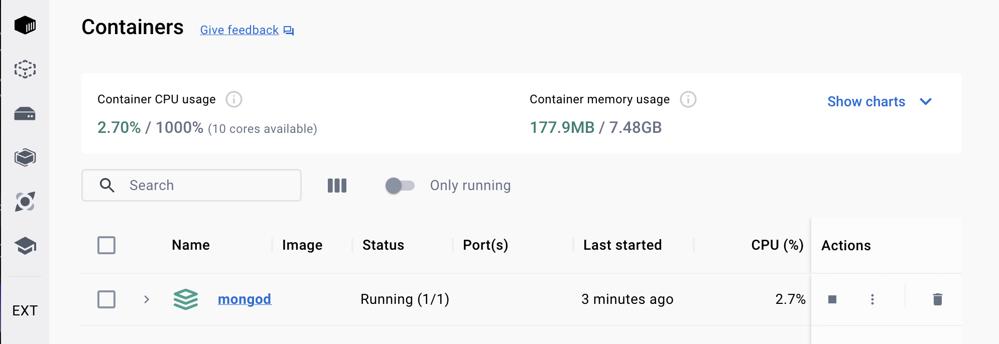
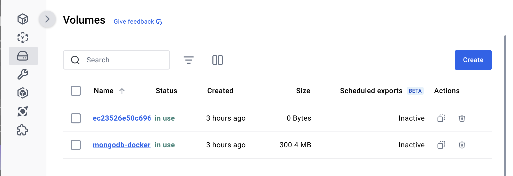

# Setting up MongoDB in Docker for Development

Setting up MongoDB in Docker for local ApostropheCMS development streamlines your workflow by providing a consistent, isolated environment that mirrors production setups. This guide will help you configure MongoDB using Docker, ensuring a reliable and efficient database for your ApostropheCMS projects. Whether you're new to Docker or looking to optimize your setup, this step-by-step guide covers everything from initial configuration to troubleshooting.

ApostropheCMS relies on MongoDB for storing content and user data. While MongoDB's flexibility makes it ideal for a CMS, managing a local instance can be challenging due to dependencies and environment configurations. Docker simplifies this process by containerizing MongoDB, reducing conflicts, and maintaining a clean development environment, whether you're building new features, testing configurations, or contributing to a project.

## Docker Installation
In this guide we will assume that you have some basic knowledge of Docker and Docker Compose. We will be using Docker Desktop because it provides an intuitive GUI for performing many operations, but you can elect to just install and use the Docker engine and Docker Compose. To start, if you don't already have Docker Desktop installed on your computer, navigate to the [Docker website](https://docker.com) to download and install the version specific for your machine. You will also need to make an account to log in to your app.

## Creating a Docker Compose File for MongoDB

Docker Compose is a powerful tool that simplifies the management of containerized applications by allowing you to define services, networks, and volumes in a single YAML file. Even when bringing up a single MongoDB container, as we are doing in this guide, Docker Compose offers significant benefits. It ensures consistency and reusability across different environments, streamlines the container lifecycle with easy-to-use commands, and sets the stage for future scalability.

If you are going to be developing multiple ApostropheCMS projects, it makes sense to place the `docker-compose.yml` file in a standalone folder on your development partition. This approach also ensures that you won't later confuse it with any Docker Compose file needed for production deployment

Create a `docker-compose.yml` file in an appropriately located folder and add the following code:

<AposCodeBlock>

```yml
version: '3.8'
services:
  mongo:
    image: mongo:latest
    container_name: apostrophe-mongo
    ports:
      - "27017:27017"
    volumes:
      - mongo-data:/data/db

volumes:
  mongo-data:

```
  <template v-slot:caption>
    /Development/mongodb/docker-compose.yml
  </template>
</AposCodeBlock>

Let's break this file down:

- **`version: '3.8'`**: This specifies the version of the Docker Compose file format. Version 3.8 is widely compatible and includes support for most features needed in modern Docker setups.

- **`services:`**: The `services` section defines the containers that Docker Compose will manage. In this case, we are defining a single service called `mongo`.

- **`mongo:`**: This is the name of the service, which you can reference in other parts of your configuration. Here, it defines the MongoDB container.

  - **`image: mongo:latest`**: This specifies the Docker image to use for the MongoDB container. The `mongo:latest` image tag pulls the latest stable version of MongoDB from Docker Hub. If you are going to be using a specific version of MongoDB in production and want your development environment to reflect this you can get the cooresponding version from the [Docker hub](https://hub.docker.com/_/mongo/tags).

  - **`container_name: apostrophe-mongo`**: This assigns a name to the container, making it easier to identify and manage. Naming the container helps avoid confusion if you're running multiple containers. Note that in the Docker Desktop GUI you will see the container listed as the name of the folder the `docker-compose.yml` is contained within.

  - **`ports:`**: The `ports` section maps the container’s internal port to your local machine. The `"27017:27017"` mapping ensures that MongoDB is accessible on port 27017 on both your local machine and within the container.

  - **`volumes:`**: The `volumes` section mounts a persistent storage volume from your local machine to the container. The `mongo-data:/data/db` mapping ensures that the data stored in MongoDB persists even if the container is stopped or removed. This is crucial for retaining your database information across development sessions.

- **`volumes:`**: The `volumes` section at the bottom of the file defines the volume `mongo-data`, which is referenced in the `mongo` service. Docker will create and manage this volume to store MongoDB's data on your local machine, ensuring that your database persists across container restarts.

When using version control, ensure your `docker-compose.yml` file is included in your repository. However, be cautious with sensitive data like credentials. For security, avoid hard-coding sensitive information like database credentials directly in the `docker-compose.yml` file. Instead, use environment variables or Docker secrets to manage these credentials securely.

## Running the container


Once this `docker-compose.yml` file is created, all you have to do is create and bring the container up using:

`docker-compose up -d`

Using the `-d` flag will run the container in detached mode in the background. You can leave the container running if your development computer has enough resources, but you will have to restart the container with this command or by clicking on the play icon in the Desktop GUI whenever you restart your computer.

If you prefer, when not actively developing your Apostrophe project you can bring the container down from either the Desktop GUI by clicking on the stop icon or by using:

`docker-compose down`

Additionally, MongoDB can consume significant memory and CPU resources, which may exceed the default limits set in Docker Desktop, leading to slow performance or container crashes. Over time, unused volumes, containers, and networks can accumulate, consuming disk space and further degrading performance. To ensure a smooth development experience, it’s important to adjust Docker's resource allocations using the Docker Desktop settings and regularly clean up unused resources with commands like `docker system prune`.




Unneeded volumes can be removed from The Desktop GUI "Volumes" tab. **Note that this will delete all data saved to that container**. This should only be done if you are either finished with local development of the project or following backup of the database with a command using:

`mongodump --host localhost --port 27017 --out /path/to/backup`

This backup can then be restored using:

`mongorestore --host localhost --port 27017 /path/to/backup`

## Troubleshooting Tips:

- Container Fails to Start: Check for port conflicts or permission issues, especially if you're on a non-Linux system.
- Slow Performance: Increase Docker's resource allocation in Docker Desktop settings or consider running MongoDB directly on the host if necessary.
- Data Loss: Always ensure you're using named volumes and back up your data before removing volumes or containers.

### Conclusion

Setting up MongoDB for local development using Docker offers a streamlined alternative to installing the community server or using a managed service like Atlas, potentially saving time and costs. While there are some drawbacks—such as challenges in sharing database contents between developers—the ease of setup and consistency it brings to your development workflow can often outweigh these concerns. As you become more comfortable with Docker, you may find new ways to leverage its capabilities, further enhancing your development process.