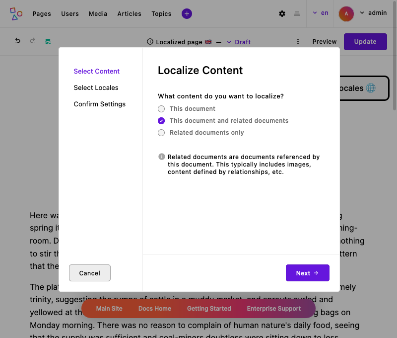
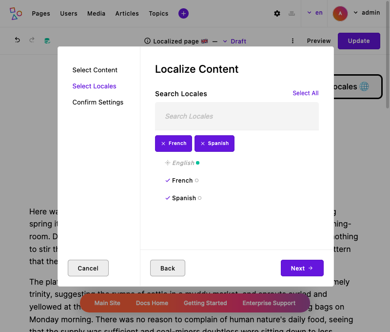
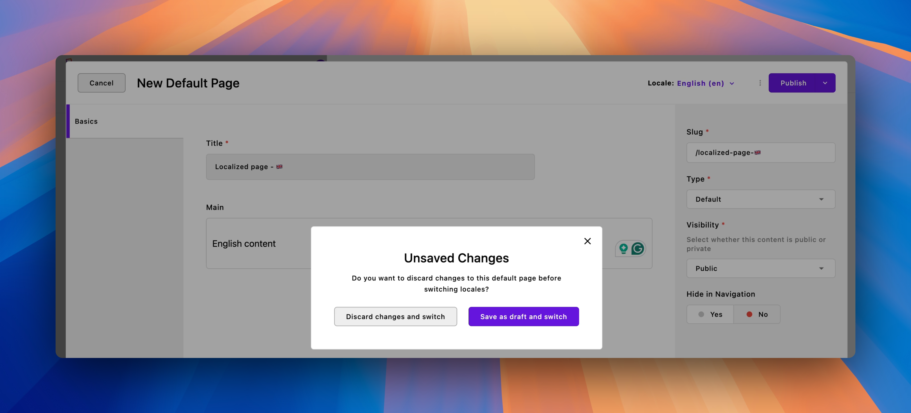

# Dynamic content localization

Dynamic content localization (or simply "content localization") refers to the process of translating and customizing Apostrophe site content for different locales. In most cases this is primarily a matter of translation, but it can be much more than that depending on the website.

While [static localization](static.md) involves rendering strings of text depending on the locale, content localization involves using entirely *different database documents* based on the locale. That may seem like technical trivia, but it can be helpful when thinking about the content creation process.

<!-- TODO: Update when the l10n API reference is available. -->
Content l10n also is generally done completely through the user interface. There is an API for localization which will be covered in reference material, but for now we'll focus on:
- the content editor's experience of localization
- developer tools to give visitors and editors navigation between locales ([skip to this](#template-data-for-l10n))

::: info
Localizing content is only possible if the Apostrophe app has configured locales. If you are looking for information on configuring locales, see the [localization landing page](overview.md#configuring-locales). There is also a [glossary section](/reference/glossary.md#localization-terms) of related terms.
:::

## Localizing editable content

Before going into specifics of the user interface, it is worth establishing some of the important concepts and patterns used in Apostrophe's content localization.

Localizing means that **we make a clone of the content for a new locale, then make changes specific to the new locale.** As mentioned earlier, this will often involve translation, switching out photos, adding information, and other content changes. Once the page or piece has a new locale version, website visitors using the new locale will be able to see that document.

**Each page or piece in Apostrophe is initially created for only one locale.** Sometimes we don't go any further. It may not be necessary to localize a page about Canadian office holidays into Mandarin, for example. If the page or piece should be available in more locales, *then* we localize it. The only exceptions are [parked pages](/reference/module-api/module-options.md#park) and piece types with the `replicate: true` option.

There are multiple ways to localize a page or piece document depending on your needs. The primary workflow is to use the context menu to re-localize the document. This will allow you to localize documents that are associated through relationships with the page at the same time. This also allows for the use of the automatic translation of existing content using the [`@apostrophecms-pro/automatic-translation` extension](https://apostrophecms.com/extensions/automatic-translation).

As covered below, from within the editor manager you also have the option to use the inline locale switcher located to the left of the user preferences menu. This will create a new document in the selected locale that is linked to the original document, but will not migrate any content.

Let's take a look at the context menu localization using a new page in the Apostrophe demo as an example. In this example we will have three locales configured:

<AposCodeBlock>

  ```javascript
    module.exports = {
      options: {
        locales: {
          en: {
            label: 'English'
            // The default locale since there is no prefix requirement.
          },
          fr: {
            label: 'French',
            prefix: '/fr'
          },
          es: {
            label: 'Spanish',
            prefix: '/es'
          }
        }
      }
    }
  ```
  <template v-slot:caption>
    modules/@apostrophecms/i18n/index.js
  </template>
</AposCodeBlock>

### Creating localized content using the context menu


After creating a new page, we want to add any content and widgets that will also be used in other locales. For example, we might want to add a hero widget to the page since all pages would need that content. Once the page is localized you can then edit the content to fit the new locale. For example, the hero image in the English and French locales might differ. But, adding the content to your original page before localizing means that the pages in other locales will share a more unified look. Plus, it reduces the effort of building the page multiple times, once for each locale. Any content addition following the original localization action will not be included across locales automatically. The page can be re-localized, but this will overwrite any edits that have been made in the new locale for that document.

Once we have a page that is ready for localization, we can select "Localize..." from the context menu. For pages, this context menu is present when editing pages and in the page tree. For pieces, this context menu is present both when editing a piece and within the piece manager.

Once the localization item is selected we will be led through a few steps in the "wizard modal" to localize the page.

1. **Choose whether to only localize this page, this page and any related documents, or only related documents.** "Related documents" may include new images you uploaded for this page, pieces that you connected to this page through a widget, or other such [relationships](/guide/relationships.md).
2. **Select the locales that should get clones of this page.**
3. **Confirm whether to localize only new related docs or all related docs** (overriding existing versions) with checkboxes to fine tune this selection.






If you have the automatic-translations extension installed, this screen will also have a checkbox indicating that you want the content translated as it is added to the new locale. Once confirmed, the page now exists in all three locales. We can see this by the updated indicators in the locale chooser. These pages will exist in these new locales as drafts and need to be published to become visible.


We can then switch to another locale, make edits specific to that locale, and publish.


### Using the inline locale switcher


The inline locale switcher located to the left of the user preferences menu can allow you to easily edit the version of the document that has been localized to another locale without having to switch to that locale. It also can create quick "shallow" clones of pages and pieces. If we haven't localized a document to another locale, selecting that locale from the inline switcher will create a new document of that type without **any** added content. However, if you were to examine the database, you would see that your original document and the newly created one share the same ID, minus the locale. In some cases, this maybe the preferred workflow to create a set of pages across multiple locales that are going to differ greatly in content or be populated programmatically.

 If a document has any changes that are unsaved when we try to switch locales using the inline switcher, we will be prompted to either discard any unsaved changes and switch locales immediately or save changes as a draft document and localize. Clicking on the close button in the upper right will completely cancel the operation and return you to the editing modal of the page in the current locale.

Once in the document in the new locale, you can edit it as you normally would. When you are finished with editing there will be the usual choices. If you elect to not preview the document and just save as a draft or publish, you will be returned to the original locale where you started the editing operation. So if you are editing a page in the Spanish locale, switch to the French locale using the inline switcher, and then choose to publish any edits made to that document without previewing, you will be returned to the Spanish locale. If you elect to preview the document, you will be switched to the new locale.

#### Nested content
As outlined, localizing a document that has relationships from the context menu allows for the localization of those related documents to the new locale. After that, if you switch to editing in another locale using the inline switcher and then edit one of the documents connected through the relationship field, you will still see the inline switcher indicating the new locale you are editing in. However, the inline switcher will be disabled. If you want to edit these documents in a different locale you will have to edit the original document, not through the relationship.

## Template data for l10n

The Apostrophe user interface has a locale chooser for editors, but visitors to the website won't have access to that. We typically need to provide a way for visitors to switch to a version of the page they are on, but in a different locale. There are two properties on the `data` object in templates to help with this.

### `data.locale`

`data.locale` is simple. It will render as the locale code for the active locale. So if you're in the English (`'en'`) locale, it will return `'en'`.

### `data.localizations`

This property provides much more information. It will be an array of objects that include information about the current page context (or piece, when on a show page) in all the active locales. It will include special properties that can help build a locale switcher for visitors:

| Locale property | Description |
| ------- | ------- |
| `locale` | The locale code (e.g., `'en'`, `'es'`) |
| `label` | The configured label for the locale (e.g., "English", "Spanish") |
| `available` | A boolean value indicating whether the page has been added to this locale |
| `current` | A boolean value indicating whether this is the currently displayed locale |
| `_url` | An API route that will return the page's URL in the locale (if it exists there) |

The `_url` property is an API route, and not the actual URL, to avoid making too many requests. If a website had 20 locales configured then Apostrophe would need to make 20 requests to get the actual page URL in each one. The API route is predictable and redirects to the actual URL when hit.

Here is an example of `data.localizations` for the page from the screenshots above.

```javascript
[
  {
    _id: 'cksqi1ye1000mof3rdgtmvn0y:en:draft',
    title: 'Localized page 🇬🇧',
    slug: '/localized-page',
    type: 'default-page',
    visibility: 'public',
    aposLocale: 'en:draft',
    aposMode: 'draft',
    available: true,
    _url: '/api/v1/@apostrophecms/page/cksqi1ye1000mof3rdgtmvn0y:es:draft/locale/en',
    locale: 'en',
    label: 'English',
    homePageUrl: 'http://localhost:3000/'
  },
  {
    _id: 'cksqi1ye1000mof3rdgtmvn0y:fr:draft',
    title: 'Page localisée 🇫🇷',
    slug: '/localized-page',
    type: 'default-page',
    visibility: 'public',
    aposLocale: 'fr:draft',
    aposMode: 'draft',
    available: true,
    _url: '/api/v1/@apostrophecms/page/cksqi1ye1000mof3rdgtmvn0y:es:draft/locale/fr',
    locale: 'fr',
    label: 'French',
    homePageUrl: 'http://localhost:3000/fr/'
  },
  {
    _id: 'cksqi1ye1000mof3rdgtmvn0y:es:draft',
    title: 'Página localizada 🇪🇸',
    slug: '/localized-page',
    type: 'default-page',
    visibility: 'public',
    aposLocale: 'es:draft',
    aposMode: 'draft',
    available: true,
    _url: '/api/v1/@apostrophecms/page/cksqi1ye1000mof3rdgtmvn0y:es:draft/locale/es',
    current: true,
    locale: 'es',
    label: 'Spanish',
    homePageUrl: 'http://localhost:3000/es/'
  }
]
```

### Sample locale switcher template

Here is an example of using the `data.localizations` array to generate a locale switcher for a page.

``` nunjucks
<div class="locales">
  {# A button to open the list of locales (nothing special here) #}
  <button class="locales__toggler" data-locales-toggle aria-expanded="false">
    Toggle locales 🌐
  </button>
  <ul class="locales__list" data-locales hidden>
    {# List of locales, looping over data.localizations #}
    
      <li class="locales__item">
        {#
          Linking the locale name only when it exists in the locale and it's
          not the current locale
        #}
        
          <a href="{{ localization._url or localization.homePageUrl }}">
        
        {# Using both the label and the locale code #}
        {{ localization.label }} ({{ localization.locale }})
        
          </a>
        
      </li>
    
  </ul>
</div>
```
