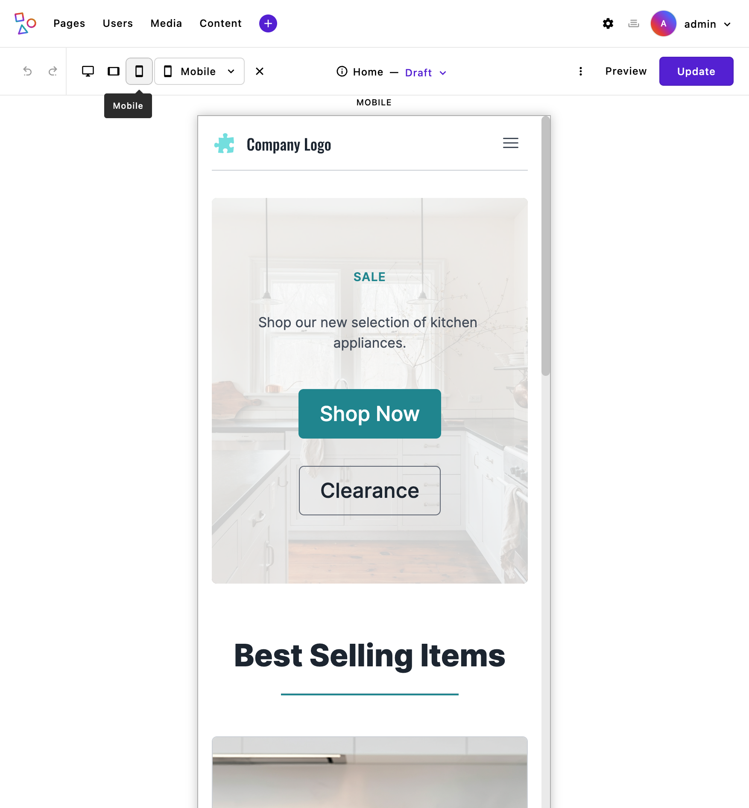

# Pages and page types

Every page in an Apostrophe website is assigned a **"page type"**. The page type tells Apostrophe **what template to use** to render the page and **what configuration to apply**. Configurations will often at least include the field schema for the page type.

## Creating a page type

Apostrophe core only includes a "Home page" type with some basic default content options. You will likely need your own page types, which you create by adding modules that extend `@apostrophecms/page-type` and instantiating them in `app.js`.

```js
// modules/default-page/index.js
module.exports = {
  extend: '@apostrophecms/page-type'
};
```

```js
// app.js
require('apostrophe')({
  shortName: 'my-website',
  modules: {
    'default-page': {}
  }
});
```

<!-- TODO: Replace area field link to a guide page when available. -->
If we add a string field for the subtitle and an [area field](/reference/field-types/area.md) for rich text and images, the Default page type would look like:

```js
// modules/default-page/index.js
module.exports = {
  extend: '@apostrophecms/page-type',
  fields: {
    add: {
      subtitle: {
        type: 'string'
      },
      main: {
        type: 'area',
        options: {
          widgets: {
            '@apostrophecms/rich-text': {},
            '@apostrophecms/image': {}
          }
        }
      }
    },
    group: {
      basics: {
        fields: ['title', 'subtitle', 'main']
      }
    }
  }
};
```

See the [field schema](/guide/content-schema.md) page for more on configuring fields.

::: tip
We can add functionality to the default home page type by adding a configuration file for it at `modules/@apostrophecms/home-page/index.js`. Add new fields to it as in the example above and this core page type will be ready for additional content possibilities. Or it will be once we update its page template... See below.
:::

## Page template essentials

Each page type requires a template. The only exception to that rule is if a page type extends another page type that already has a template.

Page templates are added in a `views` directory for the page type as `page.html`. The template for the previous example's default page would be `modules/default-page/views/page.html`. A very simple page template for the Default page might look like this:
<!-- TODO: Consider adding a file tree component when available. -->

``` nunjucks
{# modules/default-page/views/page.html #}



  <header>
    <h1>{{ data.page.title }}</h1>
    
      <p>{{ data.page.subtitle }}</p>
    
  </header>
  

```

There are a number of things at work here.

### The template is extending a `layout.html` template

``` nunjucks

```

`layout.html` is a base level template [used in official Apostrophe essentials starter kit](https://github.com/apostrophecms/starter-kit-essentials/blob/main/views/layout.html) and placed in `views/layout.html`. It is used to add markup for things that belong on every page, such as the website navigation and footer. It extends the `outerLayout.html` template from Apostrophe core, but provides a layer to customize the page wrapper while not overwriting `outerLayout.html`.

The layout template might look something like this:

``` nunjucks



<div>
  <header>
    {# Page header code: logo, navigation, etc. #}
  </header>
  <main>



  {# Page body content. Pages templates normally override this. #}



  </main>
  <footer>
    {# Page header code: contact information, secondary navigation, etc. #}
  </footer>
</div>

```

### We are inserting page template markup in a template block

``` nunjucks


```

Apostrophe uses the Nunjucks template language, which has a [block system](https://mozilla.github.io/nunjucks/templating.html#block) for injecting markup into lower-level templates. The block system involves placing a `block` tag in the root-level template file, then using those blocks in higher-level templates to insert markup. Since we used the `main` block here it will overwrite the layout template's `main` block.

### Page data is on `data.page`

``` nunjucks
{{ data.page.title }}
```

Templates have access to a `data` object containing information about the Apostrophe application and current context data. In page templates, `data.page` contains data for the active page. For our Default page, that includes the title, subtitle, "main" area, and lots of other information.

Naming specific properties in the double brackets syntax, `{{}}`, prints them in the template.

``` nunjucks

  <p>{{ data.page.subtitle }}</p>

```

Nunjucks offers additional tags, including the [`` conditional tag](https://mozilla.github.io/nunjucks/templating.html#if), to help work with data in templates.

::: tip
If you want to know what is available in a template object, you can log it in your terminal using the template method `apos.log()`. This looks like:

``` nunjucks
{{ apos.log(data.page) }}
```
:::

### The widget area is added using the `area` tag

``` nunjucks

```

This is a special tag in Apostrophe used to let editors add and manage content widgets to the page. After the `area` tag name, we pass the tag the field's context, which is our page, followed by the field name. We [configured it in the `index.js` file](#creating-a-page-type) to use two widget types. While editing the page, the user will have access to a menu to add widgets of those types.


We'll explore areas more in [the areas guide](/guide/areas-and-widgets.md).

::: tip
To overwrite the home page type template, create a template file for it at  `modules/@apostrophecms/home-page/views/page.html` and add template markup.
:::

## Activating page types

 There is one more step to make a page type available to use: You'll need to add it to the core page module's `type` option. This configures the "Type" field for pages.


This is a core module option, but you can add your own configuration by giving it an `index.js` file in your project: `modules/@apostrophecms/page/index.js`. You'll then configure it's `types` option with all page types you want to allow.

```javascript
// modules/@apostrophecms/page/index.js
module.export = {
  options: {
    types: [
      // 👇 Adding our new page type
      {
        name: 'default-page',
        label: 'Default page'
      },
      // 👇 Optionally including the core "Home page" type
      {
        name: '@apostrophecms/home-page',
        label: 'Home page'
      }
    ]
  }
}
```

Each type needs a `name` matching the module's name and a label for editors. See the reference section for [other core page module options](/reference/module-api/module-options.md#options-for-the-core-page-module).

## Connecting pages with page tree navigation

<!-- TODO: Link to a guide on building manual navigation widgets or through
     the global doc when available. -->
There are many ways to build navigation with Apostrophe. One is to base site navigation on the page tree. The **"page tree"** refers to the parent-child relationship between pages. For example, the home page is the parent of all top-level pages, which may have subpages of their own.

Pages can be organized into a page tree hierarchy while adding them or through the page manager interface.


Apostrophe templates have data available to add navigation based on the page tree. This includes:

| Data object | What is it? |
| ------ | ------ |
| `data.home` | Home page data. It is similar to the data on `data.page`, but always references the home page. |
| `data.home._children` | Page data for pages one level below the home page in the page tree. |
| `data.page._ancestors` | Page data for the ancestors of the active page, starting with the home page. |
| `data.page._children` | Page data for pages one level *below* the active page. |

By default, one level of children are available on each ancestor, as well as on the home page and `data.page`.

With that available data, we could construct navigation for the website header using the Nunjucks `` loop tag. The `layout.html` `beforeMain` block could look like:

``` nunjucks
{# views/layout.html #}

<div>
  <header>
    {# 👇 Adding our navigation wrapper. #}
    <nav>
      <ul>
        {# 👇 Referencing `data.home._children` and looping over them. #}
        
          <li>
            <a href="{{ page._url }}">{{ page.title }}</a>
          </li>
        
      </ul>
    </nav>
  </header>
  <main>

```

This is looping over the home page's child pages, printing their URLs and titles into links. This is simply one way to add navigation using the page data in templates.

## Device breakpoint previews

Pages can be enabled to emulate devices, like phones and tablets, making it easy to see how your content will look at different screen sizes.


When device preview mode is enabled, you’ll see icons in the admin bar for each of the breakpoints (sizes) that have been set through the `breakpointPreviewMode` of the `@apostrophecms/asset` module. By default, there are three shortcut device breakpoints added. Adding additional breakpoint preview sizes will cause a dropdown menu with all of the sizes to appear.


Clicking on an icon or making a selection from dropdown menu will cause your page content to display in a container that matches the specific device size, so you can quickly check how the layout and styles respond. The displayed content will be fully editable, so that you can see how any new content is impacted by the current media queries. You can go back to editing in the full browser screen by clicking on the currently selected preview icon or clicking on the `X` to the right of the dropdown.

Custom styles you’ve added with CSS media queries are converted by the `asset` module to container queries. Note that this only works with styles added or imported by stylesheets in the [`ui/src/index.scss` files of each module](/guide/front-end-assets.html#placing-client-side-code), it doesn't work with styles outside the build path, like styles added directly to the template. Keep in mind that while most media queries will translate well, there are some differences when using container queries that might not be fully reflected in the preview. For example, you can not add `min-height` or `rotation` query parameters to containers.

Breakpoint preview is enabled by default, but if you want to change the configuration you can pass additional options to the `@apostrophecms/asset` module at project level.
<AposCodeBlock>

```javascript
module.exports = {
  options: {
    breakpointPreviewMode: {
      enable: true,
      screens: {
        desktop: {
          label: 'Desktop',
          width: '1440px',
          height: '900px',
          icon: 'monitor-icon',
          shortcut: true
        },
        tablet: {
          label: 'Tablet',
          width: '1024px',
          height: '768px',
          icon: 'tablet-icon',
          shortcut: true
        },
        mobile: {
          label: 'Mobile',
          width: '414px',
          height: '896px',
          icon: 'cellphone-icon',
          shortcut: true
        },
        ultrawide: {
          label: 'Ultrawide Monitor',
          width: '2560px',
          height: '1440px'
        },
        laptopLarge: {
          label: 'Large Laptop',
          width: '1680px',
          height: '1050px'
        },
        ipadPro: {
          label: 'iPad Pro',
          width: '1366px',
          height: '1024px'
        },
        surfaceDuo: {
          label: 'Surface Duo',
          width: '540px',
          height: '720px'
        },
        galaxyFold: {
          label: 'Galaxy Fold',
          width: '280px',
          height: '653px'
        }
      }
    }
  }
};
```
<template v-slot:caption>
modules/@apostrophecms/asset/index.js
</template>
</AposCodeBlock>

You can learn about all the properties that can be passed to the `breakpointPreviewMode` option on the [`@apostrophecms/asset` reference page](/reference/modules/asset.md#breakpointPreviewMode). The two most critical are `enable` and `screens`. If you pass `enable: false` it will remove the breakpoint preview icons and menu from the admin-bar. The `screens` property takes an object where each property is a different breakpoint. Adding the `breakpointPreviewMode` at the project level will override any default values, so you need to pass `enable: true` if you wish to add additional brekpoints.

Each of the individual breakpoint properties in the `screen` object take a `label` that will be displayed to the user when they hover over the icon. The `icon` property supplies the icon that will be displayed if the breakpoint is also given a property of `shortcut: true`. This icon name should be either an icon you can [register in this module](/reference/module-api/module-options.md#icon) or an icon that is [already registered](/reference/module-api/module-overview.md#icons). Finally, each breakpoint needs the `width` and `height` of the container that corresponds to the device being emulated.