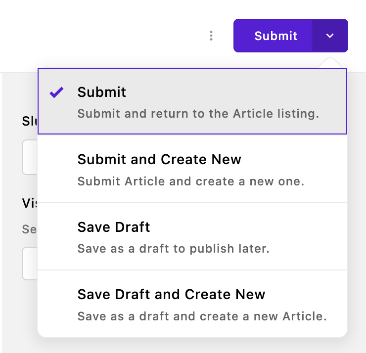
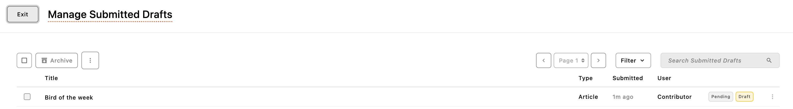
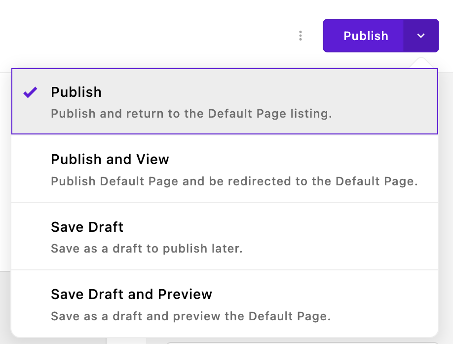

# Permissions and Workflow

The permission system available through the core `@apostrophecms/permission` module manages content workflows, user access, and site administration. It allows you to:

- **Create safe content workflows** where drafts can be reviewed before going live
- **Delegate content creation** without worrying about accidental changes to critical pages
- **Control file uploads** to maintain site security and organization
- **Manage user access** to sensitive or premium content
- **Scale your editorial team** with clear roles and responsibilities

## The four default user roles

Apostrophe provides four user roles that cover most organizational needs:

| **Ability**                     | **Guest** | **Contributor** | **Editor** | **Administrator** |
|---------------------------------|-----------|------------------|------------|--------------------|
| View "Login Required" Content   | ✅ | ✅ | ✅ | ✅ |
| Create Content                  | ❌ | ✅ | ✅ | ✅ |
| Edit Content                    | ❌ | ✅ | ✅ | ✅ |
| Publish Content                 | ❌ | ❌ | ✅ | ✅ |
| Upload Images and Files         | ❌ | ❌ | ✅ | ✅ |
| Manage Users                    | ❌ | ❌ | ❌ | ✅ |

### Guest
Guest users can log in to view content marked as "Login required" but cannot make any changes to the website. Use this role for:
- Newsletter subscribers who get early access to articles
- Community members viewing member-only resources
- External stakeholders who need to review content without editing rights

### Contributors
Contributors can create and edit content but cannot publish it live or upload files. This role is ideal for:
- Freelance writers submitting articles for review
- Team members creating draft content
- Junior staff learning the content management system

### Editors
Editors have all contributor permissions plus the ability to publish content and upload files. Perfect for:
- Senior editorial staff who review and approve content
- Content managers overseeing publication schedules
- Marketing teams managing campaigns and assets

### Administrators
Admins can do everything, including user management. Essential for:
- Website administrators
- IT staff managing user accounts
- Senior managers with full oversight needs

## Content Workflow

Let's walk through a typical content workflow to see how permissions create a smooth editorial process.

| **Step** | **Contributor Workflow** | **Editor Workflow** |
|----------|--------------------------|---------------------|
| **1. Create** | Logs in and creates a draft post.                                                 | Logs in and creates a post.                            |
| **2. Edit** | Can format text, link pages, and revise drafts - **cannot upload files or images**. | Can format, revise, and add media.                     |
| **3. Save** | Saves as a draft — **cannot publish**.                                              | Saves and can publish immediately.                     |
| **4. Submit** | Submits for editor review.                                                        | Skips review — manages and publishes their own work.   |
| **5. Publish** | Not allowed.                                                                     | Publishes instantly — full control.                    |
| **6. Revisions**| Can continue editing; changes remain drafts until republished by an Editor.     | Can edit live content and push updates directly.       |

### Step 1: Contributor Creates Content

A freelance writer with the **Contributor** role logs into the website and creates a new blog post.

As a contributor, the writer **can**:

  <ul>
    <li>Write and format the article</li>
    <li>Add internal links to other pages</li>
    <li>Save work as a draft</li>
    <li>Edit content multiple times</li>
    <li>Submit the draft for review (using the "Submit" button instead of "Publish")</li>
  </ul>
  

However, contributors **cannot**:
- Publish the article (it remains in draft status)
- Upload images or files

The article remains editable by the original author even after submission, allowing them to make revisions, corrections, or improvements while the editor reviews their work through their own submission management interface. Any changes made during this review period will be included when the editor eventually publishes the piece. Contributors can also elect to take the content out of the submission flow and resubmit at a later point.

### Step 2: Editor Reviews and Enhances

  
  
The content editor with the <strong>Editor</strong> role receives a notification about the new draft article.

The editor can open their submitted drafts inbox to review the content. The inbox provides information about when the content was submitted and author details. Articles are clearly marked to indicate whether they are new submissions or revisions to previously published content.

From the submitted drafts interface, editors can:
- Edit the content for style and accuracy
- Upload and add images to enhance the article
- Preview how the article will look when published
- Publish the submission immediately
- Share a preview link for others to review the draft
- Dismiss the submission if it's not ready for publication

### Step 3: Publication

  
After reviewing the work and adding appropriate images, the Editor publishes the article.

  

The article is now live on the website. If changes are needed later:
- The original Contributor can continue to edit the published article (but changes remain as drafts until an editor publishes them)
- The Editor can make immediate changes and publish them

## Advanced Permissions Extension

While the four standard roles handle most situations, some organizations need more granular control. For complex hierarchies, departmental workflows, or custom permission requirements, Apostrophe offers an Advanced Permissions extension that provides:

- **Custom user groups** for departments or teams with specific permission sets
- **Content-based permissions** (e.g., "can only edit blog posts")
- **Per-document permissions**, allowing you to grant specific users or groups access to individual pieces of content rather than all content of that type

The Advanced Permissions extension enables more targeted workflows - for example, a freelance writer could be given permission to edit only their assigned articles, or a department editor could manage only content in their section.

The Advanced Permissions extension integrates seamlessly with Apostrophe's core permission system while adding enterprise-level control. For detailed implementation guidance, see the [Advanced Permissions documentation](https://apostrophecms.com/extensions/advanced-permission).