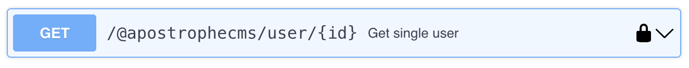
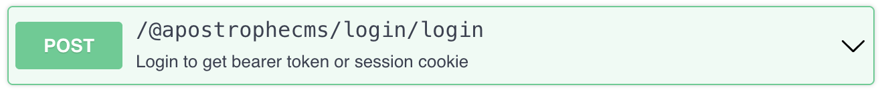

# Interactive API Reference

> **💡 Sandbox Testing**: This online explorer can connect to a project running at `localhost:3000` on your workstation to test standard API routes. You can test with API key or bearer token authentication, but not session cookies.
>

## Before you start

To use this page as an API sandbox:

1. **Start your Apostrophe project**

   ```bash
   npm run dev
   # or
   node app
   ```

   Make sure it is reachable at:

   - `http://localhost:3000` (default ApostropheCMS dev port)

2. **Scroll to the server URL in the spec**

   In the sidebar, the [`Interactive Explorer`](/reference/api/sandbox.html#🔽-interactive-explorer) is marked with an icon. In the Swagger UI, you will find the **Server** dropdown near the top. It should show something like:

   - `http://localhost:3000`

3. **Click the `Authorize` button**
   - See more below about authorization steps.
---

## Step-by-step: Authorize and run your first request

Swagger UI will happily send anonymous requests, but most Apostrophe endpoints require authentication.

Follow these steps carefully:

1. **Click the green “Authorize” button**

2. **Choose an auth method**

   The dialog lists three security schemes.

   - `ApiKeyAuth`
   - `BearerAuth`
   - `SessionAuth`

3. **Recommended: start with API key auth**

   - In your project, typically in the `modules/@apostrophecms/express/index.js` file, add an API key:
   ``` js
   export default {
     options: {
       session: {
         secret: 'myProjectSecret'
       },
       apiKeys: {
         mysecretapikey: {
           role: 'admin'
         }
       }
     }
   };
   ```
   - In the **Authorize** dialog of the explorer, scroll up to find the **API key** entry.
   - Paste your API key into the value field - in this example, `mysecretapikey`.
   - Click **Authorize**.
   - Then click **Close** at the bottom of the dialog.
  > [!NOTE]
  > You will not get any message regarding the validity of the key. If your endpoint requests fail with a `404` error, you likely entered the key wrong. Logout from the API key authorization section and reenter the key.

4. **Try a simple GET request**
   

   - Expand a simple GET endpoint (for example, the first “Users” route).
   - Click the route to expand it
   - Click **Try it out**
   - Change any of the parameters if desired
   - Click **Execute**
   - Check the **Response** section below the request:
     - Status `200` or `201` = success
     - Status `401`, `403` or `404` = auth problem; double-check your API key.

---

## Alternative: Bearer token via login route (more steps)

If you prefer to log in with a username/password instead of using an API key, you can:

1. **Find the login route**

   - In the explorer, look for the login endpoint (`POST` with `/@apostrophecms/login/login`).
   - Expand that operation.

2. **Send a login request**

   - Click **Try it out**.
   - In the request body, edit the `username` and `password` values.
   - Click **Execute**.

3. **Copy the token from the response**

   - In the **Responses**, scroll down to the `200` response.
   - Manually copy the token value, not including the quotes. The copy button will copy both the key and value.

4. **Configure Bearer auth in Swagger UI**

   - Click the **Authorize** button at the top of the Swagger UI.
   - Find the **BearerAuth** input.
   - Paste **only** the token value into the field (Swagger UI will add `Bearer ` for you).
   - Click **Authorize**, then **Close**.

5. **Try a simple GET request**
   

   - Expand a simple GET endpoint (for example, the first “Users” route).
   - Click the route to expand it
   - Click **Try it out**
   - Change any of the parameters if desired
   - Click **Execute**
   - Check the **Response** section below the request:
     - Status `200` or `201` = success
     - Status `401`, `403` or `404` = auth problem; double-check your token.

---

## Why session cookie auth is not supported here

ApostropheCMS typically uses a session cookie (for example, `project-shortname.sid`) when you log into the admin UI. The online Swagger explorer **cannot** reuse that login, because:

- The in-documentation Swagger UI runs in your browser as a separate web app.
- It cannot safely or portably access cookies from another origin.
- Even if it could, CORS rules usually block cross-site cookie usage.

Because of this, you **cannot** use the "Authorize" dialog to test “I’m logged into the admin UI” style session behavior. For cookie-based flows:

- Download the [OpenAPI spec file repo](https://github.com/apostrophecms/apostrophecms-openapi) and set it up locally
- Use an API client like Postman/Insomnia and configure cookie handling there.

The interactive explorer on this page is intentionally focused on **header-based authentication**: API keys and bearer tokens.

---

## 🔽 Interactive Explorer

Below is the full Swagger UI.
Once your server is running and you follow the authorization instructions, use `Try it out → Execute` in each endpoint to test. To take this farther, jump below the [explorer](#testing-against-your-own-site).

<AposApiExplorer />

## Testing Against Your Own Site

1. **Download**: Get our [OpenAPI specification](/openapi.yaml){download="apostrophecms-openapi.yaml"} or the [full repo](https://github.com/apostrophecms/apostrophecms-openapi).
2. **Import**: Load it into Postman, Insomnia, or similar tools if not using the repo
3. **Configure**: Set your server URL and authentication token
    - Server URL (change `https://your-site.com` to your actual domain)
    - Session cookie name (change `project-shortname.sid` to `yourproject.sid`)
4. **Test**: Make live API calls to your ApostropheCMS instance, either locally or your hosted site


## About This Reference

This interactive documentation is generated from our [OpenAPI specification](/apostrophecms-openapi.yaml). You can:

- **Test endpoints live**: Make real API calls to your locally running project (with authentication)
- **View request/response examples**: See exactly what data to send and expect
- **Understand schemas**: Explore all data models and field requirements
- **Copy code samples**: Get ready-to-use code

For more guidance, see our [`apostrophecms-openapi` repo](https://github.com/apostrophecms/apostrophecms-openapi).

## Start learning about the ApostropheCMS API
[Learn more about API authentication →](/reference/api/authentication)
