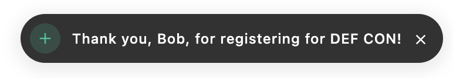

# `@apostrophecms/notification`

**Alias:** `apos.notification`

<AposRefExtends :module="$frontmatter.extends" />

This module implements a way to display notifications to logged-in users that can be triggered from either the server- or browser-side using `apos.notify`. These notifications can be customized for type, e.g. `success`, and can also emit bus events that can be used to trigger actions. The module itself has two options for controlling new notice polling frequency.

## Options

|  Property | Type | Default | Description |
|---|---|---|---|
| [`queryInterval`](#queryinterval) | integer | 500 | Interval in milliseconds between MongoDB queries |
| [`longPollingTimeout`](#longpollingtimeout) | integer | 10000 | Interval in milliseconds for the polling request to stay open. |

### `queryInterval`
This option sets the duration in milliseconds (ms) between MongoDB queries while long polling for notifications. It defaults to 500ms (1/2 a second). If you prefer fewer queries you can set this to a larger value, however, the queries are indexed queries on a small amount of data and shouldn't impact your app.

### `longPollingTimeout`
This option sets the duration of the long polling request in milliseconds. It defaults to 10000ms (10 seconds). This duration is typically a good balance between reducing overall server requests and avoiding timeouts from network intermediaries like proxy servers. It also helps in managing server resources efficiently by not keeping connections open excessively long and ensures a responsive user experience by providing timely updates without the overhead of constant querying.

## Usage
The usage of `apos.notify` differs slightly for server- vs client-side created notifications. In both cases, you need to pass the desired message string and an object of options. When using the method server-side, the first argument should be either the `req` object or a user `_id` string.

```javascript
await self.apos.notify(req, 'message', options, interpolation);
```
When using this client-side, from either on-page JavaScript or within an admin UI Vue component, this argument should not be included.

```javascript
await apos.notify('message', options, interpolation);
```
The message will be interpolated by i18next if there is a corresponding localization key, or passed directly if no key is found. You can pass additional keys to be interpolated and added to the message using either an `interpolation` object passed as the third argument, or as `options.interpolation`.

### Example

The translation strings file:
<AposCodeBlock>

```json
{
  "eventRegistrationSuccess": "Thank you, {{name}}, for registering for {{eventName}}!"
}
```
  <template v-slot:caption>
    modules/event/i18n/en.json
  </template>

</AposCodeBlock>

The form submission JavaScript:

<AposCodeBlock>

```javascript
export default () => {
  function onFormSubmit(formData) {
    const messageKey = 'eventRegistrationSuccess';
    const interpolate = {
      name: formData.name,
      eventName: formData.eventName
    };

    apos.notify(messageKey, {
      interpolate: interpolate,
      type: 'success',
      icon: 'plus-icon'
    });
    // or
    apos.notify(messageKey, {
      type: 'success',
      icon: 'plus-icon'
      },
      interpolate
    );
  }
};

```
  <template v-slot:caption>
    modules/event/ui/src/index.js
  </template>

</AposCodeBlock>

Within the `options` argument object, passed after the `message` string, you can pass several different properties.

The value of the `type` property dictates the styling of notification. In the example above the `success` type was used, but this property also accepts values of `danger`, `error`, `warning`, and `info`. If no `type` is passed in the object then `info` will be used by default.

The optional `icon` property takes the name of an already [registered icon](https://v3.docs.apostrophecms.org/reference/module-api/module-overview.html#icons). This icon is displayed in the notification to the left of the message.

The `dismiss` property takes either a boolean or integer representing the time in seconds. By default, notifications need to be dismissed manually by the user. If this property is set to `true`, the notification will automatically disappear after 5 seconds. If passed an integer, the notification will disappear after that specified number of seconds.

The `classes` option can take an optional array of additional class names that should be added to the notification wrapper. If you wish to use the notification to trigger an event using `options.buttons` or `options.event`, and do not want the user to receive a notification you can pass `classes: [ 'apos-notification--hidden' ]` in the options object.

The `return` option takes a boolean and defaults to `false`. If set to true, invoking a notification returns an object containing the `noteId` property. The value of this property can be used to retrieve details about the notification from the `aposNotifications` collection of the database.

The optional `buttons` property allows for the display of one or more buttons within the notification. It takes an array of objects with each having at least `label`, `name`, and `type` properties. Currently, the `type` property only takes `event` as a value. The `label` property takes an i18n string that will be displayed to the user. The `name` property takes a string that will be emitted when the button is clicked. Modules can listen for this on the client-side using [`apos.bus.$on(<name-value>, callback);`](https://v3.docs.apostrophecms.org/tutorials/admin-ui.html#adding-button-functionality). An optional `data` property can be used to pass an object to the module receiving the bus event. Clicking on a button will cause the notification to close.

### Example

In the browser, we could have functionality that allows users to add or delete comments on an article.

<AposCodeBlock>

```javascript
export default () => {
  // listen for notification button click to undo deletion
  // pass the data to the callback function
  apos.bus.$on('undoDeleteComment', async (commentId) => {
    try {
      await undoDeleteComment(commentId);
      // notify the user of success
      apos.notify('Comment deletion cancelled.', { type: 'success' });
    } catch (error) {
      // or error
      apos.notify('Error undoing item deletion.', { type: 'error' });
    }
  });

  function undoDeleteComment(commentId) {
    // Logic to undo deletion of the comment
  }

  function deleteComment(commentId) {
    // Logic to delete the item triggered from a client-side button

    // Show notification with undo option
    apos.notify('Comment deleted. Undo?', {
      type: 'warning',
      // dismiss undo notification after 5 seconds
      dismiss: true,
      // pass the commentId as the data payload of the bus event
      buttons: [
        {
          label: 'Undo deletion',
          type: 'event',
          name: 'undoDeleteComment',
          data: commentId
        }
      ]
    });
  }
};

```
  <template v-slot:caption>
    modules/article/ui/src/index.js
  </template>

</AposCodeBlock>

If the user deletes their comment it triggers the `deleteComment()` method. This then presents a notification with a button to undo that deletion. If the user clicks the button, `undoDeleteComment` is emitted on the bus along with the `commentId` as the `data` object payload. This bus event is picked up by the `$on` listener, which uses the data `commentId` to undelete the comment.

Much like the event triggered by clicking on the button, you can elect to trigger a bus even without the user having to click a button by using the `event` property. This property takes an object with `name` and an optional `data` property, like the `buttons` array objects. This event will be triggered as soon as the notification is presented to the user.