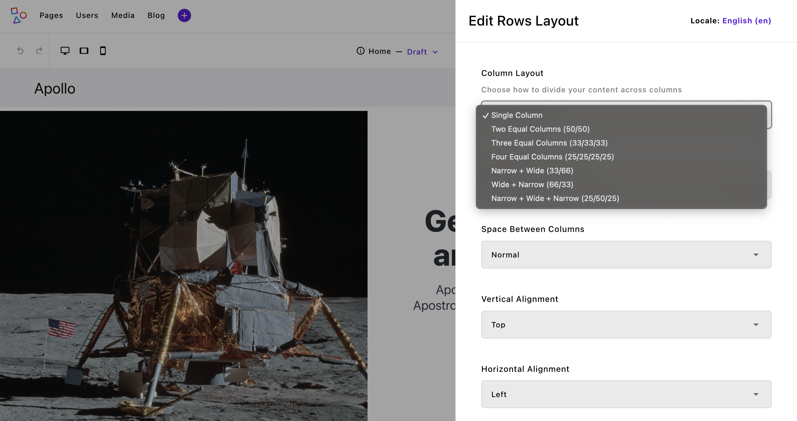

# Creating Widgets in ApostropheCMS + Astro
Widgets are the fundamental building blocks of content in ApostropheCMS. They allow content editors to change the page layout, add images, or rich text to a page. As we covered in the [Core Concepts](/tutorials/Astro/introducing-apollo.html#part-2-core-concepts) section of the Apollo introduction, this occurs through the addition of widgets to areas on the page. As we will briefly touch on, Astro also allows developers to reuse widgets as components added directly to the page. To understand widget creation, we will first look at several widgets from the Apollo theme and then create a new widget from scratch.

This tutorial provides only a brief introduction to widget development in ApostropheCMS, but there's much more to explore. For comprehensive documentation on Apostrophe's field types, query syntax, and advanced widget features, visit the [ApostropheCMS documentation](https://docs.apostrophecms.org).

## The Apollo Rows Widget


In ApostropheCMS, areas provide a flexible way to structure content, making it easy to build dynamic layouts. While areas can be defined at the page level, widgets (and pieces) can also have their own areas, allowing them to act as containers for other widgets. This enables complex, nested layouts.

A great example of this is the rows widget in the Apollo project. When added to a page, it lets users configure a set number of column areas based on their chosen layout. Each column can hold any type of widget—including another rows widget—enabling deep nesting when needed. This pattern appears throughout Apollo; for instance, the hero widget uses an area to manage call-to-action buttons while still fitting seamlessly into ApostropheCMS’s editing interface.

By structuring layouts this way, you get the best of both worlds: modular, reusable components and a maintainable codebase. Now, let’s break down how this works under the hood—both on the backend and frontend.

### Backend Implementation
In ApostropheCMS, the rows widget module demonstrates several key concepts for widget development. Let's break down its structure:

```javascript
export default {
  extend: '@apostrophecms/widget-type',
  options: {
    label: 'Rows Layout',
    icon: 'view-column-icon',
    description: 'Create row and column-based layouts for your content.'
  }
}
```
The module extends the base widget type and provides metadata used in the editor interface. The `icon` designates an already [registered icon](/reference/module-api/module-overview.html#icons) that will be displayed in the [widget selection flyout](). The real complexity comes in the `fields` configuration, where we define both the layout controls and the areas:

```javascript
fields: {
  add: {
    columnLayout: {
      type: 'select',
      label: 'Column Layout',
      def: 'single',
      choices: [
        {
          label: 'Single Column',
          value: 'single'
        },
        {
          label: 'Two Equal Columns (50/50)',
          value: 'two-equal'
        }
        // Additional layouts...
      ]
    },
    columnOneContent: {
      type: 'area',
      label: 'First Column',
      options: getWidgetGroups({
        includeLayouts: true,
        exclude: [ 'grid-layout' ]
      })
    },
    // additional area fields
  }
}
```
A key feature is the conditional visibility of areas based on the selected layout. For example, the second column area only appears when certain layouts are selected:

```javascript
columnTwoContent: {
  type: 'area',
  label: 'Second Column',
  options: getWidgetGroups({
    includeLayouts: true,
    exclude: ['grid-layout']
  }),
  if: {
    $or: [
      { columnLayout: 'two-equal' },
      { columnLayout: 'three-equal' },
      { columnLayout: 'four-equal' },
      { columnLayout: 'one-third-two-thirds' },
      { columnLayout: 'two-thirds-one-third' },
      { columnLayout: 'quarter-half-quarter' }
    ]
  }
}
```
The `if` condition with `$or` operator is part of ApostropheCMS's MongoDB-style query syntax. It's used throughout Apostrophe for conditional field visibility, permissions, and querying content. Each potential column gets its own uniquely named area, which becomes available for content only when the chosen layout supports it.  The `getWidgetGroups` helper ensures that each area accepts the same set of widgets, excluding the grid layout to prevent nesting conflicts.

### Frontend Implementation in Astro
Just like the page template components, the widget frontend implementation starts with the component frontmatter, where we handle imports, type definitions, and data processing:

```javascript
---
const { widget } = Astro.props;
import AposArea from '@apostrophecms/apostrophe-astro/components/AposArea.astro';
```
When a widget is rendered in an area, Astro passes the data from the ApostropheCMS backend through the `widget` prop. The values of these schema fields can then be used in the template as we did with our pages. If the widget also contains any areas, as the rows widget does, we can also import the `AposArea` helper for rendering those additional widgets.

The component then defines configuration objects that map our backend choices to frontend styling:

```javascript
const layouts = {
  'two-equal': {
    classes: ['is-12-mobile is-6-tablet', 'is-12-mobile is-6-tablet'],
    areas: ['columnOneContent', 'columnTwoContent']
  },
  'three-equal': {
    classes: ['is-12-mobile is-6-tablet is-4-desktop', 'is-12-mobile is-6-tablet is-4-desktop', 'is-12-mobile is-6-tablet is-4-desktop'],
    areas: ['columnOneContent', 'columnTwoContent', 'columnThreeContent']
  }
  // Additional layouts...
};
```
These configurations are processed in the frontmatter to generate our final classes:

```javascript
const currentLayout = layouts[widget.columnLayout || 'two-equal'];
const columnsClasses = [
  'columns',
  spacingClass,
  verticalAlignClass,
  horizontalAlignClass,
  maxWidth,
  'mx-auto'
].filter(Boolean).join(' ');
```
::: info
Astro has a built in directive for creating class lists - [`class:list`](https://docs.astro.build/en/reference/directives-reference/#classlist). This allows for construction of the class list directly in the template instead of the frontmatter.
```javascript
<span class:list={['columns', {spacingClass}, {verticalAlignClass}, ['mx-auto'] ]} />
```
Since in many cases we are translating to Bulma classes we created some helper functions and have elected to create our class lists in the frontmatter.
:::

These configurations and processed classes are then used in the template section to create our dynamic layout:

```astro
<section
  class="column-layout container is-fluid mb-6"
  role="region"
  aria-label={widget.label || 'Content columns'}
>
  <div class={columnsClasses} role="presentation">
    {currentLayout.areas.map((areaName, index) => (
      widget[areaName] && (
        <div
          class={`column ${currentLayout.classes[index]} editor-column`}
          data-column-index={index + 1}
          role="region"
          aria-label={`Column ${index + 1}`}
        >
          <div class="column-content">
            <AposArea area={widget[areaName]} />
          </div>
        </div>
      )
    ))}
  </div>
</section>
```
The template demonstrates several key concepts:

1. The `currentLayout.areas` array drives the structure, mapping to our backend area fields
2. Each area is only rendered if it exists in the widget data (`widget[areaName]`)
3. The `AposArea` component renders the nested content, maintaining the widget-within-widget pattern
4. Layout classes are applied dynamically based on the selected configuration

The `AposArea` component is doing the heavy lifting here - it takes our area data and renders any widgets that have been added to that area by content editors. This creates the recursive structure we discussed earlier, where each column can contain its own set of widgets.

The rows widget demonstrates the foundational patterns of widget development in ApostropheCMS and Astro:
- Widget configuration through fields and options in the backend
- Conditional field visibility using Apostrophe's query syntax
- Area fields that enable nested widget structures
- Frontend component organization with configuration objects and dynamic templating
- Integration with the `AposArea` component for nested content rendering

Next, let's look at how we can add client-side interactivity to widgets. The video and slideshow widgets offer two different approaches to handling JavaScript in the widget ecosystem.

## Adding Client-Side Interactivity to Widgets
Astro provides several routes for adding JavaScript to your the browser. This ccan take the form of public scripts loaded on every page, `<script>` tags in your components, and the addition of client-side framework component, e.g. Vue of React components. Let's explore the different approaches available for adding client-side interactivity to widgets in the ApostropheCMS + Astro environment, using examples from the Apollo project.

### Web Components Approach

Web Components are a great choice for widgets that need to maintain their own state and behavior. The Apollo `VideoWidget` relies on a custom web component to access the ApostropheCMS backend oEmbed endpoint.

::: info
You can add additional routes into your ApostropheCMS backend that can be accessed by client-side fetch operations. If they are prefixed with `/api/v1/` they will be proxied by the `apostrophe-astro` extension. If not, they can be added to the `proxyRoutes` array in the extension configuration within the `astro.config.mjs` file.
:::

Within the widget it passes `title` and `URL` data to this component:

```javascript
<video-widget
  url={placeholder ? PLACEHOLDER_VIDEO_URL : url}
  title={videoTitle}
>
</video-widget>
```

In past versions of Astro, JavaScript included in your components through the `<script>` tag was hoisted and initiated as soon as a component was added to the page through dynamic editing. In modern versions of Astro, this is no longer true. If you are generating static pages with Astro, this isn't typically a concern and can make overall bundle size smaller depending on page content. For Apostrophe widget addition however, we want a dynamic editing experience where widget content is available upon in-context addition.

Any added scripts are linked inline and only initiated after full page reload. This presents a problem when we initially add our custom `<video-widget>` to the page, because the web component won't exist until the script is run and will therefore throw an error. To get around this limitation, we moved the client-side JavaScript to the `frontend/public/scripts` folder and are loading the component script in the `[...slug].astro` file.

#### Widget Template Structure

First, let's look at how the widget template is structured:

```javascript
---
// frontend/src/widgets/VideoWidget.astro
const { widget } = Astro.props;
const { video, title } = widget;
const url = video?.url;
const videoTitle = title || 'Video';
const placeholder = widget?.aposPlaceholder;
const PLACEHOLDER_VIDEO_URL = 'https://www.youtube.com/watch?v=dQw4w9WgXcQ';
---

<div class="video-widget-wrapper">
  <video-widget
    url={placeholder ? PLACEHOLDER_VIDEO_URL : url}
    title={videoTitle}
  >
  </video-widget>
</div>
```
We are accessing the data passed from the ApostropheCMS backend server through the `widget` prop and destructuring the two fields, `video` and `title`. This information is then passed to the `<video-widget>` web component. Note that in an Astro only project we could instead import the web component in this template.

#### Web Component Implementation

The web component itself is defined in a separate file:

```javascript
// frontend/public/scripts/video-widget.js
class VideoWidget extends HTMLElement {
  static observedAttributes = ['url', 'title'];
  
  constructor() {
    super();
    this.videoData = null;
  }

  async connectedCallback() {
    await this.initializeVideo();
  }

  async attributeChangedCallback(name, oldValue, newValue) {
    if (oldValue !== newValue && this.isConnected) {
      await this.initializeVideo();
    }
  }

  async initializeVideo() {
    const url = this.getAttribute('url');
    if (!url) return;

    try {
      // Fetch oEmbed data from ApostropheCMS
      const response = await fetch(`/api/v1/oembed?url=${encodeURIComponent(url)}`);
      this.videoData = await response.json();
      this.render();
    } catch (error) {
      console.error('Error fetching video data:', error);
    }
  }

  render() {
    if (!this.videoData) return;

    // Create responsive wrapper
    const wrapper = document.createElement('div');
    wrapper.className = 'video-responsive';
    wrapper.innerHTML = this.videoData.html;

    // Clear and update content
    this.innerHTML = '';
    this.appendChild(wrapper);
  }
}

customElements.define('video-widget', VideoWidget);
```
We aren't going to go through this file in detail. The one thing that you will note is that it is making an API call to the ApostropheCMS server:
```javascript
const response = await fetch(`/api/v1/oembed?url=${encodeURIComponent(url)}`);
```
If desired, you could create [custom API routes](https://docs.apostrophecms.org/reference/module-api/module-overview.html#restapiroutes-self) for any of your widgets or other web components to query in this manner.

#### Loading the Web Component

In the Apollo `[...slug].astro` file we are adding the web component script to the `startHead` slot:

```javascript
---
// frontend/src/pages/[...slug].astro
---

<AposLayout title={aposData.page?.title} {aposData} {bodyClass}>
  <Fragment slot="startHead">
    <script src="/scripts/video-widget.js"></script>
  </Fragment>
  <!-- ... rest of layout -->
</AposLayout>
```

### Traditional JavaScript Initialization

For widgets that need more traditional JavaScript initialization, like the `SlideshowWidget`, we need a different approach.

#### Widget Template

```javascript
---
// frontend/src/widgets/SlideshowWidget.astro
const { widget } = Astro.props;
const { images, _id } = widget;
---

<div
  class="slideshow-widget"
  data-slideshow
  data-widget-id={_id}
>
  <div class="slideshow-content">
    {images?.map((image, index) => (
      <div
        class:list={[
          'slide',
          { active: index === 0 }
        ]}
        data-slide={index}
      >
        
      </div>
    ))}
  </div>

  <div class="slideshow-controls">
    <button class="prev" aria-label="Previous slide">←</button>
    <button class="next" aria-label="Next slide">→</button>
  </div>
</div>
```
The template just brings in the widget data and creates simple markup to display and navigate through the slides.

#### JavaScript Initialization

```javascript
// frontend/src/widget/SlideshowWidget.astro
// ... slideshow specific code

const slideshows = new Map();

setTimeout(() => {
  initSlideshows();

  if (window.apos) {
    apos.bus.$on('refreshed', initSlideshows);
    apos.bus.$on('modal-resolved', initSlideshows);
  }
}, 300);

function initSlideshows() {
  slideshows.forEach((slideshow) => slideshow.destroy());
  slideshows.clear();

  setTimeout(() => {
    document.querySelectorAll('.slideshow-container').forEach((container) => {
      const slideshowId = container.dataset.slideshowId;
      if (slideshowId) {
        slideshows.set(slideshowId, new Slideshow(container));
      }
    });
  }, 100);
}
```
The slideshow widget uses a combination of Astro and ApostropheCMS event handling to manage slideshow functionality. When in editing mode, the widget properly reinitializes after preview/edit toggles by listening to ApostropheCMS's event bus. Here we are listening for two different emit events - `refreshed` that occurs when a user switches between the edit and preview modes, and `modal-resolved` that occurs after the user closes the editing modal to reinitialize when slides are removed or added. A small timeout ensures both ApostropheCMS is available and the DOM has been updated before initializing or reinitializing slideshows. Each slideshow instance is tracked in a Map to properly clean up event listeners and autoplay intervals when needed.

Currently, when a new slideshow widget is first added to a page through ApostropheCMS, a page reload is required for the JavaScript initialization to take effect. However, once the page has been reloaded, the slideshow functions normally and handles preview/edit mode switches correctly. This initial load limitation is a known issue in the current implementation, related to the timing of widget addition and script hydration.

## Creating a Custom Testimonial Widget

Let's create a testimonial widget from scratch to demonstrate the complete widget development process. This widget will display customer testimonials with a quote, author name, role, and optional image.

### Backend Setup

First, create the widget module in your backend project:

```bash
mkdir -p backend/modules/testimonial-widget
touch backend/modules/testimonial-widget/index.js
```

#### Module Configuration

Add this configuration to `testimonial-widget/index.js`:

```javascript
export default {
  extend: '@apostrophecms/widget-type',
  options: {
    label: 'Testimonial',
    icon: 'format-quote-icon',
    description: 'Add customer testimonials to your page'
  },
  fields: {
    add: {
      quote: {
        type: 'string',
        label: 'Quote',
        textarea: true,
        required: true
      },
      author: {
        type: 'string',
        label: 'Author Name',
        required: true
      },
      role: {
        type: 'string',
        label: 'Author Role'
      },
      authorImage: {
        type: 'area',
        label: 'Author Image',
        options: {
          max: 1,
          widgets: {
            '@apostrophecms/image': {}
          }
        }
      },
      style: {
        type: 'select',
        label: 'Display Style',
        def: 'simple',
        choices: [
          {
            label: 'Simple',
            value: 'simple'
          },
          {
            label: 'Card',
            value: 'card'
          },
          {
            label: 'Featured',
            value: 'featured'
          }
        ]
      }
    },
    group: {
      basics: {
        label: 'Basics',
        fields: [
          'quote',
          'author',
          'role'
        ]
      },
      appearance: {
        label: 'Appearance',
        fields: [
          'authorImage',
          'style'
        ]
      }
    }
  }
};
```

### Register the Widget

1. First, add the widget to the widget groups in `backend/lib/helpers/area-widgets.js`:

```javascript
export const widgetGroups = {
  // ... existing groups
  content: {
    label: 'Content',
    columns: 3,
    widgets: {
      '@apostrophecms/image': {},
      '@apostrophecms/video': {},
      '@apostrophecms/rich-text': {},
      // ... other content widgets
      testimonial: {} // Add our new testimonial widget
    }
  }
};
```

2. Then add the widget to `backend/app.js`:

```javascript
export default {
  modules: {
    // ... other modules
    'testimonial-widget': {}
  }
}
```

The `area-widgets.js` helper provides a clean, maintainable way to:
- Organize widgets into logical groups (layout vs. content)
- Configure widget display in the admin UI (columns, labels)
- Centrally manage widget availability across different areas
- Easily exclude specific widgets when needed

### Using the Widget in Areas

Now you can use the helper to add the testimonial widget to any area. For example, in a page type:

```javascript
import { getWidgetGroups } from '../../lib/helpers/area-widgets.js';

export default {
  extend: '@apostrophecms/page-type',
  options: {
    label: 'My Page Type'
  },
  fields: {
    add: {
      main: {
        type: 'area',
        options: getWidgetGroups({
          includeLayouts: true // Include layout widgets if needed
        })
      }
    }
  }
};
```

### Frontend Implementation

#### Create the Widget Component

Create a new file at `frontend/src/widgets/TestimonialWidget.astro`:

```javascript
---
import AposArea from '@apostrophecms/apostrophe-astro/components/AposArea.astro';

const { widget } = Astro.props;
const { quote, author, role, style = 'simple', authorImage } = widget;

// Map styles to Bulma classes
const styleClasses = {
  simple: 'is-light',
  card: 'is-primary',
  featured: 'is-info is-large'
};

const boxClass = `box notification ${styleClasses[style]} p-5`;
---

<div class={boxClass}>
  {authorImage && (
    <figure class="image is-96x96 mb-4 mx-auto">
      <AposArea area={authorImage} />
    </figure>
  )}

  <blockquote class="is-size-5 has-text-centered mb-4">
    "{quote}"
  </blockquote>

  <div class="has-text-centered">
    <strong class="is-block">{author}</strong>
    {role && <span class="is-block has-text-grey">{role}</span>}
  </div>
</div>

<style>
  blockquote {
    font-style: italic;
    line-height: 1.5;
  }

  .box {
    max-width: 800px;
    margin: 2rem auto;
  }

  .is-large {
    font-size: 1.25rem;
  }
</style>
```

### Register the Widget Component

Add the widget to `frontend/src/widgets/index.js`:

```javascript
import TestimonialWidget from './TestimonialWidget.astro';

export default {
  // ... other widgets
  'testimonial': TestimonialWidget
};
```
## Next Steps: Working with Pieces
While widgets handle modular content and layouts, pieces in ApostropheCMS serve a different purpose - managing collections of content like blog posts, team members, or products. In the next section, we'll explore how pieces work in an ApostropheCMS + Astro environment, including:

- Creating piece types
- Building piece pages
- Managing relationships
- Implementing piece widgets
- Handling piece data in Astro templates

Pieces complement widgets by providing reusable content that can be displayed across your site in various contexts. Understanding both systems gives you powerful tools for building flexible, content-rich websites.