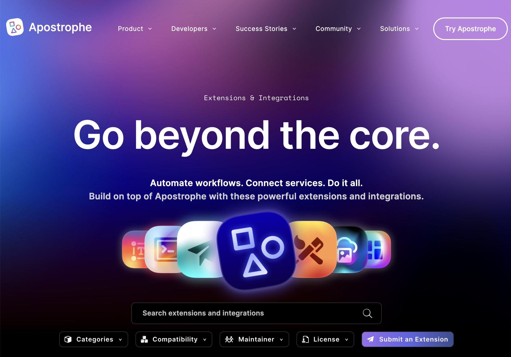

# Adding extensions to your project

Extensions are a way to easily add functionality to your project, whether by adding modules created by other developers, or a set of self-developed, custom modules that get installed in your project. Apostrophe's own library of extension also contains great examples for learning Apostrophe's codebase.

For the final tutorial of our basic project build, we are going to install two different extensions. First, we will install the `seo` extension. This extension is a good example of how a set of bundled modules can improve multiple core modules as well as modify the project layout template. Next, we will install the `blog` extension. In this case, the `blog` extension doesn't improve any core modules, but it provides a useful example of how to implement piece-type filters, queries, and the `extendMethods()` function when creating a new piece-type.

The amount of actual code creation in this template will be minimal,but you can switch to the `sec2-8-adding-extensions` branch of the [project repository](https://github.com/apostrophecms/a3-onboarding-project) like with previous tutorials. Alternatively, you can just install the two extensions using the npm commmands detailed below and add the modules into the `app.js` file of your local project.

## The ApostropheCMS extensions page



In addition to other resources like blog articles and tutorials, the [ApostropheCMS website](https://apostrophecms.com/extensions) has a section for extensions provided by the Apostrophe engineering team and outside contributors. The page is a great resource for searching through the extension library.

Once you find an extension that seems useful, you can click to read more information about the extension, find the installation instructions, or click through to the repository on GitHub to look at the code.

## The `seo` extension

The `@apostrophecms/seo` module adds meta fields to all pages and pieces, which provide useful functionality like Google Analytics support. In this section of the tutorial we aren't going to focus on proper SEO practices or the content that this module adds. Instead, we will focus on two aspects of this module. First, how the SEO module accomplishes the installation of multiple modules and second, how to modify multiple pages and pieces using `improve` and template injection.

### Installation

To install the `seo` extension we will go to the [extension page](https://apostrophecms.com/extensions/seo-tools-3) and follow the installation instructions. There are two steps. First, from within the root directory of your project run `npm install @apostrophecms/seo`. This command installs the modules into your `npm_modules/@apostrophecms` folder and update your `package.json` file. Next, we open our `app.js` file and add it to our `modules` configuration as you would with any new project-level module. 

<AposCodeBlock>

``` javascript
require('apostrophe')({
  shortName: 'a3-onboarding-project',
  modules: {
    '@apostrophecms/seo': {},
    // the remainder of the project modules
  }
};

```
  <template v-slot:caption>
    app.js
  </template>

</AposCodeBlock>

A base URL is necessary for deploying an SEO extension enabled project to production. Adding one can be done either by using the `APOS_BASE_URL` environment variable, or by setting the `baseUrl` option during deployment. If the base URL is set during local development you will see problems with asset loading and login.

### Package structure
Like the other custom modules we created for this onboarding project, the top level of this package is an `index.js` file.

<AposCodeBlock>

``` javascript
const fs = require('fs');
const path = require('path');

module.exports = {
  options: {
    alias: 'seo',
    i18n: {
      ns: 'aposSeo',
      browser: true
    }
  },
  bundle: {
    directory: 'modules',
    modules: getBundleModuleNames()
  },
  init(self) {
    self.apos.template.prepend('body', '@apostrophecms/seo:tagManagerBody');
    self.apos.template.append('head', '@apostrophecms/seo:tagManagerHead');
    self.apos.template.prepend('head', '@apostrophecms/seo:metaHead');
  },
  components(self) {
    return {
      async metaHead(req, data) {},
      async tagManagerBody(req, data) {},
      async tagManagerHead(req, data) {}
    };
  }
};

function getBundleModuleNames() {
  const source = path.join(__dirname, './modules/@apostrophecms');
  return fs
    .readdirSync(source, { withFileTypes: true })
    .filter(dirent => dirent.isDirectory())
    .map(dirent => `@apostrophecms/${dirent.name}`);
}

```
  <template v-slot:caption>
    npm_modules/@apostrophecms/seo/index.js
  </template>

</AposCodeBlock>

#### `options`

``` javascript
options: {
  alias: 'seo',
  i18n: {
    ns: 'aposSeo',
    browser: true
  }
}
```
Let's walk through the code starting with the `options`. The first property, `alias`, provides a quick reference to the module on the `apos` object. We covered this briefly in the [Creating Widgets](/tutorials/widgets.html) tutorials in this series when we accessed the columns helper function. Basically, instead of using `apos.modules['@apostrophecms/seo']`, you can use `apos.seo`. You do **not** want to do this for most publicly available modules (those that would be distributed to multiple projects) to prevent naming conflicts.

The next option property is `i18n`. This property sets up a namespace for localization strings for files in this module. This method of setting the namespace is deprecated but still supported. Instead, within the `i18n` object an `aposSeo` key should be added with additional configuration supplied via an object of that key.

``` javascript
...
i18n: {
  aposSeo: {
    browser: true
  }
}
...
```
In this case, `browser: true` makes the translation strings available within the Vue components of the admin UI when a user is logged in. Looking at the overall project structure, we can see that there is an `i18n` folder at the root level of the project. The JSON files in this folder provide the translation strings and do not need to be prefixed with `aposSeo`. However, within the modules, any time these strings are used you need to prefix with `aposSeo:` to fetch the translation from the correct folder.

#### `bundle`

``` javascript
bundle: {
  directory: 'modules',
  modules: getBundleModuleNames()
},
```

Following the `options` is a top-level configuration object that we haven't covered: `bundle`. It can take an object with two properties. The `directory` property takes a relative path to the directory of the modules to be loaded. Looking at the `npm_modules/@apostrophecms/seo` folder, we can see that the `modules` folder is in the same directory as the `index.js` file.

``` javascript
function getBundleModuleNames() {
  const source = path.join(__dirname, './modules/@apostrophecms');
  return fs
    .readdirSync(source, { withFileTypes: true })
    .filter(dirent => dirent.isDirectory())
    .map(dirent => `@apostrophecms/${dirent.name}`);
}
```

The `modules` property takes an array of module names. In this case, that array is supplied by the function `getBundleModuleNames()`, located at the end of the `index.js` code. Using this approach allows for registration of any number of modules quickly.

#### `init(self)` & `components(self)`

``` javascript
init(self) {
  self.apos.template.prepend('body', '@apostrophecms/seo:tagManagerBody');
  self.apos.template.append('head', '@apostrophecms/seo:tagManagerHead');
  self.apos.template.prepend('head', '@apostrophecms/seo:metaHead');
},
components(self) {
  return {
    async metaHead(req, data) {},
    async tagManagerBody(req, data) {},
    async tagManagerHead(req, data) {}
  };
}
```

The `init(self)` and `components(self)` configuration objects work together to add markup to the `<head>` and two sections of the `<body>`. First, three new components are added by the `components(self)` method. The template for each component is located in the `npm_modules/@apostrophecms/seo/views` folder where the name for the markup file matches the name of the function in the components object with `html` appended. This was covered in the [Creating Widgets](/tutorials/widgets.html) tutorial.

From within the `init(self)` function, the module takes advantage of the `prepend()` and `append()` functions exposed by the `@apostrophecms/template` module. These function specify where additional content can be added to the `@apostrophecms/template/views/outerLayoutBase.html` file. You can examine this file to see where these "injection" points are with respect to the blocks that we covered in the [Creating Pages](/tutorials/pages.html) tutorial. Modifying the base layout file allows you to modify all page templates that are using the `outerLayoutBase.html` file, without knowing the markup of the individual templates or having to add the module to every page individually.

#### The components
The Nunjucks templates for each of the components are fairly standard. The `views/404.html`, `views/tagManagerBody.html`, and `views/tagManagerHead.html` all poll the `@apostrophecms/global` module options. The `views/metaHead.html` markup is slightly different.

<AposCodeBlock>

``` nunjucks






{# title #}


  <meta name="title" content="{{ seoTitle }}" />

```
  <template v-slot:caption>
    node_modules/@apostrophecms/seo/views/metaHead.html
  </template>

</AposCodeBlock>

This same template can be used on a piece-page or another page-type, so it has to pull data from any of these sources. It then uses conditional logic to retrieve data from any of the possible sources to apply in the template. If there was also data being harvested and applied to widgets, `data.widgets` might also need to be polled for the desired data.

#### The modules
The `seo` extension bundles eight modules that each `improve` a different core apostrophe module. By improving each of these core modules, the core modules and all custom modules in your project that extend these same core modules will have these code changes.

``` javascript
module.exports = {
  improve: '@apostrophecms/file',
  options: {
    seoFields: false
  }
};
```

For five of the core modules, `apostrophecms/file`, `apostrophecms/file-tag`, `apostrophecms/image`, `apostrophecms/image-tag`, and `apostrophecms/user`, the only improvement is to pass the `seoFields/false` property in the option to disable the SEO field enhancements for those piece-types. This is necessary because the other modules of the extension, as we will see, improve core modules that these five extend but doesn't make sense for these five to add SEO data.

``` javascript
fields(self, options) {
  const add = {};
  const group = {
    seo: {
      label: 'aposSeo:group',
      fields: [],
      last: true
    }
  };
  if (options.seoGoogleTagManager) {
    add.seoGoogleTagManager = {
      label: 'aposSeo:gtmIdHelp',
      type: 'string',
      help: 'aposSeo:gtmIdHelp'
    };
    group.seo.fields.push('seoGoogleTagManager');
  }
  if (options.seoGoogleAnalytics) {
    add.seoGoogleTrackingId = {
      label: 'aposSeo:gaId',
      type: 'string',
      help: 'aposSeo:gaIdHelp'
    };
    group.seo.fields.push('seoGoogleTrackingId');
  }
  if (options.seoGoogleVerification) {
    add.seoGoogleVerificationId = {
      label: 'aposSeo:googleVerifyId',
      type: 'string',
      help: 'aposSeo:googleVerifyIdHelp'
    };
    group.seo.fields.push('seoGoogleVerificationId');
  }
  return Object.keys(add).length
    ? {
      add,
      group
    }
    : null;
}
```

The `seo-fields-global` module of the extension also disables the SEO fields for the global piece-type, but adds several other schema fields to a tab labeled with the `aposSeo:group` translation string. In this case, rather than add a `fields` object directly, the object is being returned from a function that uses conditionals to check whether three different options have been enabled. These options can be passed to the `@apostrophecms/global` module from two different places at project level. In the `README.md` file of the extension package it demonstrates enabling them by adding the module to the `modules` object of the `app.js` file.

``` javascript
require('apostrophe')({
  shortName: 'MYPROJECT',
  modules: {
    '@apostrophecms/seo': {},
    '@apostrophecms/global': {
      options: {
        seoGoogleAnalytics: true,
        seoGoogleTagManager: true,
        seoGoogleVerification: true
      }
    }
  }
});
```

In our project, we already have a `modules/@apostrophecms/global/index.js` file where we can enable these three options.

The `seo-fields-page-type` module enhances the `@apostrophecms/page-type` module by adding a single relationship schema field. Enhancements to the former module also benefit the `@apostrophecms/piece-page-type` module, as the latter extends the base module. These enhancements are implemented using a `fields()` method that returns an object instead of a static object. The method enables conditional field additions, depending on options for each page-type module.

Similarly, the `seo-fields-doc-type` module enhances the `@apostrophecms/doc-type` module. Enhancements here impact not just page-type modules but also the `@apostrophecms/piece-type` module. For the doc-type module, the `fields()` function returns an object that includes multiple schema fields, provided `options.seoFields` isn't set to `false`. The function also introduces an extra `select` type schema field if the extending module specifies an `seoCanonicalTypes` option with an array of piece-type module names or includes `@apostrophecms/page` to encompass all page types. Such an addition enables piece-type modules to identify a canonical link for a piece.

Overall, this extension provides a good blueprint for how to modify all the page- and piece-types in a project. A similar strategy could be used to include any combination of core modules, for example only improving the `@apostrophecms/widget-type` and `@apostrophcms/piece-type` modules.

## The `blog` extension

The [`blog` extension](https://apostrophecms.com/extensions/blog) adds a new `blog` piece-type and piece-page-type to your project. Like the `seo` extension it uses the `bundle` option to make an additional module available. A main feature of the blog module is the ability to filter the posts in the piece management modal by publication date that uses both `filters` and custom `queries`. The extensions code will also allow us to examine the `piecesFilters` option introduced in the "Pieces" tutorial.

### Installation

To install the `@apostrophecms/blog` module, navigate to the [extension page](https://apostrophecms.com/extensions/blog) and follow the installation instructions. After running `npm install @apostrophecms/blog` in the root of our project a number of follow up steps are necessary.

Unlike the `seo` extension, the `@apostrophecms/blog` module should be added to the `bundles` array of the project `app.js`. The modules added through this package `extend` the `@apostrophecms/piece-type` and `@apostrophecms/piece-page-types` core modules. For the `seo` extension, all the modules improved rather than extending the core modules, so it was sufficient to add the base `@apostrophecms/seo` module to the `modules` configuration object. Adding `@apostrophecms/blog` to the bundles can also allow you to use the two modules of the extension as a base to further extend your own custom modules without adding either of the extension modules to the `modules` configuration object.

While we aren't using them in this project, the next step of installation would be to add `@apostrophecms/blog` and `@apostrophecms/blog-page` to the `modules` object. Finally, the new page type needs to be added to the `modules/@apostrophecms/pages/index.js` file in order for it to show up as an option in the page-type selector.

### Package structure

This extension is slightly more modest in scope than the `seo` extension. The main `index.js` file adds the `@apostrophecms/blog` piece-type. It also uses the `bundle` configuration to load a module to provide the pages for the new piece-type. Since it is only a single module, the name of the module is added directly to the `bundles.modules` array instead of using a function that returns all the names in the directory. At the root of the extension there is a helper file, `queries.js`, that we will examine when we dissect the main `index.js` file. The `modules/@apostrophecms/blog-page` folder contains the `index.js` file for the new piece-page-type and also a `views` folder containing the expected `show.html` and `index.html` files, but also a `filters.html` file that contains the markup for the filters that users can apply to the pieces.

### The `blog` piece-type

#### The `index.js` file

Let's walk through the `npm_modules/@apostrophecms/blog/index.js` file. At the top, the file  uses `require` to bring two dependencies into the module, the `dayjs` library and the `queries.js` helper file.

``` javascript
bundle: {
  directory: 'modules',
  modules: [ '@apostrophecms/blog-page' ]
},
```
As was pointed out, unlike the `seo` extension, this extension adds the name of the additional module in the bundle directly, instead of using a function.

``` javascript
options: {
  label: 'aposBlog:label',
  pluralLabel: 'aposBlog:pluralLabel',
  sort: { publishedAt: -1 },
  i18n: {
    ns: 'aposBlog',
    browser: true
  }
}
```
Within the `options` a label and i18n namespace are added. Additionally, the `sort` option is set to sort on the `publishedAt` field in descending order, from newest to oldest date. This impacts the order in the piece manager and on the index page.

``` javascript
columns: {
  add: {
    publishedAt: {
      label: 'aposBlog:publishedAt'
    }
  }
},
```

As covered in the "Pieces" tutorial, the `columns` configuration object adds additional columns to the piece manager. In this case it adds the value of the `publishedAt` schema field.

``` javascript
fields: {
  add: {
    publishedAt: {
      label: 'aposBlog:publishedAt',
      type: 'date',
      required: true
    }
  },
  group: {
    basics: {
      fields: [ 'publishedAt' ]
    }
  }
},
```

As outlined, this extension provides a ready-made way to filter blog articles based on date but not much else. As such, the `fields` configuration object only contains a single field, `publishedAt`. For actual blog pieces you would have to add additional fields like `author` and an area with widgets for content area.

``` javascript
filters: {
  add: {
    future: {
      label: 'aposBlog:futureArticles',
      def: null
    },
    year: {
      label: 'aposBlog:filterYear',
      def: null
    },
    month: {
      label: 'aposBlog:filterMonth',
      def: null
    },
    day: {
      label: 'aposBlog:filterDay',
      def: null
    }
  }
},
queries,
```
The `filters` configuration object adds four different filters to the piece manager. As covered in the "Pieces" tutorial, this configuration object can take a `fields` schema field name or a custom query builder. In this case, all four use a custom query that is supplied by the `queries.js` helper file that was required at the beginning of the `index.js` file, and added just after the `filters`. We will look at the helper file next.

``` javascript
extendMethods(self) {
  return {
    newInstance(_super) {
      const instance = _super();
      if (!instance.publishedAt) {
        instance.publishedAt = dayjs().format('YYYY-MM-DD');
      }
      return instance;
    }
  };
}
```

Finishing off the `index.js` file is an `extendMethods()` configuration function. The `newInstance()` method is the function that creates a new document when you save your piece. In this case it checks that the new piece has a `publishedAt` field, and if not it adds one with the current date.

#### The `queries.js` helper file
To reiterate, the `filters` configuration object can take either an existing schema field names or a custom query builder to filter pieces. In the case of these filters, none correspond directly to a schema field and all require examination and/or parsing of the `publishedAt` field. This file provides the custom queries for each of the added filters. We will step through two of the filters. The filters for `year`, `month`, and `day` are very similar. The filter for `future` is slightly different, so we will cover it and the `year` filter.

<ins>The `future` filter</ins>

``` javascript
future: {
  def: null,
  finalize() {
    let future = query.get('future');

    if (!self.apos.permission.can(query.req, 'edit', self.name, 'draft')) {
      future = false;
    }

    if (future === null) {
      return;
    }

    const today = dayjs().format('YYYY-MM-DD');
    if (future) {
      query.and({ publishedAt: { $gte: today } });
    } else {
      query.and({ publishedAt: { $lte: today } });
    }
  },
  launder(value) {
    return self.apos.launder.booleanOrNull(value);
  },
  choices() {
    return [
      {
        value: null,
        label: 'aposBlog:both'
      },
      {
        value: true,
        label: 'aposBlog:future'
      },
      {
        value: false,
        label: 'aposBlog:past'
      }
    ];
  }
},
```
The query builders for each filter are defined as named objects within the `builders` object. Here this code snippet provides the builder for the `future` filter.

Each of filters in this file are initialized with a default value of `null` from the `def` property. They each also have three functions, `finalize()`, `launder()`, and `choices()`. We will start with the `choices()` method as it makes it easier to then understand the `finalize()` method.

``` javascript
choices() {
  return [
    {
      value: null,
      label: 'aposBlog:both'
    },
    {
      value: true,
      label: 'aposBlog:future'
    },
    {
      value: false,
      label: 'aposBlog:past'
    }
  ];
}
```
These choices returned by the `choices()` method are presented to the user in the filters dropdown of the piece manager. When the user selects one it is set on the query object. Again, by default, this filter has a value of `null` which will leave the blog pieces unfiltered. Selecting to filter for only articles to be published in the future will set `future: true` on the query object, while selecting for already published articles will set it to `false`.

``` javascript
finalize() {
  let future = query.get('future');

  if (!self.apos.permission.can(query.req, 'edit', self.name, 'draft')) {
    future = false;
  }

  if (future === null) {
    return;
  }

  const today = dayjs().format('YYYY-MM-DD');
  if (future) {
    query.and({ publishedAt: { $gte: today } });
  } else {
    query.and({ publishedAt: { $lte: today } });
  }
},
```
The `finalize()` method runs at the end of query building prior to processing by the database. There are also `prefinalize()` and `after()` methods that run prior to the `finalize()` method and after database submission, respectively. You can read more about them in the [documentation](https://v3.docs.apostrophecms.org/reference/module-api/module-overview.html#builders). 

The first thing this method does is retrieve the value of the `future` key from the query object. The first conditional then tests if the user is able to edit draft versions of pieces. If not, then the value of `future` is set to false, allowing the user to only see blog pieces that have already been published.

If the next conditional, `future === null`, tests positive then the query will be returned without any modification since the user wants to see all pieces.

Finally, the method gets the current date using the `dayjs` library and modifies the query to require the value of the `publishedAt` field to be greater than (`$gte`) the current date if future is `true` or less than (`$lte`) if `false`.

``` javascript
launder(value) {
  return self.apos.launder.booleanOrNull(value);
},
```
The `launder()` method validates the values that are passed as arguments and returns `true` if valid. In this case the method passes the value through a method exposed by the `@apostrophecms/launder` module. This module actually attaches an instance of the stand-alone launder package that can be used in any project. The method being used allows the returned value to be `true`, `false`, or `null` (actually, it also allows a lot of other values like `t` for true - [package here](https://www.npmjs.com/package/launder)).

<ins> The `year` filter</ins>

``` javascript
year: {
  def: null,
  finalize() {
    const year = query.get('year');
    if (!year) {
      return;
    }

    query.and({ publishedAt: { $regex: '^' + year } });
  },
  launder(value) {
    const year = self.apos.launder.string(value);

    if (!year.match(/^\d\d\d\d$/)) {
      return '';
    }

    return year;
  },
  async choices() {
    const allDates = await query.toDistinct('publishedAt');
    const years = [
      {
        value: null,
        label: 'aposBlog:filterAll'
      }
    ];

    for (const eachDate of allDates) {
      const year = eachDate.substr(0, 4);
      if (!years.find((e) => e.value === year)) {
        years.push({
          value: year,
          label: year
        });
      }
    }
    years.sort().reverse();

    return years;
  }
},

```

Like the `future` filter, the `year` filter has `finalize()`, `launder()`, and `choices()` methods, plus it sets the default choice to `null`.

``` javascript
finalize() {
  const year = query.get('year');
  if (!year) {
    return;
  }

  query.and({ publishedAt: { $regex: '^' + year } });
},
```
The `finalize()` method is significantly simpler for the `year` filter as compared with the `future` filter. It checks the `query` object to ensure that the `year` is set and returns without modifying the query if it isn't. Otherwise, it adds regex to the query to detect the year value at the beginning of the piece `publishedAt` field value.

``` javascript
async choices() {
  const allDates = await query.toDistinct('publishedAt');
  const years = [
    {
      value: null,
      label: 'aposBlog:filterAll'
    }
  ];

  for (const eachDate of allDates) {
    const year = eachDate.substr(0, 4);
    if (!years.find((e) => e.value === year)) {
      years.push({
        value: year,
        label: year
      });
    }
  }
  years.sort().reverse();

  return years;
}
```

The `choices()` method populates the user choices by performing a database query and then creating an array from the database results. The value of the `allDates` variable is set by modifying the query with the [`toDistinct()`](https://v3.docs.apostrophecms.org/guide/database-queries.html#finishing-with-query-methods) query method. This query method returns an array with all the `publishedAt` values across all the blog pieces, with each value only appearing once. It then takes each full date, extracts just the year, and pushes that value to the `years` array, finally sorting the array before returning it. Additionally, in order to allow the user to remove the year filter and have blog articles from any year appear, the `years` array is defined with a first item that passes `null` as a value to the `finalize()` method.

``` javascript
launder(value) {
  const year = self.apos.launder.string(value);

  if (!year.match(/^\d\d\d\d$/)) {
    return '';
  }

  return year;
},
```

The `launder()` method in this case uses the JavaScript `match()` method to test that the value is a valid four digit year.

The filters for months and days are almost identical except for `publishedAt`, which is parsed for the desired value and the regular expression used in the `launder()` method.

To summarize, you can create a custom filter for any user submitted value, like part of a date, by providing three methods that parse and launder the values to provide choices that can be used to identify a subsection of documents. The custom filter can then be used both in the piece manager, but also in the `index.html` piece-page-type to display a subset of the pieces.
 
### The `blog-page` module

This module implements the pages for showing your blog pieces. The `index.html` file also demonstrates how to implement filtering that can be adapted for use on any piece index page.

#### The `index.js` file

<AposCodeBlock>

``` javascript
module.exports = {
  extend: '@apostrophecms/piece-page-type',

  options: {
    label: 'aposBlog:page',
    piecesFilters: [ { name: 'year' }, { name: 'month' }, { name: 'day' } ]
  },

  extendMethods(self) {
    return {
      indexQuery(_super, req) {
        return _super(req).future(false);
      },
      showQuery(_super, req) {
        return _super(req).future(false);
      }
    };
  }
};
```
  <template v-slot:caption>
    node_modules/@apostrophecms/blog
  </template>

</AposCodeBlock>

The primary take-away from this file is how filters are added and modified in the piece pages. Within the `options` object three of the four custom filters are added to the page. This allows filtering of the pieces that are included in the `data.pieces` object that is delivered to the index page through adding query parameters to the page URL.

Within the `extendMethods()` configuration object there are two core methods being extended. Again, as was covered in the "Pieces" tutorial, the method being extended should take `_super` and any arguments that were passed to the original method. In this case we are modifying the query object that is being passed to the filters of either the index page for the `indexQuery()` method, or the individual piece show pages with the `showQuery()` method. In both cases, we override the value of the `future` key in order to exclude an unpublished blog pieces. This same `extendMethods()` function can be used at project-level to change the value of `future` to `null` or `true`. For example, you could check the users permissions, like was performed in the main piece `index.js` field, and allow users who can edit the piece type to see unpublished articles.

#### The `index.html` and `show.html` files

These two markup files are fairly standard for piece-page-types and for more in-depth explanations you can look at the "Pieces" tutorial in this series. Both templates extend the `@apostrophecms/template/views/outerLayout.html` file. The `index.js` file imports the `macros.html` file from the `@apostrophecms/pager` module in order to paginate the pieces. Within the `index.js` file there is a loop, `` to step through all the pieces. Since the filters change the `data.pieces` object, no changes have to be made in order for the content to be filterable. The `show.html` page is also quite standard, simply displaying the data passed through the `data.piece` object.

#### The `filters.html` file

``` nunjucks

```

Unlike our past examples, the `index.html` also imports another Nunjucks file, `filters.html`, containing a fragment to be rendered on the page. This render call passes three arguments. First, it passes the `data.piecesFilters` object that contains the values generated by the `choices()` method of the query builders. Second, it passes the URL query parameters of the current page, `data.query`. Finally, it passes the current page URL, `data.page._url`.

``` nunjucks

  <h3>{{ __t('aposBlog:filterYear') }}</h3>
  <ul>
    
      <li>
        <a
          style="{{ 'font-style: italic' if data.query.year == year.value }}"
          href="{{ here(data.url, { year: year.value }) }}"
        >{{ __t(year.label) }}</a>
      </li>
    
  </ul>
  ...

```
In the `filters.html` file we will just look at the year filter markup since the markup for the month and day filters is very similar. Within the fragment, the available pieces are passed as `data.filters`. For each year, the template generates a list item. Inside this list item, a hyperlink is added. The text of the hyperlink is the year itself. Additionally, the font style of the hyperlink changes if the current webpage's URL includes a year query parameter matching the year in the current iteration. The `href` attribute for the hyperlink is set using a macro called `here()` that is defined at the top of the file.

``` nunjucks

  {{ url | build({
    year: data.query.year,
    month: data.query.month,
    day: data.query.day
  }, changes) }}

```

In Nunjucks, macros act like methods, taking multiple arguments and returning some value. In this case, the macro takes the current page URL as the first argument, and an object containing the date (either year, month, or day) as the second. It uses these values to create a new URL by piping the current URL into the build filter. The [build filter](https://v3.docs.apostrophecms.org/guide/template-filters.html#build-url-path-data) then appends the data from the passed object to the URL as query parameters. This then gets passed back to the hyperlink.

When the user then clicks on the link, the browser navigates to essentially the same page, but with the query parameter added. Apostrophe intercepts this query parameter, and it is passed to the `finalize()` method of our filters to populate the `data.pieces` object with only the documents that match the filter value. The loop in the `index.html` filter steps through each of the returned pieces to output the final markup on the page.

## Summary
In the tutorial, we explored the addition of two different extensions from the Apostrophe library to our project. The exploration offered insights into the `bundle` configuration property and the implications of using `extend` versus `improve` for modifying core modules. The tutorial also facilitated a deep dive into `filters`, `queries`, `builders`, and `piecesFilters`.

Equipped with the insights gained from the tutorial at hand, you should be well-prepared to develop your own custom extensions. Such extensions can easily be published on npm, facilitating their integration into various projects. This also enables other developers to leverage your work. Given the comprehensive understanding acquired from the entire tutorial series, you should be adept at crafting a sophisticated CMS experience, encompassing custom pages, pieces, widgets, and admin interfaces. With these skills, you transition from merely being a user of the CMS to becoming a contributor who can tailor the system to specific needs.