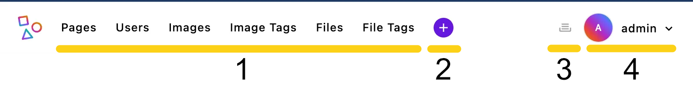

# Best Practices for Admin Bar Setup in ApostropheCMS

## Why This Matters & Core Principles

The admin bar is the primary navigation tool content managers use daily. A thoughtfully configured admin bar reduces friction in content workflows, decreases training time, and increases overall satisfaction with the CMS. Remember: developers configure the site once, but content managers use it every day.

When configuring your admin bar, prioritize:
- **Content managers first**: Organize for their workflows, not technical structure
- **Consistency**: Maintain predictable patterns aligned with core ApostropheCMS experiences
- **Clarity**: Use clear labels and intuitive groupings
- **Efficiency**: Minimize clicks needed to accomplish common tasks

<!-- VIDEO: Admin Bar Overview Tutorial -->

## Understanding the Admin Bar Components



The ApostropheCMS admin bar consists of four key components:
1.  **Main menu items**: Primary navigation links in the left section
    * Pages menu (always present and always appears first - cannot be grouped or reordered)
    * Piece-type modules (each registered piece type gets its own menu item by default)
2. **Quick create menu**: The "+" button providing shortcuts to create new content
3. **Utility context items**: Right-side icons for universal tools 
4. **User Dropdown**: Profile menu for log-out, account settings and personalization

Each component can be customized to better serve your editors' needs.

## Configuration Best Practices

### Logical Grouping & Naming

**Groups are your primary tool for organizing admin bar items.** They allow you to categorize related functionality together, making navigation intuitive for content managers. Instead of having a flat list of menu items, groups create logical sections that mirror your editors' workflows.

> [!NOTE]
> The `@apostrophecms/page` menu item always appears first in the admin bar and cannot be grouped or reordered. All other menu items can be organized using groups.

Configure your admin bar to group related functionality together - for example: content creation tools, media organization, user management, etc. This reduces cognitive load and helps editors find what they need quickly.

**Using Clear, Action-Oriented Labels:**
Use clear, action-oriented labels and maintain consistent naming patterns across modules. Avoid technical jargon in menu labels visible to content managers.

**Using Translation Strings for Admin UI:**
For all user-facing text in the admin interface, we recommend to use translation strings rather than hard-coded English text. This ensures your CMS can be properly internationalized and maintains consistency. For a complete guide including schema field localization and advanced techniques, see [Localizing schema field labels](/guide/localization/static.html#localizing-schema-field-labels).

> [!IMPORTANT]
> For admin UI translations, [you must use a custom namespace prefix](/guide/localization/static.html#adding-and-using-localization-files) (like `myproject`). Never use the `apos` namespace for your custom strings, as this could conflict with existing or future core translations.

> [!WARNING]
> **Common pitfall**: Forgetting to set `browser: true` is the most common reason admin UI translations don't work. Without this setting, your translations are only available server-side (for Nunjucks templates) but not in the browser-based admin interface.

**Example Configuration:**
Here's how to organize several custom pieces that editors constantly use, with media-related content in a separate menu:

<AposCodeBlock>

``` javascript
export default {
  i18n: {
    myproject: {
      browser: true
    }
  },
  options: {
    groups: [
      {
        // Prioritize content creation - the most common task
        name: 'content',
        label: 'myproject:content', // User-friendly label
        items: [
          'article',
          'event',
          'collection'
        ]
      },
      {
        // Group media items together
        name: 'media',
        label: 'myproject:media', // Clear category label
        items: [
          '@apostrophecms/image',
          '@apostrophecms/image-tag',
          '@apostrophecms/file',
          '@apostrophecms/file-tag'
        ]
      }
    ]
  }
};
```
  <template v-slot:caption>
    modules/@apostrophecms/admin-bar/index.js
  </template>
</AposCodeBlock>

### Menu Priority and Organization

Most developers will find organizing their menus using `groups` to be sufficient. However, you can also add an `order` array for finer control.

<AposCodeBlock>

  ```javascript
  export default {
    options: {
      // Items appear in the exact order specified here
      order: ['event', 'article', '@apostrophecms/image']
    }
  };
  ```
  <template v-slot:caption>
    modules/@apostrophecms/admin-bar/index.js
  </template>
</AposCodeBlock>

Additional positioning can be achieved using the `last` and `after` options of the [`@apostrophecms/admin-bar` module](https://github.com/apostrophecms/apostrophe/blob/42e2074f68d407fafac5106d4b02093da6d305e3/modules/%40apostrophecms/admin-bar/index.js#L166). You can read about this method in the [documentation reference section](/reference/modules/admin-bar.html#add-name-label-permission-options).

**How Grouped and Ungrouped Items Work Together:**

When mixing groups of items and ungrouped menu items, the system:
1. Positions all items first (based on `order` or module initialization order in the `app.js` file)
2. Then ensures grouped items stay together, with their position determined by their first item

<AposCodeBlock>

```javascript
// Group position is determined by its first item's position
export default {
  options: {
    // The content group will appear between image and file modules
    order: ['@apostrophecms/image', 'content-group-leader', '@apostrophecms/file'],
    groups: [
      {
        name: 'content',
        label: 'myproject:content',
        // These stay together and appear where content-group-leader is positioned
        items: ['content-group-leader', 'article', 'event']
      }
    ]
  }
};
```
  <template v-slot:caption>
    modules/@apostrophecms/admin-bar/index.js
  </template>
</AposCodeBlock>

> [!TIP]
> Place frequently-used items at the beginning of the admin bar for quick access.

## Managing the Quick Create Menu

The Quick Create menu (the "+" icon) should only contain frequently created content types. Remove items to streamline the experience:

<AposCodeBlock>

```javascript
export default {
  options: {
    // Prevent this content type from appearing in the quick create menu
    quickCreate: false
  }
};
```
  <template v-slot:caption>
    modules/article/index.js
  </template>
</AposCodeBlock>

**When to remove items:**
- Rarely created content types
- Specialized content for specific roles only (even if only selected roles can create a specific piece-type, the menu shouldn't be over-cluttered)
- When you have many piece types and need to reduce options
- Content types requiring careful setup that should use the full content manager

## Customizing the Context Utility Menu

Add custom utilities to the right side of the admin bar from the `init` method of any module:

```javascript
export default {
  init(self) {
    // Add item to the context utility menu (right side of admin bar)
    self.apos.adminBar.add(
      'custom-module:help', // Unique id
      'myproject:getSupport', // Label
      false,                 // Permissions (false = available to all)
      {
        contextUtility: true,  // This makes it appear in the right side
        icon: 'question-circle', // Icon to display (required)
      }
    );
  }
};
```
> [!NOTE]
> Custom actions or link navigation need to be added through browser-side scripting as shown in the [Adding External Link Buttons](/tutorials/adding-admin-bar-external-links.html#handling-the-button-click-event) tutorial.

> [!TIP]
> The `icon` property requires a registered icon name. See the [Icons documentation](/reference/module-api/module-overview.html#icons) for available icons and how to register custom ones.

**Best uses for context utilities:**
- Universal features needed from any context
- Support tools that should never be more than one click away
- Project-specific tools that don't fit the standard content workflow

## Customizing the User Dropdown Menu

### Adding Items to the Menu

You can add custom items to the user dropdown menu (where "Log Out" appears) using the `adminBar.add()` method with the `user: true` option:

<AposCodeBlock>

```javascript
export default {
  init(self) {
    // Add a custom item to the user menu
    self.apos.adminBar.add(
      'custom-module:user-dashboard',             // Unique identifier
      'myproject:userDashboard',    // Label
      false,                        // Permissions (false = available to all)
      {
        user: true,                 // Places this in the user menu
      }
    );
  }
};
```
  <template v-slot:caption>
    modules/my-custom-module/index.js
  </template>
</AposCodeBlock>

> [!NOTE]
> Items added to the user menu cannot be grouped further. When a user clicks this menu item, an event will be emitted on `apos.bus` with the name you provided (`custom-module:user-dashboard` in this example). You'll need to add a corresponding event handler in your frontend code to respond when the item is clicked.

### Modifying the User Preferences Menu

Give content managers control over their experience through customized preferences:

<AposCodeBlock>

```javascript
module.exports = {
  options: {
    subforms: {
      themePreference: {
        label: 'myproject:uiTheme',
        fields: ['theme'],
        reload: true // Refreshes the page when this setting changes
      },
      textSize: {
        label: 'myproject:textSize',
        fields: ['textScale'],
        reload: true // UI needs to refresh to apply new text size
      },
      notifications: {
        label: 'myproject:notifications',
        fields: ['notificationLevel']
      },
      adminLocale: {
        fields: ['adminLocale'] // Requires adminLocales in i18n module
      }
    },
    groups: {
      accessibility: {
        label: 'myproject:accessibility',
        subforms: ['themePreference', 'textSize']
      },
      preferences: {
        label: 'myproject:preferences',
        subforms: ['notifications', 'adminLocale']
      }
    }
  }
};
```
  <template v-slot:caption>
    modules/@apostrophecms/settings/index.js
  </template>
</AposCodeBlock>

> [!NOTE]
> You can read more about configuring this menu in the [main documentation](/reference/modules/settings.md). You must add any custom fields (like `theme`, `textScale`, and `notificationLevel`) to the `@apostrophecms/user` module schema. For language preferences, configure the [`adminLocales` option](/reference/modules/i18n.html#adminlocales) in the `@apostrophecms/i18n` module. The `reload: true` property is particularly useful for settings that need to take effect immediately, causing the page to refresh when the setting is changed.

## Controlling Menu Visibility

Hide modules from the admin bar to reduce clutter and focus attention:

**Why remove modules:**
- Creates a cleaner interface focused on what editors actually need
- Reduces cognitive load and training time
- Prevents confusion between similar content types
- Keeps specialized modules from cluttering navigation

Real-world example: If you have multiple tag types in your project (e.g., product tags, blog tags, event tags), you might consider:

* Placing them all in a single "Tags" group in the admin bar
* Removing them from the admin bar entirely if they're only used within relationship fields when editing other content (they can be created and edited from the relationship manager)
* Keeping only the most frequently edited tag types visible

This approach prevents your admin bar from becoming cluttered with rarely-accessed supporting content types while maintaining an efficient workflow for content editors.

**Implementation example:**
```javascript
// Correct implementation for removing a module from the admin bar
// in modules/article/index.js
export default {
  methods(self) {
    return {
      // Empty method prevents this module from appearing in the admin bar
      addToAdminBar() {
        return;
      }
    };
  }
};
```

> [!TIP]
> You can also customize the `addToAdminBar()` method to control exactly how a module appears in the admin bar, rather than just hiding it completely.

## Conclusion

A thoughtfully configured admin bar is fundamental to a positive content management experience. By focusing on content managers' actual workflows, and using consistent translation strings, you create an environment where they can work efficiently and confidently. Small UX improvements in frequently used interfaces like the admin bar can significantly impact overall satisfaction with your CMS implementation.

---

**Related Resources:**
- [ApostropheCMS 4.x Admin-bar Module Documentation](/reference/modules/admin-bar.md)
- [ApostropheCMS Settings Module Documentation](/reference/modules/settings.md)
- [How to Integrate a Support Desk into Admin Bar](/tutorials/adding-a-support-desk-button.html)
- [Adding a Custom Admin Bar Button](/tutorials/adding-admin-bar-external-links.html)
- [Admin-bar Customization in Our Tutorial Project](/tutorials/admin-ui.md)