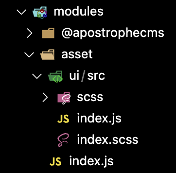
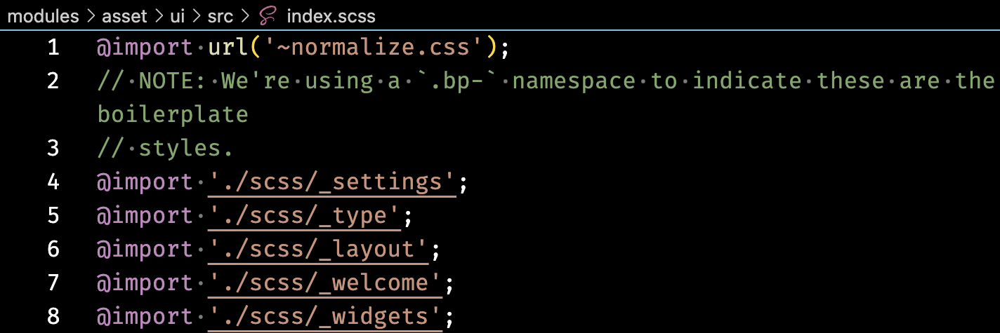
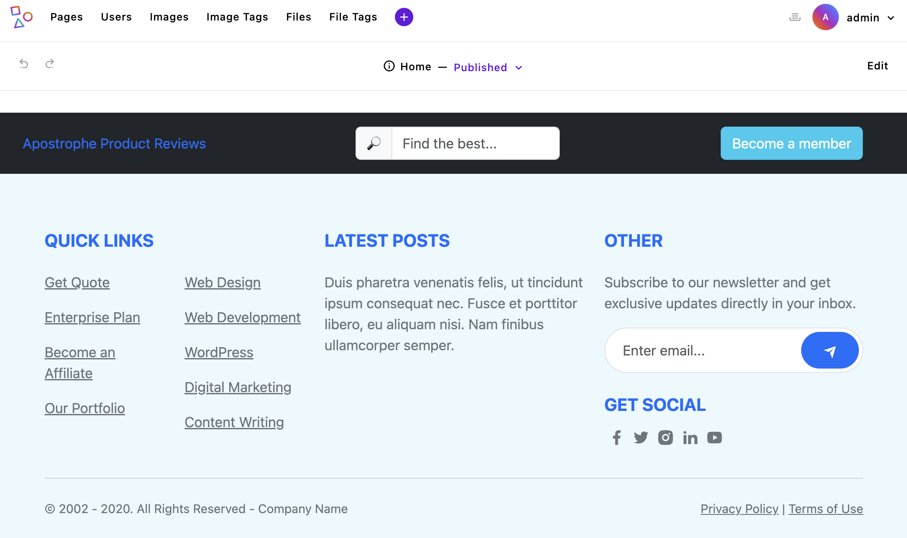
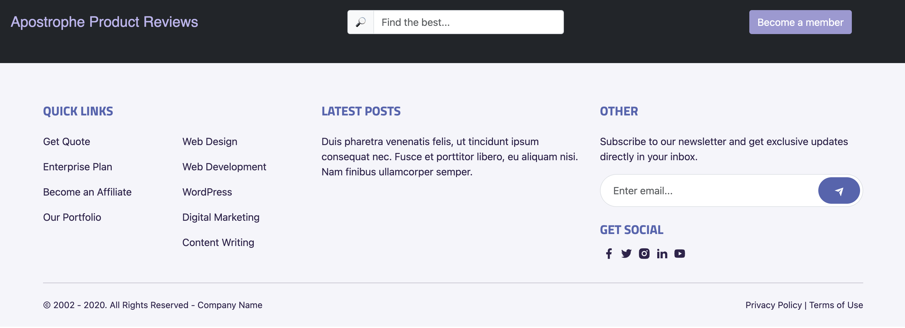

# Assets

In an Apostrophe project, you have multiple options for where to add assets. It is all dependent on how you feel most comfortable organizing your codebase. 

Apostrophe automatically provides a [webpack](https://webpack.js.org/)-powered process for bundling project frontend JavaScript and stylesheets. You can elect to use SCSS or CSS in your styling and Apostrophe will compile and bundle it for delivery to the front end. The webpack configuration can be altered to include additional file types, additional processing steps, or aid in codebase organization. You can also elect to use your own build process or opt resources out of the built-in build process.

In this tutorial, we are going to cover where assets can be added to your project. We will also look at how we can exempt files from being processed by webpack, plus how to extend webpack. Finally, we will touch on the topic of adding static assets, like logo images, where they can be accessed using relative URLs. You can copy the code from this tutorial into your project, or switch to the `sec2-3-assets` branch of the [repo](https://github.com/apostrophecms/apostrophe-onboarding-project). In this tutorial we will be installing the `Bootstrap` package, so you should run `npm update` after switching branches.

## The boilerplate `asset` folder



The boilerplate project has a `modules/asset` folder. This module extends the `@apostrophecms/module` and not the `@apostrophecms/asset` module - note that this folder is located in the top-level modules folder. This gives this module access to some core configuration settings and functions, as well as exposing it to the webpack build process. In a later tutorial, we will cover configuring the `@apostrophecms/uploadfs` module through the project-level `modules/@apostrophecms/asset` module. The `modules/asset` folder can be renamed if you are worried that the similarity in names will prove confusing or if you prefer that the core assets of your project be stored in a different folder. Please note that if you elect to change the name of the module you will also have to change the `app.js` file to register the new name.

We aren't going to alter the `index.js` file of this module, but it is worth opening it and taking a look to revisit a key customization function.

``` javascript
// modules/asset/index.js
module.exports = {
  handlers(self) {
    return {
      '@apostrophecms/page:beforeSend': {
        webpack(req) {
          req.data.isDev = (process.env.NODE_ENV !== 'production');
        }
      }
    };
  }
};
```

This module has a single [`handler(self)` configuration function](https://v3.docs.apostrophecms.org/reference/module-api/module-overview.html#handlers-self). Remember that handlers listen for Apostrophe modules, both core and custom, to emit a named signal. This handler listens for the `@apostrophecms/page` module to emit the `beforeSend` server event. This event is triggered just before a requested page is rendered and sent as a response. It is a good time in the request cycle to adjust the data available to the template by amending any information to the `data.req` object. In this case, the handler is checking the `NODE_ENV` environment variable. If it is set to `production` then the `isDev` property will be set to `false`. This will be available in the template as `data.isDev`. This can be useful for only outputting debugging info if the project is in development.

Our main interest in this module for this tutorial is the `ui/src` folder. Any number of modules can have this folder, and any JavaScript or styling assets put into this folder will be auto-discovered during the webpack build and added to the front-end asset bundles. The assets will be added to the bundle in the order that the modules are registered in the `app.js` file. This can be important for correct cascading of styles. It is also of note that if you have JavaScript in two different module `ui/src` folders that import the same dependencies, the Apostrophe webpack build is smart enough to only include that resource once.

In the boilerplate project, the `ui/src` folder contains two files, `index.js` and `index.scss`. Any front-end assets that need to be bundled either need to be added to these files, or imported by these files. We are going to start by modifying the `index.scss` file to bring our Bootstrap framework CSS into the project. Bootstrap can be installed as an npm package. Start by navigating to the root directory of your project and running `npm install bootstrap`.



Next, open up the `modules/asset/ui/src/index.scss` file. Inside are a series of import statements. The topmost one imports the popular `normalize.css` CSS resets file. The remainder of the import statements bring in starter kit-specific styling from the `scss` folder in the same directory. The Bootstrap project brings in its own CSS resets, so we can delete all the contents of this file. Add in Bootstrap using `@import 'bootstrap';`. This will bring the bootstrap CSS from the node package. All of our other styling will be imported before this so that any variables we add will be brought properly into the Bootstrap framework. At this point, you can delete the contents of the `scss` folder in this directory. We will begin adding back some custom styling next.

Although this project won't be using any Bootstrap components, only styling, we can also import the Bootstrap JavaScript. Open the `ui/src/index.js` file. You can elect to get rid of the `console.log('Hello World');` that is in the `export default()` function, but don't delete the function itself. At the top of the file, before the `export`, add in `const bootstrap = require('bootstrap');`. Your code linter may complain that you are creating a constant, but never using it. This is fine, the Apostrophe webpack will still import the bootstrap JavaScript and make it available on the front end for use.



If we spin our project up now using `npm run dev`, both the topbar and footer should look much more reasonably styled. We still need to start adding some specific styling to make it look like our final site, but Bootstrap is doing a lot of the heavy lifting for us.

I'm not going to explain the styling of this page in-depth as it is project-specific and not specific to Apostrophe. I'm going to create three files within the `modules/asset/ui/src/scss` folder. You can delete the files that are already in this folder, as we won't be using them. You can get the content of each of these files from the GitHub repo links. The [`_theme-settings.scss`](https://github.com/apostrophecms/apostrophe-onboarding-project/blob/main/modules/asset/ui/src/scss/_theme-settings.scss) file contains all the project-wide variables for brand colors and look. The [`_theme-main.scss`](https://github.com/apostrophecms/apostrophe-onboarding-project/blob/main/modules/asset/ui/src/scss/_theme-main.scss) file contains some project wide settings, like font-family and sizes for heading, plus it imports two fonts from Google fonts. Finally, the [`_theme-topbar.scss`](https://github.com/apostrophecms/apostrophe-onboarding-project/blob/main/modules/asset/ui/src/scss/_theme-topbar.scss) file contains styling specific to our header fragment topbar. To bring these stylesheets into our project, we also need to add them in our `index.scss` file.

<AposCodeBlock>

```scss
/*
Anything in this file will be compiled into the final CSS file.
Apostrophe automatically includes the index.scss file from any
module that has a ui/src directory.
*/

// Add theme SASS variables
@import './scss/_theme-settings';
// Add theme fonts and base styles
@import './scss/_theme-main';
// Add styling for theme components
@import './scss/_theme-topbar';

// Add theme framework styles
@import 'bootstrap';
```
  <template v-slot:caption>
    modules/asset/ui/src/index.scss
  </template>

</AposCodeBlock>



Now our topbar and footer look a lot more like our final project. Just to underscore, the file naming conventions that have been used for this project are a personal choice. All that you need to remember is that all of your stylesheets, however they are named, should be imported into the `index.scss` file of the `ui/src` folder for inclusion in the final front-end bundle.

## Static module assets
Within your project, you can store static assets - the ones hard-coded onto the page, not user-uploaded ones - in several different locations. Where you store them depends a bit on how those assets will be used. The first location is within the project-level `public` folder. Assets in this folder will be available within your templates via URL. For example, an image file placed into `public/images/logo.png` will be available at `https://my-project.com/images/logo.png`. Any assets shared this way will not trigger a cache reload if they are edited, so it should be used for assets that are very rarely updated, like a brand logo or favicons. A second potential drawback of this mechanism of adding assets is that relative links like `url("/images/logo.png")` will not work if the CSS and JS are being served from an S3 bucket or CDN which will no longer have the public folder in their directory structure.

To allow the use of relative URLs and to add cache busting, Apostrophe allows you to add static assets into a `public` folder placed into any module. We will use this method to add favicons to our project. Again, open the `modules/assets` folder and create a `public/favicon` folder. We will copy all of our `favicon` images from this same folder in the [`main` GitHub branch](https://github.com/apostrophecms/apostrophe-onboarding-project/tree/main/modules/asset/public/favicon) of the project. Now that we have the assets available, we need to add them to our pages. Since these favicons will be on every page of our website, we will add links into the `views/layout.html` file.

Opening this file, we will add the favicons in the head of our pages, following the `title`. The `@apostrophecms/template/outerLayoutBase.html` file offers two additional blocks in the `head` section. The `standardHead` block contains the `viewport` meta information. If we choose to add our favicons in this section we would need to use `super()` so that we don't lose this information. Instead, we can add it to the second block, `extraHead`. Opening the `views/layout.html` file we need to add the following code after the `title` block:

<AposCodeBlock>

``` nunjucks

<link rel="icon" sizes="16x16" href="{{ apos.asset.url('/modules/asset/favicon/favicon-16.png')}}">
<link rel="icon" sizes="32x32" href="{{ apos.asset.url('/modules/asset/favicon/favicon-32.png')}}">
<link rel="icon" sizes="96x96" href="{{ apos.asset.url('/modules/asset/favicon/favicon-96.png')}}">
<link rel="icon" sizes="180x180" href="{{ apos.asset.url('/modules/asset/favicon/favicon-180.png')}}">
<link rel="icon" sizes="512x512" href="{{ apos.asset.url('/modules/asset/favicon/favicon-512.png')}}">

```
  <template v-slot:caption>
    views/layout.html
  </template>

</AposCodeBlock>

We are adding favicons of 5 different sizes. To get the URL of each asset, we are using the `apos.asset.url()` helper. This will resolve to a relative URL pointing at the `modules/asset/favicon` folder within the `apos-frontend` release folder. We will come back to this folder later in the tutorial when we touch on customizing your project webpack build.

## Using a customized build process
You may choose to use a customized build process powered by another bundler, like [Gulp.js](https://gulpjs.com/). In this case, you can use the `modules/custom-module/ui/public` folder. Much like the `modules/custom-module/public` folder, files added to this folder will be brought into the corresponding JavaScript or CSS asset bundle that is added to the front end. The files in this folder will not be compiled or interpreted prior to adding to the asset bundle. Any files that depend on `import` or `require`, or stylesheets that need a preprocessor must be put through a build process before they are added into this folder.

## Modifying the webpack build configuration
There are cases where your project may use a different CSS pre-processor or need to use file types that the standard Apostrophe webpack process doesn't support. You can modify the configuration of the process through the top-level `webpack` property from any project module. There are three different properties that `webpack` accepts. For the moment, we will only cover `extensions`. You can read about [`extensionOptions`](https://v3.docs.apostrophecms.org/reference/modules/asset.html#extensionoptions) in the documentation, and we will cover the third, `bundles` in the tutorial on widgets.

The `extensions` property takes an object of named objects. Each of these named objects should be set to an object that will be merged into the existing webpack configuration. The structure of this configuration comes from the [webpack configuration specs](https://webpack.js.org/configuration/). For example:

```javascript
module.exports = {
  webpack: {
    extensions: {
      extensionName: {
        // webpack configuration
        resolve: {
          alias: {
            'Utilities': path.join(process.cwd(), 'lib/utils')
          }
        }
      }
    }
  }
};
```

This would create an alias that you could then use within files in the `modules/custom-module/ui/src/` folder.

```javascript
import { customMethod } from ('Uilities/methods.js');

export default () => {
  // Code utilizing customMethod()
};
```

Because the extensions are named, you can elect to override the extension of one module in another module by passing an extension of the same name. The webpack config will be merged with the extension that is loaded last. As you may have guessed, the [`extensionOptions`](https://v3.docs.apostrophecms.org/reference/modules/asset.html#extensionoptions) allows you to extend, rather than override a previously defined extension.

## Summary and next steps

In this tutorial, the focus was on handling assets in an Apostrophe project. Multiple choices were covered regarding where assets can be placed based on codebase organization preferences. You can either add your styling and code on a per-module basis or consolidate it in a single module. Special attention was given to the `ui/src` folder, the role of the `index.js` and `index.scss` files, and the addition of the Bootstrap framework to the project. The tutorial also explored managing static assets, detailing two methods: either through the project-level `public` folder or a `modules/custom-module/public` folder in any module. Advantages of adding at the module level were also discussed, including relative URLs and cache busting. This allowed us to include favicons in our project.

Additionally, the tutorial explained that Apostrophe, with its built-in webpack-powered process, can manage project frontend JavaScript and stylesheets, compiling and bundling them for frontend delivery. Tips on modifying the project's webpack configuration were also provided. The example in this tutorial illustrates how you could add an alias to further assist with project codebase organization. Of course, modifications to the webpack configuration for other JS and CSS processing are also possible.

Looking ahead, the next focus will be on widgets. These tools enable editors to add layout and content to page and piece areas. Several widgets will be created, ranging from a basic column layout widget to a more complex ratings widget. This will offer insights into adding icons to projects, provide a deeper understanding of field schema conditionals and template helper functions, and introduce async components.
