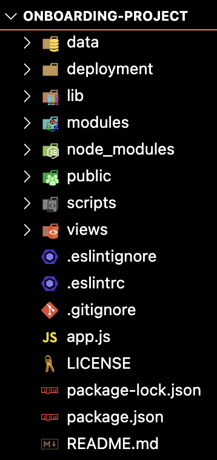
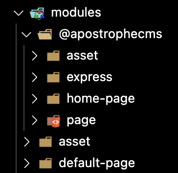
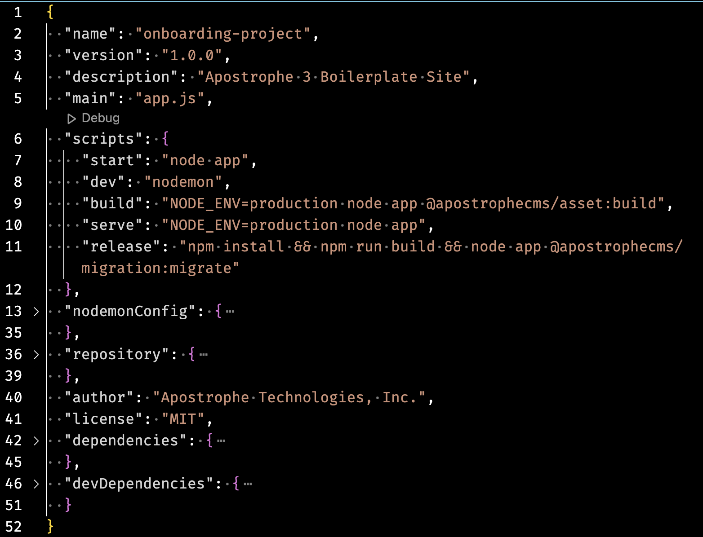

# Overview of Apostrophe code organization

<iframe src="https://www.youtube.com/embed/yd9HV5JNqLw?si=kCgnQ6cV4noHzJJV" title="YouTube video player" frameborder="0" allow="accelerometer; autoplay; clipboard-write; encrypted-media; gyroscope; picture-in-picture; web-share" referrerpolicy="strict-origin-when-cross-origin" allowfullscreen></iframe>

::: tip Howdy! 👋🏻
This video is available in textual and video forms. Watch the video and use this page to copy code into your project, or continue reading if you prefer. Of course, you can also do both!
:::

In this tutorial, we'll initialize our project with the Apostrophe Command Line Interface (CLI) tool. After creating our project we'll delve into its organization, focusing on the fundamental modules and files that comprise the Essentials starter kit project. We'll also revisit the concept of module inheritance, which was introduced in the first section. Lastly, we'll explore the application of `nestedModuleSubdirs` as an optional approach to reorganizing our project. While you will be creating this project locally using the CLI tool, you can also clone the [GitHub repo](https://github.com/apostrophecms/apostrophe-onboarding-project) and checkout branch `sec2-1b`.

## Creating our project

We're going to assume that you have already set your development environment up and installed the CLI tool. To create a new project, simply open your terminal (for Windows, make sure to open the terminal in WSL) and navigate to the location where you want to install your project. Then issue the command:

```sh
apos create onboarding-project --starter=essentials
```

You can give the project whatever name you desire in place of 'onboarding-project', just make sure that all projects using the same MongoDB instance have a unique name, as this will also be used as the database name where all of our project collections will be stored. With this command, we are specifying the `essentials` starter kit by using the optional `--starter` flag. If this flag is left off, the Essentials starter kit will be installed by default. You can explore our [website](https://apostrophecms.com/starter-kits) for additional starter kits.

The CLI tool will create a new folder with the name of the project containing a number of files and folders, including an `app.js` file with the name of the project added as the `shortName`, and a `package.json` file for installing all the project dependencies. Then it will perform a package install.

After installation is complete, it will issue a command line task to add a user with `admin` permissions and ask for a password.

```sh
node app @apostrophecms/user:add admin admin
```

This command is running the `add` task of the `@apostrophecms/user` module. Many of the core Apostrophe modules have tasks that you can run from the command line. You can use this same task to add users with permissions of 'editor', 'contributor', or 'guest', in addition to 'admin'.

```sh
node app @apostrophecms/user:add <user-name> <user-role>
```

## Essentials starter kit organization



### `app.js`
At the root level of your project is the `app.js` file. This file is used to register any modules that are being used in the project. It can also be used to initialize other services that should be started when the project spins up, for example, [site telemetry](/cookbook/opentelemetry.html). You can pass some configuration options, like class names for core widgets, but most options should be passed in the individual module files. At the top of the file there is a `shortname` property. Again, this determines the database name that will be used and should be unique within a MongoDB instance to avoid overwriting another project's content. If you use our CLI this shortname is automatically set to the name you pass as an argument to the `apos create` command. If you elect to clone a project from a repo, you will need to change this manually.

### `views`
Also at the root of your project is the `views` folder. This folder contains the main page layout file, `layout.html`, that you extend within your other page modules. We will get into the details of this in the ["Creating Pages"](/tutorials/pages.html) tutorial. This folder can also be used for project-wide template "fragments". We will be using fragments to construct both the header and footer sections of our page.

### `modules`
The modules folder is where you will add all of your project-specific modules. Within the `modules` folder, there are three additional folders in the essentials project.



The topmost of these is the `@apostrophecms` folder. Any modules in this folder will implicitly `improve` the core Apostrophe module of the same name. Any module which then uses `extend` with that core module will also have access to these improvements. We will come back to `improve` and `extend` later in this tutorial and you can read more in our [documentation section](/guide/module-configuration-patterns.html). From within your project, you can see what modules are part of core by navigating to the `node_modules/apostrophe/modules/@apostrophecms` folder. *Note*: there can be a `node_modules/@apostrophecms` folder. This is used for additional extensions (like the `@apostrophecms/blog` extension) added from your package manager, not for the core modules. As a rule, you should never touch anything in `node_modules`, unless your goal is to publish your own module to npm to share it with the world. Typically, your workflow in that circumstance would be to work on your module in a separate repository that is either symlinked or installed into the `node_modules` folder, rather than working on the code within your ApostropheCMS project.

Drilling down in the `@apostrophecms` folder we can see that there are four modules. We will cover the `home-page` and `page` module folders in the next tutorial. In the `express` folder, you should now set the session secret to a unique, random string. This is required by Express.js to sign the session ID cookie.

We will touch on the other two folders within `modules/`, `asset` and `default-page` in later tutorials.

### `package.json`


As with all Node.js apps, the `package.json` file plays a vital role in managing Apostrophe projects. It allows developers to define and control project dependencies, set up custom scripts for various tasks, and provide essential information about the project. In the case of the Apostrophe essentials starter kit, it sets up several useful scripts that we use to build and run our project. You will end up using `npm run dev` quite a bit during local development!

### `public`
The `public` folder can be used for static assets, although this isn't always the best solution because using cloud storage for other assets will break relative URLs and updating the asset won't cause a cache refresh. However, this folder is used by the Apostrophe default build process to store the various CSS and JS bundles.

### `data`
To decrease build time webpack creates a cache file that is stored within the data folder. When customizing the admin UI, this caching behavior can cause problems. If you find that elements aren't updating after code changes as expected you can try eliminating the `data` folder using `rm -rf data`. You can try eliminating the `apos-build` folder that is generated during the build step, as well. These folders will regenerate the next time you bring the project up.

### `lib`
The 'lib' folder is completely optional but typically contains code that is shared across different parts of the project or provides functionality that is not directly related to the main application logic. These files often consist of utility functions, helper classes, or custom modules that encapsulate reusable code. In the essentials project it contains a single file, `area.js`, that can be used for configuring page areas. We will revisit this in the ["Creating Pages"](/tutorials/pages.html) tutorial.

### `deployment` and `scripts`
The `deployment` and `scripts` folders house bash scripts that are primarily used internally by the Apostrophe team for the deployment of sites and cloning of the project's database for local development. In most cases, you are going to want to eliminate these folders and implement your own solutions, but they provide good examples of how to accomplish these tasks.

## Module basics

As introduced in the [Core Concepts](/guide/core-concepts.html#modules) section of the documentation, in Apostrophe each module is responsible for providing one feature, such as a type of widget, a type of customized page, or a service. All the modules use the same API. This means that they all have access to a number of core features.

### Creation

``` javascript
// modules/blog-post/index.js
module.exports = {
  // ...
}
```

The CLI tool provides an easy way to make piece, widget, and generic modules for your project.

``` sh
apos add widget article
```

The `add` command takes the type of module to be created (`piece`, `widget`, or `module`) and a name for the module. For a widget module, it will automatically add the correct ending. So for this example it would create a folder named `article-widget`. You can also pass an optional flag of `--page` when creating a `piece`. This will set up the folder and files for your views that we will be talking about in the [Creating Pieces](/tutorials/pieces.html) tutorial. When adding a `widget` you can pass the optional `--player` flag. This will create the folder and file structure for adding browser-side JavaScript to your widget that we will talk about in the [Creating Widgets](/tutorials/widgets.html) tutorial.

Making a new module from scratch is fairly easy. A basic module in Apostrophe consists of a folder that is named for the module being created, so `default-page`, or `column-widget`. Modules that create pages are typically appended with `-page` and those that create widgets with `-widget`. Within that folder, at minimum, there needs to be an `index.js` file that has a `module.exports` object. That object will contain code to configure and power the functionality of that module. As we will cover in additional tutorials, the module folder can also contain additional folders that can be used to deliver style sheets and JavaScript to the front end, create new Admin UI components, and more.

```javascript
// app.js
require('apostrophe')({
  shortname: 'onboarding-project',
  modules: {
    // ...
    'blog-post': {}
  }
})
```
In addition to adding this folder to your project `modules` folder, the new module must also be registered in the `app.js` file. To do this you just add a new property to the `modules` object, with the module name as a key and configuration object as value. For most modules, all the configuration takes place in the actual module, so an empty object is passed. Order is important here. Modules will be instantiated in the order they are added in the `modules` object. Assets included with each module will be bundled according to this order.

### Inheritance

```javascript
// modules/blog-post/index.js
module.exports = {
  extend: `@apostrophecms/piece-type`
  // ...
}
```

Module inheritance is an important concept in Apostrophe. Most of the modules in your project will `extend` a core Apostrophe module. For example, a module to create a new piece type will extend the `@apostrophecms/piece-type` module. Your custom piece module creates a new instance of the core module with a different name, inheriting all the methods and tasks of the original. You can also extend any custom module in your project. Just make sure that the new custom module is instantiated in the `app.js` file *after* the base module you are extending.


You might also have modules in your project that `improve` the core modules. Unlike extending a module, when you improve another module, you are not creating a module with a new name, but rather adding some functionality to the original. Any module that then extends the original will also have access to any improvements from the custom module. It is important to note that only modules installed into your project as packages, either through symlinking a local repo or installing from a package repository, can be improved.

### Configuration

```javascript
// modules/blog-post/index.js
module.exports = {
  extend: `@apostrophecms/piece-type`
  options: {
    alias: 'blog',
    label: 'Blog Article'
  }
  fields: {
    add: {
      blogTitle: {
        type: 'string',
        label: 'Enter your blog title'
      }
    },
    group: {
      blogFields: {
        label: 'Blog',
        fields: [ 'blogTitle' ]
      }
    }
  }
}
```

Depending on the type of module you can add a variety of `options` and `fields`. The `options` configuration object can allow you to set a label for your module that is shown to the editor or turn on localization. We will be covering these options as we dive into further tutorials.

The `fields` configuration option lets you add and group schema fields that determine what content an editor can add in your piece or page. In the ["Creating Pages"](/tutorials/pages.html) tutorial, we will begin to look at schema fields in more detail. In this code example, we are passing an object to the `fields` key, however this key can also take a function with `self` and `options` as arguments that returns the object. This is covered in our [documentation](/reference/module-api/module-overview.html#fields). This allows you to further customize what content can be added and will be covered further in the [Adding Extensions](/tutorials/adding-extensions.html) tutorial.

### Customization

Each module can take multiple initialization and configuration functions. We will just cover a couple of the most essential ones in this tutorial. Some of the other functions will be touched on during this tutorial series, but to see the full list take a look at the [documentation](/reference/module-api/module-overview.html).

### `async init(self)`

This function runs only once during application startup. You can access any options or methods that are defined in the module through `self`. You can also run functions that are defined in other modules using `self.apos.modules['abc'].function()` where `abc` is the name of the other module. Note that we can add an `alias` option to the `abc` module to shorten this to `self.apos.abc`.

### `methods(self)`

This adds methods that can be invoked within the module or from other modules. It returns an object of functions. We will be utilizing this in several areas of our on-boarding project.

### `components(self)`

You can use this function to power asynchronous template components. This allows for making async data requests at the time of template rendering. We will make use of it in our project to query the database for the most recently published review article.

### `handlers(self)`

This function allows you to listen for events emitted by core Apostrophe and custom modules and then trigger an action based on that event. For example, you could send an [outgoing webhook](/cookbook/creating-webhooks.html#outgoing-webhooks) anytime a new article is published.

## Next steps
In this tutorial, you learned a little more about the basics of Apostrophe code organization. We will apply this knowledge throughout the rest of this tutorial series. Next, we will begin constructing our review site homepage.