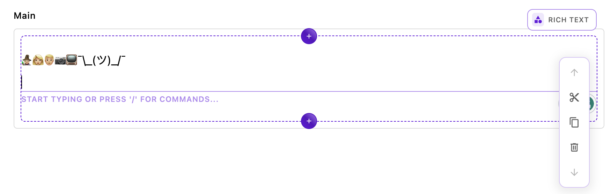

# The `@apostrophecms/smilies` extension


The `@apostrophecms/smilies` extension adds a host of text shortcuts for smilie and other emojis, plus my favorite non-emoji, `:ashrug ` (`¯\_(ツ)_/¯`). You can see the full list in the `modules/@apostrophecms/smilies/lib/replacementEmojis.js` file. This extension also takes a `tone` option passed in the `smiliesConfig` object in either the per-area or global rich-text-widget configuration. This option takes a number from 1-5 to provide a skin tone for modifiable emojis. Note that which emojis are modifiable varies based on operating system. See the [repository README](https://github.com/apostrophecms/rich-text-example-extensions/blob/main/README.md) for more detailed information.

The overall structure of the module is almost the same as the typography module that we covered in the [first tutorial](/tutorials/using-tiptap-extensions.html) so we will only briefly review the repetative files in this extension.

<AposCodeBlock>

```javascript
module.exports = {
  improve: '@apostrophecms/rich-text-widget',
  options: {
    smiliesConfig: {}
  },
  extendMethods(self) {
    return {
      // We need to extend this method so that our configuration data is available
      getBrowserData(_super, req) {
        const initialData = _super(req);
        const finalData = {
          ...initialData,
          aposSmiliesConfig: self.options.smiliesConfig
        }
        return finalData;
      }
    }
  }
};
```
  <template v-slot:caption>
    @apostrophcms/smilies/index.js
  </template>

</AposCodeBlock>

The `index.js` file improves the rich-text-widget and extends the `getBrowserData()` method. This allows us to pass global and per-area configuration to the widget through the `smiliesConfig` object.

<AposCodeBlock>

```javascript
import { Smilie } from '../../../lib/smilies.js';
export default (options) => {
  // gets options added in each area
  const perAreaConfig = options.smiliesConfig || {};
  // gets options added at project level to the widget `modules/@apostrophecms/rich-text-widget/index.js`
  const globalConfig = self.apos.modules['@apostrophecms/rich-text-widget'].aposSmiliesConfig || {};
  const configuration = Object.assign({}, globalConfig, perAreaConfig);
  // instantiates the extension with our options
  return Smilie.configure(configuration);
};
```
  <template v-slot:caption>
    @apostrophcms/smilies/ui/apos/tiptap-extensions/smilie.js
  </template>

</AposCodeBlock>

The first extension also had a `ui/apos/tiptap-extensions` folder containing the core code to instantiate the Tiptap extension. The `smilie.js` file collects the per-area and project-wide configuration options and instantiates the extension.

The biggest change here from the typography extension code is the presence of a `lib` folder with two files. Let's look more closely at these files.

### The `lib` folder
The `smilies/lib/extensions-smilies.js` file provides the code that extends the Tiptap functionality like the `@tiptap/extension-typography` files did for our first module.

<AposCodeBlock>

```javascript
// Extension adapted from the tiptap.dev site examples

// Import the functions we need from tiptap core
import { textInputRule, Extension } from '@tiptap/core';

// Import the list of emojis and regex for each
import replacementEmojis from './replacementEmojis';

const Smilie = Extension.create({
  name: 'smilie',
  addInputRules() {
    const inputRules = [];
    const tone = this.options.tone || 2;
    const convertedEmojis = changeTone(replacementEmojis, tone);
    for (let index = 0; index < convertedEmojis.length; index++) {
      inputRules[index] = textInputRule(convertedEmojis[index]);
    }
    return inputRules;
  },
});

function changeTone(replacementEmojis, tone) {
  return replacementEmojis.map(item => ({
    find: item.find,
    replace: changeSkinTone(item.replace, tone),
  }));
}

function changeSkinTone(emoji, tone) {
  const skinTones = [
    '\u{1F3FB}', // Light skin tone
    '\u{1F3FC}', // Medium-light skin tone
    '\u{1F3FD}', // Medium skin tone
    '\u{1F3FE}', // Medium-dark skin tone
    '\u{1F3FF}', // Dark skin tone
  ];

  const modifier = skinTones[tone - 1];

  // Split the emoji into its individual components
  const components = emoji.split(/(\p{Emoji}|\u{200D})/gu);

  // Modify the components that can have a skin tone modifier
  const modifiedComponents = components.map((component) => {
    if (/\p{Emoji_Modifier_Base}/u.test(component)) {
      // Replace existing modifier or add new one
      const replaced = component.replace(/[\u{1F3FB}-\u{1F3FF}]/gu, '');
      return replaced + modifier;
    }
    return component;
  });

  // Reassemble the modified components
  return modifiedComponents.join('');
}

export { Smilie, Smilie as default };
```

<template v-slot:caption>
  smilies/lib/extension-smilies.js
</template>

</AposCodeBlock>

Let's walk through the most relevant parts of this code.

```javascript
import { textInputRule, Extension } from '@tiptap/core';
```

We start by importing two key methods from the Tiptap core package. The `Extension` method is a foundational component that follows a factory pattern, providing an interface for creating objects without specifying the exact class of objects. It exposes a number of lifecycle methods and hooks that are then available for extending editor functionality.

::: details Some commonly used Tiptap methods and hooks
You can read more about these methods and hooks in the [Tiptap API documentation](https://tiptap.dev/api/introduction) and [ProseMirror reference documentation](https://prosemirror.net/docs/ref/).
1.  **`addInputRules()`**: Used to define input rules that automatically replace or format text as the user types. For example, you could create an input rule to automatically replace `:)` with an emoji smiley face. These rules are useful for adding simple, automated text transformations based on user input.

2.  **`onTransaction()`**: This hook gets called every time a new ProseMirror transaction occurs. It allows you to respond to changes in the editor's state. This will be used in the third extension.

3. **`addCommands()`**: This method allows you to define custom commands that you can later call via the editor's API. Commands are functions that perform actions like changing text, formatting, or even adding/removing nodes. This method is used in the third extension.

4. **`addExtensions()`**: Enables the addition of other extensions as dependencies. This means your extension can rely on features provided by other extensions.

5. **`addKeyboardShortcuts()`**: Enables the addition of keyboard shortcuts to execute specific commands or functionalities. You can define what should happen when a particular key or set of keys is pressed.

6. **`addNodeView()`**: Allows for the customization of how nodes (like paragraphs, headings, etc.) are rendered. This is especially useful if you want to add interactive components within the editor.

7. **`addPasteRules()`**: Defines how the editor should handle pasted content. This is particularly useful if you want to clean up or transform the content that a user pastes into the editor.

8. **`addAttributes()`**: Adds custom attributes to existing nodes or marks. This can be useful for adding data attributes, classes, or inline styles.

9.  **`onCreate()`** and **`onDestroy()`**: Lifecycle hooks that get called when the extension is created or destroyed, respectively. They can be useful for setting up and tearing down anything associated with your extension.
:::

In the Smilies extension, the `addInputRules()` method is used to dynamically create and add a series of `textInputRule` instances to an array.

<AposCodeBlock>

```javascript
const replacementEmojis = [
  { find: /:100 $/, replace: '💯'},
  { find: /:1234 $/, replace: '🔢'},
  { find: /:grinning $/, replace: '😀'},
  { find: /:smiley $/, replace: '😃'},
  ...
  { find: /:wales $/, replace: '🏴󠁧󠁢󠁷󠁬󠁳󠁿'},
  { find: /:ashrug $/, replace: '¯\\_(ツ)_/¯'}
];

export default replacementEmojis;
```
  <template v-slot:caption>
    smilies/lib/replacementEmojis.js
  </template>

</AposCodeBlock>

The `replacementEmojis.js` file in the `lib` folder contains each of those rules as an array of objects. Each object has two properties. The `find` property takes a regular expression pattern matching the characters that should be replaced within the editor as the user types. The `replace` property takes a string that contains the character(s) that should replace the matched string. Note that any special characters, like in the `replace` string need to be escaped.

```javascript
const Smilie = Extension.create({
  name: 'smilie',
  addInputRules() {
    const inputRules = [];
    const tone = this.options.tone || 2;
    const convertedEmojis = changeTone(replacementEmojis, tone);
    for (let index = 0; index < convertedEmojis.length; index++) {
      inputRules[index] = textInputRule(convertedEmojis[index]);
    }
    return inputRules;
  },
});
```
Going back to the `smilies/lib/extension-smilies.js` file, the `Smilie` variable is where all the main Tiptap magic occurs. First, we are using the `Extension.create()` method to instantiate our new extension. This isn't specific to just this extension - your own custom extensions would need to use this. We are passing an object to this method.

First up in this object, there is a `name` property. Adding a unique name allows you to refer to the extension in different editor instances, excluding it, or changing the configuration, for example.

Next, we are using the `addInputRules()` method of the `Extension()`. Again, this helper method is used to define input rules that automatically replace or format text as the user types. It needs to return an array of rules, as we defined in the `replacementEmojis.js` file. For each extension, Tiptap will call this method to compile an array of all the rules.

The remainder of this code uses the `tone` option passed when the extension is instantiated by the `smilies/ui/apos/tiptap-extensions/smilie.js`. A great improvement to this extension would be the addition of an additional UI element to change the emoji skin tone as it is added.

In conclusion, in this tutorial we created a basic text replacement extension that can be used as a template for your custom extensions. This could be as simple as changing out the `replacementEmojis.js` file with your own text strings, or using this extension as a foundation for more complex functionality. The flexibility of this setup allows for a wide range of creative applications, from adding custom emoji sets to implementing unique text transformation features. By leveraging and modifying the concepts presented here, you can create powerful and unique text editing experiences that cater to a diverse array of use cases.