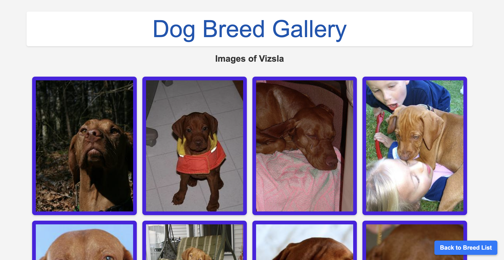

# Dynamic Routing with dispatch() and dispatchAll()

In many of our projects, accessing dynamic data from an API is a key requirement, whether it's a list of products or customer support tickets. In this tutorial, we will learn how to harness the power of built-in Apostrophe methods to create a dynamic module for fetching and displaying content. To add an element of fun, we'll use DaaS (dogs as a service) to fetch info about our beloved canine companions! Our goal is to develop a module where each dog breed is featured on its own page, dynamically generated and populated with data from an API. This means no manual data entry, just seamless integration and display of information about Fido, Milou, Hachiko, or your favorite canine.

One solution to this task might be to use pieces and the `@apostrophecms/piece-page-type` module. This module utilizes the `dispatch()` and `dispatchAll()` methods from the `@apostrophecms/page-type` module for rendering templates for all pieces (`index.html`) and individual pieces (`show.html`). While effective, this approach requires manual data entry, a time-consuming task, especially with extensive datasets like dog breed information.

In this tutorial, we'll introduce a more efficient method. We'll demonstrate how to fetch and cache data from an API, and then use the `dispatch()` and `dispatchAll()` methods in a custom module to dynamically present this content. This strategy not only conserves time but also ensures your site remains current with the latest data from the API. Let's get started! 🐕🌟🐾

::: info
As we dive into our tutorial, we are assuming that you have an existing ApostropheCMS project set up. If you're just starting and need to create a project, no worries! Simply follow the [instructions](/guide/development-setup.html#creating-a-project) provided in our documentation to get up and running with the ApostropheCMS CLI tool.
:::

## Creating the `index.js` file
Our first step will be to introduce a new page type into our project, specifically designed to showcase our dog API information. Inside the project `modules` folder create a `dog-page` folder with an `index.js` file inside. Edit that file to contain the following:

<AposCodeBlock>

```javascript
module.exports = {
  extend: '@apostrophecms/page-type',
  options: {
    label: 'Dogs Page'
  }
};
```
  <template v-slot:caption>
    modules/dog-page/index.js
  </template>

</AposCodeBlock>

This module also needs to be registered in your project `app.js` file and added to the `modules/@apostrophecms/page/index.js` in the `types` array of the `options`. Check out the [documentation page](/guide/pages.html#creating-a-page-type) for detailed instructions.

We are just going to construct a simple page for our tutorial, so we aren't going to add any additional fields to our page schema. Instead, we will be using a module customization function, `methods(self)`, to extend the page-type methods to fetch and cache our data, and then add our new routes.

### Fetching data from the API

To start, we will add a new method for fetching data from an endpoint passed in as an argument. We are also using the Apostrophe cache to store the data so that we don't have to repeatedly hit the API for data that we have already accessed.

<AposCodeBlock>

```javascript
...
methods(self) {
  return {
    // Generic method to fetch and cache data
    async fetchAndCacheData(apiUrl, cacheNamespace, cacheKey) {
      try {
        // Attempt to retrieve from cache
        let data = await self.apos.cache.get(cacheNamespace, cacheKey);
        if (!data) {
          // Fetch from API if not in cache
          const response = await fetch(apiUrl);
          data = await response.json();
          // Cache the data for 1 hour
          await self.apos.cache.set(cacheNamespace, cacheKey, data, 3600);
        }
        // We are returning the 'message' object, not the whole result
        return data.message;
      } catch (error) {
        console.error(`Error fetching data from ${apiUrl}:`, error);
        return {};
      }
    }
  }
}
```

  <template v-slot:caption>
    modules/dog-page/index.js
  </template>

</AposCodeBlock>

This method is relatively generic and could be used for most data APIs. It has a `try...catch` block to either return the API data or catch any errors. In the `try` block, we first attempt to set the value of the `data` variable to any cached data. The `@apostrophecms/cache` module [`get()` method](/reference/modules/cache.html#async-get-namespace-key) takes a cache namespace string as the first argument and returns any data in that namespace associated with the key string passed in the second argument.

In this case, if the data isn't cached, we fetch the data from the passed endpoint and then use the cache module [`set()` method](/reference/modules/cache.html#async-set-namespace-key-value-lifetime) to make it accessible if it is requested again. Note that we are setting that cache to expire after 3600 seconds (1 hour).

Finally, we are returning the `message` object from the response. This is specific to the [Dog API](https://dog.ceo/dog-api/documentation) that I'm using in this example, so this line might need to be altered when using other APIs.

::: info A Request
The API that we are using is being hosted by a kind individual at [dog.ceo](https://dog.ceo/). If you find this tutorial useful and have hit his endpoint repeatedly, we encourage you to check out his site and maybe buy him some dog treats to support his hosting costs.
:::

### Dynamic Routing with `dispatch()` and `dispatchAll()`
Now that we have set up our module and integrated a method for fetching and caching data from our dog breed API, it's time to explore the heart of dynamic routing in ApostropheCMS - the `dispatch()` and `dispatchAll()` methods. These methods allow you to create routes that respond dynamically to various URL patterns.

The [`dispatch(pattern, ...middleware, handler)` method](/reference/modules/page-type.html#dispatch-pattern-middleware-handler) provides a way to add Express-style routing for ApostropheCMS pages. The `pattern` argument is a string that can contain a mix of static and dynamic values, where dynamic values are preceded with a `:`. For example, in the pattern `/user/:userId`, `:userId` is a dynamic segment that will match any string in its place. When a URL matches the pattern, the dispatch function then passes the req to optional middleware and then the final handler. In an ApostropheCMS project, this handler often includes the `setTemplate()` helper method that selects which template will be rendered.

The `dispatchAll()` method is a utility for registering multiple `dispatch()` routes at once. This method is invoked during project startup within the `init` method of the `@apostrophecms/page-type` module. This allows for all of your dynamic routes to be ready as soon as your project is fully spun up.

Add the following to the methods section of your `dog-page` module `index.js` file.

<AposCodeBlock>

```javascript
dispatchAll() {
  // Route for all breeds
  self.dispatch('/', async (req) => {
    // API-specific endpoint for listing all breeds
    const apiUrl = 'https://dog.ceo/api/breeds/list/all';
    req.data.breeds = await self.fetchAndCacheData(
      apiUrl,
      'breedData',
      'all'
    );
    return self.setTemplate(req, 'breedList');
  });
  // Route for specific breeds and varieties
  self.dispatch('/:breed/:variety?', async (req) => {
    const { breed, variety } = req.params;

    // Build the API URL and cache key
    const apiUrl = variety
      ? `https://dog.ceo/api/breed/${breed}/${variety}/images`
      : `https://dog.ceo/api/breed/${breed}/images`;
    const cacheKey = variety ? `${breed}-${variety}` : breed;

    // Fetch and cache breed images
    req.data.images = await self.fetchAndCacheData(
      apiUrl,
      'breedData',
      cacheKey
    );
    req.data.breed = variety ? `${variety} ${breed}` : breed;
    return self.setTemplate(req, 'breedImages');
  });
}
```
  <template v-slot:caption>
    modules/dog-page/index.js
  </template>

</AposCodeBlock>

#### Fetching the breed list
The first `dispatch()` method has a pattern of `/`. This means that it will match the base slug for each page of this type. So, if your page has a slug of `dogs`, it will match, `https://mysite.com/dogs`. When a user makes a request to this page, this method will intercept the rquest and make a call to the `fetchAndCacheData()` method. It will pass the namespace `breedData` and the key `all` to check for cached data. The returned data will be added to the `req` object as `data.breed` for retrieval in our template. Finally, the modified `req` will be passed to the `setTemplate()` helper method to designate that the `breedList.html` template from the module `views` folder should be rendered in the browser.

#### Fetching the breed images
Looking at the [breed list returned by the API](https://dog.ceo/dog-api/documentation/), we can see that for some of the breeds, there are multiple varieties, while for others there is only a single. This means that we need to come up with a strategy to provide routes for both. The second `dispatch()` method has a more complicated pattern, `/:breed/:variety?` to deal with this situation. It will match the base slug for the page, plus at least one additional dynamic parameter that specifies the breed and an optional parameter for the variety as indicated by the appended question mark. So this pattern would match both `https://mysite.com/dogs/pug` and `https://mysite.com/dogs/bulldog/boston`.

An alternative to combining these two routes in one pattern is to create two separate `dispatch()` methods. The first would set the template based on breed and the second on variety.

```javascript
self.dispatch('/:breed', async req => { ... })
self.dispatch('/:breed/:variety', async req => { ... })
```
Separation of the routes makes sense when the handling of the dynamic parameters differs significantly.

The handler in this case is also a little more complicated in order to construct the correct endpoint for whether there is a variety included or not. The returned data is again added to the `req` object and then used to designate that the `breedImages.html` template should be rendered in the browser.

## Creating the template files
Now that we have set up our dispatch routes, we need to create the templates that will be used for each route. To keep the tutorial simple, we will only cover the parts of the templates that are specific to dealing with data returned by the dispatch callbacks. However, these templates also have some custom styling to create a lightbox for the images and allow the user to return to the list of all breeds.

### The `breedList.html` template
Create a `views` folder in your custom module and add a `breedList.html` file inside. This is the file that will display a list of all our breeds returned by the API. Add the following code:

<AposCodeBlock>

```nunjucks



  <h1>Dog Breeds</h1>
  <div class="divider"></div>
  <div class="breed-columns">
    
      <div class="breed-column">
        <h2>{{ breed | capitalize }}</h2>
        
          <ul>
            
              <li>
                <a href="{{ data.page._url }}/{{ breed }}/{{ variety }}">{{ variety | capitalize }} {{ breed | capitalize }}</a>
              </li>
            
          </ul>
        
          <a href="{{ data.page._url }}/{{ breed }}">{{ breed | capitalize }}</a>
        
      </div>
    
  </div>

```
  <template v-slot:caption>
    modules/dog-page/views/breedList.html
  </template>

</AposCodeBlock>

This template is a straightforward Nunjucks template. It retrieves the API data from the `data` object. For each breed, it creates a block of markup with either a single link if there is a single variety, or multiple links if there is more than one. We will use CSS to arrange these blocks of code into a responsive grid. The links themselves will create the pattern for our second `dispatch()` method, either `/:breed` or `/:breed/:variety`.

### The `breedImage.html` template
To display the breed images to the user we need a separate template that parses all of the image links passed back from the API. Create a `breedImage.html` file in the `views` folder of your module and add the following:

<AposCodeBlock>

```nunjucks



<h1>Dog Breed Gallery</h1>
<h2>Images of {{data.breed | capitalize}}</h2>
<div class="image-grid">
  
  <a href="#img{{ loop.index }}" class="image-container">
    
  </a>
  <div id="img{{ loop.index }}" class="lightbox">
    <div class="lightbox-content">
      <a href="#close" class="close">&times;</a>
        
        <p>Image {{ loop.index }}</p>
    </div>
  </div>
  
</div>
<a href="{{ data.page._url }}" role="button" class="back-to-list-button">Back to Breed List</a>

```
  <template v-slot:caption>
    modules/dog-page/views/breedImages.html
  </template>

</AposCodeBlock>

Again, this is a straightforward Nunjucks template. We are using a loop to display each of the images sent back from the API. To allow for lightbox functionality when the user clicks an image, we have enclosed each in a link with a `href` created from the `loop.index`. We have also created a div with an `id` constructed from this same index.

Finally, since clicking on an image to open a lightbox will alter the browser history and the functionality of the back button, we are providing a button to go back to the breed list. Individual breed pages, like `/dogs/pug`, aren't stored in the database but are dynamically generated. As such, navigating to one of these breed-specific pages is still technically a request for the parent `/dogs` page, so the URL for the breed list page will be contained in `data.page._url`.

### Adding styling
The only thing left to do on this project is to add a bit of styling. There are a number of locations in your ApostropheCMS project where you can add styling. If you prefer to keep your styling all in one place you can add it to a folder like `modules/asset/ui/src` or you can add it to a similar location on a per-module level. We are going to do the later, so create a `modules/dog-page/ui/src/index.scss` file. In general, I prefer to add my styling into individual files within a `scss` folder and then import them through the `index.scss` file. In this case, we will take the simple route of adding the styling directly to the index. Add the following code:

<AposCodeBlock>

```scss
// General styles
main {
  max-width: unset;
  width: 90%;
}
a[name="main"] {
  display: none;
}
body {
  font-family: Arial, sans-serif;
  margin: 0;
  padding: 20px;
  background-color: #f4f4f4;
  color: #333;
}
h1 {
  text-align: center;
  margin-bottom: 20px;
  color: #0056b3;
  background-color: #fff;
  padding: 10px;
  border-radius: 5px;
  box-shadow: 0 2px 4px rgba(0,0,0,0.1);
}
a {
  display: block;
  padding: 10px;
  background-color: #4b21e3;
  border-radius: 5px;
  text-decoration: none;
  color: #fff;
  font-weight: bold;
  text-align: center;
  transition: background-color 0.3s ease;

  &:hover {
    background-color: #0275d8;
  }
}

// Styling for the breed list page
.divider {
  border-top: 5px solid #0056b3;
  margin: 20px 0;
}
.breed-columns {
  display: flex;
  flex-wrap: wrap;
  justify-content: center;
}
.breed-column {
  flex-basis: calc(33% - 50px);
  margin: 10px;
  background-color: #fff;
  border-radius: 8px;
  box-shadow: 0 2px 4px rgba(0,0,0,0.1);
  padding: 15px;

  > h2 {
    justify-content: left;
  }

  & a:visited {
    color: #fff;
  }
}
@media screen and (max-width: 880px) {
  .breed-column {
      flex-basis: calc(50% - 50px);
  }
}
@media screen and (max-width: 480px) {
  .breed-column {
      flex-basis: 100%;
  }
}
ul {
  list-style-type: none;
  padding: 0;
}
li {
  margin-bottom: 10px;
}

// Styling for the breed pages
.image-grid {
  display: grid;
  grid-template-columns: repeat(auto-fill, minmax(250px, 1fr));
  gap: 15px;
  padding: 15px;
}
.image-container {
  overflow: hidden;
  border-radius: 8px;
  box-shadow: 0 2px 5px rgba(0, 0, 0, 0.2);
  img {
    width: 100%;
    height: 100%;
    object-fit: cover; // This ensures images cover the area without distortion
    transition: transform 0.3s ease;

    &:hover {
        transform: scale(1.05);
    }
  }
}

/* Lightbox styles */
.lightbox {
  display: none;
  position: fixed;
  z-index: 1000;
  left: 0;
  top: 0;
  width: 100%;
  height: 100%;
  background-color: rgba(0, 0, 0, 0.8);
  align-items: center;
  justify-content: center;
}
.lightbox:target {
  display: flex;
}
.lightbox-content {
  position: relative;
  max-width: 80%;
  max-height: 80%;
  margin: auto;
  padding: 10px;
  background: white;
  border-radius: 8px;
  box-shadow: 0 4px 8px rgba(0, 0, 0, 0.2);
}

.lightbox-content img {
  max-width: 100%;
  max-height: 100%;
  display: block;
  margin: auto;
}
.close {
  position: absolute;
  top: 10px;
  right: 15px;
  text-decoration: none;
  font-size: 30px;
  color: black;
}

/* Back to list button */
.back-to-list-button, .back-to-list-button:visited {
  position: fixed; /* Fixed position relative to the viewport */
  bottom: 20px; /* 20px from the bottom */
  right: 20px; /* 20px from the right */
  background-color: #007bff; /* Background color */
  color: white; /* Text color */
  padding: 10px 15px; /* Padding around the text */
  text-decoration: none; /* Remove underline from link */
  border-radius: 5px; /* Rounded corners */
  font-size: 16px; /* Font size */
  z-index: 1100; /* Ensure it's above other elements */
  box-shadow: 0 2px 5px rgba(0, 0, 0, 0.3); /* Shadow for a "floating" effect */
  transition: background-color 0.3s; /* Transition for hover effect */

  &:hover {
    background-color: #0056b3; /* Darker shade when hovered */
  }
}
```
  <template v-slot:caption>
    modules/dog-page/ui/src/index.scss
  </template>

</AposCodeBlock>

Congratulations on reaching the end of this tutorial! We've covered a lot of ground, delving into dynamic routing in ApostropheCMS using the `dispatch()` and `dispatchAll()` methods. By now, you should have a good understanding of how to create dynamic modules for fetching and displaying content from an API. It's worth noting that `dispatch()`
 is versatile and not limited to API use cases. You can also use it for dynamically serving content from local files, perfect for static datasets, mock data during development, or offline functionality.

We hope you found this tutorial enlightening and enjoyable. Happy coding, and may your projects be as dynamic and lively as the dog breeds we explored! 🎉🐕🌐