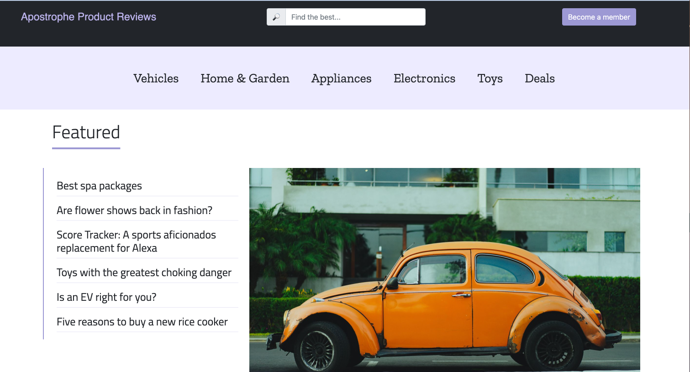
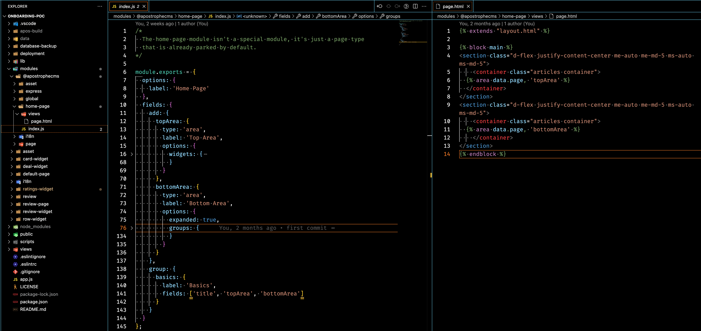
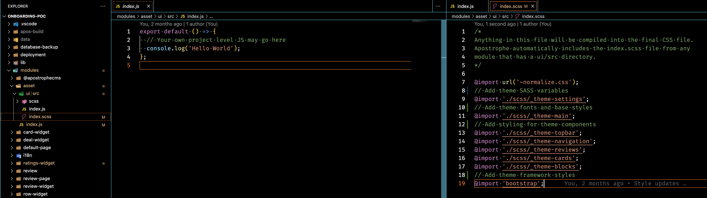
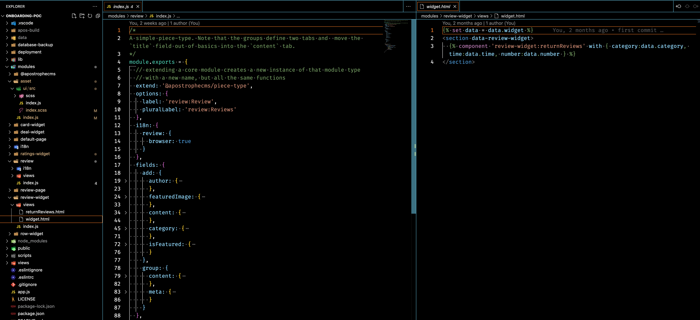
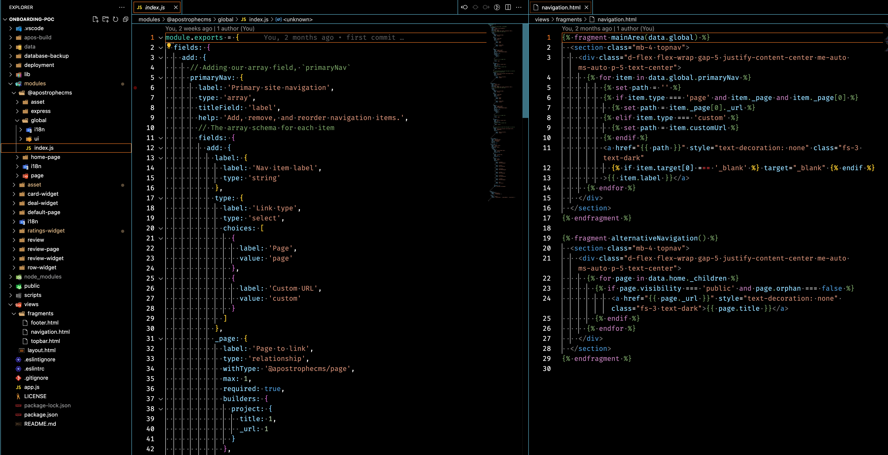
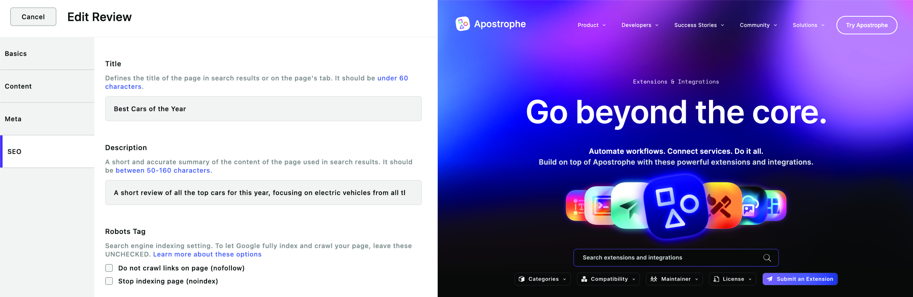

# Welcome to our ApostropheCMS Web Development Series

We're thrilled to guide you on this explorative journey through the ApostropheCMS ecosystem. Our goal with this series of tutorials is to provide a robust foundation to comprehend and harness the power of ApostropheCMS effectively.

Throughout this tutorial, we will incrementally construct a sample website using the Apostrophe 3 (A3) Essentials starter kit. This website will be similar to the [Consumer Reports](https://www.consumerreports.org/) site and provide a wealth of opportunities to learn about the essential elements of ApostropheCMS pages, pieces, templates, and components. Please note that this project is designed as a learning tool, rather than a ready-to-use template for your individual projects.

We have structured this project into distinct sections, each focusing on a specific building block of ApostropheCMS. These sections are interdependent, often expanding or refining the code from the preceding ones. However, the code from each tutorial can act as the basis for custom modules in your own project and be used as practical examples alongside our guide and reference material.

To help guide you along your development journey, the finalized code for this project can be found on the `main` branch of our [GitHub project repository](https://github.com/apostrophecms/a3-onboarding-project). The repository also includes a database with sample content and images. You'll find the repo is organized into branches that correspond to specific tutorials. For a smoother experience and additional details on how to use the project repository, take a look at the [README](https://github.com/apostrophecms/a3-onboarding-project#readme) file. While you can certainly refer to the completed code, we encourage you to try building the project yourself for a valuable learning experience.

## **Summary of what we are covering per section**

### Code Overview

Before digging into custom code creation, we are going to spin up a new project using the Essentials starter kit and take a look at code organization in Apostrophe. We'll examine how core modules are improved and organized, but also how to organize project-specific modules and extend the core modules in your custom code. This section will also touch briefly on some of the initialization and customization functions that are available to us to help build a custom web experience.

### Pages

Our journey begins with a key component of any website, pages. As we start building our product review site, we'll develop a landing page, category-specific pages, and individual product pages. One of the standout features of ApostropheCMS is its ability to programmatically generate a multitude of sub-pages from a single template. This means you can focus on crafting one exemplary template, and ApostropheCMS will do the heavy lifting of creating numerous sub-pages, eliminating the need to write additional code for each page.

Now, let's delve into the specific topics from the ApostropheCMS documentation that we'll be addressing in this section:

- **Introduction to the Module Schema:** We'll start with an overview of schema fields. [Schemas](/guide/core-concepts.html#schemas) in Apostrophe are a powerful tool to structure your data, allowing you to specify the types of content your users can add or edit. 

- **Incorporating Areas and Built-in Widgets:** Next, we'll introduce you to 'areas', a flexible content container that can include various types of widgets. We will start by utilizing several of the widgets that come built-in with Apostrophe and understanding how we can pass them per-page options.

- **Mastering the Main Layout Template:** As we dive deeper, you'll get acquainted with the main layout template in ApostropheCMS, which provides the structure for your site's appearance. We will look at how we can add content and extend common areas, such as the page head and main body.

- **Per-Page Templates:** Moving further, you'll learn about per-page templates that allow for more customization and flexibility in managing the layout and content of individual pages.

- **Exploring Nunjucks Filters:** We'll introduce you to Nunjucks filters, a versatile tool to manipulate, sanitize, and display data on the front end. 

- **Understanding Localization:** Even though we'll take a deeper dive into localization later in the tutorial, we'll touch on it in this section. We'll discuss how to manage both static strings and dynamic content for multi-language support.

- **Getting Started with Fragments:** Last but not least, we'll cover fragments and the use of global settings, which can be used to populate commonly used elements like footers or headers across your website. 

As we journey through these topics, you'll gain a solid understanding of how ApostropheCMS handles pages, preparing you for more complex topics in the tutorials ahead.

## Adding project assets

Diving deeper into our journey with ApostropheCMS, we now arrive at a critical aspect of web development - incorporating CSS, font files and JavaScript assets. This process is crucial to both the look and functionality of your website, so it's essential to understand how ApostropheCMS version 3 manages these assets.

Let's unpack the specific topics we'll cover in this section:

- **Location of Asset Files:** First, we'll explain where to place your CSS and JavaScript files that will be used site-wide, or on a per-module basis. This is handy for adding site-wide styling, fonts, and analytics scripts.

- **Webpack Options:** We'll discuss how ApostropheCMS leverages Webpack, a powerful module bundler. We will also cover adding assets to your page that will not be processed by the normal Webpack build process.

- **Understanding the 'public' Folder and Relative URLs:** Finally, we'll delve into the role of the `public` folder and how it plays a part in the deployment of your website. We will touch on the topic of adding static assets, like logo images, and accessing these assets from your ApostropheCMS templates using relative URLs.

By the end of this section, you will be adept at handling CSS and JavaScript assets in the ApostropheCMS ecosystem.

## Crafting Widgets

As we continue to deepen our understanding of ApostropheCMS, our next venture is into the realm of widget creation. In this tutorial, we will breathe life into our website by developing several custom widgets that will revamp our page layouts and offer new avenues for content management.

Let's look at the exciting array of widgets we'll be creating:

- **Row Widget:** This handy widget will empower editors to insert rows with varying column structures on the page, adding a new layer of flexibility to your layout design.

- **Deal Widget:** This versatile widget will allow editors to insert links to special pages such as e-commerce pages or affiliate links, creating an opportunity to generate additional revenue and promote strategic partnerships.

- **Ratings Widget:** Last but not least, our ratings widget will let editors incorporate the overall ratings for a product from the review site, providing a quick, at-a-glance summary for your visitors. This widget will also allow readers to provide their own feedback and will introduce database manipulation.

Now, let's examine the specific topics from the ApostropheCMS documentation that we'll cover in this section:

- **Frontend and Backend Code in Modules:** We'll kick things off by outlining where to place the frontend and backend code within our modules, helping you maintain an organized codebase.

- **Using Attributes to Pass Data to JavaScript "Players":** We'll explore how you can pass data into JavaScript "players" using attributes. This technique is invaluable when you need to access server-side data within your client-side code.

- **Adding User Input to the Database:** We'll look at how you can listen for User submissions from front-end code using `apiRoutes()` and save those submissions to the database.

By the end of this tutorial, you'll have the skills to create a range of dynamic widgets, transforming your website into an interactive and engaging platform.

## Crafting Pieces

As we proceed with our ApostropheCMS journey, our next pit-stop is the creation of 'Pieces', flexible and powerful building blocks for content in ApostropheCMS. In this tutorial, we will create a 'review' piece that Editors can use to add their review articles. As covered in the [core concepts](/guide/core-concepts.html#pieces) section of our documentation, pieces are used for any content that can be potentially used in multiple places on a website, like blog articles. Our review piece will include an image attachment, a space to write the review, and a rating widget for input from both the content creators and the content consumers.

Once we've built our review piece, we will explore how to generate pages to display all or selected reviews, and learn how to feature chosen reviews on our home page using widgets and relationships.

Here's what we'll unpack from the ApostropheCMS documentation in this section:

- **Expanding Knowledge of the Content Field Schema:** We'll delve deeper into the content field schema. You'll learn about using the attachment field to allow users to upload files or images directly to your pieces.

- **Reusable Content with Pieces:** We will highlight the power of pieces in creating reusable content, allowing you to maintain consistency while saving time and effort in managing your site's content.

- **Understanding Show and Index.html Pages:** You'll learn about the role of `show.html` and `index.html` pages in rendering individual pieces and a directory of pieces, respectively.

- **Introduction to Pagination / Browsing a Directory of Pieces:** We'll explore how ApostropheCMS handles pagination, enabling users to conveniently browse through a directory of pieces.

- **Displaying Pieces with Widgets:** We will cover how to showcase the pieces you've created on your website with widgets, allowing for dynamically updating content across your site.

- **Using Relationships to Display Pieces:** We'll modify our footer to display links to specific reviews leveraging the `relationship` field, and further exploring the use of fragments.

By mastering the creation of pieces and their applications, you'll gain more control and flexibility in managing and displaying content on your website.

## Implementing Navigation

As we continue our ApostropheCMS journey, our next milestone is adding navigation to our site. In this tutorial, we'll explore various strategies for creating navigation and select one to implement on our pages. We'll delve into the data that's automatically available to templates, provide an introduction to the page tree concept, and revisit how to add data to the global module. Additionally, we'll touch on `array` and `relationship` schemas, and their application in creating dynamic navigation.

Here's a glimpse of the specific topics from the ApostropheCMS documentation we'll cover in this section:

- **Understanding 'Array' Schema and 'Relationship' Fields:** We'll delve into the `array` schema and `relationship` fields, both crucial tools in ApostropheCMS for managing collections of data. We'll discuss the various options available in the `array` schema and how `relationship` fields can be used to establish connections between pieces of content.

- **Data Available to Every Page:** We'll discuss the data variables that are available to all page templates in ApostropheCMS. These include:
  - `data.home`: This variable holds the home page document, allowing you to access its properties.
  - `data.home._children`: This gives you an array of the home page's immediate child pages, useful for creating top-level navigation.
  - `data.page._ancestors`: This array includes the current page's ancestor pages, useful for breadcrumbs and hierarchical navigation.
  - `data.page._children`: Similar to `data.home._children`, this variable gives you the current page's immediate child pages.

By mastering navigation, you'll empower users to explore your site with ease, improving their experience and engagement.

## Refining the Admin Bar

In the next leg of our ApostropheCMS journey, we'll focus on modifying the admin bar. The admin bar in ApostropheCMS serves as the primary interface for editors, enabling them to create new pieces and pages, manage media files, and handle user roles and permissions. Additionally, it offers access to global configuration settings, locale selection and the personal settings menu. One of its crucial functions is managing the document publication workflow, providing notifications to users with appropriate permissions about documents awaiting approval.

In this tutorial, our aim is to streamline the admin bar to enhance the process of adding content to pages. We'll also touch on the process of adding custom buttons to further customize your ApostropheCMS experience.

Let's delve into the specific topics we'll cover from the ApostropheCMS documentation:

- **Grouping Items:** We'll begin by organizing the admin bar items into logical groups. This can enhance usability and navigation, making it easier for editors to find the tools they need.

- **Adding to the Context Menu:** We'll explore how to add new items to the context menu, allowing you to customize the options available to your editors based on your specific project requirements.

- **Adding a Button:** We'll walk you through the process of adding a custom button to the admin bar and setting up listeners. This can be used to create dynamic responses to user actions, enhancing the interactivity of your CMS.

- **Customizing the Personal Settings Menu:** Finally, we will take a look at customizing the personal settings menu. This menu can be set-up to allow editors to change their password and language preferences. We will also look at how to add additional functionality to this menu.

By the end of this tutorial, you'll be adept at modifying the admin bar, tailoring it to best suit the needs of your editors.

## Adding Optional Extensions

In our continuing journey to unlock the full potential of ApostropheCMS, the next step involves incorporating optional extensions into our project. In this tutorial, we'll add two incredibly useful extensions — `SEO` and `Blog`. We will demonstrate the steps for integration, and we'll also dissect the structure of these extensions, shedding light on the `bundle` option. Gaining an understanding of this concept is useful for creating and publishing reusable modules that can be used for multiple projects.

Let's highlight the specific topics we'll unpack from the ApostropheCMS documentation in this tutorial:

- **Exploring the Extensions Section:** We'll kick off by introducing you to the extensions section of ApostropheCMS.com. This part of the site is a treasure trove of functionalities that can greatly enhance your project.

- **Understanding 'Bundle' and 'Bundles' Options:** We'll delve into the 'bundle' and 'bundles' options, which allow you to group related modules. Bundles make it easier to maintain, share, and reuse collections of modules across multiple projects.

- **Leveraging Module Options:** Lastly, we'll explore module options, which allow you to configure the behavior of your modules. Understanding these options is critical to building powerful, customized experiences with ApostropheCMS.

By the end of this tutorial, you'll be adept at incorporating and understanding the structure of extensions, taking another significant step in mastering ApostropheCMS.

## Next Steps
Having introduced you to the foundational building blocks of an ApostropheCMS project in this tutorial, we're primed to delve deeper into how to effectively organize your code. Understanding how to properly structure your code is essential for both the development process and for the ongoing management of your project. Additionally, it is important to understand how to configure and modify modules from the core Apostrophe package at project-level, and where code for your project-specific modules should be placed. In the upcoming tutorial, we will explore the recommended practices and structures for organizing code in ApostropheCMS. Let's get started!