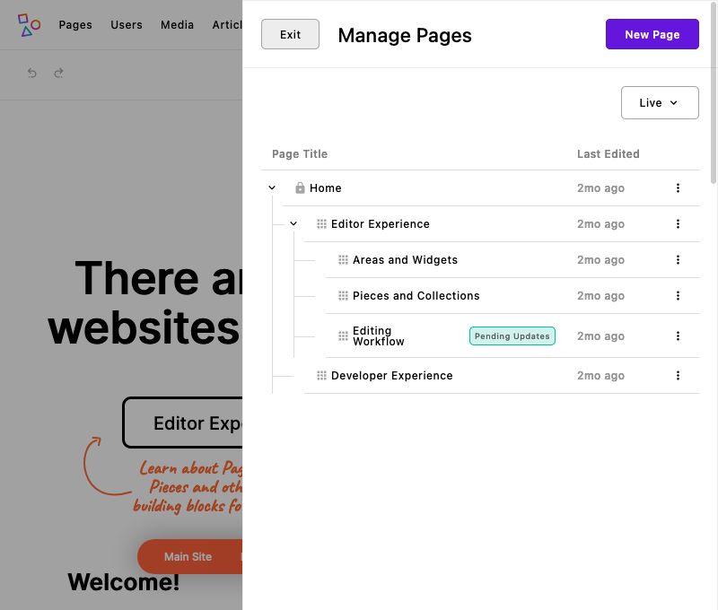
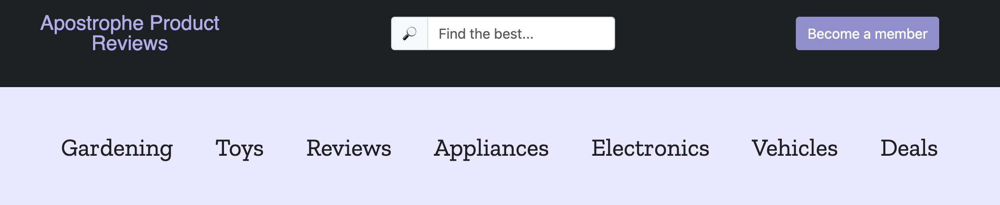
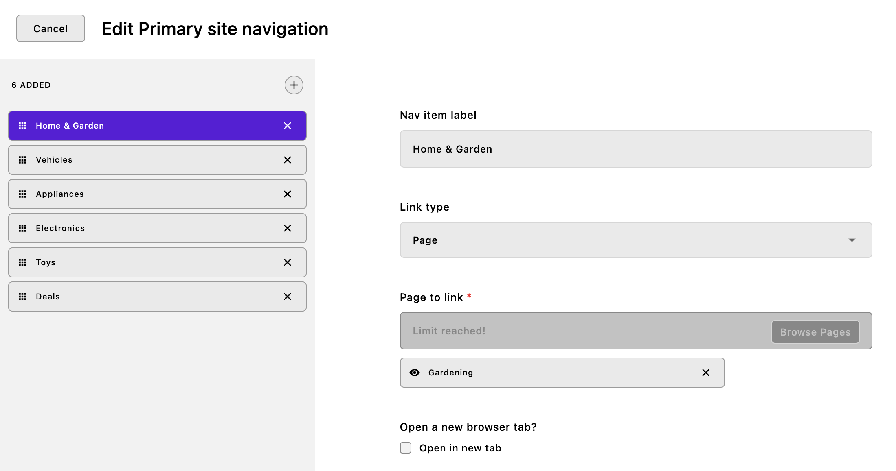
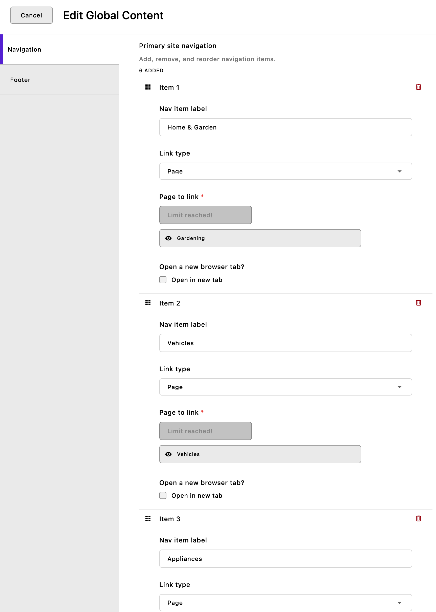
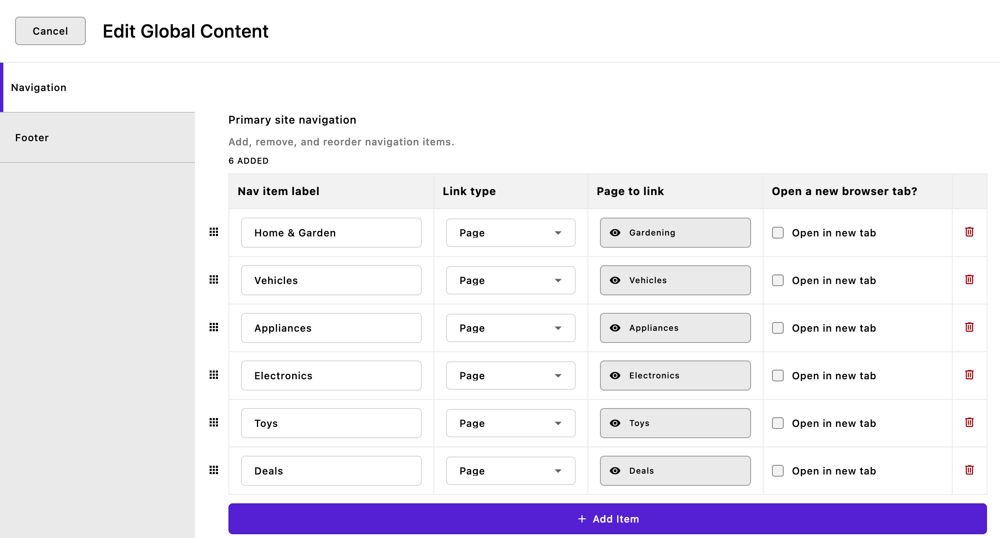

# Navigation

<iframe src="https://www.youtube.com/embed/kFPzdD2zLA0?si=8TSASkvNzwWi0mWA" title="YouTube video player" frameborder="0" allow="accelerometer; autoplay; clipboard-write; encrypted-media; gyroscope; picture-in-picture; web-share" referrerpolicy="strict-origin-when-cross-origin" allowfullscreen></iframe>

::: tip Howdy! 👋🏻
This tutorial is available in textual and video forms. Watch the video and use this page to copy code into your project, or continue reading if you prefer. Of course, you can also do both!
:::

Creating an intuitive and functional navigation system is a critical element in web design, and ApostropheCMS provides robust and flexible tools to achieve just this. In this tutorial, we will go through two methods for adding whole site navigation. The techniques we will be outlining can also be used for the creation of contextual navigation for the children of a page, for example. We will also take a shallow dive into generating breadcrumb navigation.

While we will be mainly focused on producing navigation for our project, we will also revisit changing our page layout using fragments, including multiple fragments in a single file, and utilizing the global configuration. Lastly, while covering the addition of breadcrumb navigation to our pages, we will also look at the `helper(self)` configuration function.

You can follow along by either editing the code of your project, or by switching to the `sec2-6-navigation` branch of the [GitHub repo](https://github.com/apostrophecms/apostrophe-onboarding-project).

## Generating site navigation from the page tree



Pages in ApostropheCMS operate within a hierarchical structure, a feature that provides organization and structure to your site. By default, when you add a new page, it is placed as a 'child' to the home page, forming a first-tier relationship in the hierarchy. If you create a new page while on an existing page, the new page becomes a 'child' of the current page, instead of the home page. This dynamic arrangement signifies the page's position within the tree structure. Furthermore, the placement of pages isn't fixed, as ApostropheCMS enables rearrangement via a simple drag-and-drop mechanism. Crucially, information about this hierarchical tree structure is incorporated into the `data` object, which is readily accessible to any template. This aspect can prove highly beneficial, especially when dealing with parent or ancestor pages in your site navigation.

| Data object | What is it? |
| ------ | ------ |
| `data.home` | Home page data. It is similar to the data on `data.page`, but always references the home page. |
| `data.home._children` | Page data for pages one level below the home page in the page tree. |
| `data.page._ancestors` | Page data for the ancestors of the active page, starting with the home page. |
| `data.page._children` | Page data for pages one level *below* the active page. |

By default, one level of children is available on each ancestor, as well as on the home page. This default behavior can be altered by adding `builders` to the `@apostrophecme/page` module at project-level.

``` javascript
module.exports = {
  options: {
    builders: {
      children: true,
      ancestors: {
        children: {
          depth: 2,
          areas: [ 'main', 'thumbnail' ],
          relationships: false
        }
      }
    }
  }
}
```
For example, this code would increase the number of levels of child documents returned from any ancestor to two. We are also passing in an array of allowed `areas`. In this case, we are allowing two areas, named `main` and `thumbnail`, to be included in the data object. Further, we are preventing any relationship field data. In this way, we are limiting the size and complexity of the `data` object to just what is needed.

So, the question is how can we utilize this data to build our navigation? It is actually can be as simple as including the Nunjucks template to extract and present the page information from the `data` object. Create a `views/fragments/navigation.html` file and add the following code:

<AposCodeBlock>

``` nunjucks

  <section class="mb-4 topnav">
    <div class="d-flex flex-wrap gap-5 justify-content-center me-auto ms-auto p-5 text-center">
      
        
            <a href="{{ page._url }}" style="text-decoration: none" class="fs-3 text-dark">{{ page.title }}</a>
        
      
    </div>
  </section>

```
  <template v-slot:caption>
    views/fragments/navigation.html
  </template>

</AposCodeBlock>

In this code we are accessing information about the children of the homepage using `data.home._children`. Using a `for...in` loop, we are parsing out each child document and creating a link using the computed URL `_url` and the page title. We are wrapping this in an `if` statement to make sure we are only displaying pages that have public, not private visibility.

Next, we need to add our new fragment to our `views/layout.html` file. Let's take a look at that file again.

<AposCodeBlock>

``` nunjucks
{# Automatically extends the right outer layout and also handles AJAX siutations #}







  {{ title }}
  
    {{ apos.log('Looks like you forgot to override the title block in a template that does not have access to an Apostrophe page or piece.') }}
  



<link rel="icon" sizes="16x16" href="{{ apos.asset.url('/modules/asset/favicon/favicon-16.png')}}">
<link rel="icon" sizes="32x32" href="{{ apos.asset.url('/modules/asset/favicon/favicon-32.png')}}">
<link rel="icon" sizes="96x96" href="{{ apos.asset.url('/modules/asset/favicon/favicon-96.png')}}">
<link rel="icon" sizes="180x180" href="{{ apos.asset.url('/modules/asset/favicon/favicon-180.png')}}">
<link rel="icon" sizes="512x512" href="{{ apos.asset.url('/modules/asset/favicon/favicon-512.png')}}">



  <header>
    
  </header>
  <main class="pr-main">



  </main>
  <footer>
    
  </footer>

```
  <template v-slot:caption>
    views/layout.html
  </template>

</AposCodeBlock>

At the beginning of the file, we indicate that we are extending the `data.outerLayout` template. This template exposes a number of blocks that we can either replace or extend using `_super()`. Next, we are importing our existing topbar and footer fragments. Just below these existing imports add the following import to the code:

``` nunjucks

```
Next, we need to render our navigation. Alter the `beforeMain` block to the following:

``` nunjucks

  <header>
    
    
  </header>
  <main class="pr-main">

```



With this one new line, we are adding the markup from the `pagetreeNavigation` fragment to our site just below the topbar. To match the appearance of the final project we will also need to add in additional CSS. The partial SCSS file, `_theme-navigation.scss` can be copied from the `modules/asset/ui/src/scss` folder of the sec2-6-navigation branch into a folder of the same name in your project. Additionally, import the styling by adding the following to the `modules/asset/ui/src/index.scss` file:

<AposCodeBlock>

``` scss
@import './scss/_theme-navigation';
```
  <template v-slot:caption>
    modules/asset/ui/src/index.scss
  </template>

</AposCodeBlock>

The appearance of your navigation will depend on how many pages you have added to your site. Right now, if you were to switch the localization of your site, unless you have already localized all of your review pages, your navigation would disappear. If you haven't localized them yet, while in edit mode on the homepage open the context menu (three horizontal dots) and select 'Localize...'. You will then get a modal asking what content you want to localize. If you select 'This document and related documents' it will localize all the review pages to the selected locale as drafts. You will then have to publish all the pages in the new locale. Since we are building our navigation from the page titles, you will need to translate the titles to match the new locale before publishing to have them added to the navigation in the correct language.

## Generating navigation manually

Another approach to generating your navigation that can be more flexible, but also requires more work for the content editors, is by providing schema fields for adding menu items. Since the navigation is appearing on all pages, we will create the additional fields in the `modules/@apostrophecms/global` module. If you prefer, you could instead create a stand-alone piece-type module to hold your navigation items. This would be created using the CLI by running `apos add piece navigation`, adding the new module to the `app.js` file, and then adding the code we are going to add to the global module.

### Adding the navigation schema

Open the `modules/@postrophecms/global/index.js` file and add the following to the `fields/add` object:

<AposCodeBlock>

``` javascript
// Adding our array field, `primaryNav`
primaryNav: {
  label: 'Primary site navigation',
  type: 'array',
  titleField: 'label',
  help: 'Add, remove, and reorder navigation items.',
  // The array schema for each item
  fields: {
    add: {
      label: {
        label: 'Nav item label',
        type: 'string'
      },
      type: {
        label: 'Link type',
        type: 'select',
        choices: [
          {
            label: 'Page',
            value: 'page'
          },
          {
            label: 'Custom URL',
            value: 'custom'
          }
        ]
      },
      _page: {
        label: 'Page to link',
        type: 'relationship',
        withType: '@apostrophecms/page',
        max: 1,
        required: true,
        builders: {
          project: {
            title: 1,
            _url: 1
          }
        },
        // Only if it's a page link
        if: {
          type: 'page'
        }
      },
      customUrl: {
        label: 'URL for custom link',
        type: 'url',
        required: true,
        // Only if it's a custom link
        if: {
          type: 'custom'
        }
      },
      // A nice option to have the link open in a new tab
      // Could use a boolean here
      target: {
        label: 'Open new browser tab?',
        type: 'checkboxes',
        choices: [
          {
            label: 'Open in new tab',
            value: '_blank'
          }
        ]
      }
    }
  }
},
```
  <template v-slot:caption>
    modules/@postrophecms/global/index.js
  </template>

</AposCodeBlock>

Additionally, add our new schema field to its own tab in the editor by adding the following code to the `group` object:

<AposCodeBlock>

``` javascript
navigation: {
  label: 'Navigation',
  fields: [ 'primaryNav' ]
}
```
  <template v-slot:caption>
    modules/@postrophecms/global/index.js
  </template>

</AposCodeBlock>



To add our navigation we are using an `array` type schema field. This field has its own field schema and allows the content editor to add one or more entries that contain all of those fields. It is stored in the database as an array of objects, one for each entry. The `fields` property should look fairly familiar and only has the `add` property to define all the schema fields for each array item. One new property here is the `titleField`. This property takes the name of a schema field in the array that should be used to name the individual arrays that are listed in the tabs to the left. The tabs themselves can be rearranged through drag-and-drop.



Adding the `inline: true` and `draggable: true` properties convert the UI presentation of the array to one more reminiscent of the page tree. Rather than displaying each array item in tabs on the left, they are displayed in a list with each of the schema fields visible. Much like the tabs and the page tree, individual arrays can be dragged to rearrange.



Finally, if we add the `style: 'table'` property in addition to the `inline: true` property then each array appears as a row in a table. Again, each of the individual arrays is draggable. This method of display isn't recommended if your arrays have conditional fields, as it will change the column labels if some arrays have a field while others do not. In this case, the `type` field conditionally impacts what schema field is added in the third column. Unless the content editor selects the same type for all the links, there will be cases where the label for the column won't match the type of input.

Drilling down into the schema fields of each array, we are allowing the user to either select an existing page through a `relationship` type field or to add a custom link through a `url` field. We are also allowing the content editor to alter the behavior of the link. We could also decide to programmatically add `target='_blank'` to the links only if they are a custom type.

### Adding the navigation markup

Once again, we are going to add our markup to the `views/fragments/navigation.html` file. Open this file and add the following to the end:

<AposCodeBlock>

``` nunjucks

  <section class="mb-4 topnav">
    <div class="d-flex flex-wrap gap-5 justify-content-center me-auto ms-auto p-5 text-center">
      
          
          
            
          
            
          
          <a href="{{ path }}" style="text-decoration: none" class="fs-3 text-dark"
             target="_blank" 
          >{{ item.label }}</a>
      
    </div>
  </section>

```
  <template v-slot:caption>
    views/fragments/navigation.html
  </template>

</AposCodeBlock>

To create our navigation, we are once again using a `for...in` loop to step through each of the array items added to the `data.global.primaryNav` schema field. The `data.global` object is available in all templates. For each array, we are using an `if...elif` conditional to test if it is a `page` or `custom` URL. For pages, we are also making sure that the review piece still exists and hasn't been archived. Remember that `relationship` field returns an array of objects, so we need to gather information from the first item in the array `_page[0]`. Lastly, we create our navigation loop using the path we just set, the string the content editor wants to use as a label, and an `if` conditional to add `target="_blank"`.

Finally, in order to display our new navigation, we need to add it to the `views/layout.html` file. Open the file and modify the `beforeMain` block:

<AposCodeBlock>

``` nunjucks

  <header>
    
    {#  #}
    
  </header>
  <main class="pr-main">

```
  <template v-slot:caption>
    views/layout.html
  </template>

</AposCodeBlock>

Here we have commented out the `pagetreeNavigation` fragment, but you can of course simply delete it. Now if we spin up our site, our former page tree navigation will be replaced by any links that you add through the global configuration schema.

## Creating breadcrumb navigation

Breadcrumb navigation shows visitors the series of pages from the page they are on back to the home page or other major landing page. To add breadcrumbs to our pages we will use a similar technique as we used for automatically constructing our navigation from the page tree. In that case, we were using `data.home._children`. In this case, we will use a different object, `data.page._ancestors`. This provides an array of page objects, starting with the home page, continuing through the page tree and ending with the parent of the current page.

The only caveat is if a visitor is on the [show page](https://docs.apostrophecms.org/guide/piece-pages.html#the-show-page-template) for a piece. In that case, the `data.page` object points at the index page for the piece, not the show page that the user is currently viewing. In this case, even though the individual review pieces don't have a page in the page tree, we can place them as children of the index page with a link. We can test if we are on a show page by checking if `data.piece` exists and change our markup output accordingly.

<AposCodeBlock>

  ``` nunjucks
  {# Use module helper to check environment variable #}
  
  {# Breadcrumb trail to the current page or piece. Not on the home page, only in devMode #}
  
    <nav class="breadcrumb">
      {# Loop over the ancestors. #}
      
        <a href="{{ page._url }}">{{ page.title }}</a> -> 
      
      
        {# We're rendering a show page. #}
        <a href="{{ data.page._url }}">{{ data.page.title }}</a> -> 
        <span>{{ data.piece.title }}</span>
      
        {# We're rendering a normal page. #}
        <span>{{ data.page.title }}</span>
      
    </nav>
  
  ```
  <template v-slot:caption>
    views/layout.html
  </template>

</AposCodeBlock>

This breadcrumb trail isn't part of the design of our final project but might be useful for debugging, or at least demonstrating how you can change your template using an environment variable! If you want to see the output of the markup, you can add this code into the `views/layout.html` page in either the `beforeMain` or `afterMain` blocks.

Ignoring the first line of code for now, we are wrapping our markup in an `if` conditional and testing for three things. First, we are performing null checking on the `data.page` object, even though it should be there. Next, we are checking whether that same object has a computed `_ancestors` property. The only pages that shouldn't are the home page or another top-level landing page. Finally, we are checking the value of the `debugMode` variable that we will revisit. If all of these are true, we output the markup.

Next, we set up a `for...in` loop over the `_ancestors` object, outputting a link for each with their URL and title, plus an arrow (`->`) separator. Finally, we use an `if...else` conditional to determine if we are in a piece. If so, we output a link to the index page for that piece, plus the title of the piece as the final breadcrumb. Otherwise, we just output the page title.

Returning to the `debugMode` variable. If we only want to display this markup if the user enters an environment variable at startup, we need to have a way to check on that variable. We can't do that directly in a Nunjucks template, but we can in our module JavaScript.

<AposCodeBlock>

``` javascript
helpers(self) {
  return {
    async debugMode() {
      return process.env.DEBUG === 'true';
    }
  };
}
```

<template v-slot:caption>
  modules/asset/index.js
</template>

</AposCodeBlock>

In order to pass our environmental variable to the template, we are going to use a `helper()` configuration method in our asset module. This method essentially adds helper functions to the Nunjucks templates. In this case, we are adding a simple function, `async debugMode()`, that doesn't take any arguments. You can see by the function declaration that you could leverage the 'await' keyword to pause execution until a Promise is resolved, ensuring sequential execution where necessary. In this case, we are simply checking the `DEBUG` environment value and passing a boolean to the template based on that value. In the first line of code in the template, `` we are calling the method. Since the template is located within the top-level `views` folder we need to use `apos.modules['asset']` to identify the module supplying the method. Let's reiterate, in this instance we're not passing any arguments from the template to the method. However, in your custom helpers, you might want to pass a value such as `data.piece.productPrice`. This could be useful, for instance, when calculating a sale price or regional taxes. Finally, we check that the returned value is `true`, indicating that the project was started with the `DEBUG` environment variable set to `true`. This results in the `debugMode` variable in our template being set to true, allowing the breadcrumb navigation to be rendered. To see your breadcrumbs start the site using `DEBUG=true npm run dev`.

## Adding quick links to the footer
In addition to primary navigation elements like breadcrumbs and menus, a website's footer serves as a secondary navigation area that's crucial for enhancing the user experience. One common feature is a section for 'Quick Links,' which provides easy access to important pages on your site or to external resources. Currently, our quick links section is populated with hard-coded links. To convert this to user selected links we are going to reuse code that we already added to the `modules/@apostrophecms/global/index.js` file. Open that file and add the following into the `add` object of the `property` below the `primaryNav` array field:

<AposCodeBlock>

``` javascript
quickLinks: {
  label: 'Quick links',
  type: 'array',
  titleField: 'label',
  help: 'Add, remove, and reorder navigation items.',
  // The array schema for each item
  fields: {
    add: {
      label: {
        label: 'Nav item label',
        type: 'string'
      },
      type: {
        label: 'Link type',
        type: 'select',
        choices: [
          {
            label: 'Page',
            value: 'page'
          },
          {
            label: 'Custom URL',
            value: 'custom'
          }
        ]
      },
      _page: {
        label: 'Page to link',
        type: 'relationship',
        withType: '@apostrophecms/page',
        max: 1,
        required: true,
        builders: {
          project: {
            title: 1,
            _url: 1
          }
        },
        // Only if it's a page link
        if: {
          type: 'page'
        }
      },
      customUrl: {
        label: 'URL for custom link',
        type: 'url',
        required: true,
        // Only if it's a custom link
        if: {
          type: 'custom'
        }
      },
      // A nice option to have the link open in a new tab
      target: {
        label: 'Will the link open a new browser tab?',
        type: 'checkboxes',
        choices: [
          {
            label: 'Open in new tab',
            value: '_blank'
          }
        ]
      }
    }
  }
},
```
  <template v-slot:caption>
    modules/@apostrophecms/global/index.js
  </template>

</AposCodeBlock>

This code almost completely duplicates the `primaryNav` field. In a real production site we would likely factor the fields for each array out into a separate file to be imported and added, rather than duplicating the code. Add the `quickLinks` to the `footer` tab of the groups:

<AposCodeBlock>

``` javascript
group: {
  navigation: {
    label: 'Navigation',
    fields: [ 'primaryNav' ]
  },
  footer: {
    label: 'Footer',
    fields: ['_featuredPost', 'quickLinks' ]
  }
}
```
  <template v-slot:caption>
    modules/@apostrophecms/global/index.js
  </template>

</AposCodeBlock>

### Modifying the `footer.html` fragment
To display our new `quickLinks`, we need to change the Nunjucks markup for the first column in the `div` with a class of `row`. Replace the entire first column (with classes of `col-lg-4` and `py-3`) with the following:

<AposCodeBlock>

``` nunjucks
<div class="col-lg-4 py-3">
  <h2 class="fw-bold h5 mb-4 text-primary text-uppercase">Quick Links</h2>
  <div class="row">
    <div class="col-sm-6">
      <ul class="list-unstyled">
        
          <li class="mb-3">
            
            
              
            
              
            
            <a href="{{ path }}" class="text-secondary"  target="_blank" >{{ item.label }}</a>
          </li>
        
        </ul>
    </div>
    <div class="col-sm-6">
      <ul class="list-unstyled">
        <li class="mb-3">
          <a href="#" class="text-secondary">Web Design</a>
        </li>
        <li class="mb-3">
          <a href="#" class="text-secondary">Web Development</a>
        </li>
        <li class="mb-3">
          <a href="#" class="text-secondary">WordPress</a>
        </li>
        <li class="mb-3">
          <a href="#" class="text-secondary">Digital Marketing</a>
        </li>
        <li class="mb-3">
          <a href="#" class="text-secondary">Content Writing</a>
        </li>
      </ul>
    </div>
  </div>
</div>
```
  <template v-slot:caption>
    views/fragments/footer.html
  </template>

</AposCodeBlock>

This will cause the first set of links in the quick links section to be replaced with the user's selection. It uses a `` loop to output each item as a list item. As with the `primaryNav` in the `views/fragments/navigation.html` that we added previously in this tutorial, we have some code to correctly set the link if it is a page or custom URL.

## Bonus: Adding social links to the footer
While the primary function of a website's footer is to assist with internal navigation, it can also serve as a bridge to external platforms, specifically social media channels. Including social media links in your footer is a strategic way to extend the user's journey beyond your website and encourage engagement on various social platforms. We will finish out this tutorial by quickly adding social media links using the font-awesome icon set we installed when creating the `rating-widget` module.

### Adding the schema fields
We will be adding our fields to select the social media links into the footer, so it makes sense to once again modify the `global` module. Open the `modules/@apostrophecms/global.index.js` file and add the following code to the `add` object of the `fields` property:

<AposCodeBlock>

``` javascript
socialLinks: {
  label: 'Social Links',
  type: 'array',
  titleField: 'label',
  fields: {
    add: {
      label: {
        label: 'Social Media Name',
        type: 'string',
        required: true
      },
      url: {
        label: 'Account URL',
        type: 'url',
        required: true
      },
      icon: {
        label: 'Icon',
        type: 'select',
        choices: [
          {
            label: 'Facebook',
            value: 'fab fa-facebook'
          },
          {
            label: 'Twitter',
            value: 'fab fa-twitter'
          },
          {
            label: 'Instagram',
            value: 'fab fa-instagram'
          },
          {
            label: 'YouTube',
            value: 'fab fa-youtube'
          },
          {
            label: 'Pinterest',
            value: 'fab fa-pinterest'
          },
          {
            label: 'LinkedIn',
            value: 'fab fa-linkedin'
          },
          {
            label: 'RSS',
            value: 'fas fa-rss'
          }
        ],
        required: true,
        def: 'fa-brands fa-facebook'
      }
    }
  }
}
```
  <template v-slot:caption>
    modules/@apostrophecms/global/index.js
  </template>

</AposCodeBlock>

First up we are asking for the name of the social media network. This isn't really needed for the end markup, the first field in an array will give it a name in the list of array items. Next, we are capturing the link address, and finally we are providing an icon through a `select` field. The values for each choice are the font-awesome classes for that social network.

Make sure to add your new array field to the footer tab.
<AposCodeBlock>

``` javascript
group: {
  navigation: {
    label: 'Navigation',
    fields: [ 'primaryNav' ]
  },
  footer: {
    label: 'Footer',
    fields: ['_featuredPost', 'quickLinks', 'socialLinks' ]
  }
}
```
  <template v-slot:caption>
    modules/@apostrophecms/global/index.js
  </template>

</AposCodeBlock>

### Adding social links to the footer markup
Open the `views/fragments/footer.html` file and replace the code for the third column with the following code:

<AposCodeBlock>

``` nunjucks
<div class="col-lg-4 py-3">
  <h2 class="fw-bold h5 mb-4 text-primary text-uppercase">Other</h2>
  <p class="mb-3">Subscribe to our newsletter and get exclusive updates directly in your inbox.</p>
  <form class="mb-4">
    <div class="bg-white border input-group overflow-hidden p-1 rounded-pill">
      <input
        type="email"
        class="border-0 form-control pe-3 ps-3"
        placeholder="Enter email..."
        aria-label="Recipient's email"
        aria-describedby="button-addon2"
        required>
        <button class="btn btn-primary pb-2 pe-4 ps-4 pt-2 rounded-pill" type="submit" id="button-addon2" aria-label="submit">
          <svg viewBox="0 0 24 24" fill="currentColor" class="d-inline-block" height="16" width="16">
            <path d="M1.946 9.315c-.522-.174-.527-.455.01-.634l19.087-6.362c.529-.176.832.12.684.638l-5.454
              19.086c-.15.529-.455.547-.679.045L12 14l6-8-8 6-8.054-2.685z"></path>
          </svg>
        </button>
      </div>
  </form>
  <h2 class="fw-bold h5 mb-2 text-primary text-uppercase">Get Social</h2>
  <div class="d-inline-flex flex-wrap">
      
        
        
          
        
        <a href="{{ path }}" class="p-1 text-secondary" aria-label="{{ account.label }}" target="_blank"><i class="{{ account.icon }}"></i></a>
      
  </div>
  <div class="pb-3 pt-3 small">
    <hr class="mt-0 ">
    <div class="align-items-center row">
      <div class="col-md pb-2 pt-2">
        <p class="mb-0">&copy; 2002 - 2020. All Rights Reserved - Company Name</p>
      </div>
      <div class="col-md-auto pb-2 pt-2">
        <a href="#" class="text-secondary">Privacy Policy</a>
        |
        <a href="#" class="text-secondary">Terms of Use</a>
      </div>
    </div>
</div>
```
  <template v-slot:caption>
    views/fragments/footer.html
  </template>

</AposCodeBlock>

We are only altering the portion of code in the div below the `Get Social` H2 tag. Once again, we are using a `` loop to step through our array elements. This time we are just outputing a link with the URL entered by the user surrounding a span with the icon class names.

## Summary and next steps

In this tutorial, we looked at two different methods for constructing page navigation. The first used the `data` object that Apostrophe makes accessible from every template. For the second we revisited how to use the `@apostrophecms/global` module configuration schema to make data available from any page. For both of these methods, we took advantage of fragments and the `views/layout.html` file to add the navigation to our page. Unlike when we added the topbar and footer fragments, we added multiple fragments to the same file.

Although we only touched on it briefly, we also looked at how to add breadcrumbs to pages. While we only used the `data` object to accomplish this, we could also have used the global configuration. We also added this markup directly into the layout, but we could have easily added it as a fragment in the `views/fragments/navigation.html` file. We also touched on how `helper(self)` configuration methods can manipulate and pass data for use in your templates.

Finally, we looked at how to make the links in our footer more dynamic by allowing the user to add new quick links and social media links through the global site configuration editor.

In the next tutorial, we are going to look at some ways that the admin UI can be altered, including a look at re-organizing the admin-bar and how to configure the Personal Settings menu.