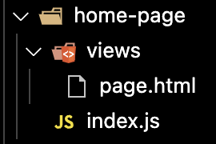
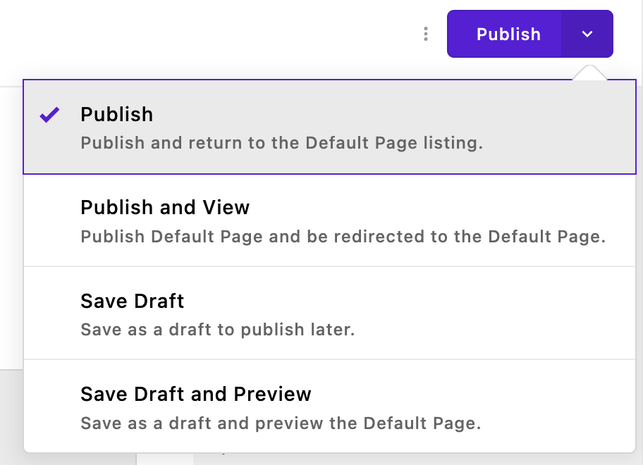
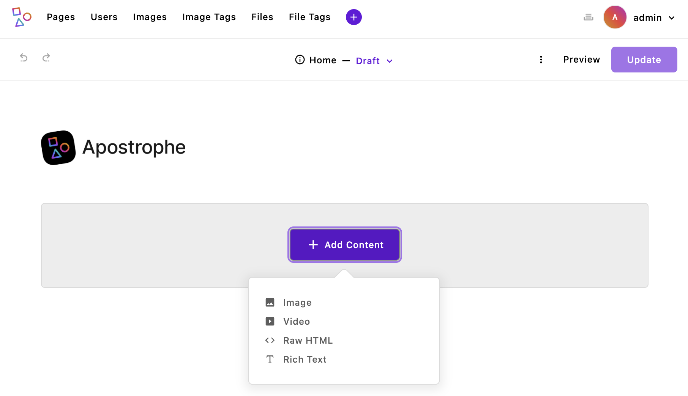
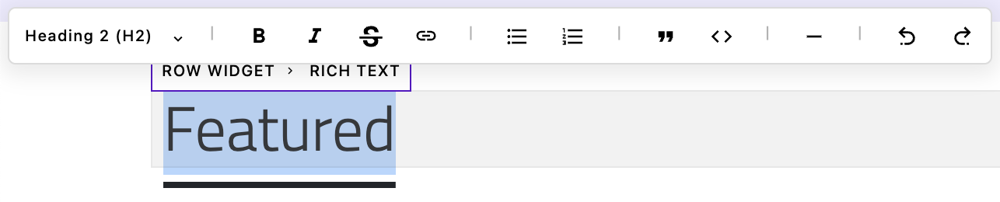
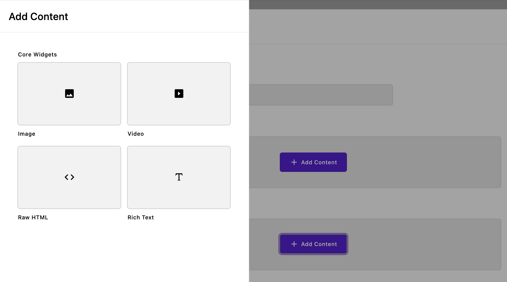
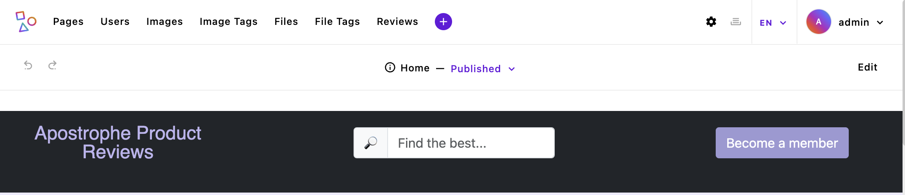
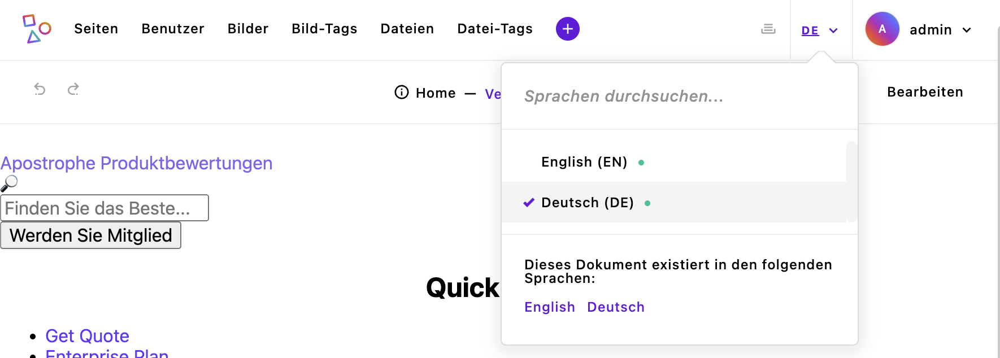

# Page Creation

In an Apostrophe project, pages provide a way to show static content, as well as dynamic content delivered by both widgets and pieces. The `@apostrophecms/page-type` module allows for the creation of page types. The selection of these page types by a user tells Apostrophe what template to use to render the page, what content types can be added to a page by the editor through the field schema, as well as what additional dynamic content should be added. You can have as many or as few page types as needed for your site. You can either elect to make code changes as you follow along with the tutorial, or you can switch to branch `sec2-2-page` of the [repo](https://github.com/apostrophecms/a3-onboarding-project).

While the focus of this tutorial is demonstrating how to add pages to your project, we will also be diving a little deeper into some key concepts. These concepts apply universally in Apostrophe projects. As a result, this tutorial won't be code-heavy but is crucial in fully understanding how to develop with Apostrophe.

## Getting Started
In our project, we are first going to create our home page by modifying the Essentials starter kit home page. At this point, you should already have created a new project using the Apostrophe CLI tool as outlined in the last tutorial. As a reminder, if you have the CLI tool installed, navigate in your terminal to the directory where you want to create your new project. Then issue the command:

`apos create onboarding-project --starter=essentials`

This will create a new directory named `onboarding-project` and clone the files from the `starter-kit-essentials` repo. It will also run `npm install`, add your project name to the `package.json` file, and register a new user with the username `admin` and the password of your choice.

## Adding a page module


The A3 Essentials starter kit already has a `home-page` module that we will modify for our purposes, but creating a new page from scratch is easy. It is essentially a two-step process. First, you create a folder in the `modules` folder. This folder is conventionally given a suffix of `-page`. Within that folder, you need to add an `index.js` file and another folder named `views` with a `page.html` file. Second, you need to register that page so that it is available for the editor to select. This is accomplished by adding it to the `types` array of the `@apostrophecms/page` module.

The `home-page` module of the starter kit extends the core module of the same name, so it resides in the `modules/@apostrophecms/home-page` folder. We are going to alter the field schema of this page to create our custom homepage layout. This page has also already been added to the project-level `@apostrophecms/page` module. Let's look at how that file is set-up.


In the starter, there are two pages that are registered in the `types` array of the module `options`. For each page, there is an object that has a `name` property set to the name of the module that should be used for that page type. Note the name structure - the `home-page` module is located inside the `modules/@apostrophecms` folder, so that needs to be prefixed before the name. The second property is the `label` that will be shown in the dropdown menu in the new page creation modal. There are a number of other options for the `@apostrophecms/page` module that we will touch on briefly in other tutorials.


Focusing back on the `modules/@apostrophecms/home-page/index.js` file,
it only has a single option, `label: 'Home Page'`. There are additional options that we could add you can read about in the [documentation](https://v3.docs.apostrophecms.org/reference/module-api/module-options.html#options-for-all-doc-type-modules). An interesting option, that applies to all doc types not just pages, is `autopublish`.



When an editor that has the correct permissions creates a new page, they can decide to publish it immediately or save it as a draft. Setting `autopublish:true` in the `options` object will take this choice away and cause the document to be published whenever changes are made.

### Content field schema

``` javascript
// modules/blog-post/index.js
module.exports = {
  extend: '@apostrophecms/piece-type',
  // 👇 The field schema
  fields: {
    add: {
      authorName: {
        label: 'Author name',
        type: 'string',
        required: true
      },
      blogTitle
      body: {
        label: 'Blog post body',
        // The `area` field type supports dynamic content widgets. It is
        // covered in the "Areas and widgets" guide section.
        type: 'area',
        options: {
          widgets: {
            '@apostrophecms/rich-text': {}
          }
        }
      }
    },
    group: {
      blogFields: {
        label: 'Blog fields',
        fields: [ 'authorName', 'body' ]
      }
    }
  }
};
```

The content field schema is simply a collection of fields for the input of content. For pages, the `field` property takes an `add` property composed of all the input fields and an optional `group` property that organizes those fields.

The `add` key takes an object of named objects. The name of each object is used for the retrieval of content added by the user in the template or from other fields. Within each object, you need at minimum a `label` that is displayed to the user and a `type`, that specifies what type of content is being added to the field, and also provides validation and sanitization of the input.

There are 23 basic field types [available](https://v3.docs.apostrophecms.org/reference/field-types/), all with additional options that modify or restrict the content that can be added. As we will touch on in a later tutorial, you can also create custom input fields for specialized content. 
In the example above, we are adding two field types. The first is a field type of `string` within an object named `authorName`. This object has another optional property, `required`, set to `true`. This will force the user to add a string to this field before it is valid and can be saved.

The second field, `body` has a field type of `area`. This is a special type that can be used to add widgets to the page. As covered in the first section, a widget is a section of structured content. Apostrophe comes with four core widgets for adding rich text, images, video, and raw HTML. As we will cover, you can also make custom widgets. Each area can contain as many types of widgets as you wish. In the above example, the `area` has a single widget, the core `@apostrophecms/rich-text` widget. It is added to the area by passing the name of the widget as a property key and an empty configuration object as a value. Note that the names of the core widgets are prefixed with `@apostrophecms` and you can leave off the `widget` suffix since all items added to an `area` should be widgets.

## Modifying the homepage index.js file
Looking at the final project, the main area of the homepage is split into a top "Featured" section, and a bottom "Latest" section. So, we will start by creating one area that will take the content from the user for the top section and a separate one for the bottom section.

### Creating the top section schema fields
Open the `modules/@apostrophecms/home-page/index.js` file. Start by deleting the `main` field from the `add` object and replace it with the following:

<AposCodeBlock>

``` javascript
topArea: {
  type: 'area',
  label: 'Top Area',
  options: {
    widgets: {
      '@apostrophecms/image': {
        // This option will add these classes to any image
        className: 'img-fluid image-fit-center-center'
      },
      '@apostrophecms/video': {},
      '@apostrophecms/html': {},
      '@apostrophecms/rich-text': {
        toolbar: [
          'styles',
          '|',
          'bold',
          'italic',
          'strike',
          'link',
          '|',
          'bulletList',
          'orderedList',
          '|',
          'blockquote',
          'codeBlock',
          '|',
          'horizontalRule',
          '|',
          'undo',
          'redo'
        ],
        styles: [
          {
            tag: 'p',
            label: 'Paragraph (P)'
          },
          {
            tag: 'h2',
            label: 'Heading 2 (H2)'
          },
          {
            tag: 'h2',
            label: 'Special underline',
            class: 'custom-underline display-6 ps-2'
          },
          {
            tag: 'h3',
            label: 'Heading 3 (H3)'
          },
          {
            tag: 'h4',
            label: 'Heading 4 (H4)'
          }
        ],
        insert: [
          'table',
          'image'
        ]
      }
    }
  }
}
```
  <template v-slot:caption>
    modules/@apostrophecms/home-page/index.js
  </template>

</AposCodeBlock>



Right now, bringing the project up would result in an error because we haven't modified our template. However, this screenshot gives a preview of what our new top area will look like. Walking through the code. We are naming the first section object `topArea` and adding a single field of `type: 'area'`. That field is getting a `label` of `Top Area`, then within the `options` we are passing the `widgets` object with all four core widgets. This will create an area where we can add additional widgets by selecting them from a dropdown menu either on the page or in the editor modal. In this case, we are also passing some in-context options to several of the widgets.

The first widget, `@apostrophecms/image`, will allow the user to add as many images as they want to the top area. Within the configuration object, we are adding the `className` property. This will cause the value string to be added to the `class` attribute of the wrapper element for each image. This property can be used with any of the core widgets. Remember, for this project, we are using the Bootstrap framework, so these classes provide styling from that framework. You can add any classes you would like, but the styling for them either needs to come from a framework, a custom style sheet, or from styles added to your template. We will cover this further in the 'Assets' tutorial.

The image widget can also take several other parameters that control the sizes and aspect ratios of the image that can be added that you can review in the [documentation](https://v3.docs.apostrophecms.org/guide/core-widgets.html#image-widget). In this way, you can make sure that a user added image doesn't cause layout issues.

The next two widgets are added without additional configuration. While the `@apostrophecms/html` widget allows the user a lot of freedom to add code to the page, it also has the drawback that malformed code can break page rendering. Therefore, it should always be used carefully and you might want to try and implement other ways of allowing the user to add their specialized content to the page. Again, we will cover the creation of a customized widget, as well as pieces and async components as alternative methods.



The final widget is the `@apostrophecms/rich-text` widget. In this case, we are adding a large amount of configuration. The first property, `toolbar` takes an array of all the items that you want to be added to the toolbar that appears when you highlight some text. The first item is the `styles` dropdown that adds the items passed in through the `styles` property array. By default, the `toolbar` array has 'styles', 'bold', 'italic', 'strike', 'link', 'anchor', 'bulletList', 'orderedList', and blockquote'. If you supply a `toolbar` array in the area configuration, it overrides the default values. You can read about the other possible toolbar items in the [documentation](https://v3.docs.apostrophecms.org/guide/core-widgets.html#configuring-the-toolbar).

The `styles` array is used to indicate what types of HTML tags can be added to the text in the rich text input box. The only tags that will be allowed are those passed in through the styles array. By default the style array is set to pass the 'p', 'h2', 'h3', and 'h4' tags. If you add a styles array to the widget configuration for the area, it overrides the default values. In addition to adding the tag through the `tag` property, each object in the `styles` array should also have a label that is displayed in the dropdown menu. Finally, you can optionally pass a string of classes. Note that you can have the same tag used multiple times with different `class` strings. This is exactly what we are doing with the `h2` tag.

Depending on what items are added to the `toolbar` and `styles` arrays, different Markdown shortcuts will be automatically enabled. For example, if the `h2` tag is allowed, you can type `##` in the editor to add that styling to the text you type afterward. You can read more in the [documentation](https://v3.docs.apostrophecms.org/guide/core-widgets.html#using-markdown-in-the-rich-text-widget).

The final configuration option for the rich text widget is the `insert` array. This creates an additional method for adding items without having to highlight any text first by making the pop-up appear by typing `/`. There is currently built-in support for adding a table or adding an inline image. There is also an add-on extension that enables the AI-assisted addition of text in the editor. We will cover installing and using extensions in a future tutorial.

### Creating the bottom section schema fields

Next, we will add the bottom section.

<AposCodeBlock>

``` javascript
bottomArea: {
  type: 'area',
  label: 'Bottom Area',
  options: {
    expanded: true,
    groups: {
      core: {
        label: 'Core Widgets',
        widgets: {
          '@apostrophecms/image': {
            // This option will add these classes to any image
            className: 'img-fluid image-fit-center-center'
          },
          '@apostrophecms/video': {},
          '@apostrophecms/html': {},
          '@apostrophecms/rich-text': {
            toolbar: [
              'styles',
              '|',
              'bold',
              'italic',
              'strike',
              'link',
              '|',
              'bullet_list',
              'ordered_list',
              '|',
              'blockquote',
              'code_block',
              '|',
              'horizontal_rule',
              '|',
              'undo',
              'redo'
            ],
            styles: [
              {
                tag: 'p',
                label: 'Paragraph (P)'
              },
              {
                tag: 'h2',
                label: 'Heading 2 (H2)'
              },
              {
                tag: 'h2',
                label: 'Special underline',
                class: 'custom-underline display-6 ps-2'
              },
              {
                tag: 'h3',
                label: 'Heading 3 (H3)'
              },
              {
                tag: 'h4',
                label: 'Heading 4 (H4)'
              }
            ]
          }
        },
        columns: 2
      }
    }
  }
}
```
  <template v-slot:caption>
    modules/@apostrophecms/home-page/index.js
  </template>

</AposCodeBlock>



The code for the bottom section is largely the same as the top section. However, instead of the `widgets` being a top-level option, it is now moved inside the `groups` option. Additionally, the `expanded: true` option has been added. Together, these cause the widgets to be presented as a graphical selection in a fly-out menu.

Looking at the `groups` option, it takes an object of named objects. In this case, we are only passing a single object named `core`. Within this object, we are passing a label for that "group" of widgets that will be displayed above their cards in the fly-out. The `widgets` property is configured the same as it was for the top section. The only other property in the `core` object is `columns`. This takes an integer from 1-4, with a default of 3, that determines how many cards there should be for each row in the group. The cards display either an icon or preview image that is configured within the widget itself.

### Organizing the fields

The last thing we need to add to our custom homepage, for now, is the optional `groups` property. This code should be added after the `add` property within the `fields` object.

<AposCodeBlock>

```javascript
group: {
  basics: {
    label: 'Basics',
    fields: [ 'topArea', 'bottomArea' ]
  }
}
```
  <template v-slot:caption>
    modules/@apostrophecms/home-page/index.js
  </template>

</AposCodeBlock>

The `group` property takes an object of named objects. Each of these named objects will create a tab in the editor modal. By default, Apostrophe creates two tabs in the editor modal. The first is a 'Basics' tab that contains the `title` field. You can choose to move that field into a new group to no longer have a 'Basics' tab. The second is named `utility` and is always visible along the right side of the modal. You can add additional fields in this tab, or you can elect to move the `slug` and `type` fields in this tab to other tabs. With the group object above, we are moving our two areas into the 'Basics' tab along with the default `title` field.

## Introducing templates

At this point, if we were to try spinning our site up we would get a 500 error. This is because our template file expects the `main` field that we deleted. So we need to replace to code within the `modules/@apostrophecms/home-page/views/page.html` file to output our new areas. Before we do this, let's take a look at some features we can use in templates.

As we covered in the first section, Apostrophe uses the Nunjucks templating language, which mixes HTML markup with a variety of different features. One feature that is used in most page-type templates for an Apostrophe project is template inheritance. This allows one template to extend another, much like most modules in Apostrophe extend a parent module. In the boilerplate project, templates at the project level typically extend the `views/layout.html` file.

### The "outerLayoutBase.html" file
If you were to open the `views/layout.html` file, you would see that it extends another core file of Apostrophe, `outerLayout` that comes from the `@apostrophecms/template` module. That file in turn extends the `outerLayoutBase.html` file. Let's open that file, `node_modules/apostrophe/modules/@apostrophecms/template/views/outerLayoutBase.html`

<AposCodeBlock>

``` nunjucks
<!DOCTYPE html>
<html lang="en" >
  <head>
    
    
    
    <title>{{ data.piece.title or data.page.title }}</title>

    {# This call is still here for backwards compatibility, but does nothing #}
    {{ apos.asset.stylesheets(data.scene) }}

    
    <meta name="viewport" content="width=device-width, initial-scale=1">
    
    
    
    
  </head>
  <body class="{{ data.aposBodyClasses }} "{{ data.aposBodyDataAttributes | safe }}>
    
    
      
        <div id="apos-busy"></div>
        <div id="apos-admin-bar"></div>
      
    
    
      
        <div id="apos-notification"></div>
      
    
    <div data-apos-refreshable>
      
      <a name="main"></a>
      
      
      
      
    </div>
    
    
    
      <div id="apos-modals"></div>
      <div id="apos-command-menu"></div>
    
    {# Scripts must load after apos-modal in the DOM #}

    {# This call is still here for backwards compatibility, but does nothing #}
    {{ apos.asset.scripts(data.scene) }}

    {# For project-level webpack injection in dev environments #}
    
    {# Automatically does nothing in production #}
    {{ apos.asset.refreshOnRestart() }}
  </body>
</html>
```

</AposCodeBlock>

This file is a bit complicated, but largely repetitive once you understand the structure. The file creates a standard web page but adds `block` directives to areas of the page where you can inject custom values from your project-level templates.

For example,
``` nunjucks
<html lang="en" >
```

This line adds an `html` tag with the default language set to `en`. But, the value of the `lang` attribute is surrounded by `` and `` tags. This means that in our project level template we can set the page language by passing a different value in through these same block tags.

``` nunjucks
fr
```
Looking through this file, we can see that there are multiple areas of the page where we can add or change content, like the `extraHead` block at the end of the page `head` tag, and the `main` block within the body tag. Sometimes, we don't want to eliminate code that may already exist in a parent template block. For example, looking at the `standardHead` block code: 

``` nunjucks

  <meta name="viewport" content="width=device-width, initial-scale=1">

```
The `meta` tag in this block has reasonable attributes that we may want to keep, but we may want to add additional meta tags. In this case, we can tell our project-level template to keep any content that is already in the block and simply append the new markup that we pass it using the `super()` render tag.

``` nunjucks

  {{ super() }}
  <meta property="og:title" content="{{ data.page.title }}">

```

The current contents of the block will be added wherever in your template block you use this renderer. So, you could put new content before or after the parent template content.

## Adding the homepage template

Let's create a basic template that simply displays the two areas that we added. In most cases, a page type module requires a template for rendering when there is a request for the page. It will look for a `page.html` file in the module `views` folder. The only exception to that rule is if the module extends a page type for which there is already a template. To add our new homepage template, open the `modules/@apostrophecms/home-page/views/page.html` file and delete all the content. Add this code in its place.

<AposCodeBlock>

``` nunjucks



<section class="d-flex justify-content-center me-auto me-md-5 ms-auto ms-md-5">
  <container class="articles container">
    
  </container>
</section>
<section class="d-flex justify-content-center me-auto me-md-5 ms-auto ms-md-5">
  <container class="articles container">
    
  </container>
</section>

```
  <template v-slot:caption>
    modules/@apostrophecms/home-page/views/page.html
  </template>

</AposCodeBlock>

This template extends the `view/layout.html` file and replaces the content of the `main` block. All the other blocks in the layout are left untouched. The majority of the content here just sets up sections and adds Bootstrap styling.

The only other lines of special note in this file are the two that render the widgets that were added into each area by our content field schema: `` and ``. These `` template tags are provided by the `@apostrophecms/area` core module and take a context, in this case `data.page`, and an area schema field name.

### Page data
Pages, pieces, and widget templates each get data from the field schema of the corresponding document provided to them through the `data` object. For pages, this is through `data.page`. This provides an object with the names and values of each schema field as properties. For pages, this also provides a wealth of additional information about the document, including the time the document was created or updated, the document id for accessing it in the database, and publication status.

Depending on the document type of the module, the template has a lot of additional data available through the `data` object. We will be using one of the `data` properties in the fragments section, but you can see the larger list of them in the [documentation](https://v3.docs.apostrophecms.org/guide/template-data.html).

::: v-pre
 When creating a new template, sometimes it is handy to see exactly what is being passed to the template for debugging purposes. Apostrophe exposes several helpers, including `apos.log`. In this case, you could use it to output the `data.page` object to the console, using `{{ apos.log('this is the page data', data.page)}}`, essentially like using `console.log('message', variable)` in JavaScript. This information will show up in the server console, not the browser console, since the page is rendered server-side.
 
 An alternative to this is using `<script> console.log({{ page.data | json}})</script>`. This will pipe the log output to the browser console since the script will be run on the client-side. This is useful for parsing through large objects or using other console methods. Note the use of `| json` within the interpreted expression. This is saying that the `page.data` should be piped to the Nunjucks `json` filter. Filters in Nunjucks apply a function to any template data and are used to sanitize or modify the input that is piped to them. In this case, the `json` filter will properly escape data into a json string for output in a script tag. There are several [Nunjucks-](https://mozilla.github.io/nunjucks/templating.html#filters) and [Apostrophe-supplied](https://v3.docs.apostrophecms.org/guide/template-filters.html#apostrophe-supplied-filters) filters, plus you can create [custom filters](https://v3.docs.apostrophecms.org/guide/template-filters.html#custom-template-filters). We will explore this further in a future tutorial.
::: 

### Using fragments
Another tool we have to help us in constructing pages is fragments. Fragments can be used in templates for pages, pieces, and widgets. They are useful for template code that is reused across multiple files, but also to organize complicated layouts by splitting the code into smaller, more manageable pieces. Fragments are very similar to Nunjucks macros, but they support fetching data to add to the fragment asynchronously. We will revisit this in a later tutorial. 

Looking back at the project overview at the beginning of this tutorial section we can see that all the pages are going to have a top bar with our branding, a navbar, and a footer. We could elect to directly add this markup to our `views/layout.html` file, but instead, we are going to use fragments for each.

### Top bar fragment


Create a `views/fragments/topbar.html` and add the following code:

<AposCodeBlock>

``` nunjucks

  <section class="bg-dark text-white topbar">
    <div class="align-items-center container-fluid d-flex justify-content-evenly logo-block" style="min-height: 100%; height: 100%;">
      <div class="align-items-center d-flex justify-content-between mb-auto mt-3 row" style="width: 100%;">
        <div class="col-md-3 mb-3 ps-2 text-center">
          <div class="lh-1 logo-block">
            <a href="{{ data.home._url }}" class="text-decoration-none"><span class="tight">{{ __t('apostropheProductReviews') }}</span></a>
          </div>
        </div>
        <div class="col-md-3 mb-3 text-center">
          <div class="input-group me-1 ms-1 w-100">
            <div class="input-group-text">🔎</div>
            <input class="form-control" placeholder="{{ __t('findTheBest') }}...">
          </div>
        </div>
        <div class="col-md-3 mb-3 text-center">
          <button type="button" class="btn btn-info text-white">{{ __t('becomeAMember') }}</button>
        </div>
      </div>
    </div>
  </section>

```
  <template v-slot:caption>
    views/fragments/topbar.html
  </template>

</AposCodeBlock>

There are three things of note within this file. First, all the code is surrounded with `fragment` tags. The top tag has a fragment name that looks a bit like a function name. That is because we can pass arguments in from our templates to be used within our fragments. We will look at this when we add the navigation fragment in a later tutorial.
::: v-pre
Second, our logo link uses the data object to set the URL for the home page using `{{ data.home._url }}`. All pages and widgets can access the `data.home` property. While there is a `slug` property within `data.home`, we don't want to use this in case our user wants to localize the page. Instead, we are using the computed `_url` property value. Looking into the database at the homepage, we won't see the `_url` property. Instead, this value is computed when the user requests the page.

Lastly, the logo text and two placeholder texts look a little odd -  
`<a href="{{ data.home._url }}" class="text-decoration-none"><span class="tight">{{ __t('apostropheProductReviews') }}</span></a>`
:::
**Adding static translation to the topbar**

The text for all three is computed using the `__t()` template helper. Adding our text in using this helper allows us to perform static localization of our text strings. We will circle back to "static" versus "dynamic" localization in a later tutorial. For now, in order for our site to work, we need to create a new folder to contain our string translation files.

There are multiple places we could store our translation strings, but in this case, the topbar is going to be used globally throughout our site, so it makes sense to put them in a project-level `@apostrophecms/global` module folder. When we create our navigation fragment we will come back to the `@apostrophecms/global` module and [global settings](https://v3.docs.apostrophecms.org/guide/global.html). This module provides a useful place for allowing the user to enter content or alter settings that are used across your project. Create a `modules/@apostrophecms/global/i18n` folder. Within that folder create an `en.json` file and add the following code:

<AposCodeBlock>

``` json
{
  "apostropheProductReviews": "Apostrophe Product Reviews",
  "findTheBest": "Find the best",
  "becomeAMember": "Become a member"
}
```
  <template v-slot:caption>
    modules/@apostrophecms/global/i18n/en.json
  </template>

</AposCodeBlock>

For each of the strings we are passing to the `__t()` helper, we have a corresponding string that we want to add to the page.

#### Configuring project locales

Now that we have localization strings added to our project, we need to provide locales for the project. These locales are most often different languages, countries, or combinations of the two. In some cases, it may also be appropriate to establish locales for people based on topical interests, professional categories, or cultural identities.

Locales are configured through the `@apostrophecms/i18n` module. Open the `modules/@apostrophecms` folder and create an `i18n` folder with an `index.js` file inside. Add the following code:

<AposCodeBlock>

``` javascript
module.exports = {
  options: {
    locales: {
      en: {
        label: 'English'
      },
      de: {
        label: 'Deutsch',
        prefix: '/de'
      }
    }
  }
};

```
  <template v-slot:caption>
    modules/@apostrophecms/i18n/index.js
  </template>

</AposCodeBlock>

This code is passing the `locales` property to the module `options`. That property should contain a named object for each locale we want to add to our project. The name for each object is a short identifier, typically a two-letter language code, country code, or one of each with a dash separating them. For example, you might want one locale for French-speaking Canadians (`fr-CA`) and another for English-speaking Canadians (`en-CA`). In the code we added to our project we are creating two locales, a base English locale with the short identifier `en`, and a German ("Deutsch") locale with the short identifier `de`. For the German locale, we are passing a `prefix` property. This prefix will be appended to the base hostname before the page path. For example, 'www.myProjectSite.com/de/'. We can also elect to use a different hostname for our localized content using the `hostname` property. Each locale except for the base locale must have a prefix, a hostname, or both.

Now that we have a second locale added, we need to add an additional JSON file containing the string translations. Open the `modules/@apostrophecms/global/i18n` folder and add a `de.json` file. Add the following code:

<AposCodeBlock>

``` json
{
  "apostropheProductReviews": "Apostrophe Produktbewertungen",
  "findTheBest": "Finden Sie das Beste",
  "becomeAMember": "Werden Sie Mitglied"
}
```
  <template v-slot:caption>
    modules/@apostrophecms/global/i18n/de.json
  </template>

</AposCodeBlock>

Again, our JSON file contains each of the translation strings as keys and their translations as values. We will circle back to look at our translations at the end of this tutorial when we can see both our topbar and footer.

### Creating the footer fragment


We will place our `footer.html` fragment in the same folder as our `topbar.html`. Create the `views/fragments/footer.html` file and add the following code:

<AposCodeBlock>

``` nunjucks

  <footer class="bg-info bg-opacity-10 pt-5 text-secondary"> 
      <div class="container"> 
          <div class="row"> 
              <div class="col-lg-4 py-3">
                  <h2 class="fw-bold h5 mb-4 text-primary text-uppercase">Quick Links</h2>
                  <div class="row">
                      <div class="col-sm-6">
                          <ul class="list-unstyled"> 
                              <li class="mb-3"><a href="#" class="text-secondary">Get Quote</a>
                              </li>
                              <li class="mb-3"><a href="#" class="text-secondary">Enterprise Plan</a>
                              </li>
                              <li class="mb-3"><a href="#" class="text-secondary">Become an Affiliate</a>
                              </li>
                              <li class="mb-3"><a href="#" class="text-secondary">Our Portfolio</a>
                              </li>
                          </ul>
                      </div>
                      <div class="col-sm-6">
                          <ul class="list-unstyled"> 
                              <li class="mb-3"><a href="#" class="text-secondary">Web Design</a>
                              </li>
                              <li class="mb-3"><a href="#" class="text-secondary">Web Development</a>
                              </li>
                              <li class="mb-3"><a href="#" class="text-secondary">WordPress</a>
                              </li>
                              <li class="mb-3"><a href="#" class="text-secondary">Digital Marketing</a>
                              </li>
                              <li class="mb-3"><a href="#" class="text-secondary">Content Writing</a>
                              </li>
                          </ul>
                      </div>
                  </div>
              </div>
              <div class="col-lg-4 py-3">
                  <h2 class="fw-bold h5 mb-4 text-primary text-uppercase">Latest Posts</h2>
                  <p class="mb-3">
                         Duis pharetra venenatis felis, ut tincidunt ipsum consequat nec. Fusce et porttitor libero, eu aliquam nisi. Nam finibus ullamcorper semper.</p>
              </div>
              <div class="col-lg-4 py-3"> 
                  <h2 class="fw-bold h5 mb-4 text-primary text-uppercase">Other</h2>
                  <p class="mb-3">Subscribe to our newsletter and get exclusive updates directly in your inbox.</p>
                  <form class="mb-4">
                      <div class="bg-white border input-group overflow-hidden p-1 rounded-pill">
                          <input type="email" class="border-0 form-control pe-3 ps-3" placeholder="Enter email..." aria-label="Recipient's email" aria-describedby="button-addon2" required>
                          <button class="btn btn-primary pb-2 pe-4 ps-4 pt-2 rounded-pill" type="submit" id="button-addon2" aria-label="submit">
                              <svg viewBox="0 0 24 24" fill="currentColor" class="d-inline-block" height="16" width="16">
                                  <path d="M1.946 9.315c-.522-.174-.527-.455.01-.634l19.087-6.362c.529-.176.832.12.684.638l-5.454 19.086c-.15.529-.455.547-.679.045L12 14l6-8-8 6-8.054-2.685z"></path>
                              </svg>
                          </button>
                      </div>
                  </form>
                  <h2 class="fw-bold h5 mb-2 text-primary text-uppercase">Get Social</h2>
                  <div class="d-inline-flex flex-wrap"> <a href="#" class="p-1 text-secondary" aria-label="facebook"> <svg viewBox="0 0 24 24" fill="currentColor" width="20" height="20">
                              <path d="M14 13.5h2.5l1-4H14v-2c0-1.03 0-2 2-2h1.5V2.14c-.326-.043-1.557-.14-2.857-.14C11.928 2 10 3.657 10 6.7v2.8H7v4h3V22h4v-8.5z"/>
                          </svg> </a> <a href="#" class="p-1 text-secondary" aria-label="twitter"> <svg viewBox="0 0 24 24" fill="currentColor" width="20" height="20">
                              <path d="M22.162 5.656a8.384 8.384 0 0 1-2.402.658A4.196 4.196 0 0 0 21.6 4c-.82.488-1.719.83-2.656 1.015a4.182 4.182 0 0 0-7.126 3.814 11.874 11.874 0 0 1-8.62-4.37 4.168 4.168 0 0 0-.566 2.103c0 1.45.738 2.731 1.86 3.481a4.168 4.168 0 0 1-1.894-.523v.052a4.185 4.185 0 0 0 3.355 4.101 4.21 4.21 0 0 1-1.89.072A4.185 4.185 0 0 0 7.97 16.65a8.394 8.394 0 0 1-6.191 1.732 11.83 11.83 0 0 0 6.41 1.88c7.693 0 11.9-6.373 11.9-11.9 0-.18-.005-.362-.013-.54a8.496 8.496 0 0 0 2.087-2.165z"/>
                          </svg> </a> <a href="#" class="p-1 text-secondary" aria-label="instagram"> <svg viewBox="0 0 24 24" fill="currentColor" width="20" height="20">
                              <path d="M12 2c2.717 0 3.056.01 4.122.06 1.065.05 1.79.217 2.428.465.66.254 1.216.598 1.772 1.153a4.908 4.908 0 0 1 1.153 1.772c.247.637.415 1.363.465 2.428.047 1.066.06 1.405.06 4.122 0 2.717-.01 3.056-.06 4.122-.05 1.065-.218 1.79-.465 2.428a4.883 4.883 0 0 1-1.153 1.772 4.915 4.915 0 0 1-1.772 1.153c-.637.247-1.363.415-2.428.465-1.066.047-1.405.06-4.122.06-2.717 0-3.056-.01-4.122-.06-1.065-.05-1.79-.218-2.428-.465a4.89 4.89 0 0 1-1.772-1.153 4.904 4.904 0 0 1-1.153-1.772c-.248-.637-.415-1.363-.465-2.428C2.013 15.056 2 14.717 2 12c0-2.717.01-3.056.06-4.122.05-1.066.217-1.79.465-2.428a4.88 4.88 0 0 1 1.153-1.772A4.897 4.897 0 0 1 5.45 2.525c.638-.248 1.362-.415 2.428-.465C8.944 2.013 9.283 2 12 2zm0 5a5 5 0 1 0 0 10 5 5 0 0 0 0-10zm6.5-.25a1.25 1.25 0 0 0-2.5 0 1.25 1.25 0 0 0 2.5 0zM12 9a3 3 0 1 1 0 6 3 3 0 0 1 0-6z"/>
                          </svg> </a> <a href="#" class="p-1 text-secondary" aria-label="linkedin"> <svg viewBox="0 0 24 24" fill="currentColor" width="20" height="20">
                              <path d="M6.94 5a2 2 0 1 1-4-.002 2 2 0 0 1 4 .002zM7 8.48H3V21h4V8.48zm6.32 0H9.34V21h3.94v-6.57c0-3.66 4.77-4 4.77 0V21H22v-7.93c0-6.17-7.06-5.94-8.72-2.91l.04-1.68z"/>
                          </svg> </a> <a href="#" class="p-1 text-secondary" aria-label="youtube"> <svg viewBox="0 0 24 24" fill="currentColor" width="20" height="20">
                              <path d="M21.543 6.498C22 8.28 22 12 22 12s0 3.72-.457 5.502c-.254.985-.997 1.76-1.938 2.022C17.896 20 12 20 12 20s-5.893 0-7.605-.476c-.945-.266-1.687-1.04-1.938-2.022C2 15.72 2 12 2 12s0-3.72.457-5.502c.254-.985.997-1.76 1.938-2.022C6.107 4 12 4 12 4s5.896 0 7.605.476c.945.266 1.687 1.04 1.938 2.022zM10 15.5l6-3.5-6-3.5v7z"/>
                          </svg> </a> 
                  </div>
              </div>
          </div>
          <div class="pb-3 pt-3 small">
              <hr class="mt-0 ">
              <div class="align-items-center row">
                  <div class="col-md pb-2 pt-2">
                      <p class="mb-0">&copy; 2002 - 2020. All Rights Reserved - Company Name</p>
                  </div>
                  <div class="col-md-auto pb-2 pt-2"><a href="#" class="text-secondary">Privacy Policy</a> | <a href="#" class="text-secondary">Terms of Use</a>
                  </div>
              </div>
          </div>
      </div>
  </footer>

```
  <template v-slot:caption>
     views/fragments/footer.html
  </template>

</AposCodeBlock>

For now, we are just creating a static footer. As we add our pieces and widgets, plus talk more about the global module, we will update this file.

### Modification of the master template

Now that we have created our fragments, we could use them in our `modules/@apostrophecms/home-page/views/page.html` file. However, since they are being used for the majority of our pages, we can add them to our project-level `views/layout.html` file. Open up this file, remove the existing content, and add the following code:

<AposCodeBlock>

``` nunjucks







  {{ title }}
  
    {{ apos.log('Looks like you forgot to override the title block in a template that does not have access to an Apostrophe page or piece.') }}
  



  <header>
    
  </header>
  <main class="pr-main">



  </main>
  <footer>
    
  </footer>

```
  <template v-slot:caption>
    views/layout.html
  </template>

</AposCodeBlock>

As before, we are using `data.outerLayout` to extend the `outerLayout.html` file of the `@apostrophecms/template` core module. Next, we are using two import statements to import our fragments. Since these files are located in the project-level `views` folder, we can reference them by passing in the subfolder and file name. If they are located elsewhere in your project you would have to reference them using a relative path.

The next section of code adds the content of the page `title` tag using the `data` object for either the piece or the page. The `set` tag is used to assign the value the `title` variable using the `or` logic operator. This works like a JavaScript `or`, returning the value of the first true operand. This is all enclosed in `title` block tags.

Next, we add are using a `beforeMain` block to add our topbar fragment within `header` tags. To accomplish this we use the `render` tag and pass it the name of the fragment file and the name of the fragment macro within the file. As we will see with the navigation fragment, we can include several fragments in the same file. We are also adding the opening of the `main` HTML element. Adding it here means that we reduce the need for `super()` within templates that are adding content to the `main` block.

Lastly, we close out the `main` markup element and add our footer fragment to the `afterMain` block.

## Alternative module schema configuration

This project won't be utilizing the `modules/default-page` module that is created in the boilerplate. But we can use it to show an additional way to configure your schema fields for cases where there are a large number of schema with similar configurations.

As pointed out in the code overview tutorial, the boilerplate project contains a `lib/` folder with an `area.js` file that isn't utilized in the project.

<AposCodeBlock>

``` javascript
// lib/area.js
module.exports = {
  '@apostrophecms/image': {},
  '@apostrophecms/video': {},
  '@apostrophecms/html': {},
  '@apostrophecms/rich-text': {
    toolbar: [
      'styles',
      '|',
      'bold',
      'italic',
      'strike',
      'link',
      '|',
      'bulletList',
      'orderedList',
      '|',
      'blockquote',
      'codeBlock',
      '|',
      'horizontalRule',
      '|',
      'undo',
      'redo'
    ],
    styles: [
      {
        tag: 'p',
        label: 'Paragraph (P)'
      },
      {
        tag: 'h3',
        label: 'Heading 3 (H3)'
      },
      {
        tag: 'h4',
        label: 'Heading 4 (H4)'
      }
    ],
    insert: [
      'table',
      'image'
    ]
  }
};

```
  <template v-slot:caption>
    lib/area.js
  </template>

</AposCodeBlock>

This file exports an area content field schema with each of the four core widgets added and some configuration of the rich text widget. This is a simple default export, but we will return to this in a later tutorial to see how we can use named exports to add a centralized library of schema fields. So how would this be used?

Opening the `modules/default-page/index.js` we can delete the existing `fields.add.main.options.widgets` object and instead, use our exported schema. In addition, we need to require the `lib/area.js` file.

<AposCodeBlock>

``` javascript
const { fullConfig } = require('../../lib/area');

module.exports = {
  extend: '@apostrophecms/page-type',
  options: {
    label: 'Default Page'
  },
  fields: {
    add: {
      main: {
        type: 'area',
        options: {
          widgets: fullConfig
        }
      }
    },
    group: {
      basics: {
        label: 'Basics',
        fields: [ 'main' ]
      }
    }
  }
};

```
  <template v-slot:caption>
    modules/default-page/index.js
  </template>

</AposCodeBlock>

You can see that this would provide considerable utility if we had a page with multiple areas.

## Summary and next steps

In this tutorial, we've navigated through the process of adding a page in an Apostrophe project. This was achieved by modifying the existing `@apostrophecms/home-page` module, but in future tutorials, we will add pages through the creation of a new module and incorporation of the fresh type into the `@apostrophecms/page` module.

We also took an initial look at how to add and organize content schema fields. This is crucial because it's how you'll allow users to enter content onto your pages. We primarily concentrated on the `area` schema field and core Apostrophe widgets when creating our two content areas. Moving forward we will look at other schema field types, as well as conditionals and other options that regulate the content users can add to the page.

While creating the main page layout template for our project, we also got an overview of template inheritance by looking at the core base layout file. This also gave us the opportunity to create reusable sections of code through fragments. We will look in future tutorials at using async components as an alternative. Finally, we created the template for our displaying the content our users entered on the homepage.



Finally, we also learned about localization when creating our topbar fragment. If we bring our site up (using `npm run dev`) it won't look that great because we don't have any styling added, yet. However, if we log in, by navigating to `http://localhost:3000/login and entering our credentials, we can still see the top 'admin bar' and the content of our topbar. If we open the localization dropdown menu to the left of our login menu we can see both of our locales listed. Selecting the 'Deutsch' local, we can see that the strings for our topbar and our admin UI change from English to German.

At this point, we could add content to our site, but the majority of the homepage would look horrible. In the next tutorial, we are going to look at how to add assets like fonts and styling frameworks to our pages to begin to make them look like the completed project.