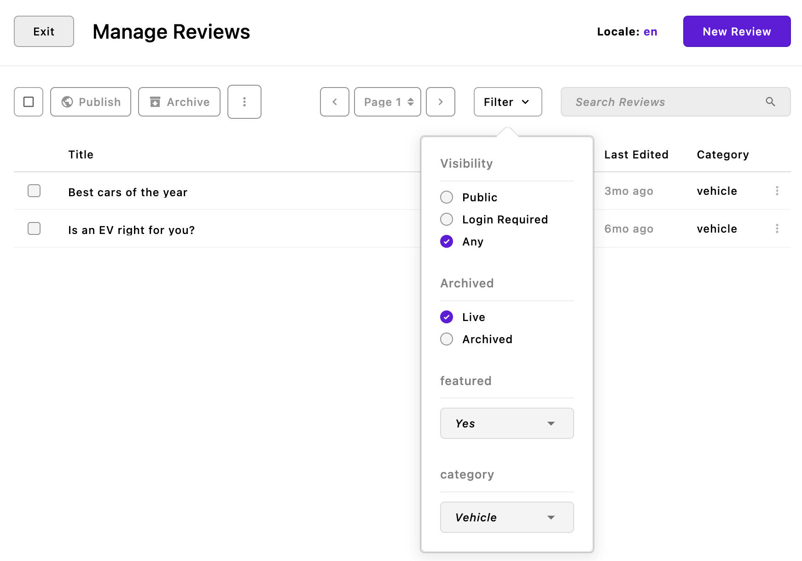
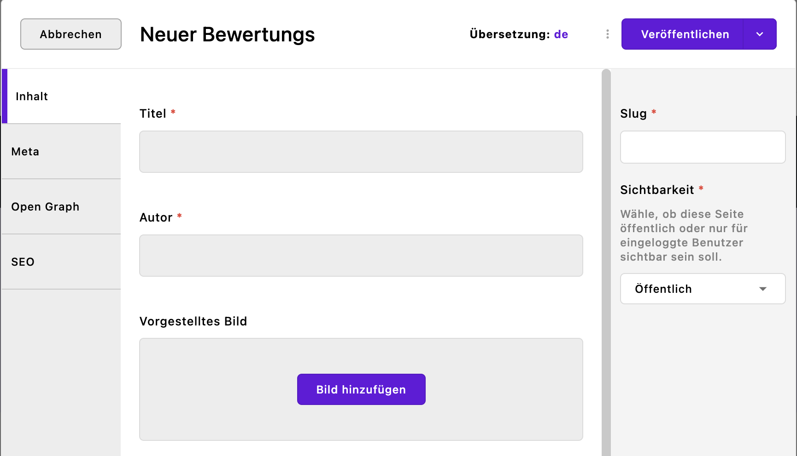
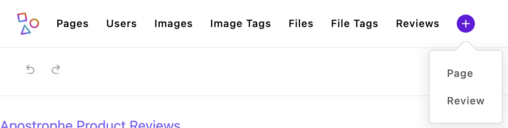
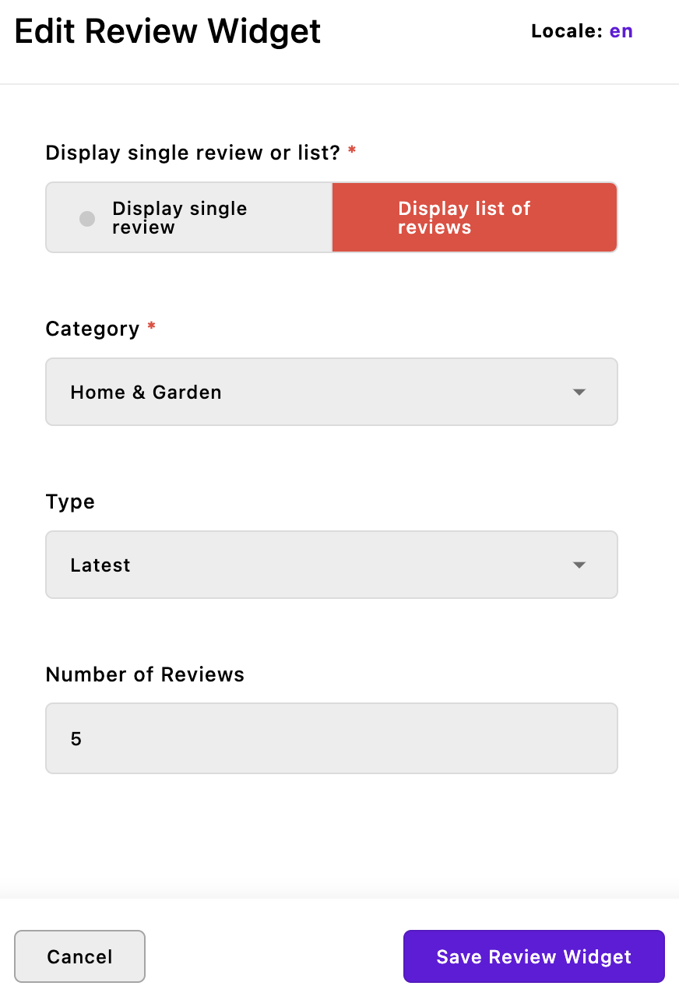
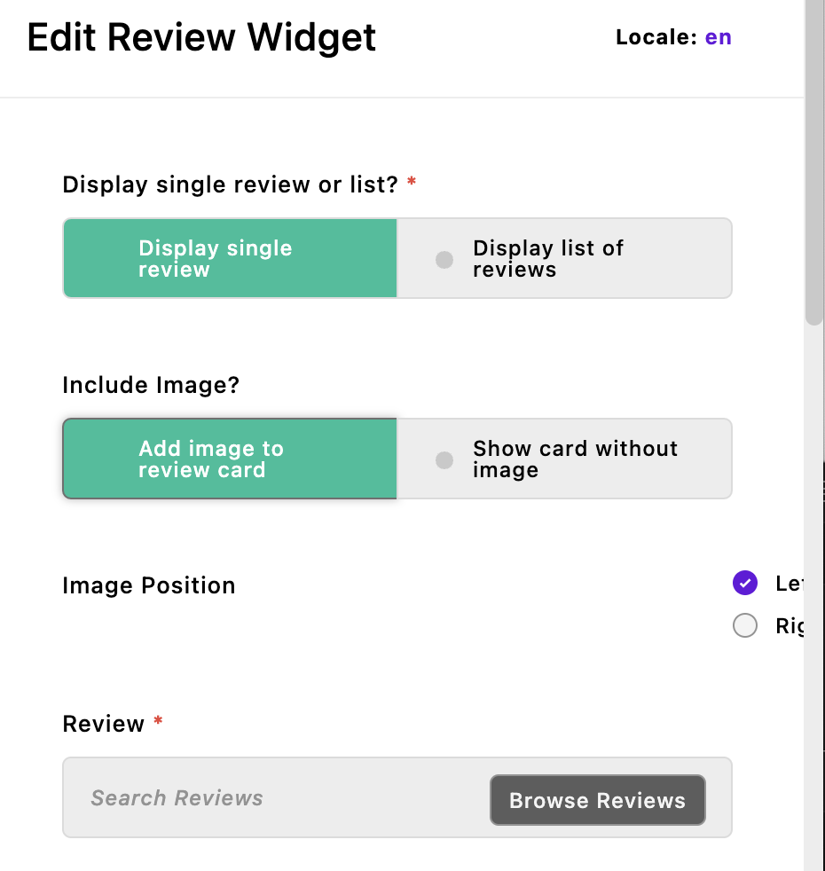

# Piece Creation

Pieces are stand-alone documents containing structured content. This content can be material that is presented on a page, like a blog article, or a team roster. However, pieces can also be used for storing other types of data. For example, the `@apostrophecms/user` module extends the `@apostrophecms/piece-type` module and stores each project user as a piece. Because pieces are stand-alone documents, they can easily be retrieved from the database.

In this tutorial, we are going to create a review piece-type and accompanying pages for showing individual pieces, as well as all the pieces belonging to a specific category. This will introduce us to filtering and query builders. We will also dive further into localizing our user interface. Finally, we will create several additional widgets to allow the display of editor-specified pieces in page areas.

You can follow along and create the new modules for our project, or switch to the `sec2-5-pieces` branch of the [GitHub repo](https://github.com/apostrophecms/apostrophe-onboarding-project).

## Creating the review piece

We are once again going to use the CLI tool for the creation of our `review-piece`. We are also going to take advantage of an additional flag, `--page`, to create an optional set of `piece-type-pages` for the display of our pieces.

```sh
apos add piece review --page
```

> ⚠️ Remember to add both of the newly created modules to the `app.js` file.

### The `piece-type` module

We will start by opening the `modules/review/index.js` file that extends the `@apostrophecms/piece-type` core module. Add the following code:

<AposCodeBlock>

``` javascript
module.exports = {
  // extending a core module creates a new instance of that module type
  // with a new name, but all the same functions
  extend: '@apostrophecms/piece-type',
  options: {
    label: 'Review',
    pluralLabel: 'Reviews',
    i18n: {
      browser: true
    }
  },
  fields: {
    add: {
      author: {
        type: 'string',
        label: 'Author',
        required: true
      },
      featuredImage: {
        type: 'area',
        label: 'Featured Image',
        max: 1,
        options: {
          widgets: {
            '@apostrophecms/image': {}
          }
        }
      },
      content: {
        type: 'area',
        label: 'Content',
        options: {
          widgets: {
            '@apostrophecms/rich-text': {},
            '@apostrophecms/image': {},
            rating: {}
          }
        }
      },
      category: {
        type: 'select',
        label: 'Category',
        required: true,
        choices: [
          {
            label: 'Vehicle',
            value: 'vehicle'
          },
          {
            label: 'Home & Garden',
            value: 'home-garden'
          },
          {
            label: 'Appliances',
            value: 'appliances'
          },
          {
            label: 'Electronics',
            value: 'electronics'
          },
          {
            label: 'Toys',
            value: 'toys'
          }
        ]
      },
      isFeatured: {
        type: 'boolean',
        label: 'Featured',
        def: false
      }
    },
    group: {
      content: {
        label: 'Content',
        fields: [ 'title', 'author', 'featuredImage', 'content' ]
      },
      meta: {
        label: 'Meta',
        fields: [ 'category', 'isFeatured' ]
      }
    }
  },
  filters: {
    add: {
      isFeatured: {
        label: 'featured'
      },
      category: {
        label: 'category'
      }
    }
  },
  columns: {
    add: {
      category: {
        label: 'Category'
      }
    }
  }
};

```
<template v-slot:caption>
  modules/review/index.js
</template>

</AposCodeBlock>

The `fields` object of this code adds five input schema fields and groups them into two tabs, `content` and `meta`. The three fields on the content tab are what you would expect for a review article. First the `author` of the piece, next, a single image from the article that can be featured in any markup as `featuredImage`, and finally the actual `content`, with the rich-text and image widgets, along with our custom ratings widget for the author to rate the product.

::: info
The `featuredImage` has an `area` schema field type that we are adding an image-widget into for the editor to add a single image. In this case it might have been preferable to use a [`relationship`](/guide/media.html#the-relationship-field-option), instead.
``` nunjucks
_featuredImage: {
  label: 'Image',
  type: 'relationship',
  withType: '@apostrophecms/image',
  max: 1
}
```
:::

In the meta tab, we are adding two fields. First, we are assigning the article to a review-type `category`. We will use this for selective display and filtering of the reviews onto individual index pages. Second, we are adding the ability for the user to toggle whether the review should be featured with a boolean field, `isFeatured`. We will also use this to filter the reviews that we display in the browser.

#### Adding filters to the piece manager



Following the `fields` object, there is a `filters` object. The `filters` object can be configured with subsections: `add` and `remove`. This configuration can either be added as a static object, as in this example, or a function that takes `self` and `options` and returns an object. Filters must correspond to an existing `fields` name or custom query builder on the piece type. We will cover custom `queries` in the [Adding Extensions](/tutorials/adding-extensions.html) tutorial.

``` javascript
filters: {
  add: {
    isFeatured: {
      label: 'featured'
    },
    category: {
      label: 'category'
    }
  }
}
```

This block of code introduces filters for the `isFeatured` and `category` fields, enabling the user to display or exclude featured pieces and reviews from particular categories, respectively. We will return to how we can use the `isFeatured` filter in the section on [creating review pages.](#adding-the-review-pages)

#### Piece manager columns

``` javascript
columns: {
  add: {
    category: {
      label: 'Category'
    },
  }
}
```
By default, the piece manager displays the piece title and the date the piece was last edited. Like the `filters` object, the `columns` object allows for the addition or removal of columns based on the schema fields of the module. In this case we are electing to display the category of the review to the right of the 'Last Edited' column in the piece manager.


#### Localizing the UI

In the `options` object, we have the standard `label` and `pluralLable` properties, but we have a new property `i18n`. This option allows us to localize the review piece admin UI to different languages by passing `browser: true`. It is slightly different from the localization that we introduced when creating our `views/fragments/topbar.html` fragment. There, we were adding localization to our template, not the interface the author is using. In the template, our localized strings were within Nunjucks tags and passed to the `__t()` helper. In this case, we don't have to do anything extra. Adding the `i18n` option will let Apostrophe know that we want to translate any label where we have supplied a corresponding translation string.

Just like with the topbar, we need to create a module-level folder for our translation strings. Create a `modules/review/i18n` folder and add a file named `en.json` inside. Into that file, we are going to add all the labels from each of the schema fields, including the labels for the choices in the select field.

<AposCodeBlock>

``` json
{
  "Review": "Review",
  "Reviews": "Reviews",
  "Author": "Author",
  "Featured Image": "Featured Image",
  "Content": "Content",
  "Category": "Category",
  "Vehicle": "Vehicle",
  "Home-garden": "Home & Garden",
  "Appliances": "Appliances",
  "Electronics": "Electronics",
  "Toys": "Toys",
  "Featured": "Featured?",
  "Meta": "Meta",
  "All": "All"
}
```

<template v-slot:caption>
  modules/review/i18n/en.json
</template>

</AposCodeBlock>

In this case, since we are localizing the strings within a single project, we aren't using a namespace. If we were intending on distributing this module to multiple projects as a package, we would need to make a few changes to our `modules/review/index.js` file. First, we would need to prefix all the label strings to be translated with the namespace. For example, `label: 'review:Author'`. Second, we would need to move the `i18n` property out of the options object to be a top-level property. That property would then receive a namespace-named object with the `browser: true` property:

``` javascript
i18n: {
  review: {
    browser: true
  }
}
```

We also need a translations file for our `de` locale, so create a `de.json` file in the same location and add:

<AposCodeBlock>

``` json
{
  "Review": "Bewertungs",
  "Reviews": "Bewertungen",
  "Author": "Autor",
  "Featured Image": "Vorgestelltes Bild",
  "Content": "Inhalt",
  "Category": "Kategorie",
  "Vehicle": "Fahrzeug",
  "Home & Garden": "Haus & Garten",
  "Home-garden": "Haus & Garten",
  "Appliances": "Geräte",
  "Electronics": "Elektronik",
  "Toys": "Spielzeug",
  "Featured": "Vorgestellt?",
  "Meta": "Meta",
  "All": "Alle"
}
```

<template v-slot:caption>
  modules/review/i18n/de.json
</template>

</AposCodeBlock>

## <a name="adding-the-review-pages"></a>Adding the review pages



We now have a way to create review pieces. If we were to spin up our project we would see a new item 'Reviews' in the admin bar. Clicking on the plus icon we would get a dropdown that will let us quickly add a new review piece by creating the piece and opening the edit modal without having to open the piece manager first. As we will revisit in the [admin bar configuration](/tutorials/admin-ui.html) tutorial, you can configure this bar to group items or prevent them from appearing in the quick create menu.

While we can now create new review pieces, they won't be displayed anywhere in our site. One way that we can display our pieces is to use a `piece-page-type`. Our CLI command has already created a `modules/review-page` folder for us. Opening the `index.js` file, we can see the normal `extend` and `options` properties. Because this folder is named `review-page`, Apostrophe automatically knows that these pages should be associated with the `review` piece-type. If we wanted to give this module a different name, we would have to add the `pieceModuleName` property to the `options` object with a value of `review`. We will alter this file after we create our `index.html` page.

> ⚠️ At this point, although the `review-page` module has been created and we added it to the `app.js` file, none of the page templates that we are constructing would be available for a user to select. We also need to add this module to the `modules/@apostrophecms/page/index.js` file. Open that file and add the following object into the `types` array:

``` javascript
{
  name: 'review-page',
  label: 'Category Pages'
}
```

### The index.html page

The `index.html` page is located in the piece-page-type module `views` folder. This page is meant to display a listing of pieces and takes markup much like our homepage. You can elect to use the same template as the homepage, or create an entirely new one. In the case of our project, we are going to mimic the look of our homepage with the same topbar, footer, and eventually, navigation fragments. Open the `modules/review-page/views/index.html` file and add the following:

<AposCodeBlock>

``` nunjucks
<!-- Pages should extend the layout to get the header and footer -->


<!-- This loads in a macro to help with pagination -->


<!-- This grabs the current URL for adding query parameters to filter -->


<!-- This is the main content area -->

  <div class="container ms-5 me-5">
    <div class="d-flex justify-content-between align-items-center mb-5">
      <h1 class="custom-underline display-6 ps-2 mb-5">Reviews</h1>
      <div>
        
          <a href="{{ currentPath | build({isFeatured: null}) }}" class="btn btn-secondary">Show All</a>
        
          <a href="{{ currentPath | build({isFeatured: true}) }}" class="btn btn-primary">Show Featured Only</a>
        
      </div>
    </div>
    <div class="row g-3">
      <!-- This loops through all of the review pieces and displays them -->
      

        <!-- Use a helper to get the image -->
        <!-- Use the Nunjucks `set` to create a variable -->
        

        <!-- Even though the featuredImage field is required, it's possible that the image has been deleted. So we need to check for that. -->
        
          
        
          <!-- Instead of an else you could choose to skip displaying an image. -->
          
        

        <!-- This is just to show how to get image details without using the helper -->
        

        <div class="review col-md-4">
          <div class="review__image">
            
          </div>
          <div class="review__content">
            
              <span class="review__featured">Featured</span>
            
            <h2 class="review__title"><a href="{{ review._url }}" class=" text-decoration-none text-dark">{{ review.title }}</h2></a>
            <p class="review__author">Authored by: {{ review.author }}</p>
          </div>
        </div>

      
    </div>

  <!-- This renders the page navigation -->

  <div class="row justify-content-center mb-5">
    <div class="col-md-4 align-self-center bg-info border border-dark border-3 rounded">
      <p class="fs-3">Review Navigation</p>
    {{ pager.render({
      page: data.currentPage,
      total: data.totalPages,
      shown: 5,
      class: 'fs-3 ms-5'
      }, data.url) }}
    </div>
  </div>

</div>

```

<template v-slot:caption>
  modules/review-page/views/index.html
</template>

</AposCodeBlock>

Walking through the code, we start with
``` nunjucks

```
This allows our page to use the same head, topbar, and footer as the home page.

``` nunjucks

// ...
  <!-- This renders the page navigation -->

  <div class="row justify-content-center mb-5">
    <div class="col-md-4 align-self-center bg-info border border-dark border-3 rounded">
      <p class="fs-3">Review Navigation</p>
    {{ pager.render({
      page: data.currentPage,
      total: data.totalPages,
      shown: 5,
      class: 'fs-3 ms-5'
      }, data.url) }}
    </div>
  </div>

```
This first line of code imports markup from the `@apostrophecms/pager` module. This markup contains several [Nunjucks macros](https://mozilla.github.io/nunjucks/templating.html#macro), which are a little like fragments that we worked with when creating our homepage. These macros are helpers that parse the number of pieces that we want to display on the page, deliver them in customizable groups, and create a breadcrumb trail for navigating through the groups.

The final block below the main content adds in the markup for our navigation breadcrumbs.

``` nunjucks
{{ pager.render({
  page: data.currentPage,
  total: data.totalPages,
  shown: 5,
  class: 'fs-3 ms-5'
}, data.url) }}
```
This code calls the imported macro and passes in several items from the `data` object that is available on any `piece-page-type` index page. The `currentPage` contains what page of results is currently being shown starting with 1. The `totalPages` gives the total number of pages that there are given the current group size. The optional `shown` option defines the maximum number of pages that should be displayed in the pager breadcrumb display at one time. If the total number of pages exceeds this the macro will insert ellipses either at the beginning or end to indicate that there are more pages available. The optional `class` property will add these classes to the wrapper around the breadcrumbs. Finally, the macro needs the URL of the page in order to correctly construct the links. All of this data is available for you to create your own navigation macros.

``` nunjucks
<!-- This grabs the current URL for adding query parameters to filter -->

<!-- This is the main content area -->

  <div class="container ms-5 me-5">
    <div class="d-flex justify-content-between align-items-center mb-5">
      <h1 class="custom-underline display-6 ps-2 mb-5">Reviews</h1>
      <div>
        
          <a href="{{ currentPath | build({isFeatured: null}) }}" class="btn btn-secondary">Show All</a>
        
          <a href="{{ currentPath | build({isFeatured: true}) }}" class="btn btn-primary">Show Featured Only</a>
        
      </div>
    </div>
```

Returning to the main markup of the page, after adding a tag to add our markup to the `main` block, we open a Bootstrap container. Within that container we add a wrapper `div` containing the main heading for the page and another `div`. Within that wrapper `div`, we apply Bootstrap classes for flexbox layout (`d-flex`), justifying the content to be evenly spaced between the start and the end (`justify-content-between`), and vertically aligning items in the center (`align-items-center`). We also add a margin-bottom (`mb-5`) for spacing.

Inside this wrapper `div`, there are two main elements:

1. The first is an `<h1>` tag that serves as the main heading for the page, labeled 'Reviews'. It uses the Bootstrap class `display-6` for styling, additional padding (`ps-2`), and a margin-bottom (`mb-5`). A custom underline is also applied with the `custom-underline` class.

2. The second is another `div` that contains conditional logic to render a button. This is done using the `` and `` tags, which are part of the template engine.

  ``` nunjucks
  <!-- This grabs the current URL for adding query parameters to filter -->
  
  ```

  Above the main block we are getting the current URL of the page, including any query parameters, using `data.page._url`. If that URL has a query parameter of `isFeatured=true`, a 'Show All' button is displayed with a secondary Bootstrap styling (`btn btn-secondary`). The URL for the button is dynamically generated by passing the page URL to the Apostrophe template filter [`build`](/guide/template-filters.html#build-url-path-data) - <span v-pre>`{{ currentPath | build({isFeatured: null}) }}`</span>. This will remove the `isFeatured` query parameter by setting it to `null`. If the query parameter isn't present in the current page URL, a 'Show Featured Only' button with primary Bootstrap styling (`btn btn-primary`) will be added. The URL for this button will be constructed with the same filter, but the `isFeatured=true` query parameter will be added to the current URL.

Please note that this is completely independent of the fact that we are using `isFeatured` as a filter for the piece manager. Most [schema fields have filters](https://docs.apostrophecms.org/reference/module-api/module-options.html#piecesfilters) already available. The values of the fields will get added to fields in the database document. So for example, we could add `?author=name` and the page would only display review pieces by that author. For fields that contain strings, individual words are added to the document search fields. So for example, a piece titled "Best Bed Buys for 2023" would be returned by adding a query parameter of `?title=bed` to the URL. However, a custom filter is needed if you want to filter based on a derived value, like the year of publication when the date field also contains the month and day. We will cover this in the [Adding extensions](/tutorials/adding-extensions.html) tutorial.

We aren't going to step through the remainder of the main content markup of the page in detail since it uses familiar concepts from past tutorials.


In brief, we set up a loop to go through all the piece objects available in the `data.pieces` array. For each, we extract a featured image, a link to the individual piece page, the piece title, and the piece author. Note that we are getting the link as `_url`. The underscore in front indicates that it is a property that is computed, not retrieved from the database. In this case, this is because pieces can be assigned to different parent pages and these links need to be computed dynamically at the time of rendering. We will cover assigning pieces to different pages in the next sections.

Now that we have our index page created, we can reopen our `modules/review-page/index.js` file and update our `options` object to add `perPage: 9` which will cause the review pieces to be displayed in groups of 9 per page. At this point, you can go ahead and spin the site up and create some review pieces. You can then add a new page, selecting `Category Pages` for the page type from the dropdown on the right.

### Creating the `show.html` page

We now have a page to display all of our reviews, but we still need a template for showing an individual piece. Open the `modules/review-page/views/show.html` file and add the following code:

<AposCodeBlock>

``` nunjucks
<!--
  This page is for displaying individual review pieces.
-->

<!-- Pages should extend the layout to get the header and footer -->




<!-- Use a helper to get the image -->
<!-- Use the Nunjucks `set` to create a variable -->

<!-- Even though the featuredImage field is required, it's possible that the image
  has been deleted. So we need to check for that. -->

  
  

  <!-- Instead of an else you could choose to skip displaying an image. -->
  


<!-- This is just to show how to get image details without using the helper -->


<!-- Take advantage of `{{apos.log()}}` to see what data is available -->

<!-- This is the main content area -->

  <div class="container">
    <div class="row">
      <div class="col-md-12">
        <h1 class="ms-5 custom-underline display-6 ps-2 mb-5">Review</h1>
      </div>
      <div class="review col-md-12">
        <div class="review__image text-center">
          
          
            <span class="review__featured fs-4 carousel-caption">Featured Article </span>
          
        </div>
        <div class="review__content">
          <h2 class="review__title text-center display-1 my-3">{{ review.title }}</h2>
        </div>
      </div>
    </div>
    <div class="row justify-content-md-center">
      <div class="col-md-8">
          <p class="review__author fs-5 mb-3">Written by: {{ review.author }}</p>
        
      </div>
    </div>
  </div>

```

<template v-slot:caption>
  modules/review-page/views/show.html
</template>

</AposCodeBlock>

The markup here is straightforward. One thing to note is that the markup is being populated by items from `data.piece` whereas the `index.html` file was using `data.pieces`. We are also making use of a helper from the `@apostrophecms/image` module, `apos.image.srcset()`. This will return a string containing a comma-separated list of each of the image sizes paired with a view width. This can help page loading speed by allowing the browser to pick the optimal image size to load.

### Displaying review pieces by category

Looking back at the schema fields of our review piece, we added a select field to be able to add a category. For example, reviews of vehicles or appliances. We want to give our site visitors the ability to look at just the reviews within a certain category. Luckily, Apostrophe provides an easy way to accomplish this. The `@apostrophecms/piece-page-type` module provides two methods, `filterByIndexPage()` and `chooseParentPage()`, that we can extend to allow us to assign specific pieces to certain pages.

We will start by adding a select to our `review-page/index.js` file that will allow the editor to select what types of pieces should be displayed on the page. Open that file and add this code after the `options` object, replacing the existing code:

<AposCodeBlock>

``` javascript
fields: {
  add: {
    displayCategory: {
      type: 'select',
      label: 'Display Category',
      choices: 'addCategoryChoices()'
    }
  },
  group: {
    basics: {
      label: 'Basics',
      fields: [ 'displayCategory' ]
    }
  }
}
```

<template v-slot:caption>
  modules/review-page/index.js
</template>

</AposCodeBlock>

This code will create a single new schema field that the author can use to select the page category. We used a similar schema field in creating our review piece module. The big difference is that here we are dynamically populating the choices. This is a powerful way to ensure that the range of choices stays current, even if, for example, there is a new category of reviews added. In this case, we are passing the `choices` property a **string** and not the actual method. This string refers to a method we can either import or define within this module and should always end with `()` to indicate that it is referring to a method.

After the `fields`, add this code:

<AposCodeBlock>

``` javascript
methods(self) {
  return {
    async addCategoryChoices(req) {
      const allReviews = await self.apos.modules.review.find(req)
        .project({
          category: 1
        })
        .toArray();
      const uniqueCategories = [ ...new Set(allReviews.map(review => review.category)) ];
      return [
        {
          label: 'All',
          value: 'all'
        },
        ...uniqueCategories.map(category => ({
          label: category.charAt(0).toUpperCase() + category.slice(1),
          value: category
        }))
      ];
    }
  };
}
```

<template v-slot:caption>
  modules/review-page/index.js
</template>

</AposCodeBlock>

We are taking advantage of the `methods(self)` configuration function that is part of every Apostrophe module. This allows us to define JavaScript functions to be used in the same module or to be called by any other custom module. This method always returns an object of functions. In this case, it is returning a single async function, `addCategoryChoices(req)`.

#### Querying the database

While it is possible to directly query the database, Apostrophe provides a way to make a wide variety of queries without knowing advanced MongoDB syntax. Further, queries using the Apostrophe API are secure and will only return content the active website user is allowed to access. Both page and piece modules have access to a `find()` method that initiates a database query. This method takes the `req` object and optional `criteria` and `options`.

``` javascript
const allReviews = await self.apos.modules.review.find(req)
  .project({
    category: 1
  })
  .toArray();
```
The `allReviews` variable uses the `find()` method, passing it the request object from the index page. From within the `review` module, we could use `await self.find(req)` because the method would be restricted to only review pieces. In this case, we are querying the `review` pieces from the `review-page` module, so we need to reference the `find()` method of that `review` module using `self.apos.modules.review.find(req)`. This query will initialize a query to return all the review pieces. These results are next filtered and modified by several "query builders". These query builders can alternatively be passed as an object to the `options` argument of the `find()` method, instead of chaining them, as is shown here.

The first query builder we are adding is `project()`. This query builder limits the data that is returned from our find operation and takes an object with document properties to be included as keys, and the value of each set to `1` or `true`. You can also use `project()` to eliminate fields by setting the value to `0` or `false`, but you **can not** provide a `project()` with both inclusion and exclusion criteria. In this case, we want to provide our content editor with a list of all the review categories. We don't need to supply the titles or authors, so we limit the amount of data that needs to be passed. Some other common query builders are `sort()` and `limit()`. You can read more about them in the [documentation](https://docs.apostrophecms.org/guide/database-queries.html).

Finally, we pass our query to the `toArray()` query method. The other common query method is `toObject()`. Both these methods take the criteria and refinements added by the query builders and add logic to tell the database how we want the data returned, as an array of objects or a single object, respectively.

``` javascript
const uniqueCategories = [ ...new Set(allReviews.map(review => review.category)) ];
```

Our next constant definition takes the returned query array, extracts all the categories, removes duplicates, and assigns the array of unique categories to `uniqueCategories`.

``` javascript
return [
  {
    label: 'All',
    value: 'all'
  },
  ...uniqueCategories.map(category => ({
    label: category.charAt(0).toUpperCase() + category.slice(1),
    value: category
  }))
];
```
Finally, we are returning an array of choices to the `select` schema field. We are adding an initial choice of `all` so that the editor can choose to have a page where the results aren't filtered according to the review category. The first letter of each category is converted into upper-case so that the labels match our translation strings.

#### Filtering the index page
Now that we have a way for the user to determine what review pieces they want to be displayed on the page, we need to extend the `filterByIndexPage()` method. In this case, we are going to use the `extendMethods(self)` configuration method. This allows a method to essentially improve, rather than replace, a method defined in the base module. Like the `methods(self)` configuration method, it should return an object of methods. Each method it returns should take the same arguments as the original, plus the `_super` argument.

Add this code after the `methods(self)`, making sure to add a comma to separate the two methods:

<AposCodeBlock>

``` javascript
extendMethods(self) {
  return {
    filterByIndexPage(_super, query, page) {
      // if the page has a category, add it to the query
      // if the page category is `all`, don't modify the query and return all pieces
      if (page.displayCategory && page.displayCategory !== 'all') {
        query.category(page.displayCategory);
      }
      // return the query
      return query;
    };
  }
}
```
<template v-slot:caption>
  modules/review-page/index.js
</template>

</AposCodeBlock>

This original `filterByIndexPage()` method takes the `query` and `page` arguments. Since we are extending the method, we are also adding the `_super` argument. Inside the function we check to make sure the content creator has selected a category and that it isn't `all`. If so, we take advantage of the fact that Apostrophe automatically adds query builders for most schema fields. In this case, adding a query builder that checks that the value of the `review` piece `category` schema field for each piece is equal to the category that the editor selected.

#### Connecting the individual pieces to the correct parent

We have now solved one side of our routing equation. Each new review page that the user creates can be set to display pieces of a selected category. However, once we click on the link to take us to the individual reviews, that review `show.html` page won't have information about the parent page. We need to extend the `chooseParentPage()` method to assign the correct one.

After the `filterByIndexPage()` method we just added, add the following code (making sure to separate our methods with a comma):

<AposCodeBlock>

``` javascript
chooseParentPage(_super, pages, piece) {
  // if the piece has a category and there is more than one page, assign the correct one
  if (piece.category && pages.length > 1) {
    // grab the piece.category and assign it to a variable
    // set to `all` if it's not a string
    const pieceCategory = typeof piece.category === 'string' ? piece.category : 'all';
    // find the page with the correct category
    // if we didn't find a page with the correct category
    // use the `chooseParentPage` method of the parent module
    // to assign the fallback page
    return pages.find((page) => page.displayCategory === pieceCategory) || _super(pages, piece);
  }
  // if only a single page, use the default behavior
  return _super(pages, piece);
}
```

<template v-slot:caption>
  modules/review-page/index.js
</template>

</AposCodeBlock>

Again, the original method took two arguments that we are prefacing with the `_super` argument. The `pages` argument is going to contain an array of all the pages that are in the database that are the `review-page` page type. The `piece` argument is going to be the individual piece that is being requested for display.

First, we are checking that the category is set for the piece that is being requested and that there is more than one `review-page`. If not, then we return the results of the original method, using `_super(pages, piece)`. Otherwise, we set the `pieceCategory` constant to either the value the author selected or `all` if the field doesn't have a string value. This is then used with the *JavaScript* `Array.prototype.find()`, not the Apostrophe query initiator, to select a page from the `pages` array. As fallback, if no page has been created with a matching category it will fall back to the parental method to select the correct page.

::: info
This `chooseParentPage()` extended method is relatively simple. We could have elected to add it as a method instead, passing `data.pages[0]` back instead of the results of `_super(pages, piece)`.
:::

At this point, you can spin the project up and create a new page for every category, plus another for 'all' to display all the pieces, or if you haven't done so yet, you can import the database from the final project (see the [repository README](https://github.com/apostrophecms/apostrophe-onboarding-project/blob/main/README.md) to learn how to accomplish this). In the next tutorial, we will add site navigation to link these pages to the homepage. Next, we are going to look at two further ways to display pieces on our pages.

## Creating a piece widget

So far, we can only display pieces on a dedicated page, but obviously, we also want to be able to display pieces on other pages throughout our site. One way this can be accomplished is through the creation of a widget that can be added to any area. We are going to create two different widgets, a simple one to display any review article, and a more complex one that allows the content creator to select from either a featured review or the latest review.

### Adding the all reviews widget


We won't be using this widget in our project, but it will be useful to build in order to introduce a new schema field and how it is used within a template. After construction, we will add it to the `default-page` area to see what it looks like. As with most of our custom modules, we will use the CLI tool to create our widget.

``` sh
apos add widget all-reviews
```

This will create a `modules/all-reviews-widget` folder and populate it with an `index.js` file and a `views` folder with a `widget.html` file.

> ⚠️ Remember to add the new module to the `app.js` file

#### Creating the schema

Open the `index.js` file and add the following code:

``` javascript
module.exports = {
  extend: '@apostrophecms/widget-type',
  options: {
    label: 'All Reviews Widget'
  },
  fields: {
    add: {
      _selectedReview: {
        type: 'relationship',
        label: 'Review to display',
        withType: 'review',
        required: true,
        max: 1,
        builders: {
          project: {
            title: 1,
            author: 1,
            _url: 1
          }
        },
        fields: {
          add: {
            recommender: {
              type: 'string',
              label: 'Recommender',
              required: true
            },
            recommendation: {
              type: 'string',
              label: 'Recommendation',
              required: true,
              textarea: true,
              max: 50
            }
          },
          group: {
            extras: {
              label: 'Extras',
              fields: [ 'recommender', 'recommendation' ]
            }
          }
        }
      }
    },
    group: {
      basics: {
        label: 'Basics',
        fields: [ '_selectedReview' ]
      }
    }
  }
};

```

For this code, we are using a new schema field, the `relationship` field. Note that the name of the field is prefixed with an underscore, `_selectedReview`. As we covered earlier in the tutorial, this means that the data returned by this field is computed at the time of render. The `withType` property identifies the Apostrophe doc type that is connected to the field. If we wanted to connect to a page, we would use `withType: '@apostrophecms/any-page-type'`.

In addition to the `required` and `max` properties, this relationship has two additional optional properties, `builders` and `fields`.

The `builders` property takes an object containing a `project` object that can limit the data returned, exactly like the query builders covered previously. In this case, only the `title`, `author`, and `_url` are being returned.

The `fields` property works like the top-level property of the same name. In this code, we are adding two additional fields to collect a recommender's name and recommendation. As with the top-level property, the `group` property is being used to group the fields on the `extras` tab. For the `recommendation` we are using a `string` type input field, but passing it the optional `textarea` boolean property to convert it into a textarea input, and a `max` property to limit the number of characters that can be added.

You can read more about the `relationship` field, like allowing nested relationships with `withRelationships`, as well as `reverseRelationship` fields and using `ifOnlyOne` to limit data in the [documentation](https://docs.apostrophecms.org/reference/field-types/relationship.html).

#### Adding the widget markup

Open the `modules/all-reviews-widget/views/widget.html` file and add the following code:

<AposCodeBlock>

``` nunjucks
<section class="bg-light pb-5 pt-5">
  <div class="container pb-5 pt-5">
    <div class="align-items-center row">
      <!-- always check to make sure the review still exists and has been added -->
      
        
        <div class="col-lg">
          <h2 class="h6 text-primary text-uppercase">Recommended</h2>
          <p class="text-primary ms-4">{{review._fields.recommender}} says: {{review._fields.recommendation}}
          </p>
          <h3 class="fw-bold h2 mb-3">{{review.title}}</h3>
          <p class="fw-light h4 ms-4">BY: {{ review.author }}</p>
        </div>
        <div class="col-lg-auto">
          <a href="{{ review._url }}" class="btn btn-primary text-uppercase">Read More</a>
        </div>
      
    </div>
  </div>
</section>
```

  <template v-slot:caption>
    modules/all-reviews-widget/views/widget.html
  </template>

</AposCodeBlock>

We are using an `if` within Nunjucks tags to make sure that the content creator added the review and it hasn't been archived by checking the `data.widget._selectedReview` value. A `relationship` field will return an array with all the selected documents, so that array should have a length longer than `0` if at least one review has been added. Next, since we are only expecting a single document in the array, we are setting the `review` variable to the first item in the array.

Within that review, we can access the additional fields through the `_fields` property. This allows us to add the recommender name and recommendation. The rest of the data coming from the review is accessed through the schema names directly.

Finally, add this widget to the default-page by adding it to the end of the `widgets` object. You can then spin the project up, add a new default page and add the new widget in the main area to see what it looks like.

### Creating the review widget



We are going to create an additional widget that will allow the editor to select and display featured or recently published pieces. We are also going to give the content creator the ability to select the number of reviews to add, and a choice of whether to add an image. Again, we will start by using the CLI tool to create our widget.

``` sh
apos add widget review
```

> ⚠️ Don't forget to add your new module to the `app.js` file.

#### Adding the schema
Open the newly created `modules/review-widget/index.js` file and add the following code:

<AposCodeBlock>

``` javascript
module.exports = {
  extend: '@apostrophecms/widget-type',
  options: {
    label: 'Review Widget',
  },
  fields: {
    add: {
      displaySingle: {
        type: 'boolean',
        label: 'Display single review or list?',
        required: true,
        def: true,
        toggle: {
          true: 'Display single review',
          false: 'Display list of reviews'
        }
      },
      includeImage: {
        type: 'boolean',
        label: 'Include Image?',
        toggle: {
          true: 'Add image to review card',
          false: 'Show card without image'
        },
        if: {
          displaySingle: true
        }
      },
      imagePosition: {
        type: 'radio',
        label: 'Image Position',
        def: 'left',
        choices: [
          {
            label: 'Left',
            value: 'left'
          },
          {
            label: 'Right',
            value: 'right'
          }
        ],
        if: {
          includeImage: true
        }
      },
      _review: {
        type: 'relationship',
        withType: 'review',
        required: true,
        if: {
          displaySingle: true
        }
      },
      category: {
        type: 'select',
        label: 'Category',
        required: true,
        def: 'all',
        choices: [
          {
            label: 'All',
            value: 'all'
          },
          {
            label: 'vehicle',
            value: 'vehicle'
          },
          {
            label: 'Home & Garden',
            value: 'home-garden'
          },
          {
            label: 'Appliances',
            value: 'appliances'
          },
          {
            label: 'Electronics',
            value: 'electronics'
          },
          {
            label: 'Toys',
            value: 'toys'
          }
        ],
        if: {
          displaySingle: false
        }
      },
      time: {
        type: 'select',
        label: 'Type',
        choices: [
          {
            label: 'Latest',
            value: 'latest'
          },
          {
            label: 'Featured',
            value: 'featured'
          }
        ],
        if: {
          displaySingle: false
        }
      },
      number: {
        type: 'integer',
        label: 'Number of Reviews',
        min: 1,
        max: 10,
        if: {
          displaySingle: false
        }
      }
    }
  },
  components(self) {
    return {
      async returnReviews(req, data) {
        const criteria = (data.category === 'all') ? {} : { category: data.category };
        if (data.time === 'featured') {
          criteria.isFeatured = true;
        }
        const limit = data.number;
        /* Because we are not in the `review` module, we need to use `self.apos.modules.review` to access that module. To search the same module, we would use `self.find()`. We only need the 'title', '_url', and 'category' so we are limiting the returned data with `project({})`.
        */
        const reviews = await self.apos.modules.review.find(req, criteria)
          .project({
            title: 1,
            _url: 1,
            category: 1
          })
          .sort({ createdAt: -1 })
          .limit(limit)
          .toArray();
        return {
          reviews: reviews
        };
      }
    };
  }
};

```
  <template v-slot:caption>
    modules/review-widget/index.js
  </template>

</AposCodeBlock>

The `fields` object should look fairly familiar. We are using two new field types, `boolean` and `radio`. The `boolean` field returns either `true` or `false`. For both, we are adding the optional `toggle` property. Without the `toggle` property, the `boolean` input field places two buttons side-by-side labeled `Yes` and `No`. The `toggle` property adds the string values added for the `true` and `false` values to those buttons. It also changes the selected appearance from a colored dot to a change in the background color.

In this code, whether the `includeImage` field is added to the schema is controlled by the value of the `displaySingle` field. Note that even though we have added new labels to the buttons, the returned values are still `true` and `false`. If `displaySingle` is `false`, the final data object won't include the field.

The `radio` field allows for the selection of a single choice out of a list of choices. The decision to use a `radio` versus a `select` field usually comes down to the number of choices, since the choices in a `radio` field will always be displayed. Otherwise, these two types of field can be used interchangeably, including populating the choices dynamically.

We are going to ignore the final section of this code that adds a component until we add markup to the `views/widget.html` file.

### Create the markup
Open the `modules/review-widget/views/widget.html` file and add the following code:

<AposCodeBlock>

``` nunjucks


  
  
    
    
      
    
      
    
    
      <div class="background-center-center background-cover col-xs-12 col-md-4" style="background-image:url('{{ imageUrl }}')"></div>
    
  
  
    
    <div class="col-xs-12 col-md-8 headline-block{{extraClass}}">
      <div class="card-body">
        <h3 class="card-title display-5">
          <a href="/reviews/{{ review.slug }}" class="text-decoration-none text-dark">{{ review.title }}</a>
        </h3>
        <p class="card-text">A review by {{ review.author }}</p>
      </div>
    </div>

<container class="container">
  <section data-review-widget class="border-2 border-bottom border-primary g-0 mb-4 row row-height">
    
      {{ imageBlock | safe }}
      {{ textBlock | safe }}
    
      {{ textBlock | safe }}
      {{ imageBlock | safe }}
    
  </section>
</container>

  <container class="article">
    <section data-review-widget>
      
    </section>
  </container>

```

  <template v-slot:caption>
    modules/review-widget/views/widget.html
  </template>

</AposCodeBlock>

We are creating two chunks of markup that are enclosed in `if...else` conditional tags. The top section within the `if` provides markup for the display of a single review. It uses Nunjucks `set` tags to create a block of markup for the image and another for the text markup. Then there is an internal `if...else` conditional based on whether the text or image block should be shown first.

The markup in the main `else` block takes advantage of the async component that we added to our `index.js` file. It passes three pieces of data from the schema fields to the component method, the `category`, `time`, and `number`. We need to use a component here because we need to perform a database query before we can compose our markup.

#### The async component
``` javascript
components(self) {
    return {
      async returnReviews(req, data) {
        const criteria = (data.category === 'all') ? {} : { category: data.category };
        if (data.time === 'featured') {
          criteria.isFeatured = true;
        }
        const limit = data.number;
        /* Because we are not in the `review` module, we need to use `self.apos.modules.review` to access that module. To search the same module, we would use `self.find()`. We only need the 'title', '_url', and 'category' so we are limiting the returned data with `project({})`.
        */
        const reviews = await self.apos.modules.review.find(req, criteria)
          .project({
            title: 1,
            _url: 1
          })
          .sort({ createdAt: -1 })
          .limit(limit)
          .toArray();
        return {
          reviews: reviews
        };
      }
    };
  }
```

In the component method, we are setting our criteria to include the selected category and whether only `featured` reviews should be selected. This is getting passed into the `find()` query initialization method of the `review` module. We are using `project()` to limit the returned information. The `sort` query builder is arranging the reviews by their `createdAt` date in descending order, which means that the latest review will be first. The `limit()` query builder is being used to only return the number of reviews specified by the user. And finally, we are completing our query by specifying that those arrays should be delivered as an array of document objects and then passing that object to our component markup.

#### Component HTML

Now that the reviews have been fetched from the database, we need to create the markup to display them. Create a `modules/review-widget/views/returnReviews.html` file. Note that this file name matched the method name and the name used in the `views/widget.html` markup. Add the following code:

<AposCodeBlock>

``` nunjucks
<div class="border-2 border-info border-start row">
  <div class="mt-4">
    
      <div class="article ps-3">
        <p class="h4">
          <a href="{{ review._url }}" class="text-decoration-none text-dark">{{review.title}}</a>
        </p>
        <hr class="mt-2 text-info bg-info" />
      </div>
    
  </div>
</div>
```
  <template v-slot:caption>
    modules/review-widget/views/returnReviews.html
  </template>

</AposCodeBlock>

Within this markup, we are creating a `for...in` loop to step through each of the returned reviews. We are creating a link for each based on the `_url` and `title`, and adding a `<hr>` horizontal rule afterward. If we wanted to alter this to include an image, we would have to change our `project()` query builder. However, it is interesting to note that if we were to log the information being delivered to the component markup, we would see that there are several computed fields, including `_id`, `_parentUrl`, and `_parentSlug` that can be used for creating navigation items, like a link to take the user to the particular index page that this review belongs on.

#### Adding styling

If we were to spin our site up now, we could populate our home page with our new widgets, but it wouldn't look quite like our final project, because we still need to add some additional styling. Just as a reminder, this styling can be placed in several locations within our project. It could be placed into a `ui/src` folder in our `review-widget` module. This would require adding or importing the styles into an `index.scss` file within that folder. Instead, we can create a new file in the `modules/asset/ui/src/scss` folder and import it in the `index.scss` file of that same module. Rather than adding the code here, I recommend copying the `_theme-reviews.scss` file from the `sec2-5-pieces` branch of the [GitHub repo](https://github.com/apostrophecms/apostrophe-onboarding-project). Next, open the `modules/asset/ui/src/index.scss` file and add `@import './scss/_theme-reviews';`.

Now with styling added, our review widget would look better, but we still need to pick where to display it! Open the `lib/area.js` file and add it to the end of the `fullConfig` object. Spinning the site up now will allow the addition of our new widget to any area that has a `row` widget. In the finished project this widget was used in both the upper and lower homepage areas.

> Unless you have added content, including reviews and category pages for any review types, the links for this widget won't be correctly formed. That is because each review document depends on having a computed `_parentURL` to create the link.

#### Fixing the Bootstrap styling issue



The Apostrophe Admin UI styling is designed to be agnostic with regard to your project styling. In this case, the stylesheet that Bootstrap is using to normalize or reset all the base browser styling is causing a problem with the Apostrophe `radio` schema input field. The choices for where we want our image when we are displaying a single review piece are pushed off the right side of the page due to a rule on the `legend` selector. To fix this we need to add some additional styling.

Open the `modules/asset/ui/src/scss` folder and create a `_bootstrap-fixes.scss` file. Add the following code:

<AposCodeBlock>

``` scss
legend {
  float: unset;
}
```
  <template v-slot:caption>
    modules/asset/ui/src/scss/_bootstrap-fixes.scss
  </template>

</AposCodeBlock>

Next, open the `modules/asset/ui/src/index.scss` file and add an import for the new partial:

<AposCodeBlock>

``` javascript
/*
Anything in this file will be compiled into the final CSS file.
Apostrophe automatically includes the index.scss file from any
module that has a ui/src directory.
*/

// Add theme SASS variables
@import './scss/_theme-settings';
// Add theme fonts and base styles
@import './scss/_theme-main';
// Add styling for theme topbar
@import './scss/_theme-topbar';
// Add styling for reviews
@import './scss/_theme-reviews';
// Add fix for Bootstrap
@import './scss/bootstrap-fixes';

// Add theme framework styles
@import 'bootstrap';
```
  <template>
    modules/asset/ui/src/index.scss
  </template>

</AposCodeBlock>

## Adding pieces to the footer


To wrap up this tutorial, we will take a brief look at two final ways that we can use to display a piece without a widget or the direct need for a piece-page. We are going to add a latest review to the footer using a component defined in the review piece module. We are going to add a featured review in the same section of our footer using a `relationship` field in our `@apostrophecms/global` module. 

### Adding a piece using a component

Open the `modules/review/index.js` file and add the following code after the `fields` object:

<AposCodeBlock>

``` javascript
components(self) {
  return {
    async latestReview(req, data) {
      const review = await self.find(req)
        .sort({ createdAt: -1 })
        .limit(1)
        .toObject();
      return { review };
    }
  };
}
```
  <template v-slot:caption>
    modules/review/index.js
  </template>

</AposCodeBlock>

This code is creating a `latestReview()` method that queries the review-pieces to find the latest post and returns it as an object. Since we are in the `review` module, we only need to use `self.find()` to restrict the returned documents to review pieces. Next, we need to create markup to display the returned piece. Create a `/modules/review/views/latestReview.html` file and add the following code:

<AposCodeBlock>

``` nunjucks
<h3 class="fw-bold h6 mb-3"><a href="{{ data.review._url }}">{{ data.review.title }}</a></h3>
<p class="mb-3">{{ data.review.searchSummary | truncate(100) }}</p>
```
  <template v-slot:caption>
    /modules/review/views/latestReview.html
  </template>

</AposCodeBlock>

This markup will construct a link using the `data.review` object returned by the component method. It is also using a field, `searchSummary` that is created when saving the review-piece to the database. This is generated by the `@apostrophecms/search` module and can be disabled if you choose. In this case, it is easier than adding an additional field to the `review` module schema and asking the content editor for a summary. This field will contain all the text added to the page, and we are using the built-in Nunjucks `truncate()` filter to add just the first 100 characters to the markup.

We still need to edit our footer fragment to display this component, but we are going to wait to modify this until we modify our `modules/@apostrophecms/global/index.js` file to allow the content editor to select a review.

### Adding a piece with a relationship


Thus far, we have used the `modules/@apostrophecms/global` module as a place to house our topbar translation strings. It is also useful for adding content that will be used throughout the site in multiple modules. The schema fields that are added to this module are exposed as `data.global` in the data object available to all page types and widgets. In this case, we are just going to add a single schema field to deliver a selected review. We will return to the global module to finish our footer in a future tutorial. For now, create the `modules/@apostrophecms/global/index.js` file and add the following code:

<AposCodeBlock>

``` javascript
module.exports = {
  fields: {
    add: {
      _featuredPost: {
        label: 'Featured Post',
        type: 'relationship',
        withType: 'review',
        max: 1,
        required: true
      }
    },
    group: {
      footer: {
        label: 'Footer',
        fields: [ '_featuredPost' ]
      }
    }
  }
};

```
  <template v-slot:caption>
    modules/@apostrophecms/global/index.js
  </template>

</AposCodeBlock>

This will add a single input field to our global configuration. This can be edited by the user by opening the menu located at the upper right of the admin bar. Again, since we are using a `relationship` type field, we need to preface our field name with an underscore.

### Modifying the footer markup

Finally, we need to edit our footer to display the component. Open the `views/fragments/footer.html` file and modify the second column that has the `h2` tag with the text "Latest Posts" to include our component markup:

<AposCodeBlock>

``` nunjucks

  <footer class="bg-info bg-opacity-10 pt-5 text-secondary">
    <div class="container">
      <div class="row">
        <div class="col-lg-4 py-3">
        <!-- remainder of code-->
        </div>
        <div class="col-lg-4 py-3">
        <!-- replace the markup in this column with the code below -->
          <h2 class="fw-bold h5 mb-4 text-primary text-uppercase">Latest Review</h2>
          
          <h2 class="fw-bold h5 mb-4 text-primary text-uppercase">Featured Review</h2>
          <h3 class="fw-bold h6 mb-3"><a href="{{ data.global._featuredPost[0]._url }}">{{ data.global._featuredPost[0].title }}</a></h3>
          <p class="mb-3">{{ data.global._featuredPost[0].searchSummary | truncate(100) }}</p>
          <!-- stop copying here -->
        </div>
        <div class="col-lg-4 py-3">
        <!-- Remainder of code -->
        </div>
      </div>
    </div>
  </footer>

```
  <template v-slot:caption>
    views/fragments/footer.html
  </template>

</AposCodeBlock>

For the latest review, we are outputting the markup from the component created in our `review` module. For the featured review, we are adding essentially the exact same markup and populating it with the information from the `data.global` Note that the `_featuredPost` field will return an array, so we have to access the first item in that array with `_featuredPost[0]`. Even though this field is required in the global configuration, best practice would be to use an `if` conditional to make sure that the featured post document actually exists.

## Summary and next steps

Pieces are a powerful way to produce reusable content that can be displayed throughout your project. In this tutorial, we created a piece-type called `review` for our project. When creating our piece module we looked at how to add localization strings for our custom module UI using the `i18n` property. This is slightly different from the localization that we did in the homepage topbar in Section 2, tutorial 2 on pages.

We also examined multiple ways to display our new pieces. First, we created a `piece-page-type` with HTML markup to display individual pieces using the `show.html` template and display multiple pieces using the `index.html` template. We utilized the Apostrophe `pager` module to look at how to limit the number of pieces displayed at once and create a breadcrumb trail for the display of the rest on our index page. We also looked at how we can have multiple index pages in our project, each with different pieces associated by extending the `filterByIndexPage()` and `chooseParentPage()` methods. This introduced the module configuration function, `extendMethods()`. Finally, we looked at how you can add choices to a select field dynamically in order to keep the category choices the content editor can make up-to-date.

Second, we looked at using widgets to display our pieces. The newly created widget can display either a single, selected review or a list of them. This led to the introduction of query builders for retrieving documents from the database from within our component. We also revisited getting schema info from the `data.widget` object. We completed this section by revisiting how to add style rules in our project.

Third, we looked at how we can display pieces on our pages using a component defined within the original piece-type module or through the global configuration. We modified the `views/fragments/footer.html` file that is displayed on each project page.

While it was mentioned in the introduction, one thing that we didn't cover in this tutorial is using pieces to store information that can be retrieved but isn't displayed anywhere on the site. For example, you could have a 'roster' piece-type with the names of each member on a particular team. In the end, you would display a 'member' piece on a team page through data stored in the roster piece. This is an easy way to dynamically change the content added to a page.

In the upcoming tutorial, we'll focus on crafting the final global element for our page: the navigation menu. Our exploration will encompass a variety of approaches to achieve this, delving back into the global configuration. Moreover, we'll investigate various `data` objects accessible on pages, which play a vital role in facilitating navigation creation.