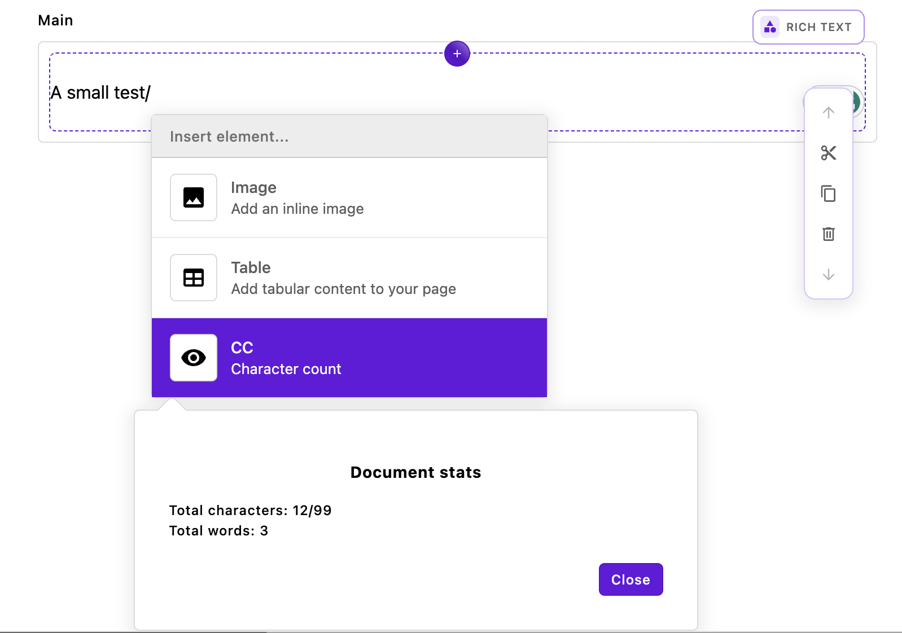

# The `@apostrophecms/characterCount` extension


The third Tiptap extension added by our bundle of modules is the `characterCount` extension. While you might find this extension useful in your project, the main point is to show how to add a new button to the toolbar or item to the insert menu. It will also introduce us to some additional Tiptap methods that we touched on briefly in covering the `smilies` extension.

This extension provides us with character and word counts for the content of the rich text editor. Highlighting some text and then activating this tool from the toolbar will give us total characters, total words, highlighted characters, and highlighted words. Activating this extension from the insert menu by typing `/` and then selecting it from the menu will only provide the total characters and words. This extension takes a per-area or project-wide option of `limit` in the `charCountConfig` object. This option can be used to restrict the number of characters that can be added to an editor. See the [repository README](https://github.com/apostrophecms/rich-text-example-extensions/blob/main/README.md) for more detailed information.

### The `index.js` file

<AposCodeBlock>

```javascript
module.exports = {
  improve: '@apostrophecms/rich-text-widget',
  options: {
    charCountConfig: {}
  },
  extendMethods(self) {
    return {
      getBrowserData(_super, req) {
        const initialData = _super(req);
        // This adds the character count to the toolbar
        const finalTools = {
          ...initialData.tools,
          characterCount: {
            component: 'TiptapCharacterCount',
            label: 'CC'
          }
        };

        // This makes the character count available to be added to the insert menu
        const finalInsert = {
          ...initialData.insertMenu,
          characterCount: {
            label: 'CC',
            icon: 'eye-icon',
            description: 'Character count',
            component: 'TiptapCharacterCountBox'
        }
      };

      // Also adds in the configuration options
        const finalData = {
          ...initialData,
          tools: finalTools,
          insertMenu: finalInsert,
          aposCharCountConfig: self.options.charCountConfig
        }
        return finalData;
      }
    }
  }
};
```
  <template v-slot:caption>
    characterCount/index.js
  </template>

</AposCodeBlock>

The main file of this extension is slightly more complex than those of the other two extensions. This is because we are enabling the addition of buttons to both the toolbar and the insert menu. Within the `getBrowserData(_super, req)` of the `extendedMethods(self)` configuration method, we once again get the existing configuration of the rich-text-widget using `const initialData = _super(req);`.

```javascript
const finalTools = {
  ...initialData.tools,
  characterCount: {
    component: 'TiptapCharacterCount',
    label: 'CC'
  }
};
```
Next, we are enhancing the `tools` object, which holds settings for all the tools that can be added to the editor's toolbar. First, we use the spread operator to retain the existing tools in the object. Then, we introduce a new property, `characterCount`. This is the name you add to the rich-text-widget `toolbar` array to enable this tool, as detailed in the [ApostropheCMS documentation](https://v3.docs.apostrophecms.org/guide/core-widgets.html#rich-text-widget). The `characterCount` property has an object with two properties.  The `component` property specifies the name of the Vue component (minus its file extension) that generates the user interface modal. This modal appears when the toolbar button is clicked. You'll find the component file in the `characterCount/ui/apos/components` directory. The `label` property determines the text displayed to the user in the button on the toolbar.

```javascript
const finalInsert = {
    ...initialData.insertMenu,
    characterCount: {
      label: 'CC',
      icon: 'eye-icon',
      description: 'Character count',
      component: 'TiptapCharacterCountBox'
  }
};
```
The next block of code adds to the `insertMenu` object. This object contains properties for all the items that can be added to the insert menu. Again, we spread the original object and then add our new property. This time we are passing a `label` and `icon` in the `characterCount` object to be displayed in the menu item. Of note, the [icon has already been registered](https://v3.docs.apostrophecms.org/reference/module-api/module-overview.html#icons), so we don't have to do it in this module. Once again, the `component` property passes the name of the Vue component file located in the `characterCount/ui/apos/components/` folder.

```javascript
const finalData = {
  ...initialData,
  tools: finalTools,
  insertMenu: finalInsert,
  aposCharCountConfig: self.options.charCountConfig
}
return finalData;
```
Finally, we construct and return a new object composed of the `intitialData` from the `getBrowserData()` method along with each of our modified properties and our new options object.

### The Vue toolbar component

In order to display our character count modal from either the toolbar or the insert menu we need to create two Vue components. These components share some logic that was moved into a mixin file, but this isn't something that is required.

Looking at the toolbar component first:

<AposCodeBlock>

```javascript
<template>
  <div class="apos-cc-toolbar">
    <AposButton type="rich-text" @click="takeAction" :class="{ 'apos-is-active': buttonActive }" :label="tool.label" :modifiers="['no-border', 'no-motion']" />
    <div v-if="active" v-click-outside-element="close" class="apos-popover apos-cc-toolbar__dialog" x-placement="bottom"
      :class="{
        'apos-is-triggered': active,
        'apos-has-selection': hasSelection
      }">
      <div class="character-count" v-if="editor">
        <h3>Document stats</h3>
        Total characters: {{ totalCharactersCount }}{{ editorLimitText }}
        <br>
        Total words: {{ totalWordsCount }}
        <br>
        <div v-if="hasSelection">
          Highlighted characters: {{ highlightedCharacters }}
          <br>
          Highlighted words: {{ highlightedWords }}
        </div>
      </div>
      <footer class="apos-cc-toolbar__footer">
        <AposButton type="primary" label="apostrophe:close" @click="close" :modifiers="formModifiers" />
      </footer>
    </div>
  </div>
</template>

<script>
import characterCountMixin from '../mixins/characterCountMixin';

export default {
  name: 'RichTextCCToolbar',
  mixins: [characterCountMixin],
  props: {
    tool: {
      type: Object,
      required: true
    }
  },
  data() {
    return {
      active: false,
      highlightedCharacters: 0,
      highlightedWords: 0
    };
  },
  computed: {
    buttonActive() {
      return this.active;
    }
  },
  mounted() {
    this.calculateHighlightedWords();
    this.calculateHighlightedCharacters();
  },
  watch: {
    active(newVal) {
      if (newVal) {
        this.calculateHighlightedWords();
        this.calculateHighlightedCharacters();
      }
    },
  },
  methods: {
    close() {
      if (this.active) {
        this.active = false;
        this.editor.chain().focus();
      }
    },
    takeAction() {
      this.active = !this.active;
      if (this.active) {
        this.populateFields();
      };
    },
    calculateHighlightedCharacters() {
      this.highlightedCharacters = this.hasSelection ? this.editor.commands.getHighlightedStats('characters') : 0;
    },
    calculateHighlightedWords() {
      this.highlightedWords = this.hasSelection ? this.editor.commands.getHighlightedStats('words') : 0;
    },
  }
};
</script>
```

  <template v-slot:caption>
    characterCount/ui/apos/components/RichTextCCToolbar.vue
  </template>

</AposCodeBlock>

To conserve space we have left the component style block out of the code above. You can look at the [component code in the GitHub repository](https://github.com/apostrophecms/rich-text-example-extensions/blob/main/modules/%40apostrophecms/characterCount/ui/apos/components/RichTextCCToolbar.vue) if you want to review it. The majority of that code will style the new modal to look like the existing Apostrophe UI components. If you haven't made a lot of custom changes to the admin UI, you should use this "boilerplate" styling with changes to match the classes in your markup.

#### The `template`

```javascript
<div v-if="active" v-click-outside-element="close" class="apos-popover apos-cc-toolbar__dialog" x-placement="bottom"
  :class="{
    'apos-is-triggered': active,
    'apos-has-selection': hasSelection
}">
  <div class="character-count" v-if="editor">
    <h3>Document stats</h3>
    Total characters: {{ totalCharactersCount }}{{ editorLimitText }}
    <br>
    Total words: {{ totalWordsCount }}
    <br>
    <div v-if="hasSelection">
      Highlighted characters: {{ highlightedCharacters }}
      <br>
      Highlighted words: {{ highlightedWords }}
    </div>
  </div>
  <footer class="apos-cc-toolbar__footer">
    <AposButton type="primary" label="apostrophe:close" @click="close" :modifiers="formModifiers" />
  </footer>
</div>
```


Focusing on the `template` markup, the majority is under the control of a div wrapper with a `v-if` directive that controls whether or not the modal HTML is displayed based on the value of `active`. There are two important attributes here. The `v-click-outside-element="close"` is important for triggering the `close()` method of the modal if the user clicks outside of the modal. This is in keeping with the other toolbar modals, but you could prefer to have the user click on the footer cancel button instead. The second attribute is `x-placement="bottom"`. This dictates how the `tippy.js` library handles the arrow placement for the modal.

Within this div, we are creating markup to present the user with the number of characters using the methods in this code and our mixin code. We will cover these methods and the Tiptap `editor.commands` when we dig into the `script` section of this template.

Finally, at the end of this modal markup we use an apostrophe component within a footer. The `AposButton` is taking an `@click="close"` to provide a close button for the modal. Note that for the label we are using the `apostrophe` namespace to translate the `close` string. This will take advantage of the built-in translation strings, but you may wish to provide a namespace and translation of your own.

```javascript
<AposButton type="rich-text" @click="takeAction" :class="{ 'apos-is-active': buttonActive }" :label="tool.label" :modifiers="['no-border', 'no-motion']" />
```

At the very top of the template, there is another `AposButton` component. This is the button that will be displayed to the user on the rich-text editor toolbar. The `@click` directive binds the `takeAction()` method to the button. As we will explore, this method toggles the `active` prop to then cause the modal markup to be added through the `v-if` directive that we covered. In this example, we are only passing in a label for the button. We could also choose to pass an icon. If you want to add icons in your own extensions, please examine the [code for the `link` toolbar item](https://github.com/apostrophecms/apostrophe/blob/87860e7a2f85395c847bb156ecc0a586d7317eeb/modules/%40apostrophecms/rich-text-widget/ui/apos/components/AposTiptapLink.vue#L3).

#### The `script`

```javascript
<script>
import characterCountMixin from '../mixins/characterCountMixin';

export default {
  name: 'RichTextCCToolbar',
  mixins: [characterCountMixin],
  props: {
    tool: {
      type: Object,
      required: true
    }
  },
  data() {
    return {
      active: false,
      highlightedCharacters: 0,
      highlightedWords: 0
    };
  },
  computed: {
    buttonActive() {
      return this.active;
    }
  },
  mounted() {
    this.calculateHighlightedWords();
    this.calculateHighlightedCharacters();
  },
  watch: {
    active(newVal) {
      if (newVal) {
        this.calculateHighlightedWords();
        this.calculateHighlightedCharacters();
      }
    },
  },
  methods: {
    close() {
      if (this.active) {
        this.active = false;
        this.editor.chain().focus();
      }
    },
    takeAction() {
      this.active = !this.active;
      if (this.active) {
        this.populateFields();
      };
    },
    calculateHighlightedCharacters() {
      this.highlightedCharacters = this.hasSelection ? this.editor.commands.getHighlightedStats('characters') : 0;
    },
    calculateHighlightedWords() {
      this.highlightedWords = this.hasSelection ? this.editor.commands.getHighlightedStats('words') : 0;
    },
  }
};
</script>
```

Moving on to the `script` section of the template. We will only cover this code briefly as the majority is a fairly standard Vue 2 component without much that is specific to Apostrophe or Tiptap, until we get to the methods object. Some code is shared between our two components and has been factored out to a mixin located at `characterCount/ui/apos/mixins/characterCountMixin.js`. This file is imported at the start of our `script` block and we will touch on this file only briefly because the code it contains will largely be explained by covering our two components.

```javascript
name: 'RichTextCCToolbar',
mixins: [characterCountMixin],
props: {
  tool: {
    type: Object,
    required: true
  }
},
```

At the top of our export, we are naming our component and passing the imported mixin. For a toolbar button, we need to pass the `tool` prop to get the label for the button that we set in our `characterCount` object that was passed to the `tools` array. This is the only Apostrophe-specific part of our script.

```javascript
data() {
  return {
    active: false,
    highlightedCharacters: 0,
    highlightedWords: 0
  };
},
```

In our `data()` method we are initializing the `active` computed property that determines if the modal should be displayed. We are also initializing our `highlightedCharacters` and `highlightedWords` properties. These two are specific to the toolbar modal. The other three computed properties used in this component, `totalCharactersCount`, `totalWordsCount`, and `editorLimitText` are used in both components, so they are initialized in the mixin.

```javascript
computed: {
  buttonActive() {
    return this.active;
  }
},
```
In our computed object, we are creating a `buttonActive()` computed property. This will cause the class on toolbar button to reflect whether or not the tool is active and provide modified styling.

```javascript
mounted() {
  this.calculateHighlightedWords();
  this.calculateHighlightedCharacters();
},
```
In the `mounted()` method we invoke our methods to calculate the numbers of highlighted words and characters, as defined in the methods section. In the mixin, we are calling the methods to calculate the overall numbers of words and characters present in the text editor.

```javascript
watch: {
  active(newVal) {
    if (newVal) {
      this.calculateHighlightedWords();
      this.calculateHighlightedCharacters();
    }
  },
},
```
The `watch` object contains a function that monitors changes to the `active` property. When `active` changes to `true`, the number of characters is recalculated using the methods in this script and the mixin.

```javascript
methods: {
  close() {
    if (this.active) {
      this.active = false;
      this.editor.chain().focus();
    }
  },
  takeAction() {
    this.active = !this.active;
    if (this.active) {
      this.populateFields();
    };
  },
  calculateHighlightedCharacters() {
    this.highlightedCharacters = this.hasSelection ? this.editor.commands.getHighlightedStats('characters') : 0;
  },
  calculateHighlightedWords() {
    this.highlightedWords = this.hasSelection ? this.editor.commands.getHighlightedStats('words') : 0;
  },
}
```
There are four method functions. In the `close()` method we are toggling the active state to close the modal and then using the Tiptap `chain()` and `focus()` methods to return focus to the editor box when the dialog box closes. In this case, we don't need the `chain()` method since we are only passing a single additional method, and not a chain of them. But for teaching purposes, it is good to know it exists.

The `takeAction()` method also toggles the `active` state, this time when the toolbar button is clicked. If `active` is true, it then calls the `populateFields()` method that is defined in the mixin. This method increments the `generation` data property, triggering an update of the DOM. This is a common pattern used by components in Apostrophe.

The `calculateHighlightedCharacters()` and `calculateHighlightedWords()` methods both use a method that is defined in our custom Tiptap extension and added to the Tiptap `commands` object. The methods in this object are used for a wide range of text editing functions. This includes basic text formatting (like making text bold or italic), inserting or removing content, creating lists, setting or removing attributes, and much more. For example, `editor.commands.bold()` would toggle bold formatting on the currently selected text. The conditionals in each method called here test whether the user has any text highlighted using the `hasSelection()` computed property defined in the mixin. We will return to this when we cover the mixin, as it is a very common method when creating a Tiptap extension in Apostrophe.

### The Vue insert component

<AposCodeBlock>

```javascript
<template>
  <div v-if="active" v-click-outside-element="close" class="apos-popover apos-cc-insert__dialog"
    x-placement="bottom" :class="{
      'apos-is-triggered': active
    }"
  >
    <AposContextMenuDialog menu-placement="top-start">
      <div class="character-count" v-if="editor">
        <h3>Document stats</h3>
        Total characters: {{ totalCharactersCount }}{{ editorLimitText }} 
        <br>
        Total words: {{ totalWordsCount }}
      </div>
      <footer class="apos-cc-control__footer">
        <AposButton type="primary" label="apostrophe:close" @click="close" :modifiers="formModifiers" />
      </footer>
    </AposContextMenuDialog>
  </div>
</template>

<script>
import characterCountMixin from '../mixins/characterCountMixin';

export default {
  name: 'RichTextCCInsert',
  mixins: [characterCountMixin],
  props: {
    active: {
      type: Boolean,
      required: true
    }
  },
  methods: {
    close() {
      if (this.active) {
        this.$emit('done');
      }
    },
  }
};
</script>
```
  <template v-slot:caption>
    characterCount/apos/ui/components/RichTextCCInsert.vue
  </template>

</AposCodeBlock>

#### The `template`

```javascript
<template>
  <div v-if="active" v-click-outside-element="close" class="apos-popover apos-cc-insert__dialog"
    x-placement="bottom" :class="{
      'apos-is-triggered': active
    }"
  >
    <AposContextMenuDialog menu-placement="top-start">
      <div class="character-count" v-if="editor">
        <h3>Document stats</h3>
        Total characters: {{ totalCharactersCount }}{{ editorLimitText }}
        <br>
        Total words: {{ totalWordsCount }}
      </div>
      <footer class="apos-cc-control__footer">
        <AposButton type="primary" label="apostrophe:close" @click="close" :modifiers="formModifiers" />
      </footer>
    </AposContextMenuDialog>
  </div>
</template>
```

Just like the toolbar component, the insert modal presented to the user is wrapped in a div that is conditionally populated with `v-if="active"` and can trigger the closure of the modal if the user clicks outside. In this case, however, Apostrophe provides us with both the triggering button and a component, `AposContextMenuDialog`, for displaying our modal markup. We are again passing the `x-placement` attribute to position the `tippy.js` tooltip arrow correctly.

Within the `AposContextMenuDialog` component, we specify `menu-placement="top-start"` to determine the placement of the tooltip arrow, typically at the top start since menus usually open downwards. Additionally, we incorporate a sanity check using the `v-if="editor"` condition to ensure that the document statistics are only displayed when the editor instance is properly initialized and available, enhancing the component's reliability. Following the display of our statistics we have a `footer` with an `AposButton` component to close the modal.

#### The `script`

```javascript
<script>
import characterCountMixin from '../mixins/characterCountMixin';

export default {
  name: 'RichTextCCInsert',
  mixins: [characterCountMixin],
  props: {
    active: {
      type: Boolean,
      required: true
    }
  },
  methods: {
    close() {
      if (this.active) {
        this.$emit('close');
      }
    },
  }
};
</script>
```
The script for the insert menu modal is almost completely contained within the mixin file. Once again we import that file and set up our export to use it along with the name of the component. In this case, Apostrophe is supplying the button that toggles the `active` state, so it is passed in with the `props`, rather than being calculated. The only other code in the script is in the `methods` object. The `close()` method is called when the user clicks outside the modal or clicks on the close button. This will emit a `close` event. This is received by the parent `AposRichTextWidgetEditor.vue` component, causing it to close the modal, remove the slash used to open the insert menu, and return focus to the editor. In the case where content is being added to the editor, this will also validate that material and either insert it in place of the slash, or throw an error. There is another event, `cancel` that simply closes the modal and returns the focus to the editor without removing the slash.

### The component mixin

<AposCodeBlock>

```javascript
export default {
  data() {
    return {
      generation: 1,
      triggerValidation: false,
      formModifiers: ['small', 'margin-micro'],
      totalCharactersCount: 0,
      totalWordsCount: 0
    };
  },
  props: {
    options: {
      type: Object,
      required: true
    },
    editor: {
      type: Object,
      required: true
    }
  },
  computed: {
    moduleOptions() {
      return apos.modules[apos.area.widgetManagers['@apostrophecms/rich-text']]
        .aposCharCountConfig;
    },
    widgetOptions() {
      if (this.options?.charCountConfig) {
        return this.options.charCountConfig;
      }
      return {};
    },
    editorLimitText() {
      if (this.moduleOptions?.limit || this.widgetOptions?.limit) {
        const limit = this.widgetOptions.limit
          ? this.widgetOptions.limit
          : this.moduleOptions.limit;
        return `/${limit}`;
      }
      return '';
    },
    hasSelection() {
      const { state } = this.editor;
      const { selection } = this.editor.state;
      const { from, to } = selection;
      const text = state.doc.textBetween(from, to, '');
      return text !== '';
    }
  },
  mounted() {
    this.calculateTotalCharacters();
    this.calculateTotalWords();
  },
  watch: {
    active(newVal) {
      if (newVal) {
        this.calculateTotalCharacters();
        this.calculateTotalWords();
        window.addEventListener('keydown', this.keyboardHandler);
      } else {
        window.removeEventListener('keydown', this.keyboardHandler);
      }
    },
  },
  methods: {
    keyboardHandler(e) {
      if (e.keyCode === 27 || e.keyCode === 13) {
        this.close();
        e.preventDefault();
      }
    },
    async populateFields() {
      this.generation++;
    },
    calculateTotalCharacters() {
      this.totalCharactersCount = this.editor.commands.getTotalCharactersCount();
    },
    calculateTotalWords() {
      this.totalWordsCount = this.editor.commands.getTotalWordsCount();
    }
  }
};
```
  <template v-slot:caption>
    characterCount/ui/apos/mixins/characterCountMixin.js
  </template>

</AposCodeBlock>

Starting with the `data()` method we are returning a number of reactive data properties, some of which are specific to the extension, and some that are specific for the majority of Apostrophe components. 

```javascript
data() {
  return {
    generation: 1,
    triggerValidation: false,
    formModifiers: ['small', 'margin-micro'],
    totalCharactersCount: 0,
    totalWordsCount: 0
  };
},
```

The `totalCharactersCount` and `totalWordsCount` initialize these two properties for extension-specific data. The `generation` property is commonly used in Apostrophe components to trigger a re-render through a watcher. The `triggerValidation` is used to validate any input prior to insertion. For this extension we aren't receiving any input from the user, so we could eliminate this property. In your custom editor extension you might need to include it. Finally, we are passing a `formModifiers` property to keep track of modal styling.

```javascript
props: {
  options: {
    type: Object,
    required: true
  },
  editor: {
    type: Object,
    required: true
  }
},
```

Within the `props` object, we are passing two props from the parent `AposRichTextWidgetEditor.vue` component. This includes the `editor` instance.

```javascript
computed: {
  moduleOptions() {
    return apos.modules[apos.area.widgetManagers['@apostrophecms/rich-text']]
      .aposCharCountConfig;
  },
  widgetOptions() {
    if (this.options?.charCountConfig) {
      return this.options.charCountConfig;
    }
    return {};
  },
  editorLimitText() {
    if (this.moduleOptions?.limit || this.widgetOptions?.limit) {
      const limit = this.widgetOptions.limit
        ? this.widgetOptions.limit
        : this.moduleOptions.limit;
      return `/${limit}`;
    }
    return '';
  },
  hasSelection() {
    const { state } = this.editor;
    const { selection } = this.editor.state;
    const { from, to } = selection;
    const text = state.doc.textBetween(from, to, '');
    return text !== '';
  }
},
```

The `computed` object has two methods, `moduleOptions()` and `widgetOptions()` that retrieve the module options. The first gets the options that are stored in the `apos.modules` object set in the `app.js` file or in a project-level `modules/@apostrophecms/rich-text-widget/index.js` file. The second retrieves any options set on the `rich-text-widget` instance of that specific area, so page- or piece-specific options.

The `editorLimitText()` method takes the options and returns a template literal string that is added in the modal to the 'total characters' string. If no character limit has been set, it returns an empty string.

The `hasSelection()` method is present in the majority of the Apostrophe `rich-text-widget` components. First, we access the current `state` of the editor. This `state` has a variety of information about the entire state of the document. This includes the current selection, the overall document structure (like how many nodes there are), and more. Next, from the `state` object we capture the `selection`. This `selection` includes the starting (`from`) and ending (`to`) cursor position of any selection. This method then uses the ProseMirror `textBetween` method. This will return either the text contained between the `from` and `to` cursor positions, or an empty string. This is then evaluated to return `true` only if `text` is not an empty string indicating there is text selected in the editor.

```javascript
mounted() {
  this.calculateTotalCharacters();
  this.calculateTotalWords();
},
```
The `mounted()` method uses methods defined in this mixin to calculate the statistics presented to the user.

```javascript
watch: {
  active(newVal) {
    if (newVal) {
      this.calculateTotalCharacters();
      this.calculateTotalWords();
      window.addEventListener('keydown', this.keyboardHandler);
    } else {
      window.removeEventListener('keydown', this.keyboardHandler);
    }
  },
},
```
The `watch` object is being set-up to monitor the `active` property that controls whether to modal is displayed. If the value goes from `false` to `true`, it recalculates the current statistics for the editor and adds a listener from the `methods()` to allow the user to close the modal from the keyboard. Otherwise, it removes the listener.

```javascript
methods: {
  keyboardHandler(e) {
    if (e.keyCode === 27 || e.keyCode === 13) {
      this.close();
      e.preventDefault();
    }
  },
  async populateFields() {
    this.generation++;
  },
  calculateTotalCharacters() {
    this.totalCharactersCount = this.editor.commands.getTotalCharactersCount();
  },
  calculateTotalWords() {
    this.totalWordsCount = this.editor.commands.getTotalWordsCount();
  }
}
```
The `methods` object provides the `keyboard()` handler method that we used in the `active()` method just mentioned. It also provides the `populateFields()` method that is commonly used in Apostrophe components to trigger a DOM refresh by updating the `generation` property. The final two methods `calculateTotalCharacters()` and `calculateTotalWords()` utilize commands added to our editor instance through our extension that we will cover next.

### The Tiptap character count extension

Now that we have covered the implementation of our modal components, we need to circle back to how we are interfacing these components with our Tiptap editor. Our `characterCount` module has a file in the `ui/apos/tiptap-extensions` that looks much like the files for the other two modules we have already discussed, so we won't go through it in detail. It collects the project-wide and per-area options and passes them to the instance of our extension. Like the `smilies` module, it also imports the code for the extension from a `lib` folder located in the module. Let's look at the code for that module.

<AposCodeBlock>

```javascript
import { Extension } from '@tiptap/core';
import { Plugin, PluginKey } from '@tiptap/pm/state';

const CharacterCount = Extension.create({
  name: 'characterCount',

  addOptions() {
    return {
      limit: null
    };
  },

  addCommands() {
    return {
      getHighlightedStats:
        (type = 'characters') =>
        ({ state }) => {
          const { from, to } = state.selection;

          if (from === to) return 0;

          // Extract text for character count (no extra spaces at node boundaries)
          const textForCharacters = state.doc.textBetween(from, to, null, '');
          const charactersCount = textForCharacters.length;

          // Extract text for word count (with spaces at node boundaries)
          const textForWords = state.doc.textBetween(from, to, ' ', ' ');
          let wordsCount = textForWords
            .split(' ')
            .filter((word) => word !== '').length;

            // if selection has an isolated slash at the end, remove it from the count
          if (/\s\/$/.test(textForWords)) {
            wordsCount--;
          }

          return type === 'characters' ? charactersCount : wordsCount;
        },

      getTotalCharactersCount:
        () =>
        ({ state }) => {
          const text = state.doc.textContent;
          return text[text.length - 1] === '/' ? text.length - 1 : text.length;
        },
      getTotalWordsCount:
        () =>
        ({ state }) => {
          let wordCount = 0;

          state.doc.descendants((node) => {
            if (node.isText) {
              const words = node.text.trim().split(/\s+/).filter(Boolean);
              wordCount += words.length;
            }
          });

          const docText = state.doc.textContent;
          const endsWithIsolatedSlash = /\s\/$/.test(docText);

          if (endsWithIsolatedSlash) {
            wordCount = wordCount > 0 ? wordCount - 1 : 0;
          }

          return wordCount;
        }
    };
  },

  addProseMirrorPlugins() {
    return [
      new Plugin({
        key: new PluginKey('characterCount'),
        filterTransaction: (transaction, state) => {
          const limit = this.options.limit;
          if (
            !transaction.docChanged ||
            limit === 0 ||
            limit === null ||
            limit === undefined
          ) {
            return true;
          }

          // Check if the transaction is a paste operation
          const isPaste = transaction.getMeta('paste');

          // Get the total characters count from the new state
          const totalCharacters = transaction.doc.textContent.length;

          // If the total number of characters exceeds the limit, rollback the transaction
          if (totalCharacters > limit) {
            if (isPaste) {
              // For pasted content, try to remove the exceeding content
              const over = totalCharacters - limit;
              const pos = transaction.selection.$head.pos;
              const from = pos - over;
              const to = pos;
              transaction.deleteRange(from, to);
            } else {
              // If the limit will be exceeded, block the transaction
              return false;
            }
          }

          // Allow the transaction if within the limit
          return true;
        }
      })
    ];
  }
});

export default CharacterCount;
```
  <template v-slot:caption>
    characterCount/lib/characterCountExtension.js
  </template>

</AposCodeBlock>

In our journey through creating custom Tiptap extensions, we've already explored how `addInputRules()` can be used to define specific input behaviors. In this extension, we will not only leverage additional configuration methods from the Tiptap API but also the underlying ProseMirror API.

```javascript
import { Extension } from '@tiptap/core';
import { Plugin, PluginKey } from '@tiptap/pm/state';
```

We are starting by importing the `Extension` construct from the Tiptap API. We used this construct when creating the `smilies` extension. Next, we import the `Plugin` class from the ProseMirror API. When developing Tiptap extensions, ProseMirror `Plugin` instances are often used to create more complex behavior. At the same time, we are also importing the ProseMirror `PluginKey` utility. This utility allows us to uniquely identify each ProseMirror plugin. This can allow us to access and manipulate the state of a plugin within the editor. This also allows us to update or replace a plugin within an editor configuration.

```javascript
const CharacterCount = Extension.create({
  name: 'characterCount',

  addOptions() {
    return {
      limit: null
    };
  },
```

The `addOptions()` method of the Tiptap `Extension` class serves as a setup function where you can specify default values and structures for the options that your extension will use. In this case, we are allowing the user to pass a `limit` option that will restrict the number of characters that can be added to an editor. We are initializing it to `null` to specify that by default, there is no limit. In our `smilies` extension, we could have used `addOptions()` to specify a default skin tone. Instead, we used `const tone = this.options.tone || 2;`. If you have a large number of configuration options, it is usually easier to maintain defaults using `addOptions()`, but it isn't required.

```javascript
addCommands() {
  return {
    // ...
  };
},
```

#### Adding commands
The `addCommands()` method in Tiptap is essential for defining custom commands that enhance or modify the functionality of the editor. These commands have the capability to interact with the editor's state, manipulate the document, or initiate specific actions. The decision to incorporate certain functionalities into `addCommands()`, as opposed to retaining them within a Vue component, hinges on various considerations. If a method is anticipated to be utilized across multiple components, integrating it into `addCommands()` is often more effective. This method is adept at handling complex state transitions and selections, making it a robust choice for intricate functionalities. Additionally, incorporating a method in this manner ensures seamless integration with Tiptap's command API, including features like the undo/redo stack, and fosters interoperability with other extensions and commands. While these methods could have been included in a mixin or individual components, understanding and utilizing `addCommands()` offers valuable insights into advanced functionality implementation within Tiptap.

```javascript
getHighlightedStats:
  (type = 'characters') =>
  ({ state }) => {
    const { from, to } = state.selection;
    if (from === to) return 0;
    // Extract text for character count (no extra spaces at node boundaries)
    const textForCharacters = state.doc.textBetween(from, to, null, '');
    const charactersCount = textForCharacters.length;

    // Extract text for word count (with spaces at node boundaries)
    const textForWords = state.doc.textBetween(from, to, ' ', ' ');
    let wordsCount = textForWords
      .split(' ')
      .filter((word) => word !== '').length;
      // if selection has an isolated slash at the end, remove it from the count
    if (/\s\/$/.test(textForWords)) {
      wordsCount--;
    }

    return type === 'characters' ? charactersCount : wordsCount;
  },
  ```

  The first command that we are adding calculates the number of highlighted characters. It can accept a single argument of `type` that defaults to `characters`, allowing us to calculate either the number of words or characters with this same function. The returned arrow function takes the `state` from the editor. This state object is then destructured to get the starting and ending cursor positions, as was done with the `hasSelection()` method in our toolbar Vue component. If those two positions are the same we then trigger an early return since there isn't anything highlighted.

```javascript
const textForCharacters = state.doc.textBetween(from, to, null, '');
const charactersCount = textForCharacters.length;
```
To get the number of highlighted characters we are using the ProseMirror `textBetween()` helper method. This method takes four arguments and returns a plain text string from a specified range. The first two arguments, `from` and `to`, take integers that indicate the positions in the document we are selecting. In our case, this is the region the user has highlighted. The third argument is the `blockSeparator` argument. It takes a string to be inserted when a new block-level content node is discovered. For example, it would be inserted between two paragraphs or the items in a list. The fourth argument is the `leafText` argument. Like the previous argument, it takes a string to be inserted into the processed text. However, in this case, it is what should be inserted when encountering non-text content in the selection, like inline images. For these last two arguments we are passing `null` and an empty string. We could have passed `null` or an empty string for both. This is just to illustrate that you can use either.

Another approach we could have used here is to use the ProseMirror `slice()` helper method. This method returns an object that includes not just the content itself, but also information about how it can be integrated into another document or another area of the same document, maintaining the original structure and formatting. This is useful when copying or cutting a section from your document. Using this method would be more complex because we would have to loop through each of the returned nodes and subnodes to find those containing text, hence our use of `textBetween` that simplifies the returned content.

```javascript
const textForWords = state.doc.textBetween(from, to, ' ', ' ');
let wordsCount = textForWords
  .split(' ')
  .filter((word) => word !== '').length;
  // if selection has an isolated slash at the end, remove it from the count
if (/\s\/$/.test(textForWords)) {
  wordsCount--;
}
```
In order to get a count of the number of words, we are once again using the `textBetween` helper method to parse over the selected text. This time however, we are adding spaces for the boarders between nodes and in place of non-text content. This then allows us to use `split` and `filter` to create an array of words and get rid of empty spaces. While the highlighted stats will likely only be called from the toolbar, we are also adding a conditional to decrease the word count by one if the last "word" is a slash, as would be used to open the insert menu.

```javascript
return type === 'characters' ? charactersCount : wordsCount;
```
Finally, we are returning the number of characters or words based on the `type` argument supplied to the method.

```javascript
getTotalCharactersCount:
  () =>
  ({ state }) => {
    const text = state.doc.textContent;
    return text[text.length - 1] === '/' ? text.length - 1 : text.length;
  },
```
To calculate the total number of characters in the document we are using the `textContent` property of the entire document. ProseMirror automatically adds this property to all nodes and it contains all the text from the node and its descendants as a plain text string.  This simplifies the process of extracting text from a document node abstracting away the need to manually traverse the node tree and concatenate text from individual text nodes. Here we are also subtracting from the character count if the final character is a slash indicating that the insert menu was opened.

```javascript
getTotalWordsCount:
  () =>
  ({ state }) => {
    let wordCount = 0;
    state.doc.descendants((node) => {
      if (node.isText) {
        const words = node.text.trim().split(/\s+/).filter(Boolean);
        wordCount += words.length;
      }
    });
    const docText = state.doc.textContent;
    const endsWithIsolatedSlash = /\s\/$/.test(docText);
    if (endsWithIsolatedSlash) {
      wordCount = wordCount > 0 ? wordCount - 1 : 0;
    }
    return wordCount;
  }
```
The final command we are adding returns the total word count from the document, again accounting for the slash added when opening the insert menu. We can't use `textContent` in this case, because this property doesn't contain additional characters between nodes, which will cause words to run together. Instead, we are using the `descendants` traversal utility method from ProseMirror. This is a fundamental method for examining or modifying large parts of the document. When called it walks through the supplied node tree, applying the supplied function to each.

In the callback function, we are first checking the `isText` property of the node. If the node is a text node, we add the number of words to the running count of words.

This word count could also have been conducted using the ProseMirror `findTextNode()` utility. This helper is much like `descendants()` in that it traverses the supplied node and child nodes, but it only applies the callback to text nodes. For example:

```javascript
let wordCount = 0;
findTextNodes(state.doc).forEach(node => {
  const words = node.text.trim().split(/\s+/).filter(Boolean);
  wordCount += words.length;
});
```

#### Creating ProseMirror plugins

```javascript
addProseMirrorPlugins() {
    return [
      new Plugin({
        // ...
      })
    ];
  }
  ```
A fundamental aspect of Tiptap's architecture lies in its ability to extend and enhance the underlying ProseMirror framework through the `addProseMirrorPlugins()` method. This method opens the door to a myriad of functionalities, significantly broadening the scope and capability of any Tiptap editor. It enables the integration of complex features like advanced versioning and history management. Additionally, it facilitates the implementation of real-time collaborative editing, allowing multiple users to work on the same document simultaneously seamlessly and interactively. A prime example of its utility is demonstrated in this extension, where `addProseMirrorPlugins()` is leveraged to introduce transaction-level control. This control is crucial for enforcing constraints like character limits within the editor, ensuring that content adheres to specified guidelines or limitations.

The `addProseMirrorPlugins()` function returns an array of individual plugins. There are numerous ProseMirror plugins available that can be imported into your Tiptap extension, but in this case we are using the `new Plugin()` constructor to create a custom plugin. This constructor takes an options object that defines the plugin's behavior and functionality.

```javascript
key: new PluginKey('characterCount'),
```
Within the `Plugin` object, we are passing a `key` property, with another ProseMirror constructor function as value. This will generate an object that can be used to access or replace the plugin's state more easily.

```javascript
filterTransaction: (transaction, state) => {
  // ...
}
```
The `filterTransaction` property allows you to add methods to inspect and modify or prevent transactions from being applied to the editor's state. This includes typing characters or pasting a block of text. It should return a boolean indicating whether the transaction should be allowed. ProseMirror plugin options can also include several other properties not used here. The `props` property can be used to override or extend editor properties, including `handleDOMEvents` to handle browser events, `handleTextInput` to handle direct text input, properties to handle keyboard events, and `decorations` that can be used to add styling or interactive elements to the document. The `appendTransaction` property is also quite useful to add transactions in response to transactions that have just been processed.

```javascript
const limit = this.options.limit;
if (
  !transaction.docChanged ||
  limit === 0 ||
  limit === null ||
  limit === undefined
) {
  return true;
}
```
Within our `filterTransactions` method, we are retrieving the `limit` option that we added at the start of the extension file in the `addOptions()` method. If the document hasn't changed or that limit isn't set to a number greater than 0, then the function returns `true`, meaning that the transaction should be allowed.

```javascript
const isPaste = transaction.getMeta('paste');
```
Next, we check whether the transaction is from the user pasting content by checking the transaction object `getMeta()` method and passing in `paste` as an argument. Other arguments to `getMeta()` are going to depend on what extensions are installed, but include `addToHistory` to indicate if a transaction should be added to the undo/redo history, and `uiEvent` to retrieve which UI event, like a click, triggered the transaction. You can also set your own metadata on a transaction using `transaction.setMeta(customKey, metaDataValue)`. While beyond the scope of this tutorial, you would then have to commit any changes to the transaction back to the editor using `view.dispatch(transaction)`.

```javascript
const totalCharacters = transaction.doc.textContent.length;
```
Next, we retrieve the number of characters the entire document would have if the transaction was allowed by looking at the `textContent` property of the `transaction.doc`. Again, the `textContent` will concatenate all of the text in the entire node being examined.

```javascript
if (totalCharacters > limit) {
  if (isPaste) {
    // For pasted content, try to remove the exceeding content
    const over = totalCharacters - limit;
    const pos = transaction.selection.$head.pos;
    const from = pos - over;
    const to = pos;
    transaction.deleteRange(from, to);
  } else {
    // If the limit will be exceeded, block the transaction
    return false;
  }
}
// Allow the transaction if within the limit
return true;
```
Finally, we use some conditional logic to first test if the final number of characters would be greater than the limit if the transaction is allowed. If not, we return true. If it exceeds the limit and the content is being pasted into the editor we then delete the incoming content to make it fit the limit. The `transaction.selection.$head.pos` is going to get the position of the cursor within the transaction. Given that it was just pasted, this will be the end of the pasted content. We then set the `from` position to the number of characters over the limit back from the end of the pasted content and the `to` to the end of the selection (we could also have used `pos` directly, but the code is clearer using `to`). The `deleteRange()` method is then used to delete the characters between the two positions before returning `true` to allow the transaction. If the transaction is coming from the user typing and going over the limit it won't be permitted by returning `false`.

This extension was created to allow for the counting of both total and highlighted characters in our rich-text editor. There is also an official [Tiptap extension](https://tiptap.dev/api/extensions/character-count) that will return the total number of characters in the editor. This extension takes a slightly different route than the extension that we just covered. It makes use of `storage` to hold the word and character values and updates with every transaction, rather than calculating when the modal is activated. The primary purpose of `storage` in a Tiptap extension is to hold data or state relevant to the extension's functionality. This can include settings, temporary data, or any other information the extension needs to function correctly. The `storage` is tied to the lifecycle of the extension itself. It is created when the extension is instantiated and exists as long as the extension is active. The scope of the storage is limited to the extension, meaning it is not directly accessible by other parts of the Tiptap editor or other extensions unless explicitly designed to be so. This is a very useful Tiptap feature that can be used in your custom extensions.

## Summation
In this tutorial series, we walked through how you can improve and customize the ApostropheCMS `rich-text-widget`. On the Apostrophe side, we learned a little about how to add custom options for your modules that improve the core modules using the `getBrowserData()` extended method. We also learned what is needed to add a new button to the toolbar or an item to the insert menu to activate your new functionality.

On the Tiptap side, we introduced how you can use premade extensions from [Tiptap](https://tiptap.dev/) and other developers. We also demonstrated how to make a simple plugin for adding your own string replacements. Finally, we dug deep into Tiptap and ProseMirror development, creating an extension that added a plugin to ProseMirror.

It should be emphasized that the Tiptap and ProseMirror frameworks have much more to offer than what we touched on here. There are many additional utilities and methods available for document manipulation, each offering unique capabilities for enhancing the Apostrophe `rich-text-widget`. Hopefully, these tutorials will set you down the road to customizing the editor in your projects to provide all the special features that you need!