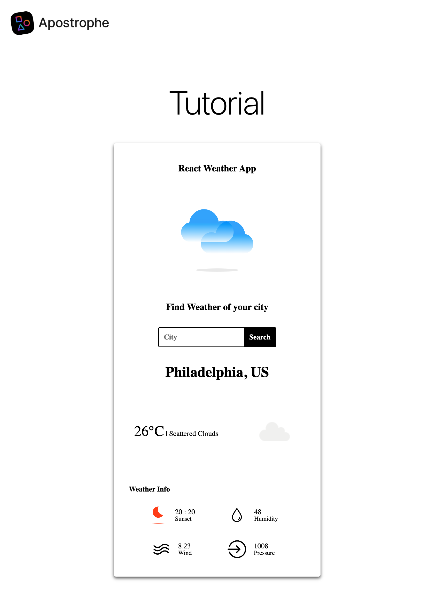

# Using JSX in Apostrophe with Vite

ApostropheCMS offers a robust and flexible platform for building content-rich websites, and it now comes with a powerful built-in Vite build system that caters to most development needs out of the box. This system streamlines the process of managing assets, optimizing performance, and ensuring a smooth developer experience. However, there are times when you may want to extend its capabilities by customizing the build process. One common scenario is integrating React components into your ApostropheCMS project for browser-side rendering, which involves customizing Vite to support JSX (JavaScript XML). By leveraging JSX and React, you can enhance the interactivity and maintainability of your front-end JavaScript components, providing a richer user experience while still taking advantage of the features offered by ApostropheCMS.

### Why Customize Your Webpack Build?

Webpack is a powerful module bundler that compiles JavaScript modules into a single file or multiple files that the browser can understand. Customizing your Webpack configuration can offer several benefits:

1. **Enhanced Development Workflow**: Customizing Vite allows you to integrate modern browser-side JavaScript frameworks like React, Vue, and Svelte, enabling a more component-based architecture.
2. **Performance Optimization**: By customizing Vite, you can take advantage of advanced features such as code splitting, tree shaking, and caching to optimize the performance of your application.
3. **Extended Functionality**: Vite's plugin system allows you to extend its functionality to handle various types of assets (e.g., images, fonts, SVGs) and preprocessors for client-side assets.
4. **Improved Maintainability**: A customized Vite build can help maintain a cleaner and more modular codebase, making it easier to manage and scale your project.


### Advantages of Using JSX for a Dynamic Component

ApostropheCMS uses Nunjucks as its server-side templating engine to handle the initial HTML rendering of your pages. To complement this server-side rendering, you can use JSX with React to add interactive and dynamic components that run entirely in the browser. This combination gives you several advantages:

1. **Component-Based Architecture**: JSX allows you to build reusable components, encapsulating both the markup and logic. This modularity makes it easier to manage complex UIs and promotes code reusability.
2. **State Management**: React's state management capabilities enable you to handle dynamic data changes efficiently. This means you can easily manage and update the state as new data is fetched.
3. **Enhanced Interactivity**: With React and JSX running in the browser, you can create highly interactive UIs with real-time updates and smooth user experiences, such as automatically updating elements without a full page reload.

### Building a Weather App with JSX




In this tutorial, we'll walk through the process of customizing your Vite configuration to support JSX in an ApostropheCMS project for browser-side rendering. We'll build a weather widget that leverages the power of React components for a dynamic and interactive user interface. The code for this widget is based on a basic React tutorial that you can find [here](https://github.com/ayushkul/react-weather-app). By the end of this tutorial, you'll understand how to set up a custom Vite build and take advantage of JSX to enhance your ApostropheCMS projects with client-side interactivity.

> [!IMPORTANT] With ApostropheCMS's switch to Vite, we now encourage the use of ECMAScript Modules (ESM) for all new projects. This tutorial uses ESM syntax throughout. It's important to note that you should not mix CommonJS (CJS) and ESM syntax at the project level, as this can lead to compatibility issues. Choose one module system for your entire project.


## Adding the Weather Widget to your Project

We will start this tutorial by creating a new widget in an already created starter kit project using the [Apostrophe CLI](https://apostrophecms.com/extensions/apos-cli) tool. At the root of your project, run the following on the command line:

```sh
apos add widget react-weather-widget --player
```

The `--player` flag is important here because we'll need a browser-side JavaScript player to initialize our React components.

Next, add the new widget to the `app.js` file.

<AposCodeBlock>

```javascript
require('apostrophe')({
  shortName: 'jsx-project',
  modules: {
    // other modules
    'react-weather-widget': {}
  }
});
```

  <template v-slot:caption>
    app.js
  </template>

</AposCodeBlock>

You can choose to add this widget to any area, but for this tutorial we will add it to the default page-type.

<AposCodeBlock>

```javascript
module.exports = {
  extend: '@apostrophecms/page-type',
  options: {
    label: 'Default Page'
  },
  fields: {
    add: {
      main: {
        type: 'area',
        options: {
          widgets: {
            '@apostrophecms/rich-text': {},
            '@apostrophecms/image': {},
            '@apostrophecms/video': {},
            'react-weather': {}
          }
        }
      }
    },
    group: {
      basics: {
        label: 'Basics',
        fields: ['title', 'main']
      }
    }
  }
};
```

  <template v-slot:caption>
    modules/default-page/index.js
  </template>

</AposCodeBlock>

## Adding JSX to Our Project


Now that we have our widget added, we'll turn our attention to modifying the project's Vite configuration. In ApostropheCMS, Vite configuration can either be handled through a project level Vite configuration file - `apos.vite.config.js`, or through individual modules. Each module can specify their Vite configuration requirements in their `index.js` files under the `build.vite` property.

For our React widget, we'll use the module-level configuration since we only need React support for this specific front-end component. Open the `modules/react-weather-widget/index.js` file and add the following:


<AposCodeBlock>

```javascript
module.exports = {
  extend: '@apostrophecms/widget-type',
  options: {
    label: 'React Weather Widget'
  },
  build: {
    vite: {
      bundles: {
        'weather-react': {}
      }
    }
  }
};
```
<template v-slot:caption>
  modules/react-weather-widget/index.js
</template>

</AposCodeBlock>


This simple configuration tells ApostropheCMS that we want the Vite build process to add the `weather-react.js` code and all of its dependencies to be processed and bundled for use in the browser. We will add that code to the `ui/src` folder of this widget next. This configuration is similar to how [Webpack bundling](/reference/modules/asset.html#bundles) worked in previous versions of ApostropheCMS. But, you don't need to specify additional loaders or rules as you would with Webpack - Vite automatically handles different file types, including JSX, CSS, and SVG files. The empty object (`{}`) as the value for `weather-react` is where you could add advanced configuration if needed, but for most use cases, the default settings are sufficient.

This configuration is specific to this module, but ApostropheCMS will merge this with the project-wide Vite configuration.

In order for our new Vite build to function, we need to add the new development dependency. Navigate to the root of your project in your terminal and issue the following command:


```sh
npm install babel-loader @babel/preset-react --save-dev
```

## Creating the Weather App Component


Now that we are able to use JSX in our project, we need to create a component that utilizes it for front-end rendering. We'll place our app component files into the widget module `ui/src` folder and import them through the `weather-react.js` file we just specified in our `vite.build`. That file is also going to act to bootstrap our app.


<AposCodeBlock>

```javascript
import { createRoot } from 'react-dom/client';
import { createElement } from 'react';
import App from './jsx-components/App.jsx';

export default () => {
  apos.util.widgetPlayers.reactWeather = {
    selector: '[data-react-weather-widget]',
    player(el) {
      if (!el) {
        return;
      }
      const rootElement = el.querySelector('#react-weather-root');
      if (rootElement && !rootElement.hasAttribute('data-react-mounted')) {
        const defaultCity = rootElement.getAttribute('data-default-city');
        const app = createElement(App, { defaultCity });
        createRoot(rootElement).render(app);

        // Mark as mounted to prevent multiple rendering
        rootElement.setAttribute('data-react-mounted', 'true');
      }
    }
  };
};

```

  <template v-slot:caption>
    modules/react-weather-widget/ui/src/weather-react.js
  </template>

</AposCodeBlock>


At the top of this file we are importing `createElement` from the `react` package and the `createRoot` function from `react-dom/client`. This will allow us to use the React framework in our project. We are also importing the main entry point `App`. To use these packages we need to add them to our project dependencies. Since they are being used on the front-end in the browser, not during the Vite build, we need to add them as regular dependencies. Navigate to the root of your project in your terminal and issue the following command:

```sh
npm install react react-dom
```


The remainder of this file is a [standard widget player](/guide/custom-widgets.html#client-side-javascript-for-widgets). This player is attached to the `[data-react-weather-widget]` attribute that we will need to add to the widget Nunjucks template. Within that element, it selects an element with an id of `react-weather-root` to create the root for our React component. We are also passing a prop we are getting from the `data-default-city` attribute on our `rootElement`. We will need to set the value of this attribute using the data passed to the template from the widget schema.

### Adding the widget Nunjucks template

The markup for this widget on the Nunjucks side (server-side template) is going to be simple. We require an attribute for the player to identify the code our client-side JavaScript player should target, a target where React will render our component root, and another attribute for passing data between the widget schema fields and the React app.

<AposCodeBlock>

```nunjucks
<section data-react-weather-widget>
  <div id="react-weather-root" data-default-city="{{ data.widget.defaultCity or '' }}"></div>
</section>
```

  <template v-slot:caption>
    modules/react-weather-widget/views/widget.html
  </template>

</AposCodeBlock>

Briefly, the attribute on the `section` tag is what we are passing into the `selector` property of the player. This section contains a single `div` element that will be used as the root for our browser-side React application. Finally, on that same element we are setting the `data-default-city` attribute value to data passed from the widget `defaultCity` schema field, or an empty string if the content manager hasn't added a string to that field.

### Modifying the widget schema fields

We have already added our Webpack configuration changes to the `modules/react-weather-widget/index.js` file, but now we also want to add the `defaultCity` schema field.

<AposCodeBlock>

```javascript

export default {
  extend: '@apostrophecms/widget-type',
  options: {
    label: 'React Weather Widget'
  },
  fields: {
    add: {
      defaultCity: {
        type: 'string',
        label: 'Default City'
      }
    },
    group: {
      basics: {
        label: 'Basics',
        fields: ['defaultCity']
      }
    }
  },
  vite: {
    // configuration code
  }
};
```

  <template v-slot:caption>
    modules/react-weather-widget/index.js
  </template>

</AposCodeBlock>

As we will see when we cover the JSX code files, this default city will cause the widget to be prepopulated with data from a selected city that can then be replaced with user input.

### Adding the main `App.jsx` component

Since this tutorial is mainly focused on how you use React in the browser in an ApostropheCMS project, we aren't going to go through the fine points of the React code we are adding.

<AposCodeBlock>

```jsx
/* eslint-disable no-unused-vars */
import { useState, useEffect } from 'react';
import styled from 'styled-components';
import CityComponent from './CityComponent';
import WeatherComponent from './WeatherComponent';

// Move styled components outside the functional component
const Container = styled.div`
  display: flex;
  flex-direction: column;
  align-items: center;
  width: 380px;
  padding: 20px 10px;
  margin: auto;
  border-radius: 4px;
  box-shadow: 0 3px 6px 0 #555;
  background: white;
  font-family: Montserrat;
`;

const AppLabel = styled.span`
  color: black;
  margin: 20px auto;
  font-size: 18px;
  font-weight: bold;
`;

function App({ defaultCity }) {
  const [city, updateCity] = useState(defaultCity || '');
  const [weather, updateWeather] = useState(null);

  useEffect(() => {
    if (defaultCity) {
      fetchWeather(defaultCity);
    }
  }, [defaultCity]);

  const fetchWeather = async (cityName) => {
    try {
      const response = await fetch(
        '/api/v1/react-weather-widget/fetch-weather?' +
          new URLSearchParams({
            city: cityName
          })
      );
      const weather = await response.json();
      updateWeather(weather);
    } catch (error) {
      console.error('Error fetching weather data:', error);
    }
  };

  const handleFetchWeather = (e) => {
    e.preventDefault();
    fetchWeather(city);
  };

  return (
    <Container>
      <AppLabel>React Weather App</AppLabel>
      <CityComponent
        updateCity={updateCity}
        fetchWeather={handleFetchWeather}
      />
      {weather && <WeatherComponent weather={weather} city={city} />}
    </Container>
  );
}

export default App;

```

  <template v-slot:caption>
    modules/react-weather-widget/ui/src/jsx-components/App.jsx
  </template>

</AposCodeBlock>


It should be noted that the two components used by this React app are being imported in the `App.jsx` file that is imported in the base `ui/src/weather-react.js` file. Vite automatically processes the JSX syntax and imports the necessary components for front-end use. The only other part of this code we need to focus on is the `fetchWeather()` function. In this app we have elected to use the [OpenWeatherMap](https://openweathermap.org/) API to retrieve the weather for each city. At the time of this writing it had a generous free tier, and easy geolocation from a city name. However, it does require an API key. We don't want to directly add this key into our `App.jsx` code since it will be exposed client-side. Instead, we are going to create a proxy endpoint in our project that will fetch the data and pass it back to our front-end component.

```javascript
const response = await fetch(
  '/api/v1/react-weather-widget/fetch-weather?' +
    new URLSearchParams({
      city: cityName
  })
);
```

This line in that function performs a fetch on the `/fetch-weather` endpoint from JavaScript running in the browser, passing in the city name as a parameter.

<AposCodeBlock>

```javascript
import dotenv from 'dotenv';
dotenv.config();

export default {
  extend: '@apostrophecms/widget-type',
  options: {
    label: 'React Weather Widget'
  },
  fields: {
    // schema field code
  },
  webpack: {
    // webpack configuration code
  },
  apiRoutes(self) {
    return {
      get: {
        async fetchWeather(req, res) {
          const { city } = req.query;
          const apiKey = process.env.OPENWEATHERMAP_API_KEY;
          try {
            const response = await fetch(
              'https://api.openweathermap.org/data/2.5/weather?' +
                new URLSearchParams({
                  q: city,
                  appid: apiKey
                })
            );
            const weather = await response.json();
            return weather;
          } catch (error) {
            return { error: error.message };
          }
        }
      }
    };
  }
};
```

  <template v-slot:caption>
    modules/react-weather-widget/index.js
  </template>

</AposCodeBlock>

There are several ways we can add endpoints to an ApostropheCMS project. In this case we are using the [`apiRoutes(self)` customization function](/reference/module-api/module-overview.html#customization-functions). This code creates a single `GET` route that can be accessed at the URL `/api/v1/react-weather-widget/fetch-weather`. Note that the function name automatically gets converted to kebab case, so `fetchWeather` becomes `fetch-weather`. If the function name for the route starts with a slash, we would use that directly when we are calling it from our components. This is useful when you need a public facing URL.

The remainder of this code should be fairly self-explanatory. We are getting the `city` value from the request object and the API key from the environment variable that should be passed when starting our project, `OPENWEATHERMAP_API_KEY=XXXXXX npm run dev`.

Next the function passes this information to the Open Weather Map API and gets back data that is returned to the browser-side component.

### Creating the `CityComponent` component

Again, we aren't going to focus on most of the JSX component code.

<AposCodeBlock>

```jsx
import styled from 'styled-components';
import PerfectDay from '../icons/perfect-day.svg';

const SearchBox = styled.form`
  display: flex;
  flex-direction: row;
  justify-content: space-evenly;
  margin: 20px;
  border: black solid 1px;
  border-radius: 2px;

  & input {
    padding: 10px;
    font-size: 14px;
    border: none;
    outline: none;
    font-family: Montserrat;
    font-weight: bold;
  }
  & button {
    background-color: black;
    font-size: 14px;
    padding: 0 10px;
    color: white;
    border: none;
    outline: none;
    cursor: pointer;
    font-family: Montserrat;
    font-weight: bold;
  }
`;
const ChooseCityLabel = styled.span`
  color: black;
  margin: 10px auto;
  font-size: 18px;
  font-weight: bold;
`;
const WelcomeWeatherLogo = styled.img`
  width: 140px;
  height: 140px;
  margin: 40px auto;
`;
const CityComponent = (props) => {
  const { updateCity, fetchWeather } = props;
  return (
    <>
      <WelcomeWeatherLogo src={PerfectDay} />
      <ChooseCityLabel>Find Weather of your city</ChooseCityLabel>
      <SearchBox onSubmit={fetchWeather}>
        <input
          onChange={(e) => updateCity(e.target.value)}
          placeholder='City'
        />
        <button type='submit'>Search</button>
      </SearchBox>
    </>
  );
};
export default CityComponent;
```

  <template v-slot:caption>
    modules/react-weather-widget/ui/src/jsx-components/CityComponent.jsx
  </template>

</AposCodeBlock>

We have already installed `react` as a dependency of our project, but we are also utilizing the `styled-components` package in this component. Again, this will be front-end, so it should be a normal, not development dependency. Navigate to the root of your project in your terminal and issue the following command: `npm install styled-components`.

The one line of code that needs to be addressed in an ApostropheCMS project is the import of the icon this component uses: `import PerfectDay from '../icons/perfect-day.svg';`. While the `@apostrophecms/attachment` module will allow the upload of files with an `svg` extension, These files won't be included in the bundled code sent to the front-end. To facilitate image access like you would experience in a React app, we are going to further modify our Webpack configuration and add all of our icons to the `modules/react-weather-widget/ui/src/icons` folder.

To import the files into our Webpack build, we also have to make a modification to the project Webpack configuration. Open the `modules/react-weather-widget/index.js` and make the following modifications:

<AposCodeBlock>

```javascript
module.exports = {
  extend: '@apostrophecms/widget-type',
  options: {
    label: 'React Weather Widget'
  },
  fields: {
    //schema fields
  },
  webpack: {
    extensions: {
      jsxAddition: {
        module: {
          rules: [
            {
              test: /\.(js|jsx)$/, // Apply this rule to .js and .jsx files
              exclude: /node_modules/,
              use: {
                loader: 'babel-loader',
                options: {
                  presets: ['@babel/preset-react'] //  presets for ES6+ and React
                }
              }
            },
            {
              test: /\.svg$/,
              use: [
                {
                  loader: 'file-loader'
                }
              ]
            }
          ]
        },
        resolve: {
          extensions: ['.jsx', '.svg']
        }
      }
    }
  },
  apiRoutes(self) {
    // apiRoutes code
  }
};
```

  <template v-slot:caption>
    modules/react-weather-widget/index.js
  </template>

</AposCodeBlock>

One of the key advantages of Vite is its built-in support for various asset types. Unlike Webpack which needed specific loaders, Vite automatically handles SVG imports: `import PerfectDay from '../icons/perfect-day.svg';`. We'll place all our SVG files from the original demo in the `modules/react-weather-widget/ui/src/icons` folder.


### Creating the `WeatherComponent` component

Again, we won't touch much on the JSX code.

<AposCodeBlock>

```javascript
import styled from 'styled-components';
import SunsetIcon from '../icons/sunset.svg';
import SunriseIcon from '../icons/sunrise.svg';
import HumidityIcon from '../icons/humidity.svg';
import WindIcon from '../icons/wind.svg';
import PressureIcon from '../icons/pressure.svg';

const WeatherInfoIcons = {
  sunset: SunsetIcon,
  sunrise: SunriseIcon,
  humidity: HumidityIcon,
  wind: WindIcon,
  pressure: PressureIcon
};

const Location = styled.span`
  margin: 15px auto;
  text-transform: capitalize;
  font-size: 28px;
  font-weight: bold;
`;

const Condition = styled.span`
  margin: 20px auto;
  text-transform: capitalize;
  font-size: 14px;
  & span {
    font-size: 28px;
  }
`;

const WeatherInfoLabel = styled.span`
  margin: 20px 25px 10px;
  text-transform: capitalize;
  text-align: start;
  width: 90%;
  font-weight: bold;
  font-size: 14px;
`;

const WeatherIcon = styled.img`
  width: 100px;
  height: 100px;
  margin: 5px auto;
`;

const WeatherContainer = styled.div`
  display: flex;
  width: 100%;
  margin: 30px auto;
  flex-direction: row;
  justify-content: space-between;
  align-items: center;
`;

const WeatherInfoContainer = styled.div`
  display: flex;
  width: 90%;
  flex-direction: row;
  justify-content: space-evenly;
  align-items: center;
  flex-wrap: wrap;
`;

const InfoContainer = styled.div`
  display: flex;
  margin: 5px 10px;
  flex-direction: row;
  justify-content: space-evenly;
  align-items: center;
`;

const InfoIcon = styled.img`
  width: 36px;
  height: 36px;
`;

const InfoLabel = styled.span`
  display: flex;
  flex-direction: column;
  font-size: 14px;
  margin: 15px;
  & span {
    font-size: 12px;
    text-transform: capitalize;
  }
`;

const WeatherInfoComponent = (props) => {
  const { name, value } = props;
  return (
    <InfoContainer>
      <InfoIcon src={WeatherInfoIcons[name]} />
      <InfoLabel>
        {value}
        <span>{name}</span>
      </InfoLabel>
    </InfoContainer>
  );
};

const WeatherComponent = (props) => {
  const { weather } = props;
  const isDay = weather?.weather[0].icon?.includes('d');
  const getTime = (timeStamp) => {
    return `${new Date(timeStamp * 1000).getHours()} : ${new Date(
      timeStamp * 1000
    ).getMinutes()}`;
  };
  return (
    <>
      <Location>{`${weather?.name}, ${weather?.sys?.country}`}</Location>
      <WeatherContainer>
        <Condition>
          <span>{`${Math.floor(weather?.main?.temp - 273)}°C`}</span>
          {`  |  ${weather?.weather[0].description}`}
        </Condition>
        <WeatherIcon
          src={`https://openweathermap.org/img/wn/${weather?.weather[0].icon}@2x.png`}
        />
      </WeatherContainer>

      <WeatherInfoLabel>Weather Info</WeatherInfoLabel>
      <WeatherInfoContainer>
        <WeatherInfoComponent
          name={isDay ? 'sunset' : 'sunrise'}
          value={`${getTime(weather?.sys[isDay ? 'sunset' : 'sunrise'])}`}
        />
        <WeatherInfoComponent
          name={'humidity'}
          value={weather?.main?.humidity}
        />
        <WeatherInfoComponent name={'wind'} value={weather?.wind?.speed} />
        <WeatherInfoComponent
          name={'pressure'}
          value={weather?.main?.pressure}
        />
      </WeatherInfoContainer>
    </>
  );
};

export default WeatherComponent;
```

  <template v-slot:caption>
    modules/react-weather-widget/ui/src/jsx-components/WeatherComponent.jsx
  </template>

</AposCodeBlock>

As with the `CityComponent.jsx` file, we are importing the `styled-components` package. We are also importing five SVG weather info icons from the `modules/react-weather-widget/ui/src/icons` folder. The OpenWeatherMap site makes the remainder of the images we need available on their site.

## Adding Hot Module Replacement for React

At this point, your React weather widget is fully functional! You can add it to pages in the ApostropheCMS admin UI, configure the default city, and users can interact with it to search for weather data in different locations. However, there's one more enhancement we can make to improve the development experience.

While Vite provides excellent built-in Hot Module Replacement (HMR) capabilities for many frameworks, integrating React's HMR functionality in an ApostropheCMS project requires a few extra steps. This is because React's "Fast Refresh" needs specific runtime code injected into the page to properly maintain component state during development.

With proper HMR support, you can make changes to your React components and see them instantly reflected in the browser without losing the current state of your application or requiring a full page reload—making your development workflow much more efficient.

### Adding the Vite-React Module from the Demo Repository

Instead of creating this module from scratch, we can leverage the work already done in the official ApostropheCMS Vite demo repository (https://github.com/apostrophecms/vite-demo). This repository contains a ready-to-use `vite-react` module that we can copy into our project.

Clone or download the demo repository, then copy the `modules/vite-react` directory into your project:

```sh
# Clone the repository (if you haven't already)
git clone https://github.com/apostrophecms/vite-demo.git

# Copy the vite-react module to your project
cp -r vite-demo/modules/vite-react your-project/modules/
```
Next, register the module in your `app.js` file:

<AposCodeBlock>

```javascript
export default apostrophe({
  shortName: 'jsx-project',
  modules: {
    // other modules
    'react-weather-widget': {},
    'vite-react': {}
  }
});
```

  <template v-slot:caption>
    app.js
  </template>

</AposCodeBlock>

Let's take a quick look at the code this module adds to our project, starting with the `index.js` file:

<AposCodeBlock>

```javascript
import { defineConfig } from '@apostrophecms/vite/vite';
import react from '@vitejs/plugin-react';

export default {
  build: {
    vite: {
      extensions: {
        enableReact: defineConfig({
          plugins: [ react() ]
        })
      }
    }
  },
  init(self) {
    // Add the React Refresh runtime to the head of the page
    // but only in HMR mode.
    self.apos.template.prepend({
      where: 'head',
      when: 'hmr:public',
      bundler: 'vite',
      component: 'vite-react:reactRefresh'
    });
  },
  components(self) {
    return {
      // Our async server component for the React refresh runtime
      reactRefresh(req, data) {
        return {};
      }
    };
  }
};
```

  <template v-slot:caption>
    modules/vite-react/index.js
  </template>

</AposCodeBlock>

This code extends Vite's configuration by adding the official React plugin, which provides Fast Refresh capabilities for React applications.

The most interesting part is how this module connects to ApostropheCMS's templating system. In the `init` function, we use `self.apos.template.prepend` to inject code into the `<head>` section of our pages, but only when running in development mode with HMR enabled (specified by `when: 'hmr:public'`). The `component: 'vite-react:reactRefresh'` line creates the connection between this insertion point and the actual content to be inserted.

That connection works through ApostropheCMS's component system. When we define `reactRefresh` in the `components(self)` method, we're telling ApostropheCMS, "When you see `vite-react:reactRefresh`, run this function and then look for a template with the same name." The system then finds and renders the `reactRefresh.html` template from the `views` directory.

The rendered template contains the JavaScript needed to connect React's Fast Refresh with Vite's HMR system. This script imports the React Refresh runtime directly from the Vite dev server and sets up the necessary global hooks that React's Fast Refresh mechanism requires for maintaining component state during updates.

Now, let's take a quick look at the component template that will inject the React Fast Refresh runtime into our page:

<AposCodeBlock>

```html
<script type="module">
  import RefreshRuntime from '{{ apos.asset.devServerUrl("/@react-refresh") }}'
  RefreshRuntime.injectIntoGlobalHook(window)
  window.$RefreshReg$ = () => {}
  window.$RefreshSig$ = () => (type) => type
  window.__vite_plugin_react_preamble_installed__ = true
</script>
```

  <template v-slot:caption>
    modules/vite-react/views/reactRefresh.html
  </template>

</AposCodeBlock>


Unlike Vue or Svelte, which have HMR capabilities more directly integrated with Vite out of the box, React requires this additional runtime code to properly preserve component state during hot updates. The code we're adding essentially bridges Vite's HMR API with React's Fast Refresh system for front-end development.

I highly recommend checking out the full Vite demo repository at https://github.com/apostrophecms/vite-demo for more examples of how to leverage Vite in your ApostropheCMS projects. The repository contains additional patterns and techniques that might be helpful as you continue to build more complex applications with React and other frontend frameworks.

## Conclusions

In this tutorial, we covered the basics of how to create a widget powered by React and JSX components running in the browser using Vite as the build tool. One of the biggest advantages of migrating from Webpack to Vite is the simplified configuration and the improved developer experience. With Vite:

1. **Less Configuration**: Vite requires minimal configuration compared to Webpack, handling most common use cases out of the box.
2. **Native ES Module Support**: Vite leverages native ES modules in the browser during development, resulting in faster startup times, and also allows for better tree-shaking and provides a more modern development experience.
3. **Automatic Asset Handling**: Vite automatically handles various file types including SVGs, images, and CSS files without additional loaders for browser-side assets.
4. **Hot Module Replacement (HMR)**: Vite offers lightning-fast HMR which updates your browser instantly without a full page reload.

Similar steps can be used to allow you to use Vue, Svelte, or Angular components in your project. You need to identify the correct Vite plugins for the framework you want to use, add them to your configuration, and ensure that your component files are properly structured. Remember that with Vite, ECMAScript Modules (ESM) are the preferred module format, which means using `import`/`export` syntax instead of CommonJS `require()`/`module.exports`.

For this widget, we only added a single render root. But to add additional components, we simply need to make sure that each element passed from the DOM to the `createRoot()` function is unique. Whether it is passed through a widget player, added as a fragment, or directly into the Nunjucks template. Note that if you are adding front-end JavaScript to create and render your root element outside a widget player, make sure to wrap your script in an [`apos.util.onReady()`](/guide/front-end-helpers.html#onready-fn) listener so that it triggers a re-render when the page content is updated during editing.

> [!IMPORTANT] The approach shown in this tutorial is specifically for enhancing your ApostropheCMS site with interactive browser-side components using React. This is not an alternative to ApostropheCMS's server-side Nunjucks templating system but rather a complementary approach for adding rich client-side interactivity to your pages.

Remember the clear separation of concerns:

- **Server-side templates (Nunjucks)**: Handle the initial HTML rendering and provide the structure of your pages. This is where ApostropheCMS shines with its powerful CMS capabilities.
- **Browser-side components (React/JSX)**: Enhance specific parts of your pages with rich interactivity that happens entirely in the user's browser after the initial page load.

This hybrid approach gives you the best of both worlds: the content management capabilities and server-rendered performance of ApostropheCMS, plus the rich interactive experiences possible with React running in the browser.
