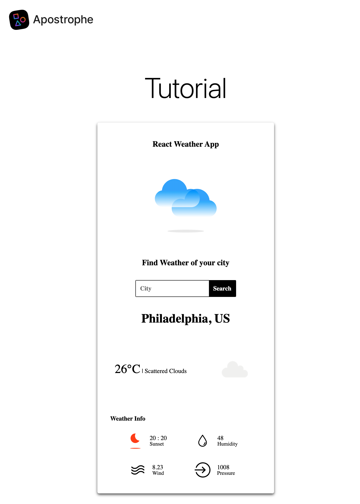

---

next: false
prev: false
title: "Using React for interactive components in ApostropheCMS with Vite"
detailHeading: "Tutorial"
url: "/tutorials/using-react-in-apostrophecms.html"
content: "Learn how to use React for an interactive browser-side component in ApostropheCMS, including how to extend the Vite build and connect React to a widget player."
tags:
topic: "Advanced Techniques"
type: tutorial
effort: advanced
----------------

# Using React for interactive components in ApostropheCMS with Vite

ApostropheCMS supports several ways to create and enhance the interface of a page.

For new server-rendered pages and widgets, we encourage [using JSX templates](/guide/jsx-templates.html) in place of Nunjucks. These `.jsx` templates run on the server and produce the HTML sent to the browser.

For focused browser-side behavior, many widgets only need ApostropheCMS's built-in [widget player system](/guide/custom-widgets.html#client-side-javascript-for-widgets). A widget player can respond to user events, fetch data, update the DOM, and reinitialize correctly during in-context editing without requiring a browser framework.

This tutorial covers a third pattern: using JSX with React to create a more substantial browser-side interface. We will build a weather widget that lets an editor choose a default city, then allows visitors to search for other cities without reloading the page. Vite will process the React application and its imported assets, while an ApostropheCMS widget player will initialize it in the browser. The code for this widget is based on a basic React tutorial that you can find [here](https://github.com/ayushkul/react-weather-app).

The same weather widget could be built with a widget player alone. We are using React because it gives us a compact but complete example with multiple UI components, shared state, asynchronous data, and several parts of the interface that update in response to that state.

For a version of the same widget where the editor chooses the city and the weather is rendered entirely on the server, see the companion tutorial [Building a weather widget with server-side JSX](/tutorials/server-side-jsx.html). You can also learn more about using JSX instead of Nunjucks in the [JSX templates guide](/guide/jsx-templates.md).

## What we're building



Our weather widget has four main parts:

* A small server-rendered template that gives React a mount point and passes the editor-selected default city into the browser
* A widget player that initializes the React application
* React components that manage user input, state, fetching, and rendering
* A server-side proxy route that calls the OpenWeatherMap API without exposing the API key to the browser

This tutorial will also show how ApostropheCMS lets you extend its built-in Vite build when a browser-side framework needs additional tooling.

> [!IMPORTANT]
> This tutorial uses ECMAScript Modules (ESM) syntax throughout. For new projects, use `import` and `export` consistently rather than mixing ESM with CommonJS `require()` and `module.exports` syntax at the project level.

## When should you use browser-side JSX?

ApostropheCMS widget players are often the simplest way to add interactive behavior to a widget. You do not need React to handle a click, submit a form, fetch data, or update part of the page.

A browser-side framework becomes more useful when the interface grows beyond a small amount of event handling and direct DOM manipulation.

React and JSX can be a good fit when:

* The interface is composed of several components that share and respond to application state
* A change in state affects multiple parts of the rendered UI
* The project already has React components or libraries you want to reuse
* Declarative rendering is easier to maintain than manually synchronizing several DOM updates

The weather widget in this tutorial is intentionally near that boundary. A widget player could build the entire interface, but React gives us a clearer way to separate the search form, application state, and weather display while keeping the rendered UI synchronized with the returned data.

For smaller interactions, a widget player alone is usually the simpler choice.

## Why customize the Vite build?

ApostropheCMS includes a built-in Vite asset pipeline that handles the JavaScript, styles, and other browser-side assets used by most projects. A typical widget player can use browser-side JavaScript without adding custom Vite configuration.

A React application introduces some additional requirements. The build needs React-specific JSX support and, for the best development experience, React Fast Refresh.

More broadly, Vite's plugin system lets you extend the ApostropheCMS build when the default asset pipeline does not provide everything a browser-side framework or other tool requires.

In this tutorial, we will use that extensibility to:

* Declare a separate browser bundle for the weather application
* Add the official Vite React plugin
* Process JSX components and imported SVG assets
* Add the React Refresh runtime during development

The same general approach can be used with other browser-side frameworks. The specific plugins and initialization code will differ, but the core pattern remains the same.

## Adding the weather widget to your project

We will start this tutorial by creating a new widget in an existing ApostropheCMS project using the [Apostrophe CLI](https://apostrophecms.com/extensions/apos-cli).

At the root of your project, run:

```sh
apos add widget react-weather-widget --player
```

The `--player` flag is important because this widget needs browser-side JavaScript to initialize the React application.

Next, register the new module in `app.js`.

<AposCodeBlock>

```javascript
import apostrophe from 'apostrophe';

export default apostrophe({
  shortName: 'jsx-project',
  modules: {
    // Other modules
    'react-weather-widget': {}
  }
});
```

<template v-slot:caption>
app.js
</template>

</AposCodeBlock>

You can make the widget available in any area. For this tutorial, add it to the default page type.

<AposCodeBlock>

```javascript
export default {
  extend: '@apostrophecms/page-type',
  options: {
    label: 'Default Page'
  },
  fields: {
    add: {
      main: {
        type: 'area',
        options: {
          widgets: {
            '@apostrophecms/rich-text': {},
            '@apostrophecms/image': {},
            '@apostrophecms/video': {},
            'react-weather': {}
          }
        }
      }
    },
    group: {
      basics: {
        label: 'Basics',
        fields: [ 'title', 'main' ]
      }
    }
  }
};
```

<template v-slot:caption>
modules/default-page/index.js
</template>

</AposCodeBlock>

The module directory and registration use the name `react-weather-widget`. In an area's widget configuration, ApostropheCMS refers to the same widget as `react-weather`, without the `-widget` suffix.

## Configuring the Vite bundle

Now that the widget is available to editors, we can configure its browser-side build.

ApostropheCMS Vite configuration can be added at the project level with `apos.vite.config.js` or contributed by an individual module. Since this browser bundle belongs specifically to the weather widget, we will declare it in the widget module.

Open `modules/react-weather-widget/index.js` and add the following:

<AposCodeBlock>

```javascript
export default {
  extend: '@apostrophecms/widget-type',
  options: {
    label: 'React Weather Widget'
  },
  build: {
    vite: {
      bundles: {
        'weather-react': {}
      }
    }
  }
};
```

<template v-slot:caption>
modules/react-weather-widget/index.js
</template>

</AposCodeBlock>

The `build.vite.bundles` configuration tells ApostropheCMS to process the `ui/src/weather-react.js` file and everything it imports as a browser bundle.

The empty object uses the default bundle settings, which are sufficient for this tutorial.

This is similar in purpose to defining a bundle in ApostropheCMS's previous Webpack-based asset system. However, Vite handles many common file types without the additional loaders and rules that were often required with Webpack. Later in the tutorial, our React components will import both JSX files and SVG assets directly.

Because this configuration belongs to the widget module, it stays close to the code that depends on it. ApostropheCMS merges it with Vite configuration contributed elsewhere in the project.

## Installing the React dependencies

Install React, React DOM, and the React plugin for Vite:

```sh
npm install react react-dom
npm install @vitejs/plugin-react --save-dev
```

We will also use `styled-components` for the weather interface:

```sh
npm install styled-components
```

React, React DOM, and `styled-components` are regular project dependencies because they are part of the browser-side application. The Vite plugin is only needed during the build, so it is installed as a development dependency.

Later, we will add a small helper module that connects the React plugin and Fast Refresh to the ApostropheCMS Vite build.

## Creating the React application entry point

The widget's React files will live in the module's `ui/src` directory. The `weather-react.js` file we declared as our Vite bundle will act as the entry point for the browser-side application.

<AposCodeBlock>

```javascript
import { createRoot } from 'react-dom/client';
import { createElement } from 'react';
import App from './jsx-components/App.jsx';

export default () => {
  apos.util.widgetPlayers.reactWeather = {
    selector: '[data-react-weather-widget]',
    player(el) {
      if (!el) {
        return;
      }

      const rootElement = el.querySelector('#react-weather-root');

      if (
        rootElement &&
        !rootElement.hasAttribute('data-react-mounted')
      ) {
        const defaultCity =
          rootElement.getAttribute('data-default-city');

        const app = createElement(App, { defaultCity });
        createRoot(rootElement).render(app);

        rootElement.setAttribute('data-react-mounted', 'true');
      }
    }
  };
};
```

<template v-slot:caption>
modules/react-weather-widget/ui/src/weather-react.js
</template>

</AposCodeBlock>

At the top of this file, we import `createElement` from React and `createRoot` from React DOM. We also import the main `App` component that we will create next.

The rest of the file is a standard [widget player](/guide/custom-widgets.html#client-side-javascript-for-widgets). React does not replace the widget player here. The player remains the ApostropheCMS-specific integration point that tells our browser-side application when and where to initialize.

ApostropheCMS runs the player for elements matching the `[data-react-weather-widget]` selector. Inside the widget, the player finds the element with the `react-weather-root` ID and uses it as the root of the React application.

The player also reads the editor-selected default city from the `data-default-city` attribute and passes that value to the `App` component as a prop.

The `data-react-mounted` attribute prevents the player from calling `createRoot()` a second time if ApostropheCMS runs the widget player again during in-context editing.

This illustrates an important distinction: React manages the interface inside its root, while the ApostropheCMS widget player manages the lifecycle that connects that application to the editable page.

## Adding the server-rendered widget template

The server-rendered markup for this widget is intentionally small. Its job is to give the widget player an element to target, provide a mount point for React, and pass the editor-selected city into the browser.

<AposCodeBlock>

```nunjucks
<section data-react-weather-widget>
  <div
    id="react-weather-root"
    data-default-city="{{ data.widget.defaultCity or '' }}"
  ></div>
</section>
```

<template v-slot:caption>
modules/react-weather-widget/views/widget.html
</template>

</AposCodeBlock>

The `data-react-weather-widget` attribute matches the selector in our widget player.

Inside that element, the `div` becomes the root of the browser-side React application. Its `data-default-city` attribute receives the value of the widget's `defaultCity` schema field, or an empty string if the editor has not selected a city.

This small template marks the boundary between the server-rendered ApostropheCMS page and the browser-side application. The server provides the initial CMS data and a place to mount the application. React takes over the interactive interface inside that root.

For new server-rendered pages and widgets, we encourage using ApostropheCMS JSX templates rather than Nunjucks. We are keeping this template deliberately small because the focus of the tutorial is the browser-side React application. The companion server-side JSX tutorial shows the same weather widget rendered entirely with a JSX template.

## Adding the widget schema field

Return to `modules/react-weather-widget/index.js` and add the `defaultCity` field.

<AposCodeBlock>

```javascript
export default {
  extend: '@apostrophecms/widget-type',
  options: {
    label: 'React Weather Widget'
  },
  fields: {
    add: {
      defaultCity: {
        type: 'string',
        label: 'Default City'
      }
    }
  },
  build: {
    vite: {
      bundles: {
        'weather-react': {}
      }
    }
  }
};
```

<template v-slot:caption>
modules/react-weather-widget/index.js
</template>

</AposCodeBlock>

Editors can now choose the city displayed when the widget first loads. Visitors will still be able to search for another city from the React interface.

This is one of the main differences between this browser-side version and the companion server-side JSX tutorial. In the server-rendered version, the editor controls the city being displayed. Here, the editor provides the starting value and the visitor can change it interactively.

## Adding the main `App.jsx` component

Create the directory:

```text
modules/react-weather-widget/ui/src/jsx-components/
```

Then add the main application component.

Since this tutorial focuses on integrating browser-side JSX and React with ApostropheCMS, we will not go through every detail of the React code. Instead, we will focus on the pieces that connect the application to the CMS and its server-side API.

<AposCodeBlock>

```jsx
import { useState, useEffect } from 'react';
import styled from 'styled-components';
import CityComponent from './CityComponent';
import WeatherComponent from './WeatherComponent';

const Container = styled.div`
  display: flex;
  flex-direction: column;
  align-items: center;
  width: 380px;
  padding: 20px 10px;
  margin: auto;
  border-radius: 4px;
  box-shadow: 0 3px 6px 0 #555;
  background: white;
  font-family: Montserrat;
`;

const AppLabel = styled.span`
  color: black;
  margin: 20px auto;
  font-size: 18px;
  font-weight: bold;
`;

function App({ defaultCity }) {
  const [city, updateCity] = useState(defaultCity || '');
  const [weather, updateWeather] = useState(null);

  useEffect(() => {
    if (defaultCity) {
      fetchWeather(defaultCity);
    }
  }, [defaultCity]);

  const fetchWeather = async (cityName) => {
    try {
      const response = await fetch(
        '/api/v1/react-weather-widget/fetch-weather?' +
          new URLSearchParams({
            city: cityName
          })
      );

      const weather = await response.json();
      updateWeather(weather);
    } catch (error) {
      console.error('Error fetching weather data:', error);
    }
  };

  const handleFetchWeather = (event) => {
    event.preventDefault();
    fetchWeather(city);
  };

  return (
    <Container>
      <AppLabel>React Weather App</AppLabel>
      <CityComponent
        updateCity={updateCity}
        fetchWeather={handleFetchWeather}
      />
      {weather && (
        <WeatherComponent
          weather={weather}
          city={city}
        />
      )}
    </Container>
  );
}

export default App;
```

<template v-slot:caption>
modules/react-weather-widget/ui/src/jsx-components/App.jsx
</template>

</AposCodeBlock>

The `App` component receives the default city from the widget player and stores it as the initial application state.

If a default city exists, the `useEffect()` hook fetches its weather data when the component loads. Visitors can then enter another city, which updates the state and triggers another request.

This is where React starts to provide something different from the widget player itself. The player initializes the application, but it does not need to manually synchronize the search form, current city, returned weather data, and rendered output. React re-renders the relevant components when the application state changes.

The important connection back to ApostropheCMS is in the `fetchWeather()` function:

```javascript
const response = await fetch(
  '/api/v1/react-weather-widget/fetch-weather?' +
    new URLSearchParams({
      city: cityName
    })
);
```

This request goes to an API route in our own ApostropheCMS project rather than directly to OpenWeatherMap.

We could call OpenWeatherMap from the browser, but that would require exposing the API key in browser-side JavaScript. Instead, our ApostropheCMS module will act as a proxy.

## Adding the server-side proxy route

Return to `modules/react-weather-widget/index.js` and add the API route.

<AposCodeBlock>

```javascript
export default {
  extend: '@apostrophecms/widget-type',
  options: {
    label: 'React Weather Widget'
  },
  fields: {
    add: {
      defaultCity: {
        type: 'string',
        label: 'Default City'
      }
    }
  },
  build: {
    vite: {
      bundles: {
        'weather-react': {}
      }
    }
  },
  apiRoutes(self) {
    return {
      get: {
        async fetchWeather(req, res) {
          const { city } = req.query;
          const apiKey =
            process.env.OPENWEATHERMAP_API_KEY;

          try {
            const response = await fetch(
              'https://api.openweathermap.org/data/2.5/weather?' +
                new URLSearchParams({
                  q: city,
                  appid: apiKey
                })
            );

            const weather = await response.json();
            return weather;
          } catch (error) {
            return {
              error: error.message
            };
          }
        }
      }
    };
  }
};
```

<template v-slot:caption>
modules/react-weather-widget/index.js
</template>

</AposCodeBlock>

There are several ways to add endpoints to an ApostropheCMS project. Here, we use the [`apiRoutes(self)` customization function](/reference/module-api/module-overview.html#customization-functions).

The `fetchWeather` function creates a `GET` route at:

```text
/api/v1/react-weather-widget/fetch-weather
```

ApostropheCMS converts the function name from camel case to kebab case in the URL, so `fetchWeather` becomes `fetch-weather`.

The route gets the city from the request query and the OpenWeatherMap API key from the `OPENWEATHERMAP_API_KEY` environment variable. It then calls OpenWeatherMap and returns the resulting data to the browser-side React application.

During development, you can provide the environment variable when starting the project:

```sh
OPENWEATHERMAP_API_KEY=your_key_here npm run dev
```

For production, set the environment variable through your hosting environment. Do not commit the API key to source control.

## Creating the `CityComponent`

Next, add the component that accepts user input.

<AposCodeBlock>

```jsx
import styled from 'styled-components';
import PerfectDay from '../icons/perfect-day.svg';

const SearchBox = styled.form`
  display: flex;
  flex-direction: row;
  justify-content: space-evenly;
  margin: 20px;
  border: black solid 1px;
  border-radius: 2px;

  & input {
    padding: 10px;
    font-size: 14px;
    border: none;
    outline: none;
    font-family: Montserrat;
    font-weight: bold;
  }

  & button {
    background-color: black;
    font-size: 14px;
    padding: 0 10px;
    color: white;
    border: none;
    outline: none;
    cursor: pointer;
    font-family: Montserrat;
    font-weight: bold;
  }
`;

const ChooseCityLabel = styled.span`
  color: black;
  margin: 10px auto;
  font-size: 18px;
  font-weight: bold;
`;

const WelcomeWeatherLogo = styled.img`
  width: 140px;
  height: 140px;
  margin: 40px auto;
`;

function CityComponent({
  updateCity,
  fetchWeather
}) {
  return (
    <>
      <WelcomeWeatherLogo src={PerfectDay} />
      <ChooseCityLabel>
        Find weather for your city
      </ChooseCityLabel>
      <SearchBox onSubmit={fetchWeather}>
        <input
          onChange={(event) =>
            updateCity(event.target.value)
          }
          placeholder="City"
        />
        <button type="submit">
          Search
        </button>
      </SearchBox>
    </>
  );
}

export default CityComponent;
```

<template v-slot:caption>
modules/react-weather-widget/ui/src/jsx-components/CityComponent.jsx
</template>

</AposCodeBlock>

This component also gives us a concrete example of what Vite is doing for the browser-side application.

The SVG file is imported directly into the component:

```javascript
import PerfectDay from '../icons/perfect-day.svg';
```

Vite follows that import as part of the application's dependency graph, processes the asset, and makes its resulting URL available to the component.

With ApostropheCMS's previous Webpack-based asset system, handling an imported asset type could require adding or configuring a loader. Vite handles common browser assets such as SVGs without that additional setup.

Place the SVG files used by the weather application in:

```text
modules/react-weather-widget/ui/src/icons/
```

## Creating the `WeatherComponent`

Finally, add the component that displays the returned weather data.

<AposCodeBlock>

```jsx
import styled from 'styled-components';
import SunsetIcon from '../icons/sunset.svg';
import SunriseIcon from '../icons/sunrise.svg';
import HumidityIcon from '../icons/humidity.svg';
import WindIcon from '../icons/wind.svg';
import PressureIcon from '../icons/pressure.svg';

const WeatherInfoIcons = {
  sunset: SunsetIcon,
  sunrise: SunriseIcon,
  humidity: HumidityIcon,
  wind: WindIcon,
  pressure: PressureIcon
};

const Location = styled.span`
  margin: 15px auto;
  text-transform: capitalize;
  font-size: 28px;
  font-weight: bold;
`;

const Condition = styled.span`
  margin: 20px auto;
  text-transform: capitalize;
  font-size: 14px;

  & span {
    font-size: 28px;
  }
`;

const WeatherInfoLabel = styled.span`
  margin: 20px 25px 10px;
  text-transform: capitalize;
  text-align: start;
  width: 90%;
  font-weight: bold;
  font-size: 14px;
`;

const WeatherIcon = styled.img`
  width: 100px;
  height: 100px;
  margin: 5px auto;
`;

const WeatherContainer = styled.div`
  display: flex;
  width: 100%;
  margin: 30px auto;
  flex-direction: row;
  justify-content: space-between;
  align-items: center;
`;

const WeatherInfoContainer = styled.div`
  display: flex;
  width: 90%;
  flex-direction: row;
  justify-content: space-evenly;
  align-items: center;
  flex-wrap: wrap;
`;

const InfoContainer = styled.div`
  display: flex;
  margin: 5px 10px;
  flex-direction: row;
  justify-content: space-evenly;
  align-items: center;
`;

const InfoIcon = styled.img`
  width: 36px;
  height: 36px;
`;

const InfoLabel = styled.span`
  display: flex;
  flex-direction: column;
  font-size: 14px;
  margin: 15px;

  & span {
    font-size: 12px;
    text-transform: capitalize;
  }
`;

function WeatherInfoComponent({
  name,
  value
}) {
  return (
    <InfoContainer>
      <InfoIcon src={WeatherInfoIcons[name]} />
      <InfoLabel>
        {value}
        <span>{name}</span>
      </InfoLabel>
    </InfoContainer>
  );
}

function WeatherComponent({ weather }) {
  const isDay =
    weather?.weather[0].icon?.includes('d');

  const getTime = (timeStamp) => {
    return `${new Date(
      timeStamp * 1000
    ).getHours()} : ${new Date(
      timeStamp * 1000
    ).getMinutes()}`;
  };

  return (
    <>
      <Location>
        {`${weather?.name}, ${weather?.sys?.country}`}
      </Location>

      <WeatherContainer>
        <Condition>
          <span>
            {`${Math.floor(
              weather?.main?.temp - 273
            )}°C`}
          </span>
          {` | ${weather?.weather[0].description}`}
        </Condition>

        <WeatherIcon
          src={
            `https://openweathermap.org/img/wn/` +
            `${weather?.weather[0].icon}@2x.png`
          }
          alt={weather?.weather[0].description}
        />
      </WeatherContainer>

      <WeatherInfoLabel>
        Weather Info
      </WeatherInfoLabel>

      <WeatherInfoContainer>
        <WeatherInfoComponent
          name={isDay ? 'sunset' : 'sunrise'}
          value={getTime(
            weather?.sys[
              isDay ? 'sunset' : 'sunrise'
            ]
          )}
        />
        <WeatherInfoComponent
          name="humidity"
          value={weather?.main?.humidity}
        />
        <WeatherInfoComponent
          name="wind"
          value={weather?.wind?.speed}
        />
        <WeatherInfoComponent
          name="pressure"
          value={weather?.main?.pressure}
        />
      </WeatherInfoContainer>
    </>
  );
}

export default WeatherComponent;
```

<template v-slot:caption>
modules/react-weather-widget/ui/src/jsx-components/WeatherComponent.jsx
</template>

</AposCodeBlock>

Like `CityComponent.jsx`, this component imports several SVG files directly from the widget's `ui/src/icons` directory.

Together, the React components demonstrate the main reasons you might choose a browser-side framework over handling the entire interface in a widget player:

* The interface is divided into reusable components
* Shared application state lives in one place
* UI output is derived from that state
* React keeps the rendered interface synchronized when the state changes

None of these capabilities are impossible with a widget player. The advantage is in how the interface is organized and maintained as it becomes more complex.

## Adding React Fast Refresh

At this point, the weather widget is functional. Editors can add it to a page and choose a default city, and visitors can search for weather data without reloading the page.

There is one more improvement we can make to the development experience.

Vite provides Hot Module Replacement, or HMR, which updates browser-side code as you work. React's Fast Refresh support requires the React plugin and a small amount of runtime setup so React components can update without a full page reload and, when possible, without losing their current state.

The official ApostropheCMS [Vite demo repository](https://github.com/apostrophecms/vite-demo) contains a `vite-react` module that handles this setup.

Clone or download the repository and copy the module into your project:

```sh
git clone https://github.com/apostrophecms/vite-demo.git

cp -r \
  vite-demo/modules/vite-react \
  your-project/modules/
```

Then register it in `app.js`.

<AposCodeBlock>

```javascript
export default apostrophe({
  shortName: 'jsx-project',
  modules: {
    // Other modules
    'react-weather-widget': {},
    'vite-react': {}
  }
});
```

<template v-slot:caption>
app.js
</template>

</AposCodeBlock>

Let's look at what this helper module does.

<AposCodeBlock>

```javascript
import {
  defineConfig
} from '@apostrophecms/vite/vite';
import react from '@vitejs/plugin-react';

export default {
  build: {
    vite: {
      extensions: {
        enableReact: defineConfig({
          plugins: [ react() ]
        })
      }
    }
  },
  init(self) {
    self.apos.template.prepend({
      where: 'head',
      when: 'hmr:public',
      bundler: 'vite',
      component: 'vite-react:reactRefresh'
    });
  },
  components(self) {
    return {
      reactRefresh(req, data) {
        return {};
      }
    };
  }
};
```

<template v-slot:caption>
modules/vite-react/index.js
</template>

</AposCodeBlock>

The `build.vite.extensions` configuration adds the official React plugin to ApostropheCMS's Vite configuration.

The module also connects React's Fast Refresh runtime to ApostropheCMS's templating system.

During development, the `init()` function uses `self.apos.template.prepend()` to add a component to the page `<head>`, but only when public HMR is active.

The component name:

```text
vite-react:reactRefresh
```

connects the insertion point to the `reactRefresh()` component function and its corresponding template.

That template contains the browser-side setup required by React Fast Refresh:

<AposCodeBlock>

```html
<script type="module">
  import RefreshRuntime from '{{ apos.asset.devServerUrl("/@react-refresh") }}'

  RefreshRuntime.injectIntoGlobalHook(window)
  window.$RefreshReg$ = () => {}
  window.$RefreshSig$ = () => (type) => type
  window.__vite_plugin_react_preamble_installed__ = true
</script>
```

<template v-slot:caption>
modules/vite-react/views/reactRefresh.html
</template>

</AposCodeBlock>

With this setup in place, changes to your React components can be reflected in the browser immediately during development.

The [Vite demo repository](https://github.com/apostrophecms/vite-demo) is worth exploring for additional examples of extending the ApostropheCMS asset build.

## Conclusion

In this tutorial, we used JSX in a browser-side React application and connected it to an ApostropheCMS widget.

The complete pattern includes:

* A Vite bundle that processes the browser-side application and its imports
* A small server-rendered template that provides a mount point and passes initial CMS data into the browser
* A widget player that connects the application to the ApostropheCMS page lifecycle
* React components that manage shared state and visitor interaction
* A server-side API route that protects the third-party API key
* React Fast Refresh support for a better development experience

Vite handles the JSX source, imported components, and assets such as SVG files as part of the browser build. Its plugin system also lets you extend the ApostropheCMS asset pipeline when a framework or other browser-side tool needs additional build support.

The weather application also illustrates where browser-side React fits alongside ApostropheCMS's other rendering and front-end options.

For new server-rendered pages and widgets, we encourage using ApostropheCMS JSX templates instead of Nunjucks. For focused browser-side interactions, the built-in widget player system is often all you need. When an interface grows into several components with shared state and state-driven rendering, a framework such as React can provide a more manageable structure.

To compare server-side and browser-side JSX directly, see the companion tutorial [Building a weather widget with server-side JSX](/tutorials/server-side-jsx.html). Both tutorials build versions of the same widget, making it easier to see where server-side JSX templates end and a browser-side React application begins.
