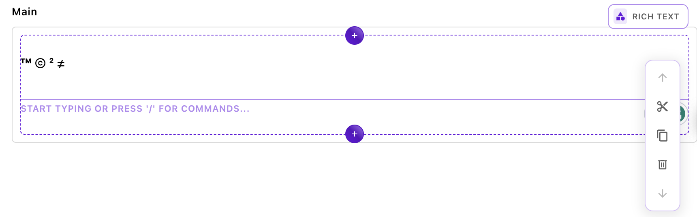

## The `@apostrophecms/typography` extension


The first module, `@apostrophecms/typography` adds a whole series of autocomplete actions to your editor. For example, typing `(tm)` will autoconvert to `™`.  It serves as a template for how we can install a premade Tiptap extension into our project. For the whole list of autocomplete actions check out the [documentation](https://tiptap.dev/api/extensions/typography) for the extension on the Tiptap site. Note that some auto-convert rules (like fractions) won't work if you have the insert menu turned on.

The overall structure of this module represents the minimum needed to incorporate a Tiptap extension, an `index.js` file, and a `ui/apos/tiptap-extension/<extension-name>.js` file. We have also added extra code to allow the developer to set options at the project or per-area level.

### Installing the Tiptap extension package
The first step to installing a Tiptap or ProseMirror extension is to install the package in our project. Luckily for us, Tiptap offers all of its open-source extensions in npm, so we can use `npm install @tiptap/extension-typography`. Looking at the `package.json` file of the bundle, we can see this package listed in the dependencies. You might need to use an alternative method of installation for packages from other developers.

### The `index.js` file
Let's look at the `index.js` file:

<AposCodeBlock>

```javascript
module.exports = {
  improve: '@apostrophecms/rich-text-widget',
  options: {
    typoConfig: {}
  },
  extendMethods(self) {
    return {
      // We need to extend this method so that our configuration data is available
      getBrowserData(_super, req) {
        const initialData = _super(req);
        const finalData = {
          ...initialData,
          aposTypoConfig: self.options.typoConfig
        }
        return finalData;
      }
    }
  }
};
```

<template v-slot:caption>
  @apostrophcms/typography/index.js
</template>

</AposCodeBlock>

Starting at the top, we are stating that this module is going to improve the `@apostrophecms/rich-text-widget`. Remember that when we `improve` a module, any instance of that module will have that new code. The `improve` configuration method can *only* be used in modules we are installing from a package. If we were doing this with a custom module at project level, we would need to `extend` the `@apostrophecms/rich-text-widget`, giving it a new name and using that custom widget in any areas where we want the modified behavior. In this case, we are improving our widget project-wide so that any area that already has a `rich-text-widget` will have this enhanced functionality. This one line is actually all that we would need in the `index.js` file to add the Tiptap extension, but we are also allowing the user to pass additional configuration to the extension using the `typoConfig` option, as outlined in the repository [README](https://github.com/apostrophecms/rich-text-example-extensions) and [Tiptap documentation](https://tiptap.dev/api/extensions/typography).  We are setting it to an empty object by default.

In order to be able to access the options that the user sets from the front end, we need to extend the Apostrophe `getBrowserData()` method. This is extended by most of the Apostrophe core modules. To accomplish this we are using the [`extendMethods(self)`](https://v3.docs.apostrophecms.org/reference/module-api/module-overview.html#extendmethods-self) configuration method. Any methods extended this way take the arguments of the original (in this case just `req`), plus the `_super` argument. This gives the extended method access to the output of the original function.

```javascript
const initialData = _super(req);
```
This line uses `_super` and the `req` request object to get the pre-existing values returned by the `getBrowserData()` method.

```javascript
const finalData = {
  ...initialData,
  aposTypoConfig: self.options.typoConfig
}
return finalData;
```
Next, we construct and return an object consisting of the original data with our new option added as the value for the `aposTypoConfig` key. When using this in your own module you should be careful to add a namespace to the beginning of your key so that you don't overwrite any existing data that is being passed.

### The `ui/apos/tiptap-extension/typography.js` file

<AposCodeBlock>

```javascript
// imports the tiptap extension from node_modules
import Typography from '@tiptap/extension-typography';
export default (options) => {
  // gets options added in each area
  const perAreaConfig = options.typoConfig || {};
  // gets options added at project level to the widget `modules/@apostrophecms/rich-text-widget/index.js`
  const globalConfig = self.apos.modules['@apostrophecms/rich-text-widget'].aposTypoConfig || {};
  const configuration = Object.assign({}, globalConfig, perAreaConfig);
  // instantiates the extension with our options
  return Typography.configure(configuration);
};
```

<template v-slot:caption>
  typography/ui/apos/tiptap-extensions/typography.js
</template>

</AposCodeBlock>

Once again, this file is more complex than it would be if we weren't passing options to the extension. We would only need to import the extension, as we are doing here in the first line, and create the default export that returns the extension with an empty configuration object. In this case, we are getting the per-area options from the `options` object and the project-wide options from the `aposTypoConfig` object that we added by extending the `getBrowserData()` method.

That's all it takes to add a Tiptap extension!