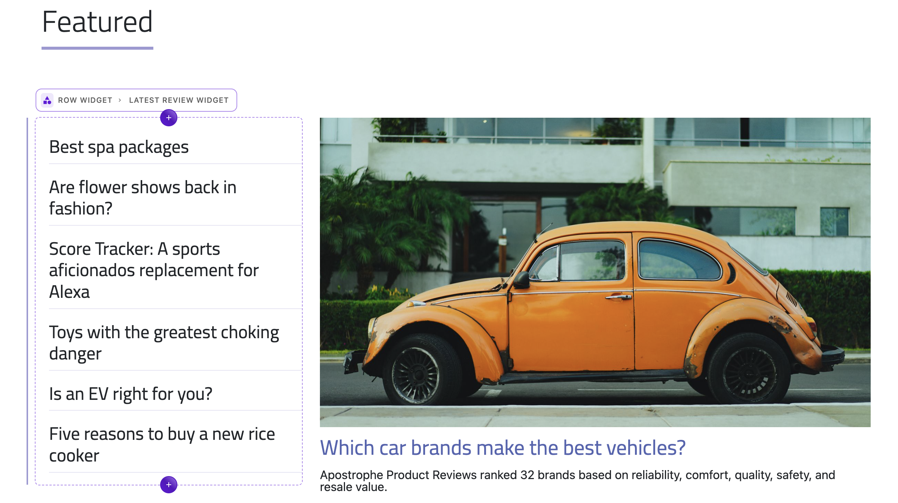
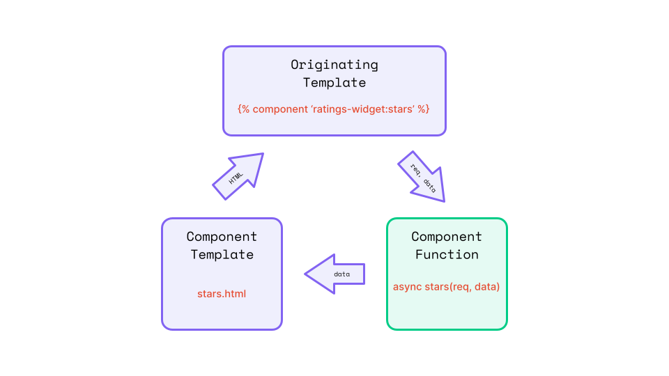
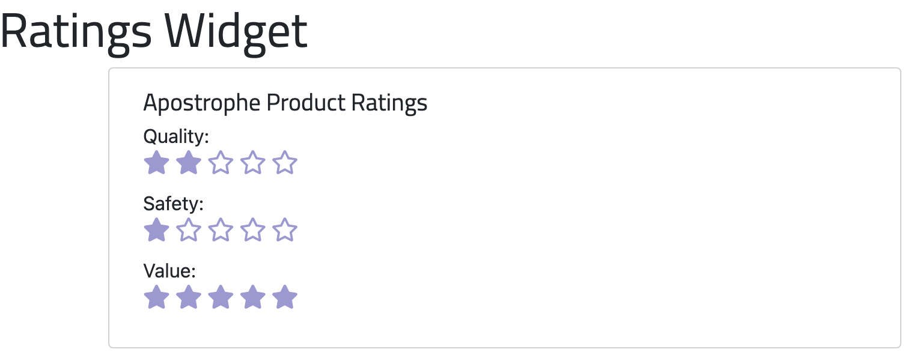
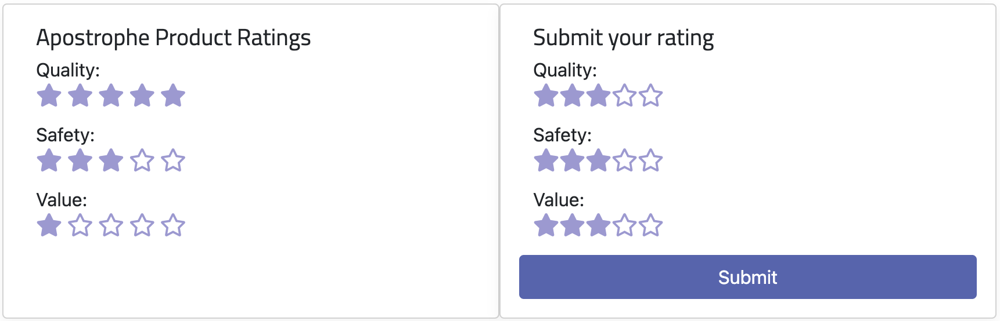

# Widget Creation

In our tutorial on creating pages in our Apostrophe project, we made use of the core widgets for adding content to our home page areas. In this tutorial, we shift focus towards custom widget development, aiming to furnish our editors with unique tools to augment the site's aesthetics.

We will create a basic layout widget, a pivotal step toward accomplishing our final project's envisioned appearance. This will introduce template helper functions, schema field conditionals, and introduce how we register icons for use in our project.

Next we will formulate a 'deal widget', designed to empower editors with the capability of presenting links, garnished with images and headings, in a singular or multiple format. This will introduce some additional options and methods for working with images in schemas and templates.

Finally, we will create a 'rating widget' that allows the editors to add ratings to the different products using a star system. In the creation of this widget, we will also begin to learn about async components, a powerful way to add dynamic content to pages asynchronously and revisit adding module styling.

Again, you can follow along with the tutorial to modify your own project, or to see the progress of the project while following this tutorial switch to the `sec2-4-widgets` branch of the [a3-onboarding-project](https://github.com/apostrophecms/a3-onboarding-project) repo on GitHub.

## Widget Overview

Creating a new widget is much like creating a new page. A widget module extends the core `@apostrophecms/widget-type` module and requires two files, an `index.js` file, and a `views/widget.html` file. The index file contains the content schema fields for collecting content from the users, as well as helper methods that can extend or alter that content. The `widget.html` file provides a template for generating the markup to display the content. This is like the page module `index.js` and `views/page.html` files.

While widgets and pages have some similarities, there are some key differences. As with pages, the content schema fields of widgets are added through the `fields` property. Unlike page modules, where the `fields` property takes both `add` and `group` properties, widgets take only the `add` property. Fields are not currently grouped by tabs and are added into the modal according to their order in the `add` object.

Another key difference occurs behind the scenes in how Apostrophe handles content added through a page versus a widget. When you save a page, Apostrophe creates a new document in the database. As we will cover in a later tutorial, that document and the content within it can be retrieved from the database with a unique id. This isn't true of widgets. They don't exist as documents within the database outside the page where they are added.

Because widgets aren't meant to be stand-alone documents, the markup file that you add to the module is different also. Rather than creating markup for a whole page, you only create a block of HTML code that can be slotted into any page. This means that generally, you aren't going to have a template that you are extending. Although if you have a series of interrelated widgets, you can certainly opt to create a template or fragments to be used within each.

## Creating a layout widget


Our home page areas are currently limited to adding widgets that span the whole width of the page. Looking at the final layout of our example project, we can see that the content on the home page is split into columns of different widths. For example, the top area of the homepage is two columns, with the left column taking 33%, and the right 66%.

In the Bootstrap framework, you create rows that are then split up into multiple columns, so we will create a `row-widget`. This `row-widget` can then be added to the homepage areas and will expose new areas corresponding to the number of columns that the user selects

To simplify widget creation, we will use the CLI tool:

`apos add widget row`

This will create a new module with the name `row-widget` in our `modules` folder. Within our new module folder, the CLI tool will create a basic `index.js` file extending the core `@apostrophecms/widget-type` module. It will also provide a `views` folder containing a `widget.html` page. Much like the page-type module will serve HTML from the `modules/custom-page/views/page.html`, for a widget the HTML should be located at `modules/custom-widget/views/widget.html`.

Before this widget will function, we need to add it to the project `app.js` file. You can add `'row-widget': {}` at the end of the `modules` property object. Make sure to separate your new module from the previous one with a comma.

Opening the `modules/row-widget` folder, let's dig into the `index.js` file. Right now our `options` section contains the `label` for the widget that will be displayed to the user for selection within an area. We are going to add two additional options:

<AposCodeBlock>

``` javascript
  options: {
    label: 'Row Widget',
    icon: 'view-column-outline',
    previewIcon: 'view-column-outline'
  },
```
  <template v-slot:caption>
    modules/row-widget/index.js
  </template>

</AposCodeBlock>

We are setting both the `icon` and optional `previewIcon` to the same icon. The `icon` will be shown in the dropdown menu when people select icons during in-context editing on the page. The `previewIcon` will be displayed in the fly-out menu if the area that the `row-widget` is added into has the `expanded: true` option. Remember, in our pages creation tutorial the top area used the in-context dropdown, and the bottom area used the flyout. If we didn't add a `previewIcon` option, the value of the `icon` option would be used instead.

### Registering an icon

The icon being used in this module isn't currently registered by Apostrophe in the [`globalIcons.js` file](https://github.com/apostrophecms/apostrophe/blob/main/modules/%40apostrophecms/asset/lib/globalIcons.js) The icon is available within the [`vue-material-design-icons` v4.12.1 package](https://gist.github.com/BoDonkey/a28419ed8954b57931f80061e5e6a3dd), which is installed in our project. In order to use this icon within our module we need to add a new configuration property to our module's `index.js` file.

``` javascript
// ...
icons: {
  'view-column-outline': 'ViewColumnOutline'
},
// ...
```

Note that `icons` is a top-level property, not within the `options` object. Within the `icons` object we are using a property to define the name that we want to use in our project, `'view-column-outline'`. For value, we are adding the name of the Vue component from the package, leaving the `.vue` suffix off. We could use this same method to install other custom icons. If we added an icon file in our widget module, we would provide a relative path to that file to register it for use. Note, any icon we bring in needs to be a Vue component. Icons can typically be converted to Vue components by copying the wrappers added to the `vue-material-design-icons` package icons.

### Adding fields programmatically

There are a number of different ways that we could add a row with different numbers of columns and will depend on the design system you select. In the end, we want to give the user a choice of one to four columns per row. We also want to allow them to select variants of two columns, where the individual columns take up different widths, like '25%' and '75%'. Each of the columns requires an `area` schema field that is populated with widgets for the user to add content. So, we need to solve two problems. First, we need to display the number of areas that correlates with the value the user selects. Second, we need to add styling to make each column the correct width.

#### Displaying the correct number of areas

``` javascript
area3: {
  label: 'Area 3',
  type: 'area',
  contextual: true,
  options: {
    widgets: fullConfig
  },
  if: {
    $or: [
      { columns: 3 },
      { columns: 4 }
    ]
  }
}
```
To solve the first problem we are going to use conditionals. These optional configuration fields allow you to determine if a schema field is presented to the user based on one or more values. These values can be based on the value of other fields within the same schema, or the results returned by an asynchronous function. Conditionals are created by adding the `if` property to the schema field. That property receives an object that at the simplest, contains one or more `key:value` properties, where the key is equal to the name of another field in the schema, and the value is the exact (`===`) value desired for that field. This can be a string, boolean, or number, but it must match exactly. If there is more than one property in the object, then **all** conditions must match in order for the field to be presented.

The `if` property object can also contain an `$or` property that takes an array of objects. Each of the objects in the array contains a schema field name as a property and the desired match for a value. However, this will evaluate as true if **any** of the fields evaluates as true.

In the example above, we are adding a schema field named `area3`. Most of the other properties being added match what we saw in the earlier tutorial on creating a page, except for the `if` we just discussed. This property is taking an object with an `$or` property with an array of two objects. These objects are telling Apostrophe to show this field if another field in the schema named `columns` has a value of either `3` or `4`.

We could hard code each of the four different areas, as shown in this example, but this wouldn't help with setting the desired styling. Instead, we will create the area schema using a loop. We will also move this code out into a separate file. This isn't required, it is simply a choice to keep the codebase more organized. Create a `modules/row-widget/lib/fields.js` file and add the following code:

<AposCodeBlock>

```javascript
const fullConfig = require('../../../lib/area');
const fields = {
  columns: {
    label: 'Column layout',
    type: 'select',
    help: 'How many columns should this row have?',
    choices: [
      {
        label: 'One full-width column',
        value: 1
      },
      {
        label: 'Two equal-width columns',
        value: 2
      },
      {
        label: 'Three equal-width columns',
        value: 3
      },
      {
        label: 'Four equal-width columns',
        value: 4
      },
      {
        label: 'Two columns, 33% and 66%',
        value: '4-8'
      },
      {
        label: 'Two columns, 66% and 33%',
        value: '8-4'
      },
      {
        label: 'Two columns, 25% and 75%',
        value: '3-9'
      },
      {
        label: 'Two columns, 75% and 25%',
        value: '9-3'
      }
    ]
  }
};

const colsIf = [ null, false, [ 2, 3, 4, '4-8', '8-4', '3-9', '9-3' ], [ 3, 4 ], [ 4 ] ];

for (let i = 1; i <= 4; i++) {
  fields[`area${i}`] = {
    label: `Area ${i}`,
    type: 'area',
    contextual: true,
    options: {
      widgets: fullConfig
    },
    ...(colsIf[i] && {
      if: {
        $or: colsIf[i].map((colName) => {
          return {
            columns: colName
          };
        })
      }
    })
  };
  // uncomment to see the full output for each area
  // console.log(`Output for i = ${i}:`, fields);
}

module.exports = {
  fields
};
```
Walking through each line,
``` javascript
const fullConfig = require('../../../lib/area');
```
  <template v-slot:caption>
    modules/row-widget/lib/fields.js
  </template>

</AposCodeBlock>

First, we are importing the area widget configuration from the project-level `lib` folder. Remember we used this when we were creating the `default-page` page type. As we add our next widgets, we will alter the `area.js` file to export additional configurations, and we will return to alter this `fields.js` file.

``` javascript
const fields = {
  columns: {
    label: 'Column layout',
    type: 'select',
    help: 'How many columns should this row have?',
    def: 1,
    choices: [
      {
        label: 'One full-width column',
        value: 1
      },
      {
        label: 'Two equal-width columns',
        value: 2
      },
      {
        label: 'Three equal-width columns',
        value: 3
      },
      {
        label: 'Four equal-width columns',
        value: 4
      },
      {
        label: 'Two columns, 33% and 66%',
        value: '4-8'
      },
      {
        label: 'Two columns, 66% and 33%',
        value: '8-4'
      },
      {
        label: 'Two columns, 25% and 75%',
        value: '3-9'
      },
      {
        label: 'Two columns, 75% and 25%',
        value: '9-3'
      }
    ]
  }
}
```
Next, we are creating the first schema field for our widget. In this case, it is named `columns` and has a field type of `select` and some help text that will be presented to the user. Our select is getting a default value of `1` using the optional `def` property. The `choices` property receives an array of objects that are each composed of a label that is presented in the dropdown to the user, and the corresponding value for that selection. For the equal-width columns, we are just passing the number of columns desired. For the columns that require different widths, we are passing a string that has the width of each column. Full-width in Bootstrap is 12 columns, 50% width would be `6`, 25% would be `3`, etc... This is idiosyncratic to Bootstrap and will be different with other frameworks.

``` javascript
const colsIf = [ null, false, [ 2, 3, 4, '4-8', '8-4', '3-9', '9-3' ], [ 3, 4 ], [ 4 ] ];
```
The `colsIf` variable gives an array we can use to determine our conditional depending on the selected value. We are padding it with `null` at the beginning to make looping easier.

``` javascript
for (let i = 1; i <= 4; i++) {
  fields[`area${i}`] = {
    label: `Area ${i}`,
    type: 'area',
    contextual: true,
    options: {
      widgets: fullConfig
    },
    ...(colsIf[i] && {
      if: {
        $or: colsIf[i].map((colName) => {
          return {
            columns: colName
          };
        })
      }
    })
  };
  // uncomment to see the full output for each area
  // console.log(`Output for i = ${i}:`, fields);
}
```

Next, we set up a loop to add from 1 to 4 columns. For each iteration, we add an area object to the existing `fields` variable and give that area a name and label based on the counter value. We use the imported configuration to add the same set of widgets to each area. Finally, we use the spread operator to add our conditional field based on the values provided by the `colsIf` array. So, `array1` won't have a conditional since the value is `false`, but `array3` will have a conditional field with an `$or` that will return true only if the user selects either `3` or `4` in the dropdown.

Finally, at the end of this file we have:
```javascript
module.exports = {
  fields
};
```
This will export our newly populated `fields` variable. So, how do we use it?

Open the `modules/row-widget/index.js` file and add:

<AposCodeBlock>

``` javascript
const { fields } = require('./lib/fields');
```
  <template v-slot:caption>
    modules/row-widget/index.js
  </template>

</AposCodeBlock>

This will bring our exported variable into the main file. We can then add:

<AposCodeBlock>

``` javascript
fields: {
  add: fields
},
```
  <template v-slot:caption>
    modules/row-widget/index.js
  </template>

</AposCodeBlock>

This will add all of our schema fields for our widget. While we aren't quite finished with the changes that we need to make to our `index.js` file, let's shift over to creating the templating needed to display our content.

### Templating our layout

In the tutorial on creating pages, we touched on the basic usage of Nunjucks. Within these templates, plain HTML markup can be intermixed with tags that are interpreted and utilized during rendering. These include conditional tags that selectively display content and others that provide loops to add repetitive items, like list items. 

If you open the `widget.html` file of our module you will see that a section with an attribute of `data-row-widget` has been added. You can elect to place your code inside this section or eliminate it within your project. In this case, I'm going to eliminate the section because it makes the Bootstrap styling more difficult.

We are going to start with a simplified, non-working version of our final template and modify it. Add the following code to the `modules/row-widget/views/widget.html` file, replacing all of the content:

<AposCodeBlock>

``` nunjucks
<div class="row mb-5">
  
    <div class="col-md-{{column}}">
      
    </div>
  
</div>
```
  <template v-slot:caption>
    modules/row-widget/views/widget.html
  </template>

</AposCodeBlock>

This markup starts by adding a `div` with Bootstrap classes for margin, `mb-5`, and another class called `row`. The `row` class tells our styling framework that we want this content to be the full width of the container. Using additional Bootstrap classes, we can split the width into multiple columns.

Next, we have a for loop within our `` tags. In Nunjucks templates, a `for...in` loop takes an array of values. The array items can be simple numbers, strings, or they can be objects. Each array item is passed individually to the code within the loop and the HTML rendered, before progressing to the next array item. In this case, the `for` loop would iterate over an array supplied by the `columns` schema field. The value of this schema field, and any others, is supplied to the template within the `data.widget` object. Directly looping over the array items might work well if we had only allowed the user to specify the number of columns (although a [`range` tag](https://mozilla.github.io/nunjucks/templating.html#range-start-stop-step) would work better in that case), but we also allowed them to specify custom widths. Additionally, our `columns` schema doesn't return an array, only a single value. We will fix this in a moment.

Inside the for loop, we are adding a `div` with a Bootstrap class to specify how much width the column should take. Again, right now this is just for illustration. We are going to need to modify the value of the users choice so that it works in both the `for` loop to add the correct number of columns, and for adding our column class.

Within our column div, we are once again using the `area` template helper. We are passing it the widget data object and asking it to process the area named `'area'+loop.index`. This final portion, `loop.index`, is a special variable that is inside of Nunjucks loops. It provides the current iteration of the loop, starting at 1, and we are concatenating that value onto the `area` string. There are other variables that allow you to easily change markup output for the first item (`loop.first`) or last item (`loop.last`), or perform other operations within the loop.

As written, this code will not function because of the value being returned by the `columns` schema field. We have two requirements, that the value delivered to the template be an array that will work with the `for` loop. Secondly, the array contains a value for each column that reflects the width of the column. This will cause the for loop to iterate over the markup the correct number of times and add the correct width classes. To accomplish this we are going to use a [`helper(self)` configuration function](https://v3.docs.apostrophecms.org/reference/module-api/module-overview.html#helpers-self) in our `index.js` file.

#### Creating a Nunjucks helper

The [`helpers(self)` customization function](https://v3.docs.apostrophecms.org/reference/module-api/module-overview.html#helpers-self) takes the module as an argument and returns an object of functions that add template utility methods. We have already utilized one helper, `area` to display the content added into our pages area schema fields. In this case we will create a custom helper that will convert the values coming for the `columns` select field into an array. Open the `modules/row-widget/index.js` file and add the following code after the fields object:

<AposCodeBlock>

``` javascript
helpers(self) {
  return {
    layoutToColumns(layout) {
      const layoutMap = {
        1: [ 12 ],
        2: [ 6, 6 ],
        3: [ 4, 4, 4 ],
        4: [ 3, 3, 3, 3 ],
        '4-8': [ 4, 8 ],
        '8-4': [ 8, 4 ],
        '3-9': [ 3, 9 ],
        '9-3': [ 9, 3 ]
      };
      return layoutMap[layout] || [ 12 ];
    }
  };
}
```
  <template v-slot:caption>
    modules/row-widget/index.js
  </template>

</AposCodeBlock>

This code declares a new helper function called `layoutToColumns(layout)` that takes the `columns` value and converts it to an array of values that correspond to the number and width of the columns to be added. This array is then returned. Now we need to add it to our template.

Open the `modules/row-widget/views/widget.html` file and add the following at the top of the file.

<AposCodeBlock>

``` nunjucks

```
  <template v-slot:caption>
    modules/row-widget/views/widget.html
  </template>

</AposCodeBlock>

This line calls the new helper function using `apos.modules['row-widget'].layoutToColumns(data.widget.columns)`, passing in the value of the `columns` schema field as an argument. We could simplify this call by adding an `alias` option to our module. For example, adding `alias: 'row'`, would shorten this to `apos.row.layoutToColumns(data.widget.columns)`. The returned value of our helper function is assigned to the `cols` variable using the Nunjucks `` tag. Now we can alter the for loop to:

<AposCodeBlock>

``` nunjucks

```
  <template v-slot:caption>
    modules/row-widget/views/widget.html
  </template>

</AposCodeBlock>

#### Using the row widget

Now that we have a functional row widget, we need to add it to the areas where we want to utilize it. For our tutorial project, I added it to the homepage `topArea` and `bottomArea` widget lists. To accomplish this, open the `modules/@apostrophecms/home-page/index.js` file and add `row: {}` to the `widgets` object of both areas. At this point, you could spin your project up and take the new row widget for a spin!

Remember, to edit a page you need to be logged in, then just navigate to the page and click the edit button at the upper right. If you don't see the new row widget in your areas when you open the drop-down or flyout menus, you may need to clear your former builds first before bringing the project up, making sure to pass the `APOS_DEV=1` flag. So: `rm -rf apos-build data && APOS_DEV=1 npm run dev`.

## Creating the deal widget


As practice and to reiterate the key concepts in creating a widget, we are next going to make a simple widget that will allow the user to set up a call-to-action area on the page that includes an image and URL link. This widget is used on the right side of the bottom area of the tutorial project homepage.

Again, by convention, a widget module folder is named with a `-widget` suffix and contains `index.js` and `views/widget.html` files. We can use the CLI tool to create this basic structure using:

``` sh
apos add widget deal
```
> ⚠️ Remember to add the new widget into the `app.js` after creation.

### Adding the schema fields

Open the newly-created `module/deal-widget/index.js` file and add the following code:

<AposCodeBlock>

``` javascript
module.exports = {
  // extending a core module creates a new instance of that module type
  // with a new name, but all the same functions
  extend: '@apostrophecms/widget-type',
  options: {
    label: 'Deal Widget'
  },
  fields: {
    add: {
      title: {
        type: 'string',
        label: 'Deal Title',
        required: true
      },
      link: {
        type: 'url',
        label: 'Deal Link',
        required: true
      },
      image: {
        type: 'area',
        label: 'Deal Image',
        max: 1,
        required: true,
        options: {
          widgets: {
            '@apostrophecms/image': {
              aspectRatio: [ 16, 9 ],
              minSize: [ 1200, 675 ]
            }
          }
        }
      }
    }
  }
};

```
  <template v-slot:caption>
    module/deal-widget/index.js
  </template>

</AposCodeBlock>

We are adding three required schema fields. A `title` field of the `string` type, a `link` field of the `url` type, and finally, we are adding an image using an `area` field with an `@apostrophecms/image` core widget. In this final `image` field, we are specifying that the user can only add a single image using the `max: 1` property.

Within the image widget we are limiting the image to an aspect ratio of `16:9` with a minimum horizontal resolution of `1200px` and a minimum vertical resolution of `675px`. In this way, you can ensure that any images added by the user won't break the design. If the user adds an image that has a different aspect ratio, Apostrophe will apply an automatic crop to the image. The user can adjust how the image is cropped using the editing tools, but will still be restrained to the 16:9 aspect ratio. Any images not meeting the resolution minimums won't be presented to the user as a choice.

### Creating the template
Add the following to the `modules/deal-widget/views/widget.html` file:

<AposCodeBlock>

``` nunjucks
<!-- Use a helper to get the image. Use the Nunjucks `set` to create a variable -->


<!-- Even though the image field is required, it's possible that the image
  has been deleted. So we need to check for that. -->

  <!-- Uncomment the line below to see other available data -->
  {# {{ apos.log('image data', image) }} #}
  
  

  


<section data-deal-card-widget class="align-items-center mb-2 border-2 border-bottom border-info row">
  <div class="col-12 col-md-6 order-last order-md-first">
    <p class="lead"><a href="{{ data.widget.url }}" class="text-decoration-none">{{ data.widget.title }}</a></p>
  </div>
  <div class="col-12 col-md-6">
    
  </div>
</section>
```
  <template v-slot:caption>
    modules/deal-widget/views/widget.html
  </template>

</AposCodeBlock>

In the first line of this template, we are setting the value of the `image` variable to the object added to our `image` schema field. We are using a built-in method, `apos.image.first()`. This allows us to get the first image added to an area. While we are passing in the `image` schema field as an argument, this same helper can be used to get the first image on a page or within any other document. You can also add an optional object to return the first image of a certain type - `apos.image.first( page.body, { extension: 'gif'} )`. You might be able to guess from the name that this is a method defined in the `@apostrophecms/image` module.

::: v-pre
The next block of code makes sure that the image object exists and if not, loads in a holder image. If it does exist another built-in method is used to get the URL of a specific size image. In this case, we are getting the `one-sixth` size. By default, when you upload an image using the media library [there are six resized images saved](https://v3.docs.apostrophecms.org/reference/modules/attachment.html#imagesizes) in addition to the original - 'max', 'full', 'two-thirds', 'one-half', 'one-third', and 'one-sixth'. These default sizes can be changed through configuration of the `@apostrophecms/attachment` module. We are also setting the alt text for the image from the `image` variable. You can use `{{ apos.log('image data', image) }}` to see what other info is available.
:::

Finally, we are using standard markup and Nunjucks tags to construct our final deal card HTML.

### Using the deal widget
Like the `row-widget`, we will be using the `deal-widget` on the home page. Once again, we could add it to the top and bottom areas of the homepage. However, since we added the area configuration for our rows from the `lib/area.js` file, let's instead add it there. Open the file and modify the code to look like the following:

<AposCodeBlock>

``` javascript
/*
This file provides an easy way to populate any areas in the project with widgets.
*/
const basicConfig = {
  '@apostrophecms/image': {
    // This option will add these classes to any image
    className: 'img-fluid image-fit-center-center'
  },
  '@apostrophecms/video': {},
  '@apostrophecms/html': {},
  '@apostrophecms/rich-text': {
    toolbar: [
      'styles',
      '|',
      'bold',
      'italic',
      'strike',
      'link',
      '|',
      'bulletList',
      'orderedList',
      '|',
      'blockquote',
      'codeBlock',
      '|',
      'horizontalRule',
      '|',
      'undo',
      'redo'
    ],
    styles: [
      {
        tag: 'p',
        label: 'Paragraph (P)'
      },
      {
        tag: 'h2',
        label: 'Heading 2 (H2)'
      },
      {
        tag: 'h2',
        label: 'Special underline',
        class: 'custom-underline display-6 ps-2'
      },
      {
        tag: 'h3',
        label: 'Heading 3 (H3)'
      },
      {
        tag: 'h4',
        label: 'Heading 4 (H4)'
      }
    ],
    insert: [
      'table',
      'image'
    ]
  }
};

const fullConfig = {
  ...basicConfig,
  deal: {}
};

module.exports = {
  basicConfig,
  fullConfig
};

```
  <template v-slot:caption>
    lib/area.js
  </template>

</AposCodeBlock>

By altering the file in this way we are creating two named exports and eliminating the default export. This means that we need to alter the import in the `modules/row-widget/lib/fields.js` file to:

<AposCodeBlock>

``` javascript
const { fullConfig } = require('../../../lib/area');
```
  <template v-slot:caption>
    modules/row-widget/lib/fields.js
  </template>

</AposCodeBlock>

You can now spin up your site and add a deal widget. First, add a row widget to either the top or bottom area and select a column size. Second, add a deal widget and populate the fields with title, link, and image. In a real production site it would probably be better to modify the link field to give the user a choice between an existing page or an outside URL. We will build this when we are creating our site navigation.

## Creating the rating widget

What is a review site without the ability of the authors and readers to submit ratings!? To wrap up our tutorial on widgets we will take a look at another way to deliver template content and begin the creation of our ratings widget. We will create a section for editors to add their product ratings from a set of schema fields, and a way for reader's to submit their ratings on the front end. This will highlight an important aspect of widget creation, adding a 'player' for front-end JavaScript.

### Adding the async component method

Again, we will start with the CLI tool to create the base files: `apos add widget rating --player`. We are using the `--player` flag to have the tool create the folder and file structure for adding our JavaScript. Don't forget to add the new `rating-widget` to the `app.js` file to register it after creation.

We will start by adding the ability for the editor to add a rating to the product review. Open up the `index.js` file and add the following code:

<AposCodeBlock>

``` javascript
module.exports = {
  extend: '@apostrophecms/widget-type',
  options: {
    label: 'Rating Widget',
  },
  fields: {
    add: {
      productQuality: {
        type: 'range',
        label: 'Product Quality',
        min: 1,
        max: 5,
        step: 1,
        def: 1
      },
      productSafety: {
        type: 'range',
        label: 'Product Safety',
        min: 1,
        max: 5,
        step: 1,
        def: 1
      },
      productValue: {
        type: 'range',
        label: 'Product Value',
        min: 1,
        max: 5,
        step: 1,
        def: 1
      }
    },
    group: {
      basics: {
        label: 'Basics',
        fields: [ 'productQuality', 'productSafety', 'productValue' ]
      }
    }
  },
  components(self) {
    return {
      async stars(req, data) {
        // Performs any data manipulation or retrieval
        // before it is passed to the component template
        // In this case, we are just passing the starsData from the widget
        return {
          starsData: data.starsData
        };
      }
    };
  }
};

```
  <template v-slot:caption>
    modules/rating-widget/index.js
  </template>

</AposCodeBlock>

While the schema fields in this code are of a new type, the majority of the code should look familiar. The `range` field type allows the developer to specify a range of numbers from `min` to `max` that the user can enter using a slider. You can optionally add a `step` size that determines the interval between each value. This code adds three different schema fields to collect quality, safety, and value ratings, all added to the `basics` tab. 

The last section of code is the novel part. In our template, we want to convert the number entered by the user into stars displayed on the front end. We could use a loop directly in the template, but we would have to add the loop code to the template three times, one for each schema field. Instead, we will use an `async components()` customization function. Components are a little like fragments. Unlike fragments, however, you can run a database query or fetch information from a 3rd party API to populate it.

At the moment, this component is very simple. We will expand on it when we add the reader section of the widget to collect information on the frontend. A component function takes the module as an argument and returns an object of functions that can be used within templates. There are two differences from the `helper()` functions that we have already learned about. First, `helpers` must be synchronous, `components` can be asynchronous. Second, `components` return markup to the template, rather than a value or object.



In the code for the `components(self)` configuration method we are returning a single function named `stars()`. This function takes two arguments - `req`, the request object from the originating template and `data`, an object with the data payload passed from the template where the component is used. Our component method is then returning an object with a `starsData` property set to the `starsData` value sent from our template. This data payload is then sent to our component template, `stars.html`. As covered, `components` return markup to the originating template. The markup being returned here is derived from another template, `stars.html`, named with the same file name as the component method name. This template has access to the data returned by our component method on the `data` object.

### Creating the component template

Create the `modules/rating-widget/views/stars.html` file and add the following code:

<AposCodeBlock>

``` nunjucks


  
    <i class="fas fa-star"></i>
  
    <i class="far fa-star"></i>
  

```
  <template v-slot:caption>
    modules/rating-widget/views/stars.html
  </template>

</AposCodeBlock>

This template contains a simple `for...range` loop that will increment a counter from 1 to 5 (not including the stop value of 6) and compare that value to the star value entered by the author. If the counter value is less than or equal to the entered value, a filled star from the font-awesome library is added. Otherwise, an empty star from the same library is added to the markup. I can hear those in the back mumbling - "Don't we already have an icon library, why don't we register a new one from there?" While it is true that we have a library of icons, they are all Vue components for use in the admin UI, we need a different set of icons for the front end.

### Creating the widget template

Open the `modules/rating-widget/views/widget.html` file and replace the existing content with the following code

<AposCodeBlock>

``` nunjucks
<section class="container" data-rating-widget>
  <div class="row">
    <div class="card mb-3 col-md-6">
      <div class="card-body">
        <h5 class="card-title">Apostrophe Product Ratings</h5>
        <div class="card-text">
          <div class="row mb-3">
            <p class="mb-1">Quality:</p>
            <div class="fontawesome-rating">
              
            </div>
          </div>
          <div class="row mb-3">
            <p class="mb-1">Safety:</p>
            <div class="fontawesome-rating">
              
            </div>
          </div>
          <div class="row mb-3">
            <p class="mb-1">Value:</p>
            <div class="fontawesome-rating">
              
            </div>
          </div>
        </div>
      </div>
    </div>
  </div>
</section>
```
  <template v-slot:caption>
    modules/rating-widget/views/widget.html
  </template>

</AposCodeBlock>

Our template for this widget is almost all straight HTML markup except for three calls to our component function. Within each `<div class="fontawesome-rating">` we have a Nunjucks tag, ``. This is saying that we want to use the component function named `stars` defined in the `rating-widget`. To call a component method defined in a different module it would be changed to ``. We are passing an object to our function using `with`. In this case, it is an object with a single property, `starsData`, that will be available in the `data` object passed to our method. In each component call, we are passing in the schema field value for that category, whether quality, safety, or value. You can pass any data available in the template to the component method in this manner, although passing in the entire template data object can cause performance issues.

### Adding the widget styling and font-awesome

The last step we need to perform to get our rating-widget ready to add to pages is to add the font-awesome font that we used for displaying the rating. Font-awesome is available as a CDN-delivered resource, so we are going to add it to our project this way. There are a number of areas where we could elect to add this resource. If we plan on using the font in other areas of the site, it might make sense to add it to a stylesheet loaded in the `modules/asset/ui/src` folder. In this case, we are only going to be using it in the `rating-widget` module, so instead we will create a `modules/rating-widget/ui/src/index.scss` file and add the following:

<AposCodeBlock>

``` scss
@import url("https://cdnjs.cloudflare.com/ajax/libs/font-awesome/5.8.2/css/all.min.css");
@import './scss/_font-awesome-stars';
```
  <template v-slot:caption>
    modules/rating-widget/ui/src/index.scss
  </template>

</AposCodeBlock>

Here we are importing the font-awesome font and also a file for the additional widget styling. The additional styling is going to be very simple, but I like to mainly use the index file to import other files, not directly add style rules. Create the `modules/rating-widget/ui/src/scss/_font-awesome-stars.scss` file and add the following:

<AposCodeBlock>

``` scss
.fa-star:before {
  color: var(--bs-info);
  font-size: 20px;
}
```
  <template v-slot:caption>
    modules/rating-widget/ui/src/scss/_font-awesome-stars.scss
  </template>

</AposCodeBlock>


The only other thing we need to do to is add our new widget and spin the project up to see what it looks like. In the end, we are going to add it into our review piece, but for now, you can add it to the area in the `default-page` module and the `lib/area.js` file in the `fullConfig` section to be able to use it on the homepage. Once again, you may need to remove the `apos-build` and `data` folders, plus start-up with the `APOS_DEV=1` variable set.

## Adding the reader feedback to the rating-widget



Now we have built an area where our editors can give their ratings on the products being reviewed. Now we need to implement a way for the readers of the site to provide feedback on the products. Extending the rating-widget will accomplish two goals, in terms of this tutorial series.
1) It will introduce us to "players", a way to add custom browser-side JavaScript for powering our widget.
2) We need to capture the reader response in the database, so we will get to learn about the `apiRoute(self)` configuration function and can begin to explore how we can interact with the database.

### Creating the markup

We want to duplicate our existing widget layout in order to add a section where readers can add a rating to a product review. To accomplish this first step we will update the markup for the widget.

At the top of the `modules/rating-widget/views/widget.html` file add:

<AposCodeBlock>

``` nunjucks

```

<template v-slot:caption>
  modules/rating-widget/views/widget.html
</template>

</AposCodeBlock>

This code will set a variable, `widgetId` for use in our markup. We are getting this value from the `data.widget` object that is available in every widget. This is just like the `data.piece` object available on pages. This value will be used to link a database record containing the data that the reader submits to the corresponding rating widget.

Next, add the following code after the markup for the first column with a class of `card` that we added previously, inside the div with a class of `row`:

<AposCodeBlock>

``` nunjucks
<div class="card mb-3 col-md-6">
  <div class="card-body" data-reader-card data-widget-id={{widgetId}}>
    <h5 class="card-title">Submit your rating</h5>
    <div class="card-text">
      <div class="row mb-3">
        <p class="mb-1">Quality:</p>
        <div class="rating">
          <span class="simple-rating" data-category="quality" data-default-rating="3"></span>
        </div>
      </div>
      <div class="row mb-3">
        <p class="mb-1">Safety:</p>
        <div class="rating">
          <span class="simple-rating" data-category="safety" data-default-rating="3"></span>
        </div>
      </div>
      <div class="row mb-3">
        <p class="mb-1">Value:</p>
        <div class="rating">
          <span class="simple-rating" data-category="value" data-default-rating="3"></span>
        </div>
      </div>
      <div class="row">
        <button class="btn btn-primary" data-submit-rating>Submit</button>
      </div>
    </div>
  </div>
</div>
```

<template v-slot:caption>
  modules/rating-widget/views/widget.html
</template>

</AposCodeBlock>

This markup adds the same three fields for 'Quality', 'Safety', and 'Value' that we added for displaying the values selected by the editor. We will circle back to how to use various data attributes when we add our player code. The important thing to understand at this point is that the player code can't access the widget or page data. Instead, any data to be used in a player should be added as data attributes to the markup which can later be retrieved browser-side by the player code.

### Adding the widget player
While we could add an inline script to our widget for browser-side JavaScript, it makes more sense to add a "player". Code added this way will be run when the editable area of the page is refreshed during editing. This isn't guaranteed with inline scripts, which can lead to a loss of dynamic content and event listeners.

Player code can be added in the `ui/src/index.js` file of any module, or a file imported by it. Open the `modules/rating-widget/ui/src` folder and create an index.js file. Paste the following code:

<AposCodeBlock>

``` javascript
// Export the main anonymous function
export default () => {
  // Define SimpleStarRating constructor function that takes a target element as argument
  const SimpleStarRating = function (targetElement) {
    // Helper function to get attribute from the target element
    function fetchAttribute(attributeName, defaultValue) {
      return targetElement.getAttribute(attributeName) || defaultValue;
    }

    // Initialize variables
    const maximumStars = parseInt(fetchAttribute('data-stars', 5));
    let defaultStarRating = parseFloat(fetchAttribute('data-default-rating', 0));
    let currentStarRating = -1;
    const starElements = [];

    // Style the target element
    targetElement.style.display = 'inline-block';

    // Create star elements
    for (let index = 0; index < maximumStars; index++) {
      const star = document.createElement('span');
      star.className = 'far fa-star';
      star.addEventListener('click', handleStarClick);
      if (index > 0) {
        starElements[index - 1].appendChild(star);
      } else {
        targetElement.appendChild(star);
      }
      starElements.push(star);
    }

    // Function to set the current rating
    function setCurrentRating(rating) {
      currentStarRating = rating;
      targetElement.setAttribute('data-rating', currentStarRating);
      displayCurrentRating();
    }

    // Event listeners for mouse events
    targetElement.addEventListener('mouseout', function () {
      displayCurrentRating();
    });

    targetElement.addEventListener('mouseover', function () {
      clearStarRating();
    });

    // Show the default rating initially
    displayDefaultRating();

    // Helper function to display rating
    function displayRating(rating) {
      clearStarRating();
      for (let i = 0; i < starElements.length; i++) {
        if (i >= rating) break;
        starElements[i].classList.replace('far', 'fas');
      }
    }

    // Function to display the current rating
    function displayCurrentRating() {
      const ratingAttribute = parseFloat(fetchAttribute('data-rating', 0));
      if (ratingAttribute) {
        currentStarRating = ratingAttribute;
        displayRating(currentStarRating);
      } else {
        displayDefaultRating();
      }
    }

    // Function to display the default rating
    function displayDefaultRating() {
      defaultStarRating = parseFloat(fetchAttribute('data-default-rating', 0));
      displayRating(defaultStarRating);
    }

    // Function to clear the star rating display
    function clearStarRating() {
      for (let i = 0; i < starElements.length; i++) {
        starElements[i].classList.replace('fas', 'far');
      }
    }

    // Function to handle clicking on a star
    function handleStarClick(event) {
      if (this === event.target) {
        const clickedStarIndex = starElements.indexOf(event.target);
        if (clickedStarIndex !== -1) {
          const newRating = clickedStarIndex + 1;
          setCurrentRating(newRating);
        }
      }
    }
  };

  // Register the SimpleStarRating as a widget player for ApostropheCMS
  apos.util.widgetPlayers.rating = {
    selector: '[data-rating-widget]',
    player: function (element) {
      const ratingElements = element.getElementsByClassName('simple-rating');
      for (let i = 0; i < ratingElements.length; i++) {
        const ratingElement = ratingElements[i];
        // Remove existing child spans
        while (ratingElement.firstChild) {
          ratingElement.removeChild(ratingElement.firstChild);
        }
        const _simpleStarRating = new SimpleStarRating(ratingElement);
      }

      const submitButton = element.querySelector('[data-submit-rating]');
      const ratingCard = element.querySelector('[data-reader-card]');
      const widgetId = ratingCard.getAttribute('data-widget-id');

      // Attach click event to the submit button
      submitButton.addEventListener('click', async () => {
        // Collect ratings
        const ratings = {};
        Array.from(ratingElements).forEach((el) => {
          const category = el.getAttribute('data-category');
          const rating =
            el.getAttribute('data-rating') ||
            el.getAttribute('data-default-rating');
          ratings[category] = Number(rating);
        });

        const averageRatings = await sendRatingsToServer(
          ratings,
          widgetId
        );
        // Remove the submit button
        submitButton.remove();

        // Replace the rating elements with a thank you message and average ratings
        ratingCard.innerHTML = `
            <h5 class="card-title">Thank you for your ratings!</h5>
            <div class="card-text">
              <p>Average Ratings from ${averageRatings.ratingsCount} reviews</p>
              <div>
                <p class="mb-1">Quality:</p>
                <div class="rating">${generateStars(
                  averageRatings.averageQuality
                )}</div>
              </div>
              <div>
                <p class="mb-1">Safety:</p>
                <div class="rating">${generateStars(
                  averageRatings.averageSafety
                )}</div>
              </div>
              <div>
                <p class="mb-1">Value:</p>
                <div class="rating">${generateStars(
                  averageRatings.averageValue
                )}</div>
              </div>
            </div>
          `;
      });
    }
  };

  async function sendRatingsToServer(ratings, widgetId) {
    const baseURL = window.location.origin;
    const endpoint = `${baseURL}/api/v1/rating-widget/submit`;
    const data = {
      ratings: ratings,
      widgetId: widgetId
    };

    try {
      const response = await fetch(endpoint, {
        method: 'POST',
        headers: {
          'Content-Type': 'application/json'
        },
        body: JSON.stringify(data)
      });

      if (!response.ok) {
        throw new Error(`HTTP error! status: ${response.status}`);
      }

      const responseData = await response.json();
      console.log('Success:', responseData);
      return responseData;
    } catch (error) {
      console.error('Error:', error);
      return null;
    }
  }

  function generateStars(rating, maxStars = 5) {
    let starsHTML = '';
    for (let i = 1; i <= maxStars; i++) {
      if (i <= rating) {
        starsHTML += '<span class="fas fa-star"></span>';
      } else if (i === Math.ceil(rating) && i !== rating) {
        starsHTML += '<span class="fas fa-star-half-alt"></span>';
      } else {
        starsHTML += '<span class="far fa-star"></span>';
      }
    }
    return starsHTML;
  }
};

```

<template v-slot:caption>
 modules/rating-widget/ui/src/index.js
</template>

</AposCodeBlock>

This is a lot of code, and we aren't going to cover it all. We will go through the sections that are generally applicable to Apostrophe, not the code associated with the behavior of the UI that is common JavaScript. Let's start by looking at the overall structure of the code.

``` javascript
export default () => {
  const SimpleStarRating = function (targetElement) {
    ...
  }

  apos.util.widgetPlayers.rating = {
    ...
  }

  async function sendRatingsToServer(ratings, widgetId, docId) {
    ...
  }

  function generateStars(rating, maxStars = 5) {
    ...
  }
};
```

The player file must export a default function. In this case, within that exported function we are defining a constructor, `SimpleStarRating`.  It initializes a new `SimpleStarRating` object, sets up its properties and methods, and performs some initial actions like setting up the star elements for the default rating and adding event listeners. This constructor function encapsulates all the behavior and properties needed for the star rating functionality. We will only look at the code for this constructor briefly.

The `apos.util.widgetPlayers.rating` adds the player code to an object of widget players, `apos.util.widgetPlayers` using the widget name, excluding the `-widget` suffix. We will take a deeper dive into how this is structured.

There are two additional helper functions included in the export. The first asynchronous function, `sendRatingsToServer()` is responsible for initiating the database connection and transferring the data. We will also look at this in depth. The second method, `generateStars()` is used for UI behavior and will only be mentioned when looking at the main player code.

### The `SimpleStarRating` constructor

``` javascript
const SimpleStarRating = function (targetElement) {
  // Helper function to get attribute from the target element
  function fetchAttribute(attributeName, defaultValue) {
    return targetElement.getAttribute(attributeName) || defaultValue;
  }
  ...
};
```

Starting at the beginning of the constructor, we define a helper function called `fetchAttribute()` since we will be accessing markup attributes repeatedly to gather data passed from the `data.widget` object into the front-end markup. This function will get the specified attribute from the `targetElement` and if it doesn't exist it will pass back the `defaultValue`.

``` javascript
 // Initialize variables
    const maximumStars = parseInt(fetchAttribute('data-max-stars', 5));
    let defaultStarRating = parseFloat(fetchAttribute('data-default-rating', 0));
    let currentStarRating = -1;
    const starElements = [];
```
Next we are initializing some variables. The most important one for this tutorial is `defaultStarRating`. Remember that in the markup, each of our three sections had a `data-default-rating`.

``` nunjucks
<span class="simple-rating" data-category="quality" data-default-rating="3"></span>
```
Our target element doesn't have a `data-stars` attribute, but this would give us the ability to change the number of stars from a slight change to the markup and a schema field asking the editor to assign a maximum number.

``` javascript
// Create star elements
for (let index = 0; index < maximumStars; index++) {
  const star = document.createElement('span');
  star.className = 'far fa-star';
  star.addEventListener('click', handleStarClick);
  if (index > 0) {
    starElements[index - 1].appendChild(star);
  } else {
    targetElement.appendChild(star);
  }
  starElements.push(star);
}
```
Skipping slightly down in the code there is a loop that adds all the stars into our target element. While this isn't specific to Apostrophe, I'm pointing it out to remind you that our stars are being added using font-awesome, just like in the editor card.

``` javascript
// Function to set the current rating
function setCurrentRating(rating) {
  currentStarRating = rating;
  targetElement.setAttribute('data-rating', currentStarRating);
  displayCurrentRating();
}
```
The last method we are going to look at in our constructor is `setCurrentRating`. This method is called on a click of one of the rating stars and sets an attribute of `data-rating` equal to the value of the star on the parent span before updating the display. This isn't an Apostrophe-specific method, just a valuable pattern to use for widget players.

### The `apos.util.widgetPlayers.rating` object

``` javascript
apos.util.widgetPlayers.rating = {
   selector: '[data-rating-widget]',
   player: function (element) {
     ...
   }
}
```

The `apos.util.widgetPlayers.rating` object takes two properties. The `selector` property takes a value that identifies the widget HTML in the page.

``` nunjucks
<section class="container" data-rating-widget>
```

This selector was added when we first initiated construction of this widget. This selector does not need to be unique on the page. This is important because a user can add several of the same widget to the page. Apostrophe is smart enough to hook a specific player instance to a specific widget.

The second property is `player` and takes a function with the DOM element matching the selector as argument. This is where you are going to add the code that manipulates and takes input from your widget. This is the code that should update the widget or add event listeners upon page load or refresh. As shown in this example, you can export additional helper functions that are used in the player. They will still be exposed on the front-end, they just won't be refreshed with the rest of the code in the `apos.util.widgetPlayers` object.

``` javascript
player: function (element) {
  const ratingElements = element.getElementsByClassName('simple-rating');
  for (let i = 0; i < ratingElements.length; i++) {
    const ratingElement = ratingElements[i];
    // Remove existing child spans
    while (ratingElement.firstChild) {
      ratingElement.removeChild(ratingElement.firstChild);
    }
    const _simpleStarRating = new SimpleStarRating(ratingElement);
  }
...
```
The code for the player begins by getting all the elements in our widget with a class name of `simple-rating`. Looking back at our markup, each of the three sections - 'quality', 'safety', and 'value' - all have a span with this class.
``` nunjucks
<p class="mb-1">Quality:</p>
<div class="rating">
  <span class="simple-rating" data-category="quality" data-default-rating="3"></span>
</div>
```
The array of these elements is passed into a for loop, any existing star element arrays are removed and each gets a new `SimpleStarRating` constructor instantiated that adds the correct stars based on the `data-default-rating`.

``` javascript
const submitButton = element.querySelector('[data-submit-rating]');
const ratingCard = element.querySelector('[data-reader-card]');
const widgetId = ratingCard.getAttribute('data-widget-id');
```

Next, we are selecting the submission button within the DOM so that we can add an event listener. We are also selecting the reader input card added by the new markup, both to allow us to get the `widgetId` value passed from the `data.widget` object through the attribute added to the markup, and to later change the HTML after the user makes a submission.

``` javascript
submitButton.addEventListener('click', async () => {
  // Collect ratings
  const ratings = {};
  Array.from(ratingElements).forEach((el) => {
    const category = el.getAttribute('data-category');
    const rating =
      el.getAttribute('data-rating') ||
      el.getAttribute('data-default-rating');
    ratings[category] = Number(rating);
  }
  ...
```
The remainder of the `player` function adds an event listener to the submission button. Upon click it first collects the ratings from each of the sections. It uses the `data-category` and either `data-rating` or `data-default-rating` attributes, depending on whether the reader has selected a rating star. These ratings then get pushed to an array. The data attributes we are getting back are strings, so we are coercing them to numbers before storing them.

``` javascript
const averageRatings = await sendRatingsToServer(
    ratings,
    widgetId
  );
```
Those ratings, along with identifiers for the specific widget and the document to which the widget has been added, are passed to the `sendRatingsToServer` method. The values returned from that function are assigned to the `averageRatings` variable for later use.

``` javascript
// Remove the submit button
  submitButton.remove();
```
Next, to make sure the user doesn't submit again (until page refresh), the submission button is removed. Obviously in production code you would want a better methodology, like storing a cookie, to additionally prevent this type of behavior.

``` javascript
// Replace the rating elements with a thank you message and average ratings
ratingCard.innerHTML = `
  <h5 class="card-title">Thank you for your ratings!</h5>
  <div class="card-text">
    <p>Average Ratings from ${averageRatings.ratingsCount} reviews</p>
    <div>
      <p class="mb-1">Quality:</p>
      <div class="rating">${generateStars(
        averageRatings.averageQuality
      )}</div>
    </div>
    <div>
      <p class="mb-1">Safety:</p>
      <div class="rating">${generateStars(
        averageRatings.averageSafety
      )}</div>
    </div>
    <div>
      <p class="mb-1">Value:</p>
      <div class="rating">${generateStars(
        averageRatings.averageValue
      )}</div>
    </div>
  </div>
`;
```
Finally, we are replacing the existing markup for the reader submission section to reflect the running average rating in each category and the total number of reviews. The data returned from the server by the `sendRatingsToServer()` function is used to populate the markup with the total number of reviews and stars representing the running average for each section using the `generateStars()` helper function. Feel free to examine the `generateStars()` function on your own.

### The `sendRatingsToServer` method

``` javascript
async function sendRatingsToServer(ratings, widgetId) {
  const baseURL = window.location.origin;
  const endpoint = `${baseURL}/api/v1/rating-widget/submit`;
  const data = {
    ratings: ratings,
    widgetId: widgetId
  };

  try {
    const response = await fetch(endpoint, {
      method: 'POST',
      headers: {
        'Content-Type': 'application/json'
      },
      body: JSON.stringify(data)
    });

    if (!response.ok) {
      throw new Error(`HTTP error! status: ${response.status}`);
    }

    const responseData = await response.json();
    console.log('Success:', responseData);
    return responseData;
  } catch (error) {
    console.error('Error:', error);
    return null;
  }
}
```
There are different methods for updating the database from a user submission. For the `@apostrophecms/form` extension, an `$emit` is used that has the form document. The module has a `handler(self)` that listens for that signal and saves the form to the database. In this case, we are going to use HTTP `POST` and a `routeAPI(self)` configuration function in our module.

This method starts by setting the `baseURL` value to the base URL of the site and then constructing the endpoint for our POST. In this case we are going to create a route named `submit`. All the data for the body of the POST is added to the `data` variable.

Next, we set up a try/catch block to initiate the fetch and get back either response data or an error from the route. Again, any returned data is passed back to the click listener to repopulate the HTML displayed to the user.

### Adding the `apiRoutes(self)` configuration method

Except for a tiny bit of styling, setting up the `apiRoutes(self)` configuration method in the parent `rating-widget/index.js` file is the last step. Open the `modules/rating-widget/index.js` file and add the following code after the `components(self)` configuration method:

<AposCodeBlock>

``` javascript
apiRoutes(self) {
  return {
    post: {
      async submit(req) {
        // Destructure input ratings and identifiers from the request body
        const { quality = 3, safety = 3, value = 3 } = req.body.ratings;
        const { widgetId } = req.body;

        const ratingDocument =
          (await fetchRatingDocument(req, widgetId)) ?? {};

        // Calculate new average ratings
        const newAverages = calculateNewAverages(
          ratingDocument,
          quality,
          safety,
          value
        );

        // Update the document with new average ratings
        await updateDocument(widgetId, newAverages);

        return newAverages;
      }
    }
  };
  // Fetches the rating document from the database
  async function fetchRatingDocument(req, widgetId) {
    const criteria = { _id: widgetId };
    return await self.apos.db.collection('reviewRatings').findOne(criteria);
  }

  // Calculate new average ratings
  function calculateNewAverages(ratingDocument, quality, safety, value) {
    // Destructure existing averages and count, using -1 as a fallback for missing averages
    const {
      averageQuality = -1,
      averageSafety = -1,
      averageValue = -1,
      ratingsCount = 0
    } = ratingDocument;

    // Function to update the average, includes formula explanation
    const updateAverage = (oldAverage, newValue, count) => {
      // If there were no reviews yet, the new value becomes the average
      if (oldAverage === -1) return newValue;
      // Formula to update the running average
      return parseFloat(
        ((oldAverage * (count - 1) + newValue) / count).toFixed(1)
      );
    };

    return {
      // Update each average using the helper function
      averageQuality: updateAverage(averageQuality,quality,ratingsCount + 1),
      averageSafety: updateAverage(averageSafety, safety, ratingsCount + 1),
      averageValue: updateAverage(averageValue, value, ratingsCount + 1),
      // Increment the ratings count
      ratingsCount: ratingsCount + 1
    };
  }

  // Updates the document in the database
  async function updateDocument(widgetId, newAverages) {
    try {
      const { averageQuality, averageSafety, averageValue, ratingsCount } =
        newAverages;
      const criteria = {
        _id: widgetId
      };
      const updateQuery = {
        $set: {
          averageQuality: averageQuality,
          averageSafety: averageSafety,
          averageValue: averageValue,
          ratingsCount: ratingsCount
        }
      };
      await self.apos.db
        .collection('reviewRatings')
        .updateOne(criteria, updateQuery, { upsert: true });
    } catch (e) {
      console.log('error', e);
    }
  }
}
```

  <template v-slot:caption>
    modules/rating-widget/index.js
  </template>

</AposCodeBlock>

This configuration method returns an object with the main POST route method called `submit(req)`, but also four other helper functions. While these helper functions are fairly specific to the POST route function, our `apiRoutes(self)` method could expose multiple POST routes, or routes for other HTTP verbs that could all utilize the helper functions. How you structure your code is up to you.

``` javascript
post: {
  async submit(req) {
    // Destructure input ratings and identifiers from the request body
    const { quality = 3, safety = 3, value = 3 } = req.body.ratings;
    const { widgetId } = req.body;

    const ratingDocument =
      (await fetchRatingDocument(req, widgetId)) ?? {};

    // Calculate new average ratings
    const newAverages = calculateNewAverages(
      ratingDocument,
      quality,
      safety,
      value
    );

    // Update the document with new average ratings
    await updateDocument(widgetId, newAverages);

    return newAverages;
  }
}
```

This object starts by declaring a `post` property that will take an object of all of POST methods. The `submit` method starts by getting values from the `req` object. It then uses the `widgetId` that came originally from the `data.widget` object to retrieve a record from the database using that ID and the `fetchRatingDocument()` helper method. We are using the nullish coalescing operator to set `ratingDocument` to an empty object if the record doesn't exist in the database, indicating it hasn't been created, yet.

The values the user selected, along with the values from the rating document object are next used to calculate what the new average should be with the `calculateNewAverages()` helper method. After updating the document using the `updateDocument()` helper method, the new averages are passed back as a response to the fetch request made by the player script.

### The `fetchRatingDocument()` method

``` javascript
async function fetchRatingDocument(req, widgetId) {
  const criteria = { _id: widgetId };
  return await self.apos.db.collection('reviewRatings').findOne(criteria);
}
```
The `fetchRatingDocument()` method makes a simple database query. First we set the `criteria` variable to an object with a key of `_id` set to the `widgetId`. Every MongoDB record needs a unique `_id` property. It is normally set automatically by MongoDB when you create a record, but we are going to create a record for every rating-widget added and use their unique ID as the record `_id`. To find the desired record, we will specify the collection where we will be saving our rating documents, `reviewRatings`. To specify this collection we are using `self.apos.db.collection()`. This can be used to specify any collection, but many of the core Apostrophe collections have shortcuts. For example, to access `self.apos.db.collection('aposDocs')` we can use `self.apos.doc.db`.

### The `calculateNewAverage()` function

``` javascript
function calculateNewAverages(ratingDocument, quality, safety, value) {
  // Destructure existing averages and count, using -1 as a fallback for missing averages
  const {
    averageQuality = -1,
    averageSafety = -1,
    averageValue = -1,
    ratingsCount = 0
  } = ratingDocument;

  // Function to update the average
  const updateAverage = (oldAverage, newValue, count) => {
    // If there were no reviews yet, the new value becomes the average
    if (oldAverage === -1) return newValue;
    // Formula to update the running average
    return parseFloat(
      ((oldAverage * (count - 1) + newValue) / count).toFixed(1)
    );
  };

  return {
    // Update each average using the helper function
    averageQuality: updateAverage(averageQuality, quality,ratingsCount + 1),
    averageSafety: updateAverage(averageSafety, safety, ratingsCount + 1),
    averageValue: updateAverage(averageValue, value, ratingsCount + 1),
    // Increment the ratings count
    ratingsCount: ratingsCount + 1
  };
}
```
Within the `calculateNewAverages()` method we first get the averages for each section from the widget object. If they don't already exist we set them to `-1`. We also get the current number of ratings that have been submitted and default to `0` if the field doesn't exist. Next we create a helper function, `updateAverage` to calculate the running average from passed values. Finally, we return new averages for each of the sections and an incremented count of submitted ratings.

### The `updateDocument()` function

``` javascript
async function updateDocument(widgetId, newAverages) {
  try {
    const { averageQuality, averageSafety, averageValue, ratingsCount } =
      newAverages;
    const criteria = {
      _id: widgetId
    };
    const updateQuery = {
      $set: {
        averageQuality: averageQuality,
        averageSafety: averageSafety,
        averageValue: averageValue,
        ratingsCount: ratingsCount
      }
    };
    await self.apos.db
      .collection('reviewRatings')
      .updateOne(criteria, updateQuery, { upsert: true });
  } catch (e) {
    console.log('error', e);
  }
}
```
Finally, we get to the last helper function that updates the database with our new values. It begins by destructuring the `newAverages` object to extract the fields we will use to update the database - `averageQuality`, `averageSafety`, `averageValue`, and `ratingsCount`. Subsequently, it creates a criteria object that identifies the database document to be updated based on its `_id`, which should match the supplied `widgetId`.

The core of the function is the MongoDB `$set` operation encapsulated in the `updateQuery` object. This query method is designed to update or create specific fields. If we were only increasing the `ratingsCount`, much like we would do when creating a widget that keeps track of "likes", we could use the [`$inc` method](https://www.mongodb.com/docs/v7.0/reference/operator/update-field/).

The newly created `criteria` and `updateQuery` variables are passed as arguments to an `updateOne` MongoDB method. In this case, we are specifying that the record to be updated should exist in the `reviewRatings` collection of the database. We are adding an object with a property of `upsert: true` as the third argument to indicate that if the document isn't found, it should be created and given the `_id` specified in the `criteria` object, and the values from the `$set` object.

While this function is tailored for our specific POST method, it's worth noting that its structure could be adapted to serve as a more generalized utility function. By doing so, it could execute MongoDB `$set` operations with arbitrary sets of key-value pairs.

### Final steps

If you were to spin the site up now, everything would be functional (as long as you had reviews with the `rating-widget` on page). You should be able to select your rating as a logged-out reader and have those ratings saved to the database. The reader card markup should then change to reflect the number of reviews submitted and the new averages. The only small thing we need to do is add some styling. We didn't have fractional ratings for the editors (although the `range` schema field would [allow that](https://v3.docs.apostrophecms.org/reference/field-types/range.html)). So, we need to slightly modify our `modules/rating-widget/ui/src/scss/_fontAwesomeStars.scss` file. Open that file and modify it:

<AposCodeBlock>

``` scss
.fa-star:before, .fa-star-half-alt:before {
  color: var(--bs-info);
  font-size: 20px;
}
```

<template v-slot:caption>
  modules/rating-widget/ui/src/scss/_fontAwesomeStars.scss
</template>

</AposCodeBlock>

## Summary and next steps

In this tutorial, we walked through the creation of three different widgets. During creation of the `row-widget`, we learned about using conditionals to display schema fields, creating template helpers to help format template data, and registering new icons to be used in our project.

While creating the `deal-widget`, we learned more about how to work with the image widget to make sure that images added by the user don't break our layout by specifying the aspect ratio and resolution. We also learned about how to use images outside an area using built-in Apostrophe helpers. 

Finally, the construction of the `rating-widget` introduced us to async components in Apostrophe. We also got a chance to review how styling is added at the module level. For all of these widgets, we also covered and reviewed some aspects of Nunjuck templating, looking at two different loops and how to set variables. Creation of this widget finished off our tutorial with an introduction to widget "players". A way to add front-end JavaScript to power our widgets. We also covered haw data from the back-end can be passed into front-end code using data attributes. Lastly, we got a chance to start to play with Apostrophe and MongoDB queries, query builders, and modifying database records. We will have more in-depth coverage in the "Pieces" tutorial.

Moving forward into the next tutorial, we will look at the Apostrophe `piece-type` through the creation of a `review` piece. This will also cover the creation of special page-types to display single reviews or a filtered list. We will also revisit widgets, looking at using a widget to display a specific piece or list of pieces. Along the way, we will also talk about additional schema field types and options, as well as taking a look at how Apostrophe handles pagination.